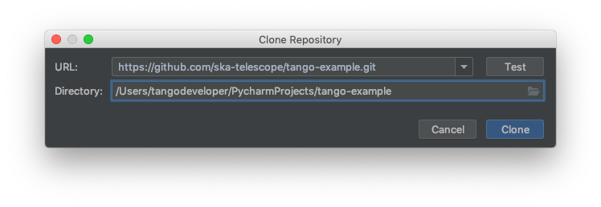
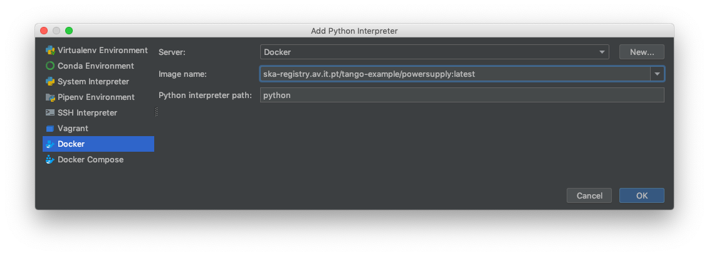
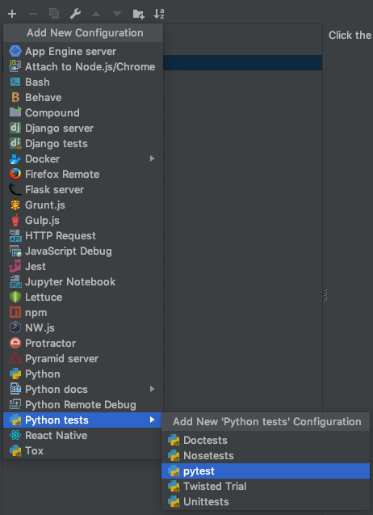
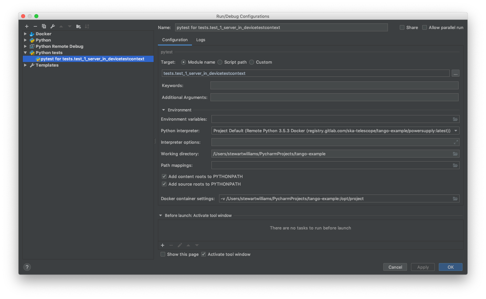
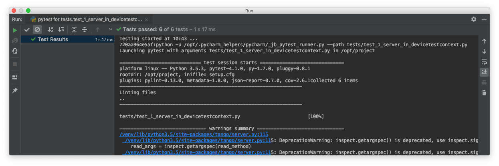

.. _`PyCharm docker configuration`:

PyCharm Professional Docker configuration
*****************************************

These instructions show how to configure PyCharm Professional for SKA control system development using the SKA Docker
images. PyCharm can be configured to use the Python interpreter inside a Docker image, which allows:

- development and testing without requiring a local Tango installation;
- the development environment to be identical to the testing and deployment environment, eliminating problems that occur
  due to differences in execution environment.

Follow the steps below to configure PyCharm to develop new code and run tests for the ska-tango-examples project using the
Docker images for the project.

Prerequisites
=============
Make sure that the following prerequistes are met:

- Docker is installed, as described on the page `Docker Docs`_.
- `PyCharm Professional`_ must be installed. *PyCharm Community is not sufficient!*
- You have basic familiarity with PyCharm. If this is the first time you have used PyCharm, follow the `First Steps`_
  tutorials so that you know how to use PyCharm to develop, debug, and test a simple Python application using a local
  Python interpreter.

.. _`Docker Docs`: https://docs.docker.com/
.. _`PyCharm Professional`: https://www.jetbrains.com/pycharm/
.. _`First Steps`: https://www.jetbrains.com/help/pycharm/basic-tutorials.html

Clone the ska-tango-examples project
====================================

PyCharm allows you to check out (in Git terms clone) an existing repository and create a new project based on the data
you've downloaded.

#. From the main menu, choose VCS | Checkout from Version Control | Git, or, if no project is currently opened, choose
   Checkout from Version Control | Git on the Welcome screen.

#. In the Clone Repository dialog, specify the URL of the `ska-tango-examples repository`_ (you can click Test to make sure
   that connection to the remote can be established).

#. In the Directory field, specify the path where the folder for your local Git repository will be created into which
   the remote repository will be cloned. The dialog should now look similar to this:

4. Click Clone, then click Yes in the subsequent confirmation dialog to create a PyCharm project based on the sources
   you have cloned.

.. _`ska-tango-examples repository`: https://gitlab.com/ska-telescope/ska-tango-examples

Build the application image
===========================

With the source code source code checked out, the next step is to build a Docker image for the application. This image
will contain the Python environment which will we will later connect to PyCharm.

Begin a terminal session in the cloned repository directory and build the image:

.. code-block:: console

      ~/dev/ska-tango-examples  master                                                                                                          23:16:46 ─
    ❯ make build                                                                                                                                           ─╯
    [+] Building 92.6s (14/14) FINISHED
    => [internal] load build definition from Dockerfile                                                                                                0.0s
    => => transferring dockerfile: 453B                                                                                                                0.0s
    => [internal] load .dockerignore                                                                                                                   0.0s
    => => transferring context: 259B                                                                                                                   0.0s
    => [internal] load metadata for artefact.skao.int/ska-tango-images-pytango-runtime:9.3.14                                                 0.2s
    => [buildenv 1/1] FROM artefact.skao.int/ska-tango-images-pytango-builder:9.3.16                                                         81.5s
    => => resolve artefact.skao.int/ska-tango-images-pytango-builder:9.3.16                                                                 0.2s
    => => sha256:5686237a38ebe49118e3c56be46cb1351f6fd07b13a4c0b916a358df074d8d1f 190B / 190B                                                          0.0s
    ...
    => [stage-1 1/5] FROM artefact.skao.int/ska-tango-images-pytango-runtime:9.3.14@sha256:b0d8a67d16818b72cb9ebf84a36431c0f5ef1ace854c4315  42.6s
    => => resolve artefact.skao.int/ska-tango-images-pytango-runtime:9.3.14@sha256:b0d8a67d16818b72cb9ebf84a36431c0f5ef1ace854c4315930ea775b  0.0s
    => => sha256:0e970d6d4e3a68ec13536739109feda96a289da2bc803637cbe43d86c2def2d9 1.02MB / 1.02MB                                                      0.4s
    ...
    => => extracting sha256:fe6a2e4a5243a99c379de5984e484667782be80029db7221c2a1cb411eedb0e6                                                           0.0s
    => => extracting sha256:48447e4613545e45c5c2f01304305bb742d43091b0458a8f56c3f93e7e28ac17                                                           0.0s
    => [internal] load build context                                                                                                                   1.2s
    => => transferring context: 288.02MB                                                                                                               1.2s
    => [stage-1 2/5] COPY --chown=tango:tango . /app                                                                                                   1.1s
    => [stage-1 3/5] COPY --from=buildenv /usr/local/bin/ /usr/local/bin/                                                                              0.1s
    => [stage-1 4/5] WORKDIR /app                                                                                                                      0.0s
    => [stage-1 5/5] RUN ipython profile create                                                                                                        0.5s
    => [stage-1 6/5] COPY requirements.txt /app/requirements.txt                                                                                       0.0s
    => [stage-1 7/5] RUN python3 -m pip install -r /app/requirements.txt                                                                               5.3s
    => [stage-1 8/5] RUN python3 -m pip install .                                                                                                      2.7s
    => exporting to image                                                                                                                              1.1s
    => => exporting layers                                                                                                                             1.1s
    => => writing image sha256:9ed46b8e9b2ee5457a650b93e3cbf1e12a4fc3613b9c38028401ca7e9c52de74                                                        0.0s
    => => naming to artefact.skao.int/ska-tango-examples:0.4.17

The last lines of terminal output displays the name and tags of the resulting images, e.g.,

.. code-block:: console

    ...
     => exporting to image                                                                                                                              1.1s
     => => exporting layers                                                                                                                             1.1s
     => => writing image sha256:9ed46b8e9b2ee5457a650b93e3cbf1e12a4fc3613b9c38028401ca7e9c52de74                                                        0.0s
     => => naming to artefact.skao.int/ska-tango-examples:0.4.17

In the example above, the image name is tagged as *artefact.skao.int/ska-tango-examples:0.4.17*. Take a note of the tagged image as you will need
it when configuring the remote interpreter.

Configure the remote interpreter
================================

Following the official PyCharm documentation, `configure Docker as a remote interpreter`_ using the image you just
created. The 'Add Python Interpreter' dialog should look similar to this:

.. _`configure Docker as a remote interpreter`: https://www.jetbrains.com/help/pycharm/using-docker-as-a-remote-interpreter.html#config-docker

As a result, the Python interpreter Preferences dialog should look something like this:

.. image:: preferences-docker-interpreter.png
    :align: center
    :alt: the Python Interpreter Preferences dialog box, showing the list of packages in the ska-tango-examples image.

Click 'OK' to apply your changes.

You can now navigate through the project. As an exercise, open the source code for the PowerSupply class, which is
defined in powersupply/powersupply.py. Notice that the IDE notifications and intellisense / code completion are now
based on information gathered from the remote Docker interpreter. Below an import statement, try typing
:code:`from tango import` and activate code completion (ctrl+space). Notice how the tango packages installed in the
Docker image are suggested to complete the statement.

Whenever you change the Python environment, for example by adding or removing dependencies in Piplock, after rebuilding
the Docker image you should regenerate the project skeletons to make PyCharm aware of the changes. To do this, select
File | Invalidate Caches / Restart... from the main menu.

Running unit tests
==================

The ska-tango-examples project illustrates two types of unit test:

#. Self-contained unit tests that execute within the confines of a single Docker container. These tests use the Tango
   class *DeviceTestContext*, which provides a mock connection to a Tango database. In the ska-tango-examples project, these
   tests are found in *tests/test_1_server_in_devicetestcontext.py*.

#. Unit tests that exercise a device in a real Tango environment, with connections to a Tango database and other
   devices. utilise require a connection. In the ska-tango-examples project, these tests are found in
   *tests/test_2_test_server_using_client.py*.

This tutorial illustrates how to run the self-contained unit tests described in 1.

From the main menu, choose Run | Edit Configurations... and click on the '+' button to add a new configuration. From the
menu that appears, select Python tests | pytest to add a new pytest test configuration. The menu selection looks like
this:

#. Change the Target radio button to 'Module Name'. Click '...' to select the target, choosing
   *test_1_server_in_devicetestcontext* as the module to be tested.

#. Select 'Project Default' as the Python interpreter for this configuration.

.. note:: If you change the project default interpreter to another configuration then you may want to revisit this run/debug configuration and explicitly select the Docker image
   interpreter rather than use the project default.

The configuration dialog should look like similar to this:

Click 'OK' to accept your changes.

From the main menu, choose Run | Run..., then from the Run dialog that opens, select the configuration you just created.
The unit tests will execute, with the results displayed in PyCharm's Run panel. The results will look like this:

Debugging Configuration
=======================

.. note:: The *coverage* module is not compatible with the PyCharm or Visual Studio Code debugger and must be disabled
   before any debugging session. Do so by editing *setup.cfg*, commenting out the ``addopts=...`` line of the
   tool:pytest section so that it looks like this:

    .. code-block:: console

        [tool:pytest]
        testpaths = tests
        #addopts = --cov=powersupply --json-report --json-report-file=htmlcov/report.json --cov-report term --cov-report html --cov-report xml --pylint --pylint-error-types=EF

PyCharm has a *debug* mode that allows breakpoints to be added to code and the runtime state of the device examined.
Refer to the official PyCharm documentation for comprehensive documentation on
`how to add breakpoints and run in debug mode`_.

.. _`how to add breakpoints and run in debug mode`: https://www.jetbrains.com/help/pycharm/debugging-code.html

The steps in the official documentation can also be used to debug and interact with ah Tango device, using the
configuration set up in the previous section as the basis for the debug configuration. However, full breakpoint
functionality requires some workarounds. Breakpoints set outside device initialisation code (i.e., outside
:code:`__init__()` and `init_device()`) only function if the Tango device uses `asyncio green mode`_. In non-asyncio
modes, Tango creates new Python threads to service requests. Unfortunately these threads do not inherit the debugging
configuration attached by PyCharm.

.. _`asyncio green mode`: https://pytango.readthedocs.io/en/stable/green_modes/green.html

For working breakpoints, there are two solutions:

#. the device must be converted to use asyncio green mode;
#. add :code:`pydevd` to your Piplock as a project dependency, rebuild the Docker image and refresh the project
   skeletons, then add :code:`pydevd.settrace()` statements where the breakpoint is required. For example, to add a
   breakpoint in the :code:`PowerSupply.get_current()` method, the code should look like this:

.. code-block:: python

    def get_current(self):
        """Get the current"""
        import pydevd
        pydevd.settrace()  # this is equivalent to setting a breakpoint in IDE
        return self.__current

Troubleshooting
===============

- **SegmentationFaults when using DeviceTestContext**

  Unit tests that create a new DeviceTestContext per test must run each DeviceTestContext in a new process to avoid
  SegmentationFault errors. For more info, see:

  - https://gitlab.com/tango-controls/pytango/pull/77
  - http://www.tango-controls.org/community/forum/c/development/python/testing-tango-devices-using-pytest/?page=1#post-3761

- **Errors when mixing test types**

  Running DeviceTestContext tests after test that use a Tango client results in errors where the DeviceTestContext gets
  stuck in initialisation. One workaround is to set the filenames so that the DeviceTestContext tests run first.
