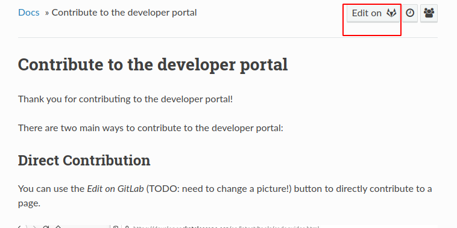

.. _contribute:

**********************************
Contribute to the developer portal
**********************************

Thank you for contributing to the developer portal!

There are two main ways to contribute to the developer portal:

Direct Contribution
###################

You can use the `Edit on GitLab` button to directly contribute to a page.

After logging in, this will open GitLab's edit page window in which depending on your permissions:

- you could use GitLab's Edit Window to make your changes and push to a branch, then create a Merge Request
- or you could use the fork option(TODO: need to add a picture!) and then follow the same steps: use GitLab's Edit Window to make your changes and push to a branch, then create a Merge Request from your fork to the developer portal project. Note; creation of the fork will be handled automatically.

Then, you can follow the Merge Request page for status updates, make new contributions directly or by setting up your local development as described below.

Static build
############

First clone the `developer portal repo <https://gitlab.com/ska-telescope/developer.skao.int>`_ from GitLab. We recommend using ssh to clone.

Then you install dependencies: ``pipenv install --dev``

You can then make changes to the repository. To build the documentation locally, run: ``pipenv run make html``

This will create a subdirectory `/build/html`. To browse the documents created
open `/build/html/index.html` in a web browser.

.. note::
   If you've been editing the developer portal files in a different shell window to the one that you run ``pipenv run make html`` in, it will occasionally fail to trigger a full build. Running any command in the shell you're running the make command in will fix this, even if it's as trivial as ``ls``.
   If you're working on the ``.js`` files, you may need to delete the ``/build`` directory for the build to handle the adjustments.

Documentation Guidelines
########################

When adding files of any kind to this project, do not use underscores in filenames. Use hyphens instead. Very long filenames are mildly discouraged, as it makes doing cross-references more difficult. Some examples::

   thng.rst // A bit short. What is this page about?
   contrib-guide.rst // Good. Not too long to type, and says what the page is about
   development_guidelines_and_policies.rst // Too long, and uses underscores, which are forbidden.

If you are adding image files, we recommend using a ``/images`` directory in the same directory as the ``.rst`` file you are editing. These directories exist in several locations already. Image and other media files should be named using the same conventions as is used for the ``.rst`` files that generate the pages. Any images added should adhere to the :doc:`SKA contribution guidelines </getting-started/contrib-guidelines>`.

If you wish to `cross-reference <https://www.sphinx-doc.org/en/master/usage/restructuredtext/roles.html#ref-role>`_ other pages on the developer portal, you must use the ``:doc:`` syntax. This allows the Sphinx documentation generator to detect broken links within the site. Do not refer to pages within thie site using the syntax for URLs.

We use `Thomas Cokelaer's headings syntax <https://thomas-cokelaer.info/tutorials/sphinx/rest_syntax.html#headings>`_; if you find a page that does not conform, please update it as you edit it.

We recommend working on a branch and then submitting a merge request. We recommend following the :ref:`branching-policy`.

When you've created a merge request, you can get feedback from a wider number of people by using the "view app" button:

.. image:: images/view-app.png
   :alt: The view app button on GitLab.

Clicking this button allows people to view your changes without having to build the documentation themselves. If you need very wide consultation, a ReadtheDocs admin (ask on the `team-system support Slack channel <https://skao.slack.com/archives/CEMF9HXUZ/>`_ to find one) can add your version to the list of version accesible from the site's "versions" dropdown:

.. image:: images/rtd-versions.png
   :alt: The Read the Docs version dropdown expanded to show a list of clickable versions.

Once you've addressed any comments, remember to pull any updates from the master branch. Then you should be good to merge your request.

Finally, if you've moved existing pages to a new location, a ReadtheDocs admin can add redirects, so we don't end up with broken links. Redirects should use the "page" type redirect.

Happy merging!
