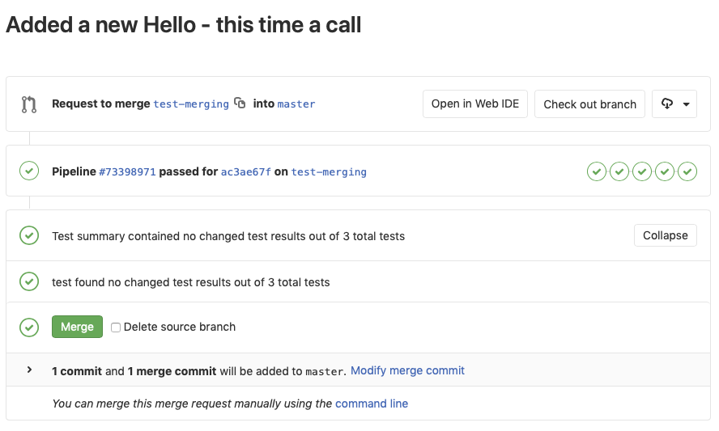
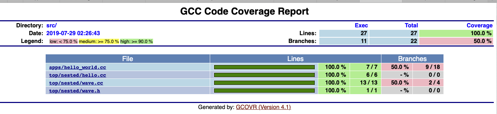

.. doctest-skip-all
.. _cplusplus-code-guide:

************************
C++ Coding Guidelines
************************
This section describes requirements and guidelines for development and testing of a new C++ project on GitLab. The Continuous Integration tools are GitLab specific - but most of the processes could be easily moved to a Jenkins Pipeline if required. 

.. contents:: Table of Contents

An Example C++ Project
======================

We have created a `skeleton C++ project
<https://gitlab.com/ska-telescope/cpp_template>`_. Which should provide a full introduction to the various
recommendations and requirements for the development of C++. The philosophy behind the development of this
template was to demonstrate one way to meet the project guidelines. There are probably as many ways to organise C++ projects
as there are developers there are sure to be some controversial design decisions made. 

This projects demonstrates a recommended
project layout. It also demonstrates how to implement the following recommended C++ project development features. 

* Continuous integration (CI) setup using Gitlab 
* CMake as a build tool.
* GoogleTest framework and example unit testing.
* C++ linting using clang for stylistic errors.
* Also test running under valgrind for memory errors.
* gcov to measure test coverage 

All building and testing is done within a docker container.

Project Layout
--------------
Top Level
^^^^^^^^^
We have a top level of the project containing:

CMakeLists.txt
""""""""""""""
        We have built this template using CMake. The structure of this file
        will be discussed in `Building the Project`_.   

LICENSE
"""""""
        All projects *must* have a license. We have include the recommended BSD
        3 clause license template *please fill it in*.

README.md
"""""""""
        Should at the very least provide a brief description, installation
        instructions, pre-requisites

src
"""
        This is the top of `the source tree`. It does not have to be called src.
        But we recommend that the source tree has its head here. The first
        namespace being the level below this one.

version.txt
"""""""""""
        In this template the version file is parsed by the CMakeLists file during the 
        build process. This specific functionality is not required, but clear versioning is.
        The SKA project mandates `Semantic Versioning <https://semver.org>`_.

The Source Tree
^^^^^^^^^^^^^^^
Our recommended source tree structure follows:

.. literalinclude:: source_tree.txt
        
A number of design decisions have been made here:

What To Do With Namespaces
""""""""""""""""""""""""""
The directory structure follows the namespaces. We have defined an uppermost
*ska* namespace and require all projects providing specfic ska functionality do
the same. We have also defined a *nested* namespace and the directory structure
follows in kind. This allows code to be grouped together easily by namespace.
Also the installation assumes this structure. Therefore headers are included
using their full namespaces.  This avoids pollution of the install tree.

Headers
"""""""
Header (.h) files are included with and template definitions (.tcc) and
implementation files (.cpp). We have done this to make it easier to navigate
the source tree. Having a separate include tree adds unnecessary complexity.

Design Patterns
"""""""""""""""
We recommend that project follow design patterns where applicable.
The example class structure follows the *Pimpl* construction design pattern but
there are many others. This has an abstract base class *hello* and a derived
class *wave* which is a type of hello, but we are also including an
implementation of a *wave*. We have done this as this scheme allows multiple
implementations of a wave to be created without forcing a recompilation of
every source file that includes *wave.h*. Some example patterns for different use
cases can be found `in this article <https://en.wikibooks.org/wiki/C%2B%2B_Programming/Code/Design_Patterns>`_.

Unit Test Locations
"""""""""""""""""""
Tests are co-located at the  namespace level of the classes that they test.
Another scheme would be to have a separate branch from the top level that
maintains the same directory structure. We prefer this scheme for the same
reasons as we prefer to colocate the headers and the implementation. Plus anything that
promotes the writing of unit tests at the same time as the classes are
developed is a good thing

.. todo:: What about functional tests

Continuous Integration
----------------------
GitLab manages builds via a YAML file held inside your repository. Similar to a
Jenkinsfile in philosophy. This is the file in the skeleton HelloWorld project. 

.. literalinclude:: example-ci.yml 

We have four stages of the CI 

* build
* lint
* test
* pages

These stages are automatically run by the GitLab runners when you push to the
repository. The pipeline halts and you are informed if any of the steps fail.
There are some subtleties in the way the test results and test coverage are
reported and we deal with them below as we go through the steps in more detail.

Building The Project
^^^^^^^^^^^^^^^^^^^^
.. todo:: Need to add some CMake Coding Conventions

The Image
"""""""""
We recommend building using the cpp_base image that we have developed and
stored in the image repository. This, or an image derived from it contains all
the tools required to operate this CI pipeline and you should avoid the pain of
installing and configuring system tools.

CMake for Beginners
"""""""""""""""""""
We recommend using CMake as a build tool. It is widely used, includes the
ability to generate buildfiles for different development environments. 
This allows developers the freedom to use whatever IDE they
would like (e.g. Eclipse and Xcode) from the same CMake files.

The CMake application parses the CMakeLists.txt file and generates a set of
build scripts. An important element of the CMake philosophy is that you can
build the application out-of-place, thereby supporting multiple build
configurations from the same source tree. 

This is the top level CMakeLists.txt file

.. literalinclude:: TopCMake.txt

This file defines the project, but the actual applications and libraries are found futher down the tree. An example CMake file in the template that is used to build the executeable is 

.. literalinclude:: AppCMake.txt

There are a number of beginner CMake tutorials on the web. The following commands should be all you need to build the HelloWorld project on your system.

.. code-block:: bash

    >cd cpp_template

For an out-of-place build you make your build directory. This can be anywhere

.. code-block:: bash

    > mkdir build
    > cd build

Then you run *cmake* - you control where you want the installation to go by
setting the install prefix. But you also need to point *cmake* to the directory
containing your top level CMakeLists.txt file

.. code-block:: bash

    > cmake -DCMAKE_INSTALL_PREFIX=my_install_dir my_source_code

CMake then runs, first attempting to resolve all the compile time dependencies
that the project defines. Note you do not have to generate Makefiles, CMake
alos supports XCode and Eclipse projects. Checkout the CMake manpage for the
current list.

After the build files have been generated you are free to build thr project. With the default Makefiles, you just need:

.. code-block:: bash
    
    >make install 

If you are using Eclipse or XCode you will have to start the build within your environment.

Withing the CI/CD control file above you can see that we invoke CMake with different *BUILD_TYPES* these add specific compiler flags. Please see the cmake documentation for more information. 
 
CMake Coding Conventions
""""""""""""""""""""""""

Unfortunately there is even less consensus in the community as to the most
effective way to write CMake files, thought there are a lot of opinions. We
have found a good distillation of some effective ideas can be found `here
<https://gist.gitlab.com/mbinna/c61dbb39bca0e4fb7d1f73b0d66a4fd1>`_. And GitLab
has an introduction to `Modern CMake
<https://cliutils.gitlab.io/modern-cmake/>`_.

In general however we recommend Modern CMake (minimum version of 3.0). A lot of legacy
projects will have used 2.8 - but we cannot recommend that new projects use
this. It is no longer maintained and does not contain many features of modern
(v3+ CMake). As far as we are aware CMake v3.0 is backward compatible
with 2.8, so if you are onboarding code that uses 2.8 we strongly suggest you upgrade. 

.. todo:: Maybe add some more advice? use targets not global settings etc ...

The SKA CMake Module Repository
"""""""""""""""""""""""""""""""

We recommend you include the CMake Module Repository as a git submodule.

.. code-block:: bash

    > cd external
    > git submodule add https://gitlab.com/ska-telescope/cmake-modules.git
    > cd <project_root>
    > git add .gitmodules

There are two issues with submodules that should be made clear. 

1) When you clone your repository you do not get your submodules - in order to populate them you have to:

.. code-block:: bash

    >git submodule sync
    >git submodule update --init

2) The commit of the submodule that was originally added to the repository is
the one that you get when you clone your parent. You can work on the submodule
and push if you want. But the main project will only pick up the changes via
the .gitmodule directory. Note that GitLab
automates this process for CI/CD builds using the GIT_SUBMODULE_STRATEGY:
normal. 

This directory is linked into the CMake search path by adding:

.. code-block:: bash

    > set(CMAKE_MODULE_PATH "${CMAKE_SOURCE_DIR}/external/cmake-modules")

to the top-level CMakeLists.txt. 

This directory will be searched ahead of the
CMake system installation for Find<Package>.cmake files. This will allow the
sharing for MODULE and CONFIG files for common packages

Including the version number
""""""""""""""""""""""""""""
There is a template configuration file that demonstrates how to pull in the
version number into the code base. We do this in a few  steps. First the Semantic
Version number is held in plain text in version.txt. This is done so that it is
easy to "bump" the version number on code changes. The second stage is the the
CMakeLists.txt file reads this file and creates an internal version number
using its contents. Finally the configuration file is used to generate a header
file containing the version number that can be included by the code.

Including External Projects
"""""""""""""""""""""""""""
We have including the GoogleTest framework as an external project, instead of a
dependency to demonstrate one way to use external projects that you want, or need to 
build from source. Most dependencies will not need to be built or included this way. The typical method 
in CMake is to use its find_package() functionality to track down the location of a dependency installed locally.
Note that there is no common or standard way of installing dependencies automatically.

Dependencies
""""""""""""
As there is no standard we propose that for clarity any external packages that you require be listed in
a *dependencies.txt* file the format of entries is this file is defined here to
follow the format of the CMake find_package() method i.e.

.. code-block:: bash

    [install | find | both] <package> [version] [EXACT] [QUIET] [MODULE] [REQUIRED] [[COMPONENTS] [components...]] [OPTIONAL_COMPONENTS components...] [NO_POLICY_SCOPE])
    
for example

.. code-block:: bash

    find cfitsio REQURIED

Except for the initial prefix (install, find or both) the other [] are optional, and are passed directly to the find_package() cmake function.

We have added a *dependencies.cmake* function that will attempt to find all the
dependencies listed using the find_package() functionality of CMake. Of course
if the build depends upon an external dependency that is not present in the
build image, automated CI *will* fail. 

.. todo:: To avoid this we will add other macros to install the external dependencies using a package management tool. When one is downselected.  

Therefore package-name is prefixed by one of *install*, *find*, or *both*. 

* *install* is used as a keyword so you can parse the file for packages to install (using apt for example), 
* *find* is used as a keyword for the dependencies function to use the find_package() functionality. It is possible, indeed likely that the package name for apt and for the cmake module will not be the same. Hence the separate keywords
* *both* for the case where the package has the same name for both the install tool and the cmake module.

Prior to defining a specific dependencies tool, and as apt does not take a list
file as an argument, you could use something like this to parse the contents of
the file and install the requirements.

.. code-block:: bash

    > cat dependencies.txt | grep -E '^install|^both' | awk '{print $2}' | xargs sudo apt-get

.. todo:: Should such a line to the CI pipeline for the installation of cfitsio as an example, together with a Findcfitsio.cmake module in the ska cmake-modules repository.

Coding Style & Conventions
--------------------------

We are not advocating that software be restructured and rewritten before
on-boarding - However we recommend that new software follow `The cplusplus Core
Guidelines <http://isocpp.gitlab.io/CppCoreGuidelines/CppCoreGuidelines>`_.

The clang/llvm compiler tools have an extension which can provide some direct
criticism of your code for stylistic errors (and even automatically fix them). For example in our lint step we
suggest you run:: 

    run-clang-tidy -checks='cppcoreguidelines-*,performance-*,readibility-*,modernize-*,misc-*,clang-analyzer-*,google-*'

.. note:: The GoogleTest  macros generate a lot of warnings ... Google have their own code guidelines ...

In the linting stage we also run cppcheck as a separate step. 

.. warning:: The linting stage as presented here is spotting an error in the GTest macros. So we have explicitly removed the test directory from the cppcheck path. 

Unit testing
------------

Setting Up The Tests 
^^^^^^^^^^^^^^^^^^^^
Within the template we give examples of how to write a Unit Test in `The Google Test framework <https://gitlab.com/google/googletest/>`_.

You will also see from the  CI script that we publish the test results in the following manner:

.. code-block:: bash

    stage: test
    dependencies:
        - build_debug
    script:
        - cd build
        - ctest -T test --no-compress-output
    after_script:
        - cd build
        - ctest2junit > ctest.xml
    artifacts:
        paths:
        - build/
    reports:
      junit: build/ctest.xml

How GitLab Can Use The Results
^^^^^^^^^^^^^^^^^^^^^^^^^^^^^^
The above directives publish the results to the GitLab JUnit test plugin, but
the system is very minimal. Primarily it is used in examining merge requests.
When you push to the GitLab repo your branch is built. On completion the test
reqults are compared if tests fail you are warned, if they pass you are
notified. For example. I have created a test branch for the repo that contains
a new derived instance of an hello world. I have included a test and I checked
locally that all the existing code built - after the merge request is started
GitLab gives the following report:

You can see that there is not much detail - but the tests results are parsed and any differences are noted.

Pages (or Publishing Artifacts)
-------------------------------

We use this step to run the test coverage tool gcov, and to publish the results:

.. code-block:: bash

  stage: pages
  dependencies:
    - test
  script:
    - mkdir .public
    - cd .public
    - gcovr -r ../ -e '.*/external/.*' -e '.*/CompilerIdCXX/.*' -e '.*/tests/.*' --html --html-details -o index.html
    - cd ..
    - mv .public public
  artifacts:
    paths:
      - public

Note that the atifacts step this allows the results to be accessed via the pipelines pages. Every build stores its artifacts from the test step and the pages step. 

.. note:: As far as we know there is no plugin for the coverage artifacts generated by gcov

But you can access the artifact from the pipeline.

Summary
=======

This basic template project is available `on GitLab <https://gitlab.com/ska-telescope/cpp-template.git>`_. And demonstrates the following:

1) Provides a base image on which to run C++ builds
2) Describes example basic dependency management is possible at least based on CMake but way of CMake External projects and git submodules
3) Presents a convention for defininig third party/external to project libs such that they are independent of the dependency management layer that will be supported by the systems team.  
4) Proposes a C++ 14 language standard and related static code checking tools
5) Outlines header naming conventions that follow namespace definitions
6) Proposal of GoogleTest for a common C++ unit testing library

