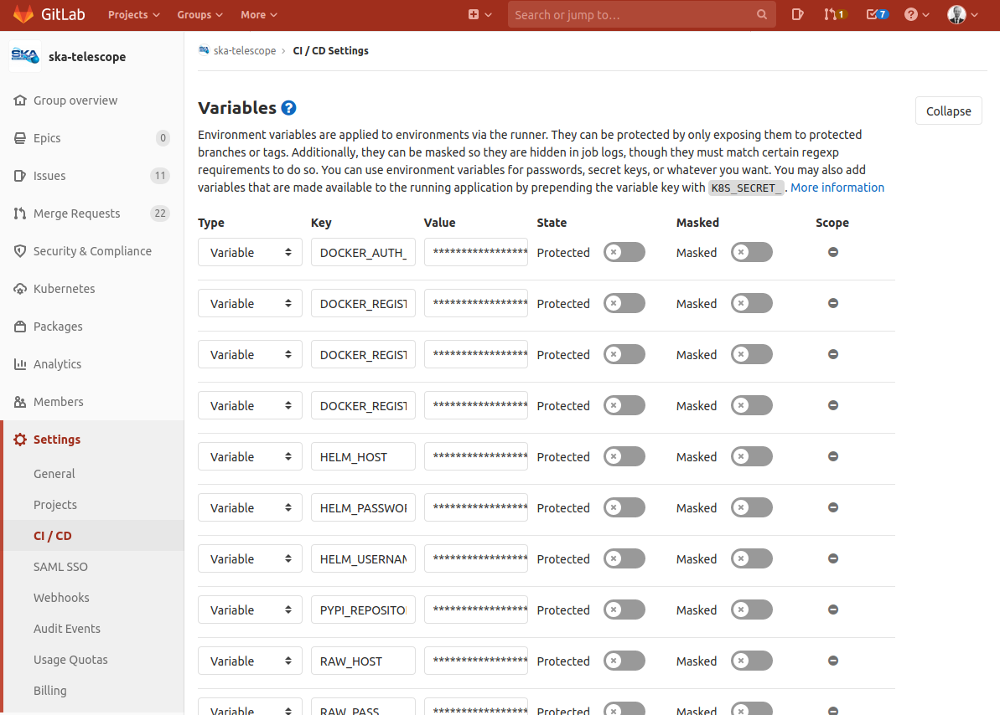

.. doctest-skip-all
.. _gitlab-variables:

***********************
GitLab Global Variables
***********************

This section describes the global variables that are presently being used as part of the
GitLab CI/CD infrastructure.

Variables Interface
===================

The variables are set under the
`CI/CD Settings <https://gitlab.com/groups/ska-telescope/-/settings/ci_cd>`_ on GitLab.

.. _figure-1-gitlab-variables:

   The variables interface on GitLab

Variables Description
=====================

+------------------------------+-------------------------------------------------------------------+-------------------------------+
|             Key              |                            Description                            |             Notes             |
+==============================+===================================================================+===============================+
| ``DOCKER_REGISTRY_HOST``     | Fully qualified hostname of the Nexus Docker registry             |                               |
+------------------------------+-------------------------------------------------------------------+-------------------------------+
| ``DOCKER_REGISTRY_PASSWORD`` | Password for uploading to the Nexus Docker registry               |                               |
+------------------------------+-------------------------------------------------------------------+-------------------------------+
| ``DOCKER_REGISTRY_USERNAME`` | Username for uploading to the Nexus Docker registry               |                               |
+------------------------------+-------------------------------------------------------------------+-------------------------------+
| ``HELM_HOST``                | Fully qualified hostname of the Helm Chart repository             |                               |
+------------------------------+-------------------------------------------------------------------+-------------------------------+
| ``HELM_USERNAME``            | Username for uploading to the Helm Chart repository               |                               |
+------------------------------+-------------------------------------------------------------------+-------------------------------+
| ``HELM_PASSWORD``            | Password for uploading to the Helm Chart repository               |                               |
+------------------------------+-------------------------------------------------------------------+-------------------------------+
| ``PYPI_REPOSITORY_URL``      | Fully qualified hostname of the PyPi Nexus repository             | Uses Twine for authentication |
+------------------------------+-------------------------------------------------------------------+-------------------------------+
| ``TWINE_USERNAME``           | Username for uploading to the PyPi Nexus repository               |                               |
+------------------------------+-------------------------------------------------------------------+-------------------------------+
| ``TWINE_PASSWORD``           | Password for uploading to the PyPi Nexus repository               |                               |
+------------------------------+-------------------------------------------------------------------+-------------------------------+
| ``RAW_HOST``                 | Fully qualified hostname for the Raw file hosting on Nexus        |                               |
+------------------------------+-------------------------------------------------------------------+-------------------------------+
| ``RAW_USER``                 | Username for uploading to the Raw file hosting on Nexus           |                               |
+------------------------------+-------------------------------------------------------------------+-------------------------------+
| ``RAW_PASS``                 | Password for uploading to the Raw file hosting on Nexus           |                               |
+------------------------------+-------------------------------------------------------------------+-------------------------------+

Historical Variable Use
=======================

The following variables have been used historically to drive behaviour in the pipelines, but must be set at the individual repository level:

+------------------------------+------------------------------------+--------------------------------------------------------------+
|             Key              |                  Description       |                          Notes                               |
+==============================+====================================+==============================================================+
| ``DOCKER_REGISTRY_FOLDER``   | specify the base path prefixed     | Used to produce the image path: with                         |
|                              | for an image eg: ``ska-docker``    | ``DOCKER_REGISTRY_HOST/DOCKER_REGISTRY_FOLDER/<image-name>`` |
+------------------------------+------------------------------------+--------------------------------------------------------------+
