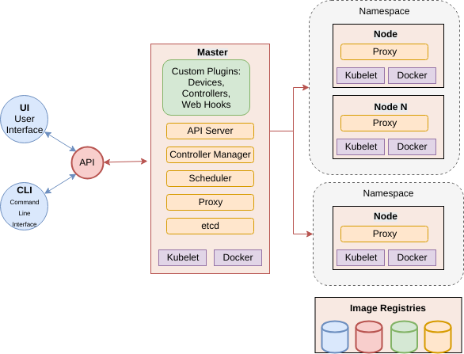

.. doctest-skip-all
.. _code-guide:

.. raw:: html

    

.. .. admonition:: The thing

..    You can make up your own admonition too.

**********************************
Container Orchestration Guidelines
**********************************

This section describes a set of standards, conventions and guidelines for deploying application suites on Container Orchestration technologies.

.. contents:: Table of Contents

Overview of Standards
=====================

These standards, best practices and guidelines are based on existing industry
standards and tooling.  The main references are:

* `Cloud Native Computing Foundation <https://www.cncf.io/>`_.
* `Docker v2 Registry API Specification <https://docs.docker.com/registry/spec/api/>`_.
* `Container Network Interface <https://github.com/containernetworking/cni>`_.
* `Container Storage Interface <https://github.com/container-storage-interface/spec>`_.
* `Open Container Initiative image specification <https://github.com/opencontainers/image-spec/releases/tag/v1.0.0>`_.
* `Open Container Initiative run-time specification <https://github.com/opencontainers/runtime-spec/releases/tag/v1.0.0>`_.

The standards are broken down into the following areas:

* Structuring application suites for orchestration - general guidelines for breaking up application suites for running in a container orchestration
* Defining and building cloud native application suites - resource definitions, configuration, platform resource integration
* Running cloud native application suites - execution, monitoring, logging, diagnostics, security considerations

Throughout this documentation, `Kubernetes <https://kubernetes.io/>`_ in conjunction with `Helm <https://helm.sh/>`_ is used as the reference implementation with the canonical versions being Kubernetes v1.14.1 and Helm v2.13.1, however the aim is to target compliance with the OCI specifications and CNF guidelines so it is possible to substitute in alternative Container Orchestration solutions, and tooling.

A set of example Helm Charts are provided in the repository `container-orchestration-chart-examples <https://github.com/ska-telescope/container-orchestration-chart-examples>`_.  These can be used to get an overall idea of how the components of a chart function together, and how the life cycle and management of a chart can be managed with ``make``.

Structuring application suites for Orchestration
================================================

In order to understand how to structure applications suites for orchestration, we first need to understand what the goals of Cloud Native software engineering are.

what is Cloud Native
--------------------

It is the embodiment of modern software delivery practices supported by tools, frameworks, processes and platform interfaces.
These capabilities are the next evolution of Cloud Computing, raising the level of abstraction for all actors against the architecture from the hardware unit to the application component.

What does this mean?  Developers and system operators (DevOps) interface with the platform architecture using abstract resource concepts, and should have next to no concern regarding the plumbing or wiring of the platform, while still being able to deploy and scale applications according to cost and usage.

Cloud Native exploits the advantages of the Cloud Computing delivery model:

* PaaS (Platform as a Service) layered on top of IaaS (Infrastructure as a Service)
* CI/CD (Continuous Integration/Delivery) – fully automated build, test, deploy
* Modern DevOps – auto-scaling, monitoring feedback loop to tune resource requirements
* Software abstraction from platform compute, network, storage
* Portability across Cloud Services providers

Why Cloud Native SDLC (Software Development Life Cycle)?

.. _figure-1-kubernetes-sdlc:

.. figure:: Kubernetes-SDLC.dio.png
   :scale: 60%
   :alt: Cloud Native SDLC
   :align: center
   :figclass: figborder

   How Kubernetes fits into the Cloud Native SDLC

* Provides cohesion for distributed projects
* Codify standards through implementing testing gates
* Ensures code quality, consistency and predictability of deployment success – CI/CD
* Automation – build AND rebuild for zero day exploits at little cost
* Portability of SDI (Software Defined Infrastructure) as well as code
* Provides a codified reference implementation of best practices, and exemplars
* Enables broad engagement – an open and collaborate system - a “Social Coding Platform”
* Consistent set of standards for integration with SRC (SKA Regional Centres), and other projects – the future platform of integrated science projects through shared resources enabled by common standards

How does orchestration work
---------------------------

How does k8s work - mechanisms, abstraction layers, life-cycle management

At the core of Cloud Native is the container orchestration platform.  For the purposes of these guidelines, this consists of Kubernetes as the orchestration layer, over Docker as the container engine.

.. _figure-2-kubernetes-architecture:

   The architecture of Kubernetes at the centre of the Cloud Native platform

Kubernetes provides an abstraction layer from hardware infrastructure resources enabling compute, network, storage, and other dependent services (other applications) to be treated as abstract concepts.  A computing cluster is not a collection of machines but instead is an opaque pool of resources, that are advertised for availability through a consistent REST based API. These resources can be customised to provide access to and accounting of specialised devices such as GPUs.

Through the Kubernetes API, the necessary resources that make up an application suite (compute, network, storage) are addressed as objects in an idempotent way that declares the desired state eg: this number of Pods running these containers, backed by this storage, on that network.  The scheduler will constantly move the cluster towards this desired state including in the event of application or node/hardware failure, which builds in robustness and auto-healing.

Both platform and service resources can be classified by performance characteristics and reservation criteria using labelling, which in turn are used by scheduling algorithms to determine optimum placement of workloads across the cluster.  All applications are deployed as sets of one or more containers in a minimum configuration called a `Pod <https://kubernetes.io/docs/concepts/workloads/pods/pod/>`_.  Pods are the minimum scalable unit that are distributed and replicated across the cluster according to the scheduling algorithm.  A Pod is essentially a single namespace holding one or more containers, and it only makes sense to put together containers that are essentially tightly coupled and logically indivisible by design.  These Pods can scheduled in a number of patterns using `Controllers (full list) <https://kubernetes.io/docs/concepts/workloads/controllers/>`_ including bare Pod (a single Pod instance), `Deployment <https://kubernetes.io/docs/concepts/workloads/controllers/deployment/>`_ (a replicated Pod set), `StatefulSet <https://kubernetes.io/docs/concepts/workloads/controllers/statefulset/>`_ (a Deployment with certain guarantees about naming and ordering of replicated units), `DaemonSets <https://kubernetes.io/docs/concepts/workloads/controllers/daemonset/>`_ (one Pod per scheduled compute node), and `Job/CronJob <https://kubernetes.io/docs/concepts/workloads/controllers/jobs-run-to-completion/>`_ (run to completion applications).

A detailed discussion of these features can be found on the main Kubernetes documentation under `Concepts <https://kubernetes.io/docs/concepts/>`_.

Structuring Application Suites
------------------------------

Architecting software to run in an orchestration environment builds on the guidelines given in the `Container Standards 'Structuring Containerised Applications' <containerisation-standards.html#structuring-containerised-applications>`_ section.  The key concepts of treating run time containers as immutable and atomic applications where any application state is explicitly dealt with through connections to storage mechanisms, is key.

The application should be broken into components that represent:

* an application component has an independent development lifecycle
* individual process that performs a discrete task such as a micro service, specific database/web service, device etc.
* component that exposes a specific service to another application eg. a micro service or database
* a reusable component that is applicable to multiple application deployments eg. a co-routine or proximity depdendent service (logger, metrics collector, network helper, private database etc)
* an independently scalable unit that can be replicated to match demand
* the minimum unit required to match a resource profile at scheduling time such as storage, memory, cpu, specialised device

Above all, design software to scale horizontally through a UNIX process model so that individual components that have independent scaling characteristics can be replicated independently.

The application interface should be through the standard `container run time <containerisation-standards.html#running-containerised-applications>`_ interface contract:

* inputs come via a configurable Port
* outputs go to a configurable network service
* logging goes to stdout/stderr and syslog and uses JSON to enrich metadata (see `Container Standards 'Logging' <containerisation-standards.html#logging>`_)
* metrics are advertised via a standard such as `Prometheus Exporters <https://prometheus.io/docs/instrumenting/writing_exporters/>`_, or emit metrics in a JSON format over TCP consumable by ETL services such as `LogStash <https://www.elastic.co/products/logstash>`_
* configuration is passed in using environment variables, and simple configuration files (eg: ini, or key/value pairs)
* POSIX compliant storage IO is facilitated by bind mounted volumes
* connections to DBMS, queuing technologies and object storage are managed through configuration
* applications should have builtin recoverability so that prior state and context is automatically discovered on restart.  This enables the cluster to auto-heal by re-launching workloads on other resources when nodes fail

By structuring an application in this fashion, it can scale from the single instance desktop development environment up to a large parallel deployment in production without needing to have explicit understanding builtin for the plumbing and wiring of each specific environment because this is handled through external configuration.

Example: Tango Controls
-----------------------

To help illustrate the Cloud Native application architecture concepts, a walk through of a Tango application suite is used.

A Tango Controller System environment is typically made up of the following:

* Database containing the system state eg: MySQL
* DatabaseDS Tango device server
* One or more Tango devices
* Optional components - Tango REST interface, Tango logviewer, sysadmin and debugging tools such as Astor and Jive

These components map to the following Kubernetes resources:

* MySQL Database == StatefulSet
* DatabaseDS == Deployment or StatefulSet
* Tango REST interface == Deployment
* Tango Device == bare Pod, or single replica Deployment

This example does not take into consideration an HA deployment of MySQL, treating MySQL as a single instance StatefulSet.  Using a StatefulSet in this case gives the follwoing guarantees above a Deployment:

* Stable, unique network identifiers.
* Stable, persistent storage.
* Ordered, graceful deployment and scaling.
* Ordered, automated rolling updates.

These characteristics are useful for stable service types such as databases and message queues.

DatabaseDS is a stateless and horizontally scalable service in it's own right (state comes from MySQL).  This makes it a fit for the Deployment (which in turn uses a ReplicaSet) or the StatefulSet.  Deployments are a good fit for stateless components that require high availability through mechanisms such as rolling upgrades.

The Tango Devices are single instance applications that act as a proxy between the 'real' hardware being controlled and the DatabaseDS service that provides each Tango Device  with a gateway to the Tango cluster state database (MySQL).  Considering that in most cases, an upgrade to a Device Pod is likely to be a delete and replace, we can use the simplest case of a bare Pod which will enable us to name eack Pod after it's intended device without the random suffix generated for Deployments.

Example: MPI jobs
-----------------

A typical MPI application consists of a head node, worker nodes with the job being launched from the head node, which in turn controls the work distribution over the workers.

This can be broken in to:

* a generic component type that covers head node and worker nodes
* a launcher that triggers the application on the designated head node

These components map to the following Kubernetes resources:

* Worker node == DaemonSet
* Launcher and Head node == Job

MPI jobs only require a single instance per physical compute node, and this is exactly the use case of DaemonSets where Kubernetes ensures exactly one instance of a Pod is running on each designated node.  Using Jobs enables the launcher and the head node to be combined.  Both Job and DaemonSet Pods will most likely need the same library and tools from MPI, so can be combined into a single container image.

Linking Components Together
---------------------------

Components of an application suite or even between suites should use `DNS <https://kubernetes.io/docs/concepts/services-networking/dns-pod-service/>`_ for service discovery.  This is achieved by using the `Service <https://kubernetes.io/docs/concepts/services-networking/service/>`_ resource.  Services should always be declared before Pods so that the automatic generation of associated Environment Variables happens in time for the Pods to discover them.  Service names are permanent and predictable, and are tied to the `Namespace <https://kubernetes.io/docs/concepts/overview/working-with-objects/namespaces/>`_ that a application suite is deployed in, for example in the namespace ``test``, the DatabaseDS Tango component can find the MySQL database ``tangodb`` using the name ``tangodb`` or ``tangodb.test``  which is distinctly different to the instance running in the ``qa`` namespace also named ``tangodb`` but addressable by ``tangodb.qa``.  This greatly simplifies configuration management for software deployment.

Guidelines
==========

All Kubernetes resource objects are described through the `REST based API <https://kubernetes.io/docs/reference/>`_.  The representations of the API documents are in either JSON or YAML, however the preference is for YAML as the description language as this tends to be more human readable.  The API representations are declarative, specifying the end desired state.  It is up to the Kubernetes scheduler to make this a reality.

It is important to use generic syntax and Kubernetes resource types.  Specialised resource types reduces portability of resource descriptors and templates, and increase dependency on 3rd party integrations.  This could lead to upgrade paralysis because the SDLC is out of our control.

Metadata
--------

Each resource is described with:

* apiVersion - API version that this document should invoke
* kind - resource type (object) that is to be handled
* metadata - descriptive information including name, labels, annotations, namespace, ownership, references
* spec(ification) - the body of the specification for this resource type denoted by `kind`

The following is an example of the start of a StatefulSet for the Tango DatabaseDS:

.. container:: toggle

    .. container:: header

        Resource description

    .. code:: yaml

         ---
         apiVersion: apps/v1
         kind: StatefulSet
         metadata:
           name: databaseds-integration-tmc-webui-test
           labels:
             app.kubernetes.io/name: databaseds-integration-tmc-webui-test
             helm.sh/chart: integration-tmc-webui-0.1.0
             app.kubernetes.io/instance: test
             app.kubernetes.io/managed-by: helm
         spec:
           ...

Namespaces
----------

Even though it is possible to specify the namespace directly in the Metadata, it **SHOULD NOT** be, as this reduces the flexibility of any resource definition and templating solution employed such as Helm.  The namespace can be specified at run time eg: ``kubectl --namespace test apply -f resource-file.yaml``. 

Name and Labels
---------------

Naming and labelling of all resources associated with a deployment should be consistent.  This ensures that deployments that land in the same namespace can be identified along with all inter-dependencies.  This is particulaly useful when using the ``kubectl`` command line tool as label based filtering can be employed to sieve out all related objects.

Labels are entirely flexible and free form, but as a minimum specify:

* the ``name`` and ``app.kubernetes.io/name`` with the same identifier with sufficient precision that the same application component deplyed in the same namespace can be distinguished eg: a concatenation of <application>-<suite>-<release>.  ``name`` and ``app.kubernetes.io/name`` are duplicated because label filter interaction between resources relies on labels eg: ``Service`` exposing ``Pods`` of a ``Deployment``.
* the labels of the deployment suite such as the ``helm.sh/chart`` for Helm, including the version
* the ``app.kubernetes.io/instance`` (which is ``release``) of the deployment suite
* ``app.kubernetes.io/managed-by`` what tooling is used to manage this deployment - most likely ``helm``

Optional extras which are also useful for filtering are:

* ``app.kubernetes.io/version`` the component version
* ``app.kubernetes.io/component`` the component type (most likely related to the primary container)
* ``app.kubernetes.io/part-of`` what kind of application suite this component belongs to

The recommended core label set are described under `Kubernetes common labels <https://kubernetes.io/docs/concepts/overview/working-with-objects/common-labels/#labels>`_.

.. code:: yaml

    metadata:
      name: databaseds-integration-tmc-webui-test
      labels:
        app.kubernetes.io/name: databaseds-integration-tmc-webui-test
        helm.sh/chart: integration-tmc-webui-0.1.0
        app.kubernetes.io/instance: test
        app.kubernetes.io/version: "1.0.3"
        app.kubernetes.io/component: databaseds
        app.kubernetes.io/part-of: tango
        app.kubernetes.io/managed-by: helm

Using this labelling scheme enables filtering for all deployment related objects eg: ``kubectl get all -l helm.sh/chart=integration-tmc-webui-0.1.0,app.kubernetes.io/instance=test``.

.. container:: toggle

    .. container:: header

        kubectl label filtering

    .. code:: bash

        $ kubectl get all,configmaps,secrets,pv,pvc -l helm.sh/chart=integration-tmc-webui-0.1.0,app.kubernetes.io/instance=test
        NAME                                          READY   STATUS     RESTARTS   AGE
        pod/databaseds-integration-tmc-webui-test-0   1/1     Running    0          55s
        pod/rsyslog-integration-tmc-webui-test-0      1/1     Running    0          55s
        pod/tangodb-integration-tmc-webui-test-0      1/1     Running    0          55s
        pod/tangotest-integration-tmc-webui-test      1/1     Running    0          55s
        pod/webjive-integration-tmc-webui-test-0      0/6     Init:0/1   0          55s

        NAME                                            TYPE        CLUSTER-IP    EXTERNAL-IP   PORT(S)                                       AGE
        service/databaseds-integration-tmc-webui-test   ClusterIP   None          <none>        10000/TCP                                     55s
        service/rsyslog-integration-tmc-webui-test      ClusterIP   None          <none>        514/TCP,514/UDP                               55s
        service/tangodb-integration-tmc-webui-test      ClusterIP   None          <none>        3306/TCP                                      55s
        service/webjive-integration-tmc-webui-test      ClusterIP   10.97.135.8   <none>        80/TCP,5004/TCP,3012/TCP,8080/TCP,27017/TCP   55s

        NAME                                                     READY   AGE
        statefulset.apps/databaseds-integration-tmc-webui-test   1/1     55s
        statefulset.apps/rsyslog-integration-tmc-webui-test      1/1     55s
        statefulset.apps/tangodb-integration-tmc-webui-test      1/1     55s
        statefulset.apps/webjive-integration-tmc-webui-test      0/1     55s

        NAME                                                  CAPACITY   ACCESS MODES   RECLAIM POLICY   STATUS   CLAIM                                        STORAGECLASS   REASON   AGE
        persistentvolume/rsyslog-integration-tmc-webui-test   10Gi       RWO            Retain           Bound    default/rsyslog-integration-tmc-webui-test   standard                56s
        persistentvolume/tangodb-integration-tmc-webui-test   1Gi        RWO            Retain           Bound    default/tangodb-integration-tmc-webui-test   standard                55s
        persistentvolume/webjive-integration-tmc-webui-test   1Gi        RWO            Retain           Bound    default/webjive-integration-tmc-webui-test   standard                55s

        NAME                                                       STATUS   VOLUME                               CAPACITY   ACCESS MODES   STORAGECLASS   AGE
        persistentvolumeclaim/rsyslog-integration-tmc-webui-test   Bound    rsyslog-integration-tmc-webui-test   10Gi       RWO            standard       56s
        persistentvolumeclaim/tangodb-integration-tmc-webui-test   Bound    tangodb-integration-tmc-webui-test   1Gi        RWO            standard       55s
        persistentvolumeclaim/webjive-integration-tmc-webui-test   Bound    webjive-integration-tmc-webui-test   1Gi        RWO            standard       55s

Templating the Application
--------------------------

While it is entirely possible to define all the necessary resources for an application suite to be deployed on Kubernetes in individual or a single YAML file, this approach is static and quickly reveals it's limitations in terms of creating reusable and composable application suites.  This is where `Helm Charts <https://helm.sh/>`_ have been adopted by the Kubernetes community as the leading templating solution for deployment.  Helm provides a mechanism for generically describing an application suite, separating out configuration, and rolling out deployment releases all done in a declarative 'configuration as code' style.  All Helm Charts should target a minimum of three environments:

* Minikube - the standalone developer environment
* CI/CD - the Continuous Integration testing environment which is typically the same benchmark as Minikube
* Production Cluster - the target production Kubernetes environment

Minikube should be the default target environment for a Chart, as this will have the largest audience and should be optimised to work without modification of any configuration if possible.

When designing a Chart it is important to have clear separation of concerns:

* the application - essentially the containers to run
* configuration - any variable that influences the application run time
* resources - any storage, networking, configuration file, secrets, ACLs

The general structure of a Chart should follow: 

.. code:: bash

    charts/myapp/
            Chart.yaml          # A YAML file containing information about the chart
            LICENSE             # OPTIONAL: A plain text file containing the license for the chart
            README.md           # OPTIONAL: A human-readable README file
            requirements.yaml   # OPTIONAL: A YAML file listing dependencies for the chart
            values.yaml         # The default configuration values for this chart
            charts/             # A directory containing any charts upon which this chart depends.
            templates/          # A directory of templates that, when combined with values,
                                # will generate valid Kubernetes manifest files.
            templates/NOTES.txt # OPTIONAL: A plain text file containing short usage notes

All template files in the ``templates/`` directory should be named in a readily identifiable way after the component that it contains, and if further clarification is required then it should be suffixed with the ``Kind`` of resource eg: ``tangodb.yaml`` contains the ``StatefulSet`` for the Tango database, and ``tangodb-pv.yaml`` contains the ``PersistentVolume`` declaration for the Tango database.  ``ConfigMaps`` should be clustered in ``configmaps.yaml`` and ``Secrets`` in ``secrets.yaml``.  The aim is to make it easy for others to understand the layout of application suite being deployed.

Helm Best Practices
~~~~~~~~~~~~~~~~~~~

The Helm community have a well defined set of `best practices <https://helm.sh/docs/chart_best_practices/>`_.  The following highlights key aspects of these practices that will help with achieving consistency and reliability.

* charts should be placed in a ``charts/`` directory within the parent project
* chart names should be lowercase and hyphenated and must match the directory name eg. ``charts/my-app``
* ``name``, ``version``, ``description``, ``home``, ``maintainers`` and ``sources`` must be included
* ``version`` must follow the `Semantic Versioning <https://semver.org>`_ standards
* the chart must pass the ``helm lint charts/<chart-name>`` test

Example ``Chart.yaml`` file:

.. code:: yaml

    name: my-app
    version: 1.0.0
    description: Very important app
    keywords:
    - magic
    - mpi
    home: https://www.skatelescope.org/
    icon: http://www.skatelescope.org/wp-content/uploads/2016/07/09545_NEW_LOGO_2014.png
    sources:
    - https://github.com/ska-telescope/my-app
    maintainers:
    - name: myaccount
      email: myacount@skatelescope.org

Metadata with Helm
~~~~~~~~~~~~~~~~~~

All resources should have the following boilerplate metadata to ensure that all resources can be uniquely identified to the chart, application and release:

.. code:: yaml

    ...
    metadata:
    name: <component>-{{ template "my-app.name" . }}-{{ .Release.Name }}
    labels:
        app.kubernetes.io/name: <component>-{{ template "my-app.name" . }}-{{ .Release.Name }}
        helm.sh/chart: "{{ .Chart.Name }}-{{ .Chart.Version }}"
        app.kubernetes.io/instance: "{{ .Release.Name }}"
        app.kubernetes.io/managed-by: "{{ .Release.Service }}"
    ...

Defining resources
~~~~~~~~~~~~~~~~~~

The `Helm templating language <https://helm.sh/docs/chart_template_guide/>`_ is based on `Go template <https://godoc.org/text/template>`_. 

All resources go in the ``templates/`` directory with the general rule is one Kubernetes resource per template file.  Files that render resources are suffixed ``.yaml`` whilst files that contain expressions and macros only go in files suffixed ``.tpl``.

.. container:: toggle

    .. container:: header

        Sample resource template for a Service generated by 'helm create mychart'

    .. code:: yaml

        apiVersion: v1
        kind: Service
        metadata:
        name: {{ include "mychart.fullname" . }}
        labels:
            app.kubernetes.io/name: {{ include "mychart.name" . }}
            helm.sh/chart: {{ include "mychart.chart" . }}
            app.kubernetes.io/instance: {{ .Release.Name }}
            app.kubernetes.io/managed-by: {{ .Release.Service }}
        spec:
            type: {{ .Values.service.type }}
            ports:
            - port: {{ .Values.service.port }}
                targetPort: http
                protocol: TCP
                name: http
            selector:
                app.kubernetes.io/name: {{ include "mychart.name" . }}
                app.kubernetes.io/instance: {{ .Release.Name }}

.. container:: toggle

    .. container:: header

        Expression or macro template generated by 'helm create mychart'

    .. code:: yaml

        {{/* vim: set filetype=mustache: */}}
        {{/*
        Expand the name of the chart.
        */}}
        {{- define "mychart.name" -}}
        {{- default .Chart.Name .Values.nameOverride | trunc 63 | trimSuffix "-" -}}
        {{- end -}}

        {{/*
        Create a default fully qualified app name.
        We truncate at 63 chars because some Kubernetes name fields are limited to this (by the DNS naming spec).
        If release name contains chart name it will be used as a full name.
        */}}
        {{- define "mychart.fullname" -}}
        {{- if .Values.fullnameOverride -}}
        {{- .Values.fullnameOverride | trunc 63 | trimSuffix "-" -}}
        {{- else -}}
        {{- $name := default .Chart.Name .Values.nameOverride -}}
        {{- if contains $name .Release.Name -}}
        {{- .Release.Name | trunc 63 | trimSuffix "-" -}}
        {{- else -}}
        {{- printf "%s-%s" .Release.Name $name | trunc 63 | trimSuffix "-" -}}
        {{- end -}}
        {{- end -}}
        {{- end -}}

        {{/*
        Create chart name and version as used by the chart label.
        */}}
        {{- define "mychart.chart" -}}
        {{- printf "%s-%s" .Chart.Name .Chart.Version | replace "+" "_" | trunc 63 | trimSuffix "-" -}}
        {{- end -}}

|

Tightly coupled resources may go in the same template file where they are logically linked or there is a form of dependency.

An example of logically linked resources are PersistentVolume and PersistentVolumeClaim definitions.  Keeping these together make debugging and maintenance easier.

.. _persistentvolume-and-persistentvolumeclaim-definition:

.. container:: toggle

    .. container:: header

        PersistentVolume and PersistentVolumeClaim definitions

    .. code:: yaml

        {{ if and .Values.tangodb.enabled .Values.tangodb.createpv }}
        ---
        kind: PersistentVolume
        apiVersion: v1
        metadata:
            name: tangodb-{{ template "tango-chart-example.name" . }}-{{ .Release.Name }}
            namespace: {{ .Release.Namespace }}
        labels:
            app.kubernetes.io/name: tangodb-{{ template "tango-chart-example.name" . }}
            app.kubernetes.io/instance: "{{ .Release.Name }}"
            app.kubernetes.io/managed-by: "{{ .Release.Service }}"
            helm.sh/chart: "{{ template "tango-chart-example.chart" . }}"
        spec:
            storageClassName: standard
            capacity:
                storage: 1Gi
            accessModes:
                - ReadWriteOnce
            hostPath:
                path: /data/tangodb-{{ template "tango-chart-example.name" . }}/

        ---
        apiVersion: v1
        kind: PersistentVolumeClaim
        metadata:
            name: tangodb-{{ template "tango-chart-example.name" . }}-{{ .Release.Name }}
            namespace: {{ .Release.Namespace }}
        labels:
            app.kubernetes.io/name: tangodb-{{ template "tango-chart-example.name" . }}
            app.kubernetes.io/instance: "{{ .Release.Name }}"
            app.kubernetes.io/managed-by: "{{ .Release.Service }}"
            helm.sh/chart: "{{ template "tango-chart-example.chart" . }}"
        spec:
            storageClassName: standard
            accessModes:
                - ReadWriteOnce
            resources:
                requests:
                    storage: 1Gi
            volumeName: tangodb-{{ template "tango-chart-example.name" . }}-{{ .Release.Name }}
        { end }}

An example of dependency is the declaration of a Service before the associated Pod/Deployment/StatefulSet/DaemonSet.  The Pod will get the `environment variables <https://kubernetes.io/docs/concepts/services-networking/service/#environment-variables>`_ set from the Service as this will be evaluated by the Kubernetes API first as guaranteed by being in the same template file.

.. container:: toggle

    .. container:: header

        Service before the associated Pod/Deployment

    .. code:: yaml

        ---
        apiVersion: v1
        kind: Service
        metadata:
        name: tango-rest-{{ template "tango-chart-example.name" . }}-{{ .Release.Name }}
        namespace: {{ .Release.Namespace }}
        labels:
          app.kubernetes.io/name: tango-rest-{{ template "tango-chart-example.name" . }}
          app.kubernetes.io/instance: "{{ .Release.Name }}"
          app.kubernetes.io/managed-by: "{{ .Release.Service }}"
          helm.sh/chart: "{{ template "tango-chart-example.chart" . }}"
        spec:
          type: ClusterIP
          ports:
          - name: rest
            port: 80
            targetPort: rest
          selector:
            app.kubernetes.io/name: tango-rest-{{ template "tango-chart-example.name" . }}
            app.kubernetes.io/instance: "{{ .Release.Name }}"

        ---
        apiVersion: extensions/v1beta1
        kind: Deployment
        metadata:
          name: tango-rest-{{ template "tango-chart-example.name" . }}-{{ .Release.Name }}
          namespace: {{ .Release.Namespace }}
        labels:
          app.kubernetes.io/name: tango-rest-{{ template "tango-chart-example.name" . }}
          app.kubernetes.io/instance: "{{ .Release.Name }}"
          app.kubernetes.io/managed-by: "{{ .Release.Service }}"
          helm.sh/chart: "{{ template "tango-chart-example.chart" . }}"
        spec:
          replicas: {{ .Values.tangorest.replicas }}
          template:
            metadata:
              labels:
                app.kubernetes.io/name: tango-rest-{{ template "tango-chart-example.name" . }}
                app.kubernetes.io/instance: "{{ .Release.Name }}"
                app.kubernetes.io/managed-by: "{{ .Release.Service }}"
                helm.sh/chart: "{{ template "tango-chart-example.chart" . }}"
            spec:
              containers:
              - name: tango-rest
                image: "{{ .Values.tangorest.image.registry }}/{{ .Values.tangorest.image.image }}:{{ .Values.tangorest.image.tag }}"
                imagePullPolicy: {{ .Values.tangorest.image.pullPolicy }}
                command:
                - /usr/local/bin/wait-for-it.sh
                - databaseds-{{ template "tango-chart-example.name" . }}-{{ .Release.Name }}:10000
                - --timeout=30
                - --strict
                - --
                - /usr/bin/supervisord
                - --configuration
                - /etc/supervisor/supervisord.conf
                env:
                  - name: TANGO_HOST
                    value: databaseds-{{ template "tango-chart-example.name" . }}-{{ .Release.Name }}:10000
                ports:
                  - name: rest
                    containerPort: 8080
            restartPolicy: Always
        {{- with .Values.nodeSelector }}
            nodeSelector:
        {{ toYaml . | indent 8 }}
        {{- end }}
        {{- with .Values.affinity }}
            affinity:
        {{ toYaml . | indent 8 }}
        {{- end }}
        {{- with .Values.tolerations }}
            tolerations:
        {{ toYaml . | indent 8 }}
        {{- end }}

Use comments liberally in the template files to describe the intended purpose of the resource declarations and any other features of the template markup.  ``#`` YAML comments get copied through to the rendered template output and are a valuable help when debugging template issues with ``helm template charts/chart-name/ ...`` .

Managing configuration
~~~~~~~~~~~~~~~~~~~~~~

Helm charts and the Go templating engine enable separation of application management concerns along multiple lines:

* resources are broken out into related and named templates
* Application specific configuration values are placed in ``ConfigMaps``
* volatile run time configuration values are placed in the ``values.yaml`` file, and then templated into ``ConfigMaps``, container commandline parameters or environment variables as required
* sensitive configuration is placed in ``Secrets``
* template content is programable (iterators and operators) and this can be parameterised at template rendering time

Variable names for template substitution should observe the following rules:

* Use camel-case or lowercase variable names - never hyphenated
* Structure parameter values in shallow nested structures to make it easier to pass on the Helm command line eg: ``--set tangodb.db.connection.host=localhost`` is convoluted compared to ``--set tangodb.host=localhost``
* Use explicitly typed values eg: ``enabled: false`` is not ``enabled: "false"``
* Be careful of how YAML parsers coerce value types - long integers get coerced into scientific notation so if in doubt use strings and type casting eg: ``foo: "12345678"`` and ``{{ .Values.foo | int }}``
* use comments in the ``values.yaml`` liberally to describe the intended purpose of variables

Config in ConfigMaps
~~~~~~~~~~~~~~~~~~~~

``ConfigMaps`` can be used to `populate <https://kubernetes.io/docs/tasks/configure-pod-container/configure-pod-configmap/>`_ ``Pod`` configuration files, environment variables and command line parameters where the values are largely stable, and should not be bundled with the container itself.  This should include any (small) data artefacts that could be different (hence configured) between different instances of the running containers.  Even files that already exist inside a given container image can be overwritten by using the ``volumeMounts`` example below.

.. container:: toggle

    .. container:: header

        ConfigMap values in Pods

    .. code:: yaml

        ---
        apiVersion: v1
        kind: ConfigMap
        metadata:
          name: special-config
          namespace: default
        data:
          SPECIAL_LEVEL: very
          SPECIAL_TYPE: charming
          example.ini: |-
            property.1=value-1
            property.2=value-2
            property.3=value-3
        ---
        apiVersion: v1
        kind: Pod
        metadata:
         name: dapi-test-pod
        spec:
          containers:
            - name: test-container
              image: k8s.gcr.io/busybox
              # accessing ConfigMap values in the commandline fron env vars
              command: [ "/bin/sh", "-c", "echo $(SPECIAL_LEVEL_KEY) $(SPECIAL_TYPE_KEY); cat /etc/config/example.ini" ]
              env:
                # reference the map and key to assign to env var
                - name: SPECIAL_LEVEL_KEY
                  valueFrom:
                    configMapKeyRef:
                      name: special-config
                      key: SPECIAL_LEVEL
                - name: SPECIAL_TYPE_KEY
                  valueFrom:
                    configMapKeyRef:
                      name: special-config
                      key: SPECIAL_TYPE
              volumeMounts:
              # mount a ConfigMap file blob as a configuration file
              - name: config-volume
                mountPath: /etc/config/example.ini
                subPath: example.ini
                readOnly: true
          volumes:
            - name: config-volume
              configMap:
                # Provide the name of the ConfigMap containing the files you want
                # to add to the container
                name: special-config
          restartPolicy: Never
        # check the logs with kubectl logs dapi-test-pod
        # clean up with kubectl delete pod/dapi-test-pod configmap/special-config

Where configuration objects are large or have a sensitive format, then separate these out from the ``configmaps.yaml`` file, and then include them using the template directive: ``tpl (.Files.Glob "configs/*").AsConfig . )`` where the ``configs/`` directory is relative to the ``charts/my-chart`` directory.

.. container:: toggle

    .. container:: header

        ConfigMap file blobs separated

    .. code:: yaml

        ---
        apiVersion: v1
        kind: ConfigMap
        metadata:
        name: config-{{ template "tango-chart-example.name" . }}-{{ .Release.Name }}
        labels:
            app.kubernetes.io/name: config-{{ template "tango-chart-example.name" . }}-{{ .Release.Name }}
            app.kubernetes.io/instance: "{{ .Release.Name }}"
            app.kubernetes.io/managed-by: "{{ .Release.Service }}"
            helm.sh/chart: "{{ template "tango-chart-example.chart" . }}"
        data:
        {{ (tpl (.Files.Glob "configs/*").AsConfig . ) | indent 2  }}

Secrets
~~~~~~~

``Secrets`` information is treated in almost exactly the same way as ``ConfigMaps``.  While the default configuration (as at v1.14.x) is for ``Secrets`` to be stored as Base64 encoded in the etcd database, it is possible and expected that the Kubernetes cluster will be configured with `encryption at rest (available from v1.13) <https://kubernetes.io/docs/tasks/administer-cluster/encrypt-data/>`_.  All account details, passwords, tokens, keys and certificates should be extracted and managed using ``Secrets``.

As for ``ConfigMaps``, separate ``Secrets`` out into the ``secrets.yaml`` template.

.. container:: toggle

    .. container:: header

        Secret values in Pods

    .. code:: yaml

        ---
        apiVersion: v1
        kind: Secret
        metadata:
          name: mysecret
        type: Opaque
        stringData:
          username: myuser
          password: mypassword
          config.yaml: |-
            apiUrl: "https://my.api.com/api/v1"
            username: myuser
            password: mypassword

        ---
        apiVersion: v1
        kind: Pod
        metadata:
          name: secret-env-pod
        spec:
          containers:
          - name: mycontainer
            image: k8s.gcr.io/busybox
            # accessing Secret values in the commandline fron env vars
            command: [ "/bin/sh", "-c", "echo $(SECRET_USERNAME) $(SECRET_PASSWORD); cat /etc/config/example.yaml" ]
            env:
            - name: SECRET_USERNAME
              valueFrom:
                secretKeyRef:
                  name: mysecret
                  key: username
            - name: SECRET_PASSWORD
              valueFrom:
                secretKeyRef:
                  name: mysecret
                  key: password
            volumeMounts:
            - name: foo
              mountPath: "/etc/config"
          volumes:
          - name: foo
            secret:
              secretName: mysecret
              items:
              - key: config.yaml
                path: example.yaml
                mode: 511
          restartPolicy: Never
        # check the logs with kubectl logs secret-env-pod
        # clean up with kubectl delete pod/secret-env-pod secret/mysecret

Where sensitive data objects are large or have a sensitive format, then separate these out from the ``secrets.yaml`` file, and then include them using the template directive: ``tpl (.Files.Glob "secrets/*").AsSecrets . )`` where the ``secrets/`` directory is relative to the ``charts/my-chart`` directory.

.. container:: toggle

    .. container:: header

        Secret file blobs separated

    .. code:: yaml

        ---
        apiVersion: v1
        kind: Secret
        metadata:
        name: secret-{{ template "tango-chart-example.name" . }}-{{ .Release.Name }}
        labels:
            app.kubernetes.io/name: secret-{{ template "tango-chart-example.name" . }}-{{ .Release.Name }}
            app.kubernetes.io/instance: "{{ .Release.Name }}"
            app.kubernetes.io/managed-by: "{{ .Release.Service }}"
            helm.sh/chart: "{{ template "tango-chart-example.chart" . }}"
        type: Opaque
        data:
        {{ (tpl (.Files.Glob "secrets/*").AsSecrets . ) | indent 2  }}

Storage
~~~~~~~

``PersistentVolumes`` and partner ``PersistentVolumeClaims`` should be defined by default in a separate template.  This template should be bracketed with a switch to enable the storage declaration to be :ref:`turned off  <persistentvolume-and-persistentvolumeclaim-definition>` (eg: ``{{ if .Values.tangodb.createpv }}``), which will most likely be dependent on and optimised for each environment.

On the ``PersistentVolume``:

* All storage should be treated as ephemeral by setting ``persistentVolumeReclaimPolicy: Delete``.
* Explicitly set volume mode eg: ``volumeMode: Filesystem`` so that it is clear whether ``Filesystem`` or ``Block`` is being requested.
* Explicitly set the access mode eg: ``ReadWriteOnce, ReadOnlyMany, or ReadWriteMany`` so that it is clear what access rights containers are expected to have.
* always specify the storage class - this should always default to ``standard`` eg: ``storageClassName: standard`` given that the default target environment is Minikube.

On the ``PersistentVolumeClaim``:

* Always specify the matching storage class eg: ``storageClassName: standard``, so that it will bind to the intended ``PersistentVolume`` storage class.
* Where possible, always specify an explicity ``PersistentVolume`` with ``volumeName`` eg: ``volumeName: tangodb-tango-chart-example-test``.  This will force the ``PersistentVolumeClaim`` to bind to a specific ``PersistentVolume`` and storage class, avoiding the loosely binding issues that volumes can have.

Kubernetes primitives
=====================

The following focuses on the core Kubernetes primtives - Pod, Service, and Ingress.  These provide the core delivery chain of a networked application to the end consumer.

The Pod
-------

The ``Pod`` is the basic deployable application unit in Kubernetes, and provides the primary configurable context of an application component.  Within this construct, all configuration and resources are plugged in to the application.

.. _patterns-and-lifecycle-hooks-examples:

This is a complete example the demonstrates container patterns, initContainers and life-cycle hooks discussed in the following sections.

.. container:: toggle

    .. container:: header

        Container patterns and life-cycle hooks

    .. code:: yaml

        ---
        kind: Service
        apiVersion: v1
        metadata:
          name: pod-examples
        spec:
          type: ClusterIP
          selector:
            app: pod-examples
          ports:
          - name: http
            protocol: TCP
            port: 80
            targetPort: http

        ---
        apiVersion: extensions/v1beta1
        kind: Deployment
        metadata:
          name: pod-examples
          labels:
            app: pod-examples
        spec:
          replicas: 1
          template:
            metadata:
              labels:
                app: pod-examples
            spec:
              volumes:
              - name: shared-data
                emptyDir: {}
              - name: the-end
                hostPath:
                  path: /tmp
                  type: Directory

              initContainers:
              - name: init-container
                image: alpine
                command: ['sh', '-c', "echo 'initContainer says: hello!' > /pod-data/status.txt"]
                volumeMounts:
                - name: shared-data
                  mountPath: /pod-data

              containers:
              # primary data generator
              - name: main-app-container
                image: alpine
                command: ["/bin/sh"]
                args: ["-c", "while true; do echo 'Main app says: ' `date` >> /pod-data/status.txt; sleep 5;done"]
                lifecycle:
                  postStart:
                    exec:
                      command: ["/bin/sh", "-c", "echo 'Hello from the postStart handler' >> /pod-data/status.txt"]
                  preStop:
                    exec:
                      command: ["/bin/sh", "-c", "echo 'Hello from the preStop handler' >> /the-end/last.txt"]
                volumeMounts:
                - name: shared-data
                  mountPath: /pod-data
                - name: the-end
                  mountPath: /the-end
                    
              # helper that exposes data over http
              - name: sidecar-nginx-container
                image: nginx
                ports:
                  - name: http
                    containerPort: 80
                volumeMounts:
                - name: shared-data
                  mountPath: /usr/share/nginx/html
                livenessProbe:
                  httpGet:
                    path: /index.html
                    port: http
                readinessProbe:
                  httpGet:
                    path: /index.html
                    port: http

              # gets date from Google and adds it to input
              - name: ambassador-container
                image: alpine
                command: ["/bin/sh"]
                args: ["-c", "while true; do echo 'Ambassador says: '`wget -S -q 'https://google.com/' 2>&1 | grep -i '^  Date:' | head -1 | sed 's/^  [Dd]ate: //g'` > /pod-data/input.txt; sleep 60; done"]
                volumeMounts:
                - name: shared-data
                  mountPath: /pod-data

              # reformats input data from sidecar and ambassador ready for output
              - name: adapter-container
                image: alpine
                command: ["/bin/sh"]
                args: ["-c", "while true; do cat /pod-data/status.txt | head -3 > /pod-data/index.html; cat /pod-data/input.txt | head -1 >> /pod-data/index.html; cat /pod-data/status.txt | tail -1 >> /pod-data/index.html;  echo 'All from your friendly Adapter' >> /pod-data/index.html; sleep 5; done"]
                volumeMounts:
                - name: shared-data
                  mountPath: /pod-data

This will produce output that demonstrates each of the containers fulfilling their role:

    .. code:: bash

        # tidy up with: kubectl delete deployment/pod-examples service/pod-examples
        
        $ curl http://`kubectl get service/pod-examples -o jsonpath="{.spec.clusterIP}"`
        initContainer says: hello!
        Main app says:  Thu May 2 03:45:42 UTC 2019
        Hello from the postStart handler
        Ambassador says: Thu, 02 May 2019 03:45:55 GMT
        Main app says:  Thu May 2 03:46:12 UTC 2019
        All from your friendly Adapter
        
        $ cat /tmp/last.txt
        Hello from the preStop handler

Container patterns
~~~~~~~~~~~~~~~~~~

The ``Pod`` is a cluster of one or more containers that share the same resource namespaces.  This enables the cluster to communicate as though they are on the same host which is ideal for preserving the one-process-per-container ideal, but be able to deliver orchestrated processes as a single application.

All ``Pod`` deployments should be designed around having a core or leading container.  All other containers in the ``Pod`` provide auxillary or secondary services.  There are three main patterns for multi-container ``Pods``:

* Sidecar - extend the primary container functionality eg: adds logging, metrics, health checks, 
* Ambasador - container that acts as an out-bound proxy for the primary container by handling translations to external services
* Adapter - container that acts as an in-bound proxy for the primary container aligning interface with alternative standards

initContainers
~~~~~~~~~~~~~~

Any action that does not neatly fit into the one-process-per-container pattern, should be placed in an ``initContainer``.  These are typically actions like initialising databases, checking for upgrade processes, executing migrations.  ``initContainer`` are executed in order, and if any one of them fails, the ``Pod`` will be restarted inline with the ``restartPolicy``.  With this behaviour, it is important to ensure that the ``initContainer`` actions are idempotent, or there will be harmful side effects.

postStart/preStop
~~~~~~~~~~~~~~~~~

Life-cycle hooks have very few effective usecases as there is no guarantee that a ``postStart`` task will run before main container command does (this is demonstrated above), and there is no guarantee that a ``preStop`` task (which is only issued when a Pod is terminated - not completed) will complete before the ``KILL`` signal is issued to the parent container after the cluster wide configured grace period (30s).

The value of the lifecycle hooks are generally reserved for:

* ``postStart`` - running an asynchronous task in the parent container that would otherwise slow down the boot time for the ``Pod`` and impact service availability.
* ``preStop`` - initiating asynchronous clean up tasks via an external service - essentially an opportunity to send a quick message out before the ``Pod`` is fully terminated.

readinessProbe/livenessProbe
~~~~~~~~~~~~~~~~~~~~~~~~~~~~

Where possible, ``livenessProbe`` and ``readinessProbe`` should be specified.  This is automatically used to calculate whether a ``Pod`` is available and healthy and whether it should be load balanced in a ``Service``.  These features can play an important role in the continuity of service when clusters are auto-healed, workloads are shifted from node to node, or during rolling updates to deployments.

The following shows the registered probes and their status for the :ref:`sidecar container in the examples above  <patterns-and-lifecycle-hooks-examples>`:

    .. code:: bash

        $ kubectl describe deployment.apps/pod-examples
        ...
        sidecar-nginx-container:
            Image:        nginx
            Port:         80/TCP
            Host Port:    0/TCP
            Liveness:     http-get http://:http/index.html delay=0s timeout=1s period=10s #success=1 #failure=3
            Readiness:    http-get http://:http/index.html delay=0s timeout=1s period=10s #success=1 #failure=3
            Environment:  <none>
            Mounts:
            /usr/share/nginx/html from shared-data (rw)
        ...

- sharing volumes, network, memory etc.

Trusting images - upstream, and tags

resource reservations and constraints: mem/cpu, ephemeral storage, devices

specialised resource reservations

Restarts - clean crashing (no internal restart)

Logging

Metrics

Use of Services
---------------

Service definitions, and discovery - ClusterIP everything (no NodePort), External systems on ExternalName
- only expose ports that are actually needed

Use of Ingress
--------------

- single Ingress per chart

Security
--------
security context and non-root, RBAC, Network Policies, Pod Security Policies
Image security analysis, and provenance (signing)

Scheduling
----------
Scheduling constraints - affinity/anti-affinity rules
Use apply  - moving towards desired state etc.

Deployment Patterns

