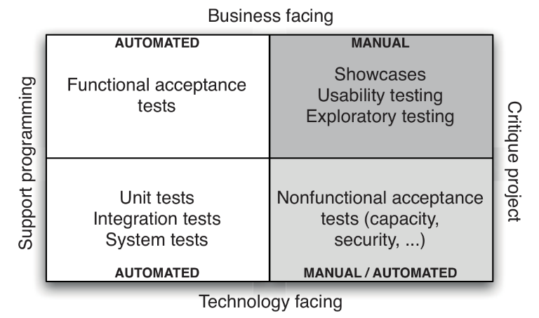

.. vim: syntax=rst

SOFTWARE TESTING POLICY AND STRATEGY
~~~~~~~~~~~~~~~~~~~~~~~~~~~~~~~~~~~~

This is version

.. toctree::
    :maxdepth: 1
    :numbered:
    :hidden:

LIST OF ABBREVIATIONS
=====================

===== ===================================================
ABBR  MEANING
===== ===================================================
CD    Continuous Delivery
CI    Continuous Integration
ISTQB International Software Testing Qualifications Board
PI    Program Increment (SAFe context)
PO    Product Owner
SAFe  Scaled Agile Framework
SKA   Square Kilometre Array
SKAO  SKA Organisation
TDD   Test Driven Development
===== ===================================================

1 Introduction
==============

What follows is the software testing policy and strategy produced by
Testing Community of Practice.

This is **version 1.0.0** of this document, completed on 2019-07-09.

Purpose of the document
-----------------------

The purpose of the document is to specify the testing policy for SKA
software, which answers the question “why should we test?”, and to
describe the testing strategy, which answers “how do we implement the
policy?”.

The policy should achieve alignment between all stakeholders
regarding the expected benefit of testing. The strategy should help
developers and testers to understand how to define a testing process.

Scope of the document
---------------------

This policy and this strategy apply exclusively to software-only SKA
artifacts that are developed by teams working within the SAFe
framework. As explained below, a phased adoption approach is
followed, and therefore it is expected that the policy and the
strategy will change often, likely at least twice per year until
settled.

The document will evolve quickly during the SKA Bridging phase
in order to reach a good level of maturity prior to SKA1 construction
starts.

Each team is expected to comply with the policy and to adopt the
strategy described here, or define and publish a more specific strategy in cases
this one is not suitable.

2. .. rubric:: References
      :name: references

3. .. rubric:: Applicable documents
        :name: applicable-documents

The following documents are applicable to the extent stated herein. In
the event of conflict between the contents of the applicable documents
and this document, the applicable documents shall take precedence.

1. SKA-TEL-SKO-0000661 - Fundamental SKA Software and Hardware
      Description Language Standards

2. SKA-TEL-SKO-0001201 - ENGINEERING MANAGEMENT PLAN

Reference documents
-------------------

.. _ref-istqb-glossary:

[RD1] International Software Testing Qualification Board -
      Glossary https://glossary.istqb.org

See other referenced material at the end of the document.

2 Adoption strategy
===================

Testing within the SKA will be complex for many reasons, including a
broad range of programming languages and frameworks, dispersed
geographical distribution of teams, diverse practices, extended
life-time, richness and complexity of requirements, need to cater for
different audiences, among others.

In order to achieve an acceptable level of quality, many types of
testing and practices will be required, including: coding standards,
unit testing/code coverage, functional testing, multi-layered
integration testing, system testing, performance testing, security
testing, compliance testing, usability testing.

In order to establish a sustainable testing process, we envision a
phased adoption of a proper testing policies and strategies, tailored to
the maturity of teams and characteristics of the software products that
they build: different teams have different maturity, and over time
maturity will evolve. Some team will lead in maturity; some other will
struggle, either because facing difficult-to-test systems, complex test
environments or because they started later.

An important aspect we would like to achieve is that
the testing process needs to support teams, not hinder them with
difficult-to-achieve goals that might turn out to be barriers rather
than drivers. Only after teams are properly supported by the testing
process we will crank up the desired quality of the product and push
harder on the effectiveness of tests.

We envision 3 major phases:

-  Enabling teams, from mid 2019 for a few PIs
-  Establishing a sustainable process, for a few subsequent PIs
-  Keep improving, afterwards.

3 Phase 1: Enabling Teams
=========================

This early phase should start now (June 2019) and should cover at least
the next 1-2 Program Increments.

**The overarching goal is to establish a test process that supports the
teams**. In other terms this means that development teams will be the
major stakeholders benefiting by the testing activities that they will
do. Testing should cover currently used technologies (which include
Tango, Python, C++, Javascript), it should help uncovering risks related
with testability of the tested systems and with reliability issues of
the testing architecture (CI/CD pipelines, test environments, test
data).

As an outcome of such a policy it is expected that appropriate technical
practices are performed regularly by each team (eg. TDD, test-first,
test automation). This will allow us in Phase 2 to crank up quality by
increasing testing intensity and quality, and still have teams following
those practices.

It is expected that the systems that are built are modular and testable
from the start, so that in Phase 2 the roads are paved to enable
increase of quality and provide business support by the testing process
in terms of monitoring the quality.

One goal of this initial phase is to create awareness of the importance
given to testing by upper management. Means to implement a testing
process will be provided (tools, training, practices, guidelines), so
that teams could adopt them.

We plan to cover at least these practices:

-  TDD and Test-First.
-  Use of test doubles (mocks, stub, spies).
-  Use and monitoring of code coverage metrics.

Another goal of this phase is **identifying the test training needs** for
the organization and teams and start providing some support
(bibliography, slides, seminars, coaching).

In order to focus on supporting the teams, we expect that the testing
process established in this initial phase should NOT:

-  set strict mandatory policies regarding levels of coverage of code
   (regardless of the coverage criteria such as statements, branch, or
   variable usage-definition), of data, of requirements and of risks;
-  systematically cover system-testing;
-  rely on exploratory testing (which will be introduced later on);
-  define strict entry/exit conditions for artefacts on the different CI stages to
   avoid creating stumbling blocks for teams;
-  provide traceability of requirements and risks;
-  be centered on “specification by example” yet.

We will focus on these aspects in subsequent phases.

On the other hand, the testing process should help creating testable
software products, it should lead to a well-designed test automation
architecture, teams should become exposed and should practice TDD,
test-first, and adopt suitable test automation patterns.

An easy-to-comply test policy is suggested, and a strategy promoting
that testing should be applied during each sprint, automated tests should be
regularly developed at different levels (unit, component, integration),
regression testing should be regularly done, test-first for bugs and
refactorings should be regularly done.

Basic monitoring of the testing process will be done, to help teams
improve themselves and possibly to create competition across teams. Test
metrics will include basic ones dealing with the testing process, the
testing architecture and the product quality.

4 Testing policy
================

This policy covers all sorts of software testing performed on the code
bases developed by each of the SKA teams. There is only one policy, and
it applies to all software developed within/for SKA.

4.1 Key definitions
-------------------

When dealing with software testing, many terms have been defined
differently in different contexts. It is important to standardise the
vocabulary used by SKA1 in this specific domain according to the
following definitions, mostly derived by [:ref:`RD1 <ref-istqb-glossary>`].

**Testing**
    The process consisting of all lifecycle activities, both static
    and dynamic, concerned with planning, preparation and evaluation of
    software products and related work products to determine that they
    satisfy specified requirements, to demonstrate that they are fit for
    purpose and to detect bugs.

**Debugging**
    The process of finding, analyzing and removing the causes of
    failures in software.

**Bug**
    A flaw in a component or system that can cause the component or
    system to fail to perform its required function, e.g. an incorrect
    statement or data definition. A bug, if encountered during execution,
    may cause a failure of the component or system. Synonyms: defect, fault

**Failure**/**Symptom**
    Deviation of the component or system from its expected
    delivery, service or result.

**Error**
    A human action that produces an incorrect result (including
    inserting a bug in the code or writing the wrong specification).

NOTE: the purpose of defining both “testing” and “debugging” is so that
readers get rid of the idea that one does testing while he or she is
doing debugging. They are two distinct activities.

4.2 Work organization
---------------------

Testing is performed by the team who develops the software. There is no
dedicated group of people who are in charge of testing, there are no
beta-testers.

4.3 Goals of testing
--------------------

With reference to the test quadrants (:ref:`Figure 1<figure-test-quadrants>`), this policy is restricted
to tests supporting the teams and mostly those that are technology
facing, hence quadrant Q1 (bottom left) and partly Q2 (top left), functional acceptance tests.

.. _figure-test-quadrants:

Test quadrants, picture taken from (Humble and Farley, Continuous Delivery, 2011).

The overarching goal of this version of the policy is **to establish a testing process that supports
the teams.**

The expected results of applying this policy are that effective
technical practices are performed regularly by each team (eg. TDD,
test-first, test automation). The testing process that will be
established should help creating testable software products, it should
lead to a well-designed test automation architecture, it should push
teams to practice TDD, test-first, and adopt suitable test automation
patterns.

The reason is that in this way the following higher level objectives can
be achieved:

*  team members explore different test automation frameworks and learn how to use them efficiently;

*  team members learn how to implement tests via techniques like test
   driven development and test-first, how to use test doubles, how to
   monitor code coverage levels, how to do pair programming and code
   reviews;

*  as an effect of adopting some of those techniques, teams reduce
   technical debt or keep it at bay; therefore they become more and
   more efficient in code refactoring and in writing high quality
   code;

*  they will become more proficient in increasing quality of the testing
   system, so that it becomes easily maintainable;

*  by adopting some of those techniques, teams will develop systems that
   are more and more testable; this will increase modularity,
   extendability and understandability of the system, hence its
   quality;

*  team members become used to developing automated tests within the
   same sprint during which the tested code is written;

*  reliance on automated tests will reduce the time needed for test
   execution and enable regression testing to be performed several
   times during a sprint (or even a day).

Emphasis on quadrant 1 of :ref:`Figure 1<figure-test-quadrants>`,
and low importance to the other quadrants, will
allow the teams to be more focussed (within the realm of testing) and
learn the basics. Some attention to quadrant 2 will let teams start addressing
tests at a higher level, which bring along aspects like traceability
(relationships between tests and requirements) and integration between
subsystems.

Expected outcomes are that once testable systems are produced, a relatively large number of
unit/module tests will be automated, new tests will be regularly
developed within sprints, refactorings will be “protected” by automated
tests, and bug fixes will be confirmed by specific automated tests,
teams will be empowered and become efficient in developing high quality
code. From that moment, teams will be ready to improve the effectiveness
of the testing process, which will gradually cover also the other
quadrants.

In this phase we can still expect a number of bugs to still be present,
to have only a partial assessment of “fitness for use”, test design
techniques not to be mastered, non-functional requirements not be
systematically covered, testing process not to be extensively monitored,
systematic traceability of tests to requirements not to be covered, and
monitoring of quality also not to be covered. These are objectives to be achieved
in later phases, with enhancements of this policy.

4.4 Monitoring implementation of the policy
-------------------------------------------

Adoption of this policy needs to be monitored in a lightweight fashion.
We suggest that each team regularly (such as at each sprint) reports the
following (possibly in an automatic way):

-  total number of test cases

-  percentage of automated test cases

-  number of test cases/lines of source code

-  number of logged open bugs

-  bug density (number of open logged defects/lines of source code)

-  age of logged open bugs

-  number of new or refactored test cases/sprint

-  number of test cases that are labelled as “unstable” or that are skipped

-  code coverage (the “execution branch/decision coverage” criterion is
   what we would like to monitor, for code that was written by the
   team).

These metrics should be automatically computed and updated, and made available to every
stakeholder in SKA.

6 Testing strategy
==================

A testing strategy describes how the test policy is implemented and it
should help each team member to better understand what kind of test to
write, how many and how to write them. This testing strategy refers to
the testing policy for Phase 1.

Because of the diversity of SKA development teams and the diversity of
the nature of the systems that they work upon [1]_, it seems reasonable
to start with a testing strategy that is likely to be suitable for most
teams and let each team decide if a refined strategy is needed. In this
case each team should explicitly define such a modified strategy and
make it public.

6.1 Key definitions and concepts
--------------------------------

(Mostly derived from the ISTQB glossary:
`www.istqb.org <http://www.istqb.org>`__\ )

Testing levels refer to the granularity of the system-under-test (SUT):

-  unit testing: The testing of individual software components (as a
      synonym of component testing). In a strict sense it means testing
      methods or functions in such a way that it does not involve the
      filesystem, the network, the database. Usually these tests are
      fast (i.e. an execution of a test set provides feedback to the
      programmer in a matter of seconds, perhaps a minute or two; each
      test case runs for some milliseconds).

-  component/module testing: The testing of individual software
      components which can be an aggregate of classes, a package, a set
      of packages, a module. Notice that the word “component” here
      refers to software modules or other static structures; it does not
      mean runtime entities as meant in SEI “Views and Beyond”. Because
      of this ambiguity we will adopt the term “module testing”.

-  integration testing: Testing performed to expose defects in the
      interfaces and in the interaction between integrated components or
      systems. In a strict sense this level applies only to testing the
      interface between 2+ components; in a wider sense it means testing
      that covers a cluster of integrated subsystems.

-  system testing: Testing an integrated system to verify that it meets
      specified requirements.

-  acceptance testing: Formal testing with respect to user needs,
      requirements, and business processes conducted to determine
      whether or not a system satisfies the acceptance criteria and to
      enable the user, customers or other authorized entity to determine
      whether or not to accept the system.

..

Test basis: All artifacts from which the requirements of a component or
system can be inferred and the artifacts on which the test cases are
based. For example, the source code; or a list of requirements; or a set
of partitions of a data domain; or a set of configurations.

Confirmation testing: Testing performed when handling a defect. Done
before fixing it in order to replicate and characterise the failure.
Done after fixing to make sure that the defect has been removed.

Regression testing: Testing of a previously tested program following
modification to ensure that defects have not been introduced or
uncovered in unchanged areas of the software, as a result of the changes
made. It is performed when the software or its environment is changed.

Exploratory testing: An informal test design technique where the tester
actively controls the design of the tests as those tests are performed
and uses information gained while testing to design new and better
tests. [it consists of simultaneous exploration of the system and
checking that it does what it should]

6.2 Scope, roles and responsibilities
-------------------------------------

This strategy applies to all the software that is being developed within
the SKA.

Each team should have at least a tester. Because of the specific skills
that are needed to write good tests and to manage the testing process,
we expect that in the coming months a tester will become a dedicated
person in each team. For the time being we see “tester” as being a
function within the team rather than a job role. Each team member should
contribute to this function although one specific person should be held
accountable for testing.

In most cases, programmers are responsible for developing unit tests,
programmers and testers together are responsible for designing and
developing module and integration tests, testers and product owners are
responsible for designing system and acceptance tests for user stories,
enablers, and features.

Each team is responsible for system and acceptance testing of the
systems they are working on, even when those systems are integrated with
other ones. So, for example, if team P’ develops a system P that
produces data used by another system C that consumes it and which is
developed by team C’, then team C’ is in charge of system tests of the
integrated system <P,C>. This is likely to happen through the API Int-C.

However, team P’ is in charge of testing the subsystem P in isolation,
likely through the common API; likewise team C’ is in charge of testing
C and developing whatever stubs are needed to make C run. Both are in
charge of testing the shared API, from either sides (P and C). Team P’
is in charge of providing instances of P so that C’ can perform the
system and acceptance tests of the integrated system <P,C>.

|image3|

Figure 2: Integration testing

P’ is responsible for providing instances of P that can be used for
testing. It is a good practice for C’ to create replicas of P (in the
form of stubs or mocks) to be used for testing C.

6.3 Test specification
----------------------

Programmers adopt a TDD approach and almost all unit and module tests
are developed before production code on the basis of technical
specifications or intended meaning of the new code. Testers can assist
programmers in defining good test cases.

In addition, when beginning to fix a bug programmers, possibly with the
tester, define one or more unit/module/integration tests that confirm
that bug. This is done prior to fixing the bug.

Furthermore, the product owner with a tester and a programmer define the
acceptance criteria of a user story and on this basis the tester with
the assistance of programmers designs acceptance, system, and
integration tests. Some of these acceptance tests are also associated
(with tags, links or else) to acceptance criteria of corresponding
features. All these tests are automated, possibly during the same sprint
in which the user story is being developed.

6.4 Test environment
--------------------

In this version of the strategy we do not cover sophisticated
environments for running functional and performance tests of complex
systems like the SDP. We expect those teams to come up with suggestions
and prototype solutions that could be included in this strategy later
on.

6.5 Test data
-------------

In this version of the strategy we do not cover sophisticated mechanisms
for handling data to support functional and performance tests of complex
systems like the SDP. We expect those teams to come up with suggestions
and prototype solutions that could be included in this strategy later
on.

6.6 Test automation
-------------------

At the moment these elements are still under active investigation.

6.7 Confirmation and regression testing
---------------------------------------

Regression testing is performed at least every time code is committed on
any branch in the repository. This should be ensured by the CI/DI
pipeline.

In order to implement an effective CI/CD pipeline, automated test cases
should be classified also (in addition to belonging to one or more test
sets) in terms of their speed of execution, like “fast”, “medium”,
“slow”. In this way a programmer that wants a quick feedback (less than
1 minute) would run only the fast tests, the same programmer that is
about to commit his/her code at the end of the day might want to run
fast and medium tests and be willing to wait some 10 minutes to get
feedback, and finally a programmer ready to merge a branch into master
might want to run all tests, and be willing to wait half an hour or
more.

Confirmation tests are run manually to confirm that a bug really exist.

6.8 Bug management
------------------

Bugs found by the team during a sprint for code developed during the
same sprint are fixed on the fly, with no logging at all. If they cannot
be fixed on the fly, soon after they are found they are logged on the
team backlog.

Bugs that are found by the team during a sprint but that are related to
changes made in previous sprints, are always logged on the team backlog
(this is useful for measuring the quality of the testing process, with a
metric called defect-detection-rate).

Bugs that are reported by third parties (eg. non SKA and SKA users,
other teams, product managers) are always logged. For the time being
these bugs will be notified to the relevant team via email or Slack
messages, and the team is expected to promptly log them in their
backlog. The team is then responsible to inform the reporter on the
evolution of the ticket.

Logging occurs in JIRA by adding a new issue of type Bug to the product
backlog and prioritized by the PO as every other story/enabler/spike.
The issue type Defect should not be used, as it is meant to indicate a
deviation from SKA requirements.

7 Book References
=================

Relevant textbooks include:

-  Managing the Testing Process: Practical Tools and Techniques for Managing Hardware and Software Testing, R. Black, John Wiley & Sons Inc, 2009

-  Continuous Delivery: Reliable Software Releases Through Build, Test, and Deployment Automation, J. Humble and D. Farley, Addison-Wesley Professional, 2010

-  xUnit Test Patterns: Refactoring Test Code, G. Meszaros, Addison-Wesley Professional, 2007

-  Test Driven Development. By Example, Addison-Wesley Professional, K. Beck, 2002

-  Agile Testing: A Practical Guide for Testers and Agile Teams, L. Crispin, Addison-Wesley Professional, 2008

.. [1]
   Ranging from web-based UIs to embedded systems.

.. |image0| image:: media/image3.png
   :width: 2.875in
   :height: 1.82292in
.. |image1| image:: media/image2.png
   :width: 0.72632in
   :height: 0.25391in
.. |image2| image:: media/image1.png
   :width: 5.73438in
   :height: 3.45932in
.. |image3| image:: media/image4.png
   :width: 6.27083in
   :height: 1.83333in
