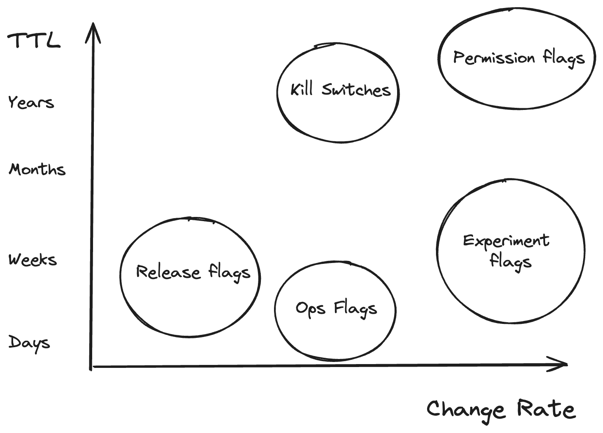
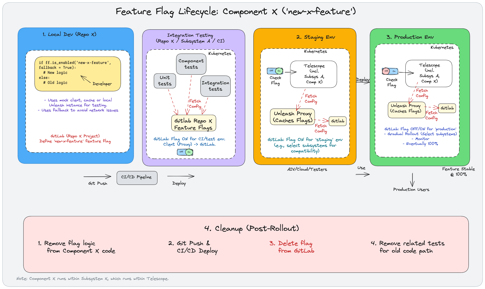

.. _feature-flags-explanation:

#############
Feature Flags
#############

This section explains the fundamental concepts behind feature flags and their specific application within the SKAO context.

What are Feature Flags?
=======================

Feature flags (also known as feature toggles, flippers, or conditional features) are a software development technique that allows you to turn certain functionality on and off during runtime, without deploying new code.

At its core, a feature flag is a decision point in your code that can change the behaviour of the software based on the flag's state (e.g., on or off).

.. code-block:: python
   :caption: Example

   if feature_flags.is_enabled("new-shiny-feature"):
       # Execute the new code path
       show_new_shiny_feature()
   else:
       # Execute the old code path
       show_old_feature()

Where They Can Be Useful
========================

Feature flags offer several advantages:

*   **Decouple Deployment from Release:** Deploy code to production frequently, but only release features to users when ready.
*   **Canary Releases & Gradual Rollouts:** Release features to a small subset of users (e.g., internal testers, beta users, percentage of traffic) before a full rollout, reducing risk.
*   **A/B Testing/Compatibility:** Expose different versions of a feature to different user segments or dependencies to test new functionality or compatibility with other components and gather feedback.
*   **Kill Switches:** Quickly disable problematic features in production without needing a rollback or hotfix deployment.
*   **Development:** Allow developers to merge incomplete features to the main branch, hidden behind a flag, reducing merge conflicts and integration pain.
*   **Operational Control:** Enable/disable features for specific operational needs (e.g., disabling a resource-intensive feature during peak load).

You can read more about different types of feature flags `here <https://docs.getunleash.io/what-is-a-feature-flag>`__.

For example, Marvin has used feature flags extensively to control the rollout of several new checks (status checks, license checks etc.) as release or kill switches. 
This allowed him to enable the feature on the agreed date, while still being able to revert when there were issues. We could also test this in the same environment with a subset of integrations easily.

Where They Shouldn't Be Used (Anti-patterns)
============================================

While powerful, feature flags should be used judiciously:

*   **Long-Term Configuration:** Flags should be temporary. Avoid using them as a permanent configuration system; use proper configuration management for that. Plan for flag removal.
*   **Excessive Complexity:** Too many flags, especially nested ones, can make code hard to reason about, test, and maintain.
*   **Replacing Proper Design:** Don't use flags to avoid making architectural decisions or refactoring technical debt.
*   **Core Architectural Changes:** Flags are generally unsuitable for toggling fundamental architectural differences.

GitLab Feature Flags
====================

SKAO leverages GitLab's built-in `Feature Flags <https://docs.gitlab.com/operations/feature_flags/>`__ functionality, which is based on the open-source `Unleash <https://www.getunleash.io/>`__ feature management system.

What GitLab Provides:
---------------------
*   **UI for Management:** A simple interface within your GitLab project (under Deploy -> Feature Flags) to create, toggle, and configure flags.
*   **Environment Scoping:** Define different flag states and strategies per GitLab environment (e.g., `production`, `staging`, `integration`, `development`).
*   **Basic Strategies:** Support for simple strategies like "All Users", "Percent of Users", "List of User IDs". This does not apply to most of SKAO's use cases. but this can leveraged as a list of options you can turn on and off at a deeper level.
*   **API Access:** Programmatic control over flags via the GitLab API.
*   **Integration with Unleash:** Uses the Unleash protocol, allowing compatibility with standard Unleash client libraries.

Limitations & Considerations:
-----------------------------
*   **Performance:** Directly querying the GitLab instance for flag status on every check can be slow and add load, especially for high-traffic applications. **This is why we use the Unleash Proxy.** The defaults should be good enough for most use cases, however, do reach out the System Team if you need help tuning this.
*   **Advanced Strategies:** GitLab's UI might not expose all advanced strategies available in Unleash itself.
*   **Dependency on GitLab:** Your application's ability to fetch flag states depends on the availability of your GitLab instance (or the proxy).
*   **No Built-in Proxy:** GitLab doesn't host an Unleash Proxy for you; we need to deploy and manage it ourselves.

Unleash Proxy for Caching
=========================

To mitigate the performance concerns of directly hitting the GitLab API, we typically deploy an `Unleash Proxy <https://docs.getunleash.io/reference/unleash-proxy>`__ alongside our applications in Kubernetes.
This is not enabled in all the environments so you need to check with the System Team to see if it is enabled for your environment.

.. note:: Keep feature flag fetching disabled for CI runs.

Naming Conventions
==================

The following naming conventions are advised to be used for feature flags:

*   Prefix the flag name with the component name. This helps to identify the feature flag and its purpose.
*   Use the same flag name across different repositories if a flag introduced in `Component A` needs to be controlled during the integration testing of `Subsystem X` or `System 1`. The *definition* and *control plane* (GitLab project) shifts, but the flag name checked in the code remains the same.
*   Use the same flag name across different environments.
*   Use the same flag name across different components of the same system.

Feature Flag Lifecycle
======================

.. _feature-flags-diagram-explanation:

This diagram illustrates the typical lifecycle of a feature controlled by a feature flag, specifically focusing on a hypothetical ``Component X`` using the flag ``new-x-feature``. It shows the journey from initial development through various environments to production rollout and eventual cleanup, keeping system dependencies in mind.

*Note: As indicated at the bottom of the diagram, ``Component X`` runs within ``Subsystem A``, which in turn runs within ``Telescope``.*

1. Local Development (Repo X)
=============================

*   **Developer Action:** A developer working within the ``Component X`` repository (Repo X) introduces new functionality. They wrap this new code path and the original ("Old logic") code path within a conditional statement controlled by the ``new-x-feature`` flag using an Unleash client library (e.g., ``ff.is_enabled('new-x-feature', fallback = True)``). Using a fallback is crucial to handle potential initialisation or network issues gracefully.
*   **Testing:** During local development, the developer uses:
    *   A mock client, cached values, or a local Unleash instance for testing flag behaviour without connecting to a central server.
*   **Flag Definition:** The diagram notes that the ``new-x-feature`` flag might initially be thought about or conceptually defined within the context of the Repo X GitLab project. *(See Integration Testing for where control often resides)*.
*   **Outcome:** The code containing the flag logic is committed and pushed via Git.

CI/CD Pipeline
==============

*   **Trigger:** The `Git Push` triggers the CI/CD Pipeline.
*   **Action:** This pipeline builds, tests, and orchestrates the deployment of the application (e.g., ``Telescope`` / ``System A``, which includes ``Component X``) to subsequent environments.

2. Integration Testing (Repo X / Subsystem A / CI)
==================================================

*   **Environment:** This phase often occurs within the CI/CD pipeline itself or a dedicated, short-lived test environment (represented within Kubernetes).
*   **Testing:** Various automated tests run against the integrated code: Unit tests, Component tests, and Integration tests etc.
*   **Flag Configuration Source:** Tests in this environment fetch flag configurations from the GitLab feature flags defined **within the Repo X project**.
*   **GitLab State:** For this CI/test environment, the ``new-x-feature`` flag is configured to be **ON** in the Repo X GitLab project to allow testing of the new code path during the CI phase.
*   **Client Interaction:** The client (potentially via a proxy, as indicated by "Client (Proxy) -> GitLab") checks the flag state against the configuration fetched from the Repo X GitLab project.
*   **Outcome:** Successful tests allow the pipeline to proceed to deploy to Staging.

3. Staging Environment
======================

*   **Deployment:** The CI/CD pipeline deploys the integrated application to a persistent staging environment.
*   **Unleash Proxy:** An Unleash Proxy service runs within the Staging environment. It periodically fetches the flag configurations from the central **GitLab** instance (the diagram implies this might shift or be consolidated from the Repo X definition, potentially now managed at the System 1 / Telescope level for broader control) and caches them.
*   **Application Behaviour:** The running application checks the flag status (`Check Flag` toggle) by querying the **local Unleash Proxy** within the staging environment.
*   **GitLab State:** The flag is configured in GitLab to be **ON** for the ``staging`` environment. Strategies might involve enabling it for specific subsystems (`select subsystems for compatibility`) or for specific users/groups.
*   **Verification:** AIV (Assembly, Integration and Verification), Cloud, or other designated Testers may interact with the staging system to manually verify the new feature.

4. Production Environment
=========================

*   **Deployment:** After successful staging validation, the application is deployed to the Production.
*   **Unleash Proxy:** A dedicated Unleash Proxy may run in Production, fetching flag configurations from GitLab for the ``production`` environment scope.
*   **Application Behaviour:** Production instances check the flag status (`Check Flag` toggle) via the Production Unleash Proxy or directly from GitLab.
*   **GitLab State (Rollout):** The flag's strategy for the ``production`` environment is managed in GitLab for a controlled rollout:
    *   The flag can be toggled **OFF/ON**.
    *   A **Gradual Rollout** strategy may be used (e.g., enabling for specific subsystems, user percentages, user IDs).
    *   **Eventually**, the strategy is updated to enable the flag for **100%** of users/subsystems.

5. Cleanup (Post-Rollout)
=========================
*   **Trigger:** Once the feature is stable and fully rolled out in Production.
*   **Actions:**

    1.  **Remove flag logic** from ``Component X`` code (leaving only the new path).
    2.  **Git Push & CI/CD Deploy:** Push the cleaned code; the pipeline deploys the updated application without the flag logic.
    3.  **Delete Flag** definition from GitLab.
    4.  **Remove related tests** for the old code path that is no longer reachable.

Best Practices
==============

*   Define flags at the highest level where they need to be controlled. If a flag in `Component A` only affects `A`'s internal behaviour and isn't relevant to `Subsystem X` or `Telescope`, it *could* potentially be managed within Repo A's project. However, if the feature controlled by the flag needs coordinated rollout across the integrated system, manage it in the GitLab project for Subsystem X or Telescope repository. Clear communication and naming conventions are crucial.
*   Use the same flag name across different repositories if a flag introduced in `Component A` needs to be controlled during the integration testing of `Subsystem X` or `Telescope`. The *definition* and *control plane* (GitLab project) shifts, but the flag name checked in the code remains the same.
*   Always use configurable options for initialisation of the Unleash client so that different datacentres can be used for different environments.

Read more on feature flags on developer portal: :ref:`feature-flags`