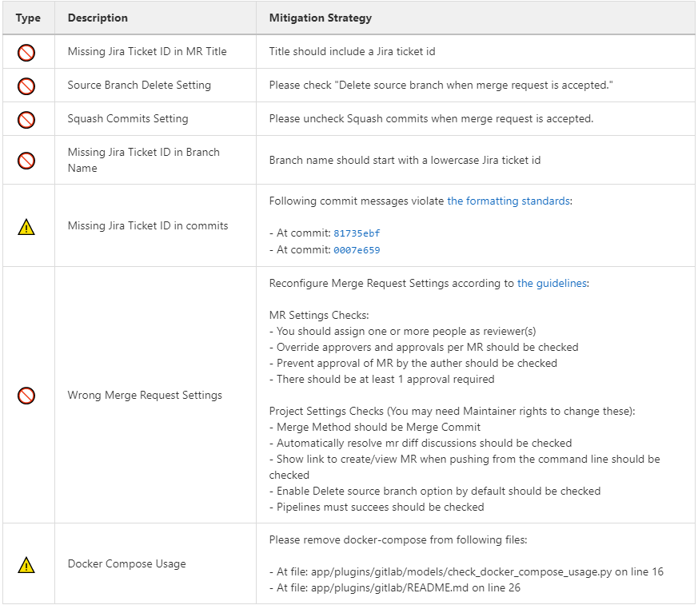

Merge Request Quality Checks
============================

To ensure the guidelines and policies described in this Developer Portal are followed for consistent and robust development/security/review and  Software Quality Assurance processes for SKA repositories, there are a series of automated checks in place.
The result of the checks are reported back to the developers in the main Merge Request page on GitLab.
It is advised to look for this comment and respond to any issue arising.

A check is either a:

* Failure (🚫): The Merge Request is violating the SKA guidelines and it should be fixed by following the mitigation defined in the check

  * Example
  
    * Branch name must start with a lowercase Jira Ticket ID - see :ref:`branching-policy`

* Warning (⚠): The Merge Request is following anti patterns/non-advised guidelines/policies and it would be better if it is fixed by the mitigation defined in the check

  * Example
  
    * Docker-Compose commands found on the repository

* Information (📖): You should be aware of the information conveyed in this Merge Request quality check message
  
  * Example
  
    * The merge request does not present documentation changes

Each check has a brief description that explains what it does and a mitigation/explanation (depending on check type) which gives detailed information about the check and how to fix it or explains its findings more. You can find a list of each check below.

Workflow
++++++++

When a new Merge Request is created, a webhook triggers the SKA MR Service to carry out the checks described below and **Marvin the Paranoid Android** (*username: marvin-42*) happily reports back to the Merge Request by adding a comment (probably the first comment). The comment includes a table (like the example below) with each check and associated information.

For subsequent changes pushed to the Merge Request, the comment is updated to reflect the latest status of the Merge Request.

   Marvin's Check Table.

*Automatic Fixing of Merge Request Settings*
^^^^^^^^^^^^^^^^^^^^^^^^^^^^^^^^^^^^^^^^^^^^^^^^^^

While the checks are being processed, several settings in the Project and the Merge Request that triggered the checks will be automatically fixed. These fixes include:

* Disabling 'squash commits when merge request is accepted'.

* Enabling 'delete source branch when merge request is accepted'.

* Enabling 'automatically resolve mr diff discussions'.

* Enabling 'remove all approvals when new commits are pushed'.

* Enabling 'pipelines must succeed'.

* Enabling 'delete source branch option by default'.

* Enabling 'show link to create/view MR when pushing from the command line'.

In addition to the above automatic fixes, there is a clickable Fix link next to each supported Merge Request Settings message, clicking on it will trigger Marvin to attempt to fix that setting if the triggering user is authenticated.

All settings fixed by Marvin will result in a new comment in the Merge Request detailing the changes made and whether they were successful or not.
Settings fixed automatically will be detailed together in a single comment, while each setting fixed through the clickable link will have their own individual comment.

Please note that only users that are assigned to the Merge Request can use the clickable links to trigger the automatic setting fix feature.

*Marvin Approval*
^^^^^^^^^^^^^^^^^

Marvin after creating the table will verify if there is any checks under the failure category failed. If so, Marvin does not approve the MR, and in the case that MR was already approved before by him he unapproves it. 
If none of the checks under the failure category failed Marvin will approve the MR.

Checks
++++++

+-------------+---------------------------------------+------------------------------------------------------------------------------------------+
|    Type     |              Description              |                                   Mitigation Strategy                                    |
+=============+=======================================+==========================================================================================+
| Warning     | Docker-Compose                        | Please remove docker-compose from following files:                                       |
|             |                                       |                                                                                          |
|             | Usage                                 | *  At file: <file_location> on line <line_number>                                        |
|             | Found                                 | *  At file: <file_location> on line <line_number>                                        |
+-------------+---------------------------------------+------------------------------------------------------------------------------------------+
| Failure     | Missing Jira Ticket                   | Branch name should start with a lowercase Jira ticket id                                 |
|             | In Branch Name                        |                                                                                          |
+-------------+---------------------------------------+------------------------------------------------------------------------------------------+
| Failure     | Missing Jira Ticket                   | Following commit messages violate :ref:`committing-code`                                 |
|             | in commits                            |                                                                                          |
|             |                                       | *   <commit-hash>                                                                        |
|             |                                       | *   <commit-hash>                                                                        |
+-------------+---------------------------------------+------------------------------------------------------------------------------------------+
| Failure     | Missing Jira Ticket ID                | Title should include a valid Jira ticket id                                              |
|             | in MR Title                           |                                                                                          |
+-------------+---------------------------------------+------------------------------------------------------------------------------------------+
| Failure     | Wrong Merge                           | Reconfigure Merge Request Settings according to :ref:`merge-request`                     |
|             | Request Setting                       |                                                                                          |
|             |                                       | MR Settings Checks(You may need Maintainer rights to change these):                      |
|             |                                       |                                                                                          |
|             |                                       | * You should assign one or more people as reviewer(s)                                    |
|             |                                       | * There should be at least 1 approval required                                           |
|             |                                       | * Please uncheck Squash commits when Merge Request is accepted.                          |
|             |                                       | * Please check Delete source branch when merge request is accepted.                      |
|             |                                       |                                                                                          |
|             |                                       | Project Settings Checks(You may need Maintainer rights to change these):                 |
|             |                                       |                                                                                          |
|             |                                       | * Pipelines must succeed should be checked                                               |
|             |                                       | * Remove all approvals when commits are added to the source branch should be checked     |
|             |                                       | * Prevent approval of MR by the author should be checked                                 |
|             |                                       | * Automatically resolve mr diff discussions should be checked                            |
|             |                                       | * Prevent editing approval rules in merge requests should be checked                     |
|             |                                       | * Enable Delete source branch option by default should be checked                        |
|             |                                       | * Merge Method should be Merge Commit                                                    |
|             |                                       | * Show link to create/view MR when pushing from the command line should be checked       |
+-------------+---------------------------------------+------------------------------------------------------------------------------------------+
| Failure     | Missing Assignee                      | Please assign at least one person for the MR                                             |
+-------------+---------------------------------------+------------------------------------------------------------------------------------------+
| Information | Documentation Changes                 | This MR doesn't introduce any documentation changes. Please consider                     |
|             |                                       | updating documentation to reflect your changes                                           |
+-------------+---------------------------------------+------------------------------------------------------------------------------------------+
| Failure     | Read The Docs                         | Please integrate this project with ReadtheDocs following the guidelines:                 |
|             | Integration                           |                                                                                          |
|             |                                       | *  Please set up docs/ folder for sphinx documentation build following the guidelines    |
|             |                                       | *  Please add this project as a subproject on Read the Docs following the guidelines     |
|             |                                       | *  Please import your project into Read the Docs                                         |
+-------------+---------------------------------------+------------------------------------------------------------------------------------------+
| Failure     | Pipeline Checks                       | Please create a `pipeline </en/latest/tools/ci-                                          |
|             |                                       | cd.html>`__  on this Merge Request or please add the following jobs:                     |
|             |                                       |                                                                                          |
|             |                                       | * `ci-metrics  </en/lat                                                                  |
|             |                                       |   est/tools/ci-cd/continuous-integration.html?highlight=post_step.yml#automated          |
|             |                                       |   -collection-of-ci-health-metrics-as-part-of-the-ci-pipeline>`__                        |
|             |                                       | * `helm-publish  </en/                                                                   |
|             |                                       |   latest/tools/software-package-release-procedure.html?highlight=helm_publish.yml        |
|             |                                       |   #package-and-publish-helm-charts-to-the-skao-helm-chart-repository>`__                 |
+-------------+---------------------------------------+------------------------------------------------------------------------------------------+
| Warning     | Missing CODEOWNERS                    | Please add a `CODEOWNERS <https://docs.gitlab.com/ee/user/project/code_owners.html>`__   |
|             | file                                  | file to the root folder.                                                                 |
+-------------+---------------------------------------+------------------------------------------------------------------------------------------+
| Warning     | Non-compliant License                 | Please update the license information according to                                       |
|             | Information                           | :doc:`/projects/licensing`                                                               |
+-------------+---------------------------------------+------------------------------------------------------------------------------------------+
| Warning     | Missing Test Coverage                 | This Project is missing test coverage Please have a look at the following `page <https   |
|             |                                       | ://developer.skatelescope.org/en/latest/tools/ci-cd/continuous-integration.html?hig      |
|             |                                       | hlight=coverage#automated-collection-of-ci-health-metrics-as-part-of-the-ci-pipeline>`__ |
+-------------+---------------------------------------+------------------------------------------------------------------------------------------+
| Warning     | Non-Complaint                         | Project Slug should start with  **ska-** .                                               |
|             | Project Slug Name                     | To change the slug go into: Settings->Advanced->Change Path                              |
|             |                                       | If you don't have access to this settings, please contact the System Team Support Center |
|             |                                       | at https://jira.skatelescope.org/servicedesk/customer/portal/166                         |
+-------------+---------------------------------------+------------------------------------------------------------------------------------------+
| Warning     | Repository Structure is not following | Following rules failed for the repository structure:                                     |
|             | standardised                          |                                                                                          |
|             | `Project Structure                    |                                                                                          |
|             | <https://confluence.skatelescope.org  |                                                                                          |
|             | /display/SE/Standardising+Project+    |                                                                                          |
|             | Structure+and+Content">`__            |                                                                                          |
|             |                                       | * Python: There should be `pyproject.toml` file in the root folder                       |
|             |                                       | * Python: Python files should be under a python module starting with                     |
|             |                                       |   ska_(preferably project_slug) in the `src/` folder                                     |
|             |                                       | * Helm: There should be at least one chart in the `charts/` folder                       |
|             |                                       | * Helm: Charts should start with <project_slug> prefix                                   |
|             |                                       | * ...                                                                                    |
|             |                                       | * *See repository structure guidelines for all of the rules*                             |
+-------------+---------------------------------------+------------------------------------------------------------------------------------------+

Docker-Compose Found
^^^^^^^^^^^^^^^^^^^^
This check is to warn users that they  are using Docker-Compose in their project. This will make it easier to remove Docker-Compose from the projects as it shouldn't be used any more (as it creates issues with the underlying
networks). To avoid this warning, the user needs to remove Docker-Compose from the project. The details of the files involved can be seen in the warning message under the Mitigation Strategy column along with the line numbers where Docker-Compose is found.

Missing Jira Ticket In Branch Name
^^^^^^^^^^^^^^^^^^^^^^^^^^^^^^^^^^
This check warns users from raising a Merge Request without a Jira ticket ID in the branch name. This will make every branch identifiable with its Jira ticket. The level of this check is a failure, and to avoid it users should follow the steps listed in :ref:`trunk-based-development`.

Missing Jira Ticket in commits
^^^^^^^^^^^^^^^^^^^^^^^^^^^^^^
This check warns users of any commit that was made without using a Jira ticket ID in its message. Having the Jira ticket ID at the beginning of your commit messages is one of the basic rules listed at :ref:`committing-code`. The Jira Ticket ID in the commit messages are used by the developers to keep track of the changes made on the ticket through JIRA, and is a key part of the Software Quality Assurance programme.

Missing Jira Ticket ID in MR Title
^^^^^^^^^^^^^^^^^^^^^^^^^^^^^^^^^^
This check warns users from raising a Merge Request without a Jira ticket ID in Merge Request title. This will make every Merge Request identifiable with its Jira ticket (through the GitLab/Jira integration). The level of this check is a failure, and to avoid it users should include a valid Jira ticket id in title of the Merge Request.

Wrong Merge Request Setting
^^^^^^^^^^^^^^^^^^^^^^^^^^^
This check warns users from merging their branch without the Merge Request being configured with the right settings. The level of this check is a failure, and to avoid it the Merge Request should be configured as listed in :ref:`merge-request`. Some of the settings can only be changed by the maintainers.

Missing Assignee in MR
^^^^^^^^^^^^^^^^^^^^^^
This check warns users that no one was assigned to the Merge Request. The level of this check is failure. To avoid it at least one assignee must be added to the MR.

Documentation Changes
^^^^^^^^^^^^^^^^^^^^^^
This check warns users that this MR doesn't introduce any documentation changes. This check provides information only. Action is not always needed, as some MRs may not require a documentation update; it is just a gentle warning that a documentation update might be missing.

Read The Docs Integration
^^^^^^^^^^^^^^^^^^^^^^^^^
This check warns users that this project does not follow the guidelines for successful Read The Docs Integration. Failing this check will prevent merging the MR. To avoid it, three checks must pass. The project needs to have set up docs/ folder for sphinx documentation, it also needs to be added as a subproject on Read the Docs. Finally webhooks need to be set up so that the project is imported your into Read the Docs.

Pipeline Checks
^^^^^^^^^^^^^^^
This check warns users from merging their Merge Request without having a pipeline with the needed jobs like post_step.yml and build_push.yml. Including build_push.yml guarantees that container scanning job is included in your pipelines. The level of this check is a failure, and to avoid it 2 steps may be needed. The first one is to create a pipeline (i.e. add .gitlab-ci.yml) if there is not one created yet. The second one can only be done after the first one, and it consists on including the jobs that are listed on the mitigation strategy column (i.e. helm-publish) in the created pipeline. How to add the jobs to the pipeline is explained on the developer portal (job name as hyperlink).

Missing CODEOWNERS File
^^^^^^^^^^^^^^^^^^^^^^^
This check warns users not to merge their Merge Request without a `CODEOWNERS <https://docs.gitlab.com/ee/user/project/code_owners.html>`__ file present in the root folder of the repository. This file specifies who owns the code and can be used to automatically set up who can approve Merge Requests.

Non-compliant License Information
^^^^^^^^^^^^^^^^^^^^^^^^^^^^^^^^^
This check warns users if license in their project is not compatible with SKA approved license so that the quality of the software is improved and compliance is ensured with SKA standards and our obligations to GitLab. This does not apply to projects in the 'External' project.

Missing Test Coverage
^^^^^^^^^^^^^^^^^^^^^
This check warns users if test coverage is missing, by verifying if the file code-coverage.xml exists in the .post job (create-ci-metrics). To avoid it make sure your tests are exporting a build/reports/code-coverage.xml file, or simply use the `make submodule targets <https://gitlab.com/ska-telescope/sdi/ska-cicd-makefile>`__.

Non-Complaint Project Slug Name
^^^^^^^^^^^^^^^^^^^^^^^^^^^^^^^
This check warns users if the project slug does not have a complaint name. For the slug to be complaint it needs to start with ska-. The level of this check is warning, to fix it you need to go into: Settings->Advanced->Change Path and change the slug to a complaint name, if you don't have the access to do it please contact the system team at #team-system-support slack channel

Repository Structure Compliance
^^^^^^^^^^^^^^^^^^^^^^^^^^^^^^^
This check warns users if the project structure and content is not following the `SKAO standardised Project Structure <https://confluence.skatelescope.org/display/SE/Standardising+Project+Structure+and+Content>`__.
The level of this check is warning.
To fix it, please ensure you are compliant with all of the rules that are written in the Mitigation Strategy column.
If you think there is an error/bug please contact the System Team Support Center at https://jira.skatelescope.org/servicedesk/customer/portal/166.
