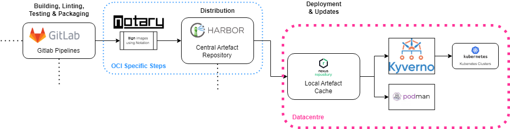
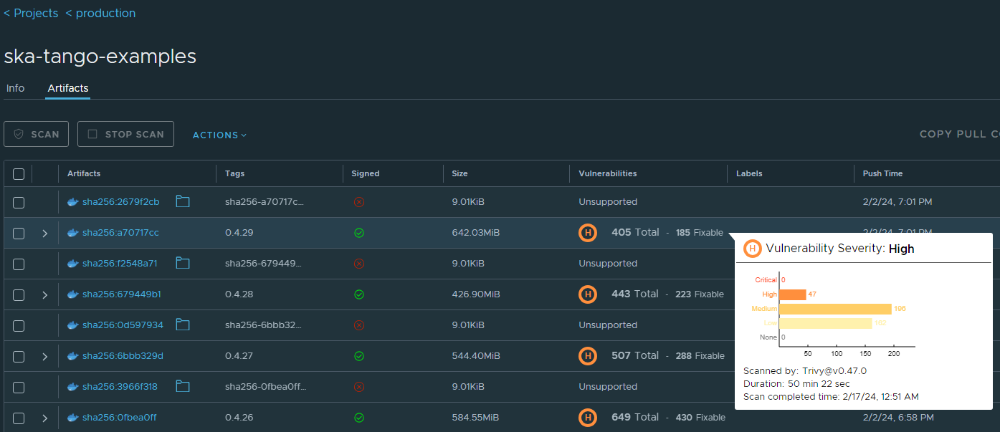

.. _oci-ssc:

======================
OCI Supply Chain
======================

OCI artefacts and registries provide the ability to further increase the security in the **delivery** stage of the Software supply chain. Among several new features coming into the software delivery realm like `SBOMs <https://security.cms.gov/learn/software-bill-materials-sbom>`_, we are now providing :ref:`signing and signature validation of our OCI images <oci-signatures>`. In the future, we will also target third-party images that are vetted for SKA usage and the list of artefacts will be expanded to cover other types of artefacts such as Helm Charts, python packages and executables.

This diagram reflects the changes relative to the :ref:`generic software supply chain <general-ssc>` diagram provided. Mainly, we have switched from Nexus to `Harbor <https://goharbor.io/>`_ as it provides a nicer interface to view signatures and allows us to **block** images from being used when they have critical vulnerabilities or haven't been signed. Signing the OCI artefacts within the realm of our secure runners helps guaranteeing the provenance of the artefacts themselves, being that the signatures used can be checked downstream. Both the preferred OCI engine - Podman -  and Kubernetes can be protected by checking the signature of the images before deployment. Below, you can find an example of what an artefact on Harbor looks like:

The **signed** checkmark, as well as the result of the vulnerability scanning, provide visible queues on the compliance of the artefact. 
