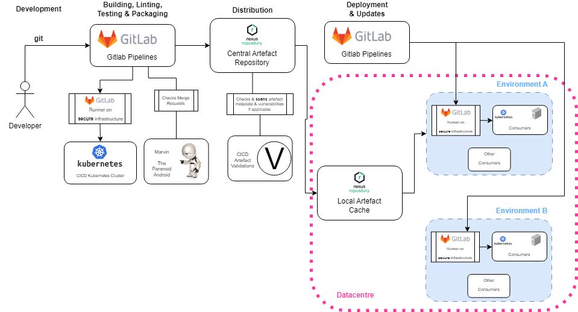

.. _ssc:

======================
Software Supply Chain
======================

The software supply chain refers to the entire process involved in creating, delivering, and maintaining secure and quality software products. It starts with the development of the software, then moves through various stages such as linting, testing, packaging, distribution, and deployment. It not only concerns software built by us, but also by the open-source community and third-party vendors.

Different package types require different solutions, and may include different stages in the supply chain. As an example, it is crucial to look for `CVEs <https://cve.mitre.org/>`_ in OCI images, which include thousands of pieces of third-party software, that may include vulnerabilities that allow attackers to compromise a whole software system.

There has been a great increase in worldwide attention on the **packaging & distribution** end of the supply chain, after the `2021's White House executive order <https://www.whitehouse.gov/briefing-room/presidential-actions/2021/05/12/executive-order-on-improving-the-nations-cybersecurity/>`_ mandating several of its institutes to issue standards and guidance on the usage of `SBOMs <https://security.cms.gov/learn/software-bill-materials-sbom>`_  to enhance the security of the software supply chain, putting the software industry to work.

Supply Chain Stages
-------------------

Lets look at the various stages in the supply chain:

1. **Development**:
   This is first stage of the production of software products. The supply chain is secured at this stage by good design principles of the software features, as well as by establishing and following development guidelines. Following such guidelines and having a code-review policy helps teams drive quality up from the first stage.

2. **Building, Linting & Testing**:
   Modern linters can help spot bugs, anti-patterns and bad design, as well as make the coding style uniform. It is paramount that software goes through automated linting - which usually relies on community and industry standards for each language - in order to guarantee that generic quality standards are met. Software then goes through testing to ensure it functions correctly and meets functional and performance standards. This involves various types of testing such as unit testing (testing individual components), integration testing (testing how components work together), and system testing (testing the entire software system).

3. **Packaging**:
   Once the software passes testing, it needs to be packaged for distribution. Packaging involves bundling the necessary files, libraries, documentation, and other resources into a format suitable for distribution. This could be an installer for desktop applications, a package for server deployment, or a container image for cloud deployment.

4. **Distribution**:
   Distribution involves making the packaged software available to be deployed. Distributing a Python package involves different infrastructure and requirements than, for instance, OCI images. Provisioning a stable and secure distribution pipeline is **paramount** to the overall security of the supply chain.

5. **Deployment**:
   Deployment is the process of installing and configuring the software for use in the target environment. This could involve installing the software on individual servers, or deploying it to cloud platforms. Deployment also includes setting up configurations, databases, and any necessary integrations, as well as handling secret information.

6. **Maintenance and Updates**:
   Software requires ongoing maintenance and updates to keep it functioning smoothly and securely. This includes bug-fixing, addressing security vulnerabilities, adding new features, and releasing functional updates.

All of the steps are handled by the various development teams at the SKA, with the infrastructure and procedures being provided - at least for the widely-used technologies - by the :ref:`pipeline machinery <ci-cd>` Gitlab templates and :ref:`makefile submodules <cicd-makefile>`. These work in tandem to provide out-of-the-box support to all of the sofware supply chain stages, giving development teams an easier time complying with the supply chain requirements. We pay special attention to the  :ref:`release procedures <tutorial_release_mgmt>` as they provide not only the distribution of software, but visibility for the project as a whole.

Software Supply Chain Infrastructure
------------------------------------

.. _general-ssc:

**General** Artefact Supply Chain
~~~~~~~~~~~~~~~~~~~~~~~~~~~~~~~~~

Generically, we use the same infrastructure to deliver artefacts to our development and production environments. These artefacts package the software products in various supported formats, most commonly:

- APT Packages
- C/C++ Libraries
- Python Packages
- Helm Charts
- Raw Packages
- OCI Images

The supply chain for these products looks like:

From development to the deployment of the software products, we mainly make use of Gitlab and the **pipeline machinery**, as well as the **CICD Kubernetes cluster** (STFC) to run secure Gitlab runners to perform CI related tasks. These runners run the Gitlab pipelines in secure (not using shared runners) infrastructure, and the packages hosted in a secure Central Artefact Repository (CAR). Finally, for each datacentre - that might contain multiple environments - we host a local cache to improve deployment times.

The final consumers can be simple VMs running the software products, Kubernetes clusters or anything else that the datacentre supports.

The supply chain for SKA software products is protected as follows:

1. **Development**:
   Developers have specific permissions in Gitlab to be able to contribute to specific projects, as well as 2FA protection.

2. **Building, Linting, Testing & Packaging**:
   For the packaging, only (if using pipeline machinery) **secure** runners are used, running on our own infrastructure so that the secret information exposed to Gitlab pipelines is secured. These runners also identify to the upstream (distribution) systems. A System Team managed service - :ref:`Marvin <marvin>` - checks the **merge requests** for overall compliance with the SKA Guidelines, also providing detailed information about the MR contents, documentation and standards. These help bolster the quality of software contributions.

4. **Distribution**:
   The distribution is done through credential protected systems that require authentication to **push** artefacts. Also, the System Team provides an artefact validation system that can **quarantine** artefacts that do not comply with the SKA Standards. Where applicable, vulnerability scannings are performed to validate artefacts against known vulnerabilities, increasing the level of confidence in the produced software products. Note that these vulnerabilities keep changing, so, running vulnerability scannings **often** is very important to keeping the security levels as well as frequently following with security patches.

5. **Deployment & Updates**:
   Similar to the production of the artefacts, its deployment is done using **secure** runners that access the infrastructure to eliminate tampering attempts.

Artefact Specifics
~~~~~~~~~~~~~~~~~~

.. note::
   Other artefact types will be added as the Software Supply Chain is updated

As mentioned before, different artefact types might have different infrastructure components with different requirements. Find below the specifics of each artefact type:

- :ref:`OCI <oci-ssc>`
