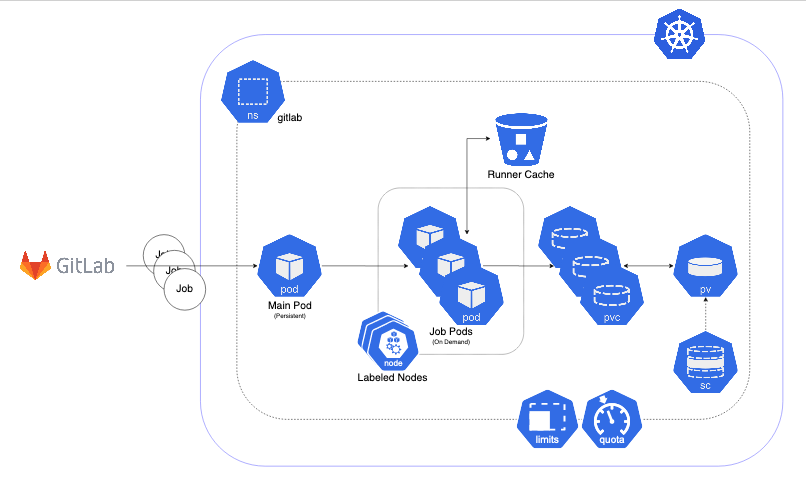

======================================
Kubernetes based Runners Architecture
======================================

GitLab runners are orchestrated by Kubernetes cluster. They could be deployed to any Kubernetes clusters using the `gitlab_runner ansible collection <https://gitlab.com/ska-telescope/sdi/ska-ser-ansible-collections/-/tree/main/ansible_collections/ska_collections/gitlab_runner?ref_type=heads>`_. 
The main architecture is illustrated below.

Features
________

- The main runner pod is deployed with Helm Chart under **gitlab** namespace with the repository.
- Main runner pod is registered to **ska-telescope group** shared runners with configurable tags.
- The main pod picks up **GitLab Jobs** and creates **on-demand pods**. This is configured using helm chart values file/or config.toml file of GitLab runners below.
- Runners are scaled according to configuration.
- Runners have resource **limits** *i.e. cpuRequests, memoryRequests, cpuLimit, memoryLimit*. This is not applied at the moment.
- Runners are running in nodes that are **specifically labelled** for ci/cd jobs.
- Runners share a **cache** between them that is used to speed up the job times.
- **Docker support**
- **Kubernetes support**

With this approach, GitLab Runners are proven to be a viable option to be used in a cluster with auto-scaling and easy management.
Docker Support

Docker can be used in the CI/CD jobs as with the normal runners. Note that: docker-compose cannot be used in conjunction with Kubernetes! You should follow the instruction on the developer portal to set up your repo.

To elevate some of the security concerns listed below with using Docker in Docker, another docker daemon is deployed in the nodes. This daemon then used as default docker-daemon in the runner pods.
Kubernetes Support

Kubernetes clusters could be created in ci/cd jobs. These clusters are created on the ci-worker nodes and destroyed at the end of the job.

Note: in order to run deploy clusters, the account permissions need to be set up correctly for the runner services.

STFC Cloud Kubernetes Clusters
------------------------------

For development purposes, STFC-backed clusters are the preferred method of deployment and testing, using Gitlab to deploy workloads into clusters. 
Currently we have two clusters, both with the same capabilities (Gitlab integration, Binderhub, etc):

* **techops** - Main cluster used by the whole project for CI/CD. It has limited support for GPUs, being mainly used to build artefacts that require GPUs
* **dp** - Cluster used by the DP ART that provides more GPUs to run actual workloads

STFC Techops
============

**Nodes**

======================================== ======== ====== ========== =========================== ===================== ========================= ======================== ===============================
Type                                     Amount   CPU    Memory     GPU                         Kubernetes Version    OS Version                Kernal Version           GPU Driver Version
======================================== ======== ====== ========== =========================== ===================== ========================= ======================== ===============================
stfc-techops-production-k8s-md-0         35       30     120GiB                                 v1.26.4               Ubuntu 22.04.1 LTS        5.15.0-48-generic        
stfc-techops-production-k8s-gpu-md-0     1        30     100GiB     1 (NVIDIA A100-PCIE-40GB)   v1.26.4               Ubuntu 22.04.1 LTS        5.15.0-88-generic        Cuda: 11.4 | Driver: 470.223.02
======================================== ======== ====== ========== =========================== ===================== ========================= ======================== ===============================

**Runners**

===================================== ====================== ========= ================= =============== ================ ===============
Runner                                Tag                    Version   CPU Limit         Memory Limit    GPUs Available   Concurrent Jobs
SKA-K8s-CAPI-Runner (default runner)  k8srunner              v16.5.0   5                 10Gi                             30 
SKA-K8s-CAPI-Runner-L                 k8srunner-large        v16.5.0   Unlimited (~30)   32Gi                             5 
SKA-K8s-CAPI-Runner-XL                k8srunner-xlarge       v16.5.0   Unlimited (~30)   128Gi                            2
SKA-K8s-CAPI-Runner-GPU-V100          k8srunner-gpu-v100     v16.5.0   5                 10Gi            1                30 
===================================== ====================== ========= ================= =============== ================ ===============

STFC DP (Kubernetes v1.26.4)
============================

**Nodes**

======================================== ======== ====== ========== =========================== ===================== ========================= ======================== ===============================
Type                                     Amount   CPU    Memory     GPU                         Kubernetes Version    OS Version                Kernal Version           GPU Driver Version
======================================== ======== ====== ========== =========================== ===================== ========================= ======================== ===============================
stfc-dp-production-k8s-md-1              5        30     120GiB     4 (NVIDIA A100-PCIE-40GB)   v1.26.4               Ubuntu 22.04.1 LTS        5.15.0-48-generic        
stfc-dp-production-k8s-gpu-md-1          1        60     800GiB     1 (NVIDIA A100-PCIE-40GB)   v1.26.4               Ubuntu 22.04.1 LTS        5.15.0-88-generic        Cuda: 11.4 | Driver: 470.223.02
stfc-dp-production-k8s-gpu-md-2          2        28     240GiB     2 (NVIDIA A100-PCIE-40GB)   v1.26.4               Ubuntu 22.04.1 LTS        5.15.0-88-generic        Cuda: 11.4 | Driver: 470.223.02
======================================== ======== ====== ========== =========================== ===================== ========================= ======================== ===============================

**Runners**

===================================== ============================ ========= ========== ============== ==============
Runner                                Tag                          Version   CPU Limit  Memory Limit   GPUs Available 
SKA-K8s-CAPI-Runner-DPGPU             ska-k8srunner-dp             v16.5.0   3          1Gi                              
SKA-K8s-CAPI-Runner-DP-GPU-A100       ska-k8srunner-dp-gpu-a100    v16.5.0   5          10Gi           8
===================================== ============================ ========= ========== ============== ==============

Deploy to GPU nodes
**Using the GPU Runner**

To run a job on a GPU runner, you can set the tag on your Gitlab job to one of the available GPU tags:

* **techops** - k8srunner-gpu-v100
* **dp** - ska-k8srunner-dp-gpu-a100

You can configure as follows:

.. code-block:: bash

    <job>:
        tags:
          - <runner tag>

**Deploy pods to GPU nodes**

If you have pods that need to run on GPU nodes, they must have special configurations:

**POD configurations:**

* **nodeSelector** - This must be set to force the pods to be scheduled to GPU nodes.

.. code-block:: bash

    node_selector:
    "nvidia.com/gpu": "true"

* **tolerations**: Given the node **taint**, the pods must **tolerate** that taint.

.. code-block:: bash

    tolerations:
      - key: "nvidia.com/gpu"
        value: "true"
        effect: "NoSchedule"

**CONTAINER configurations:**
* resource **limits** and **requirements** - Needed to claim X amount of GPU instances, just like any other resource.

.. code-block:: bash

    resources:
    limits:
      cpu: ...
      memory: ...
      nvidia.com/gpu: "<number of GPUs>"
    requests:
      cpu: ...
      memory: ...
      nvidia.com/gpu: "<number of GPUs>"

* **runtimeClass**: You need to properly set the **runtimeClass** so that the container runtime knows what profile to use to bind GPUs to a pod container.

.. code-block:: bash

    runtimeClassName: "nvidia"