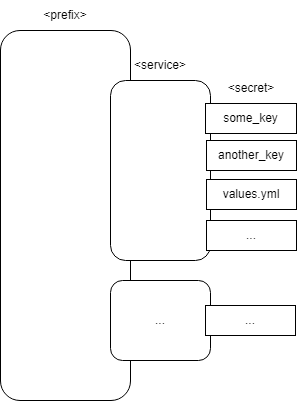
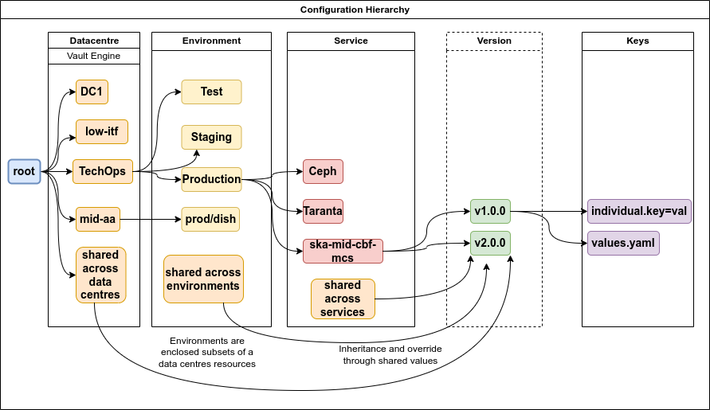

.. _explanation-vault-structure:

===============
Vault Structure
===============

In modern cloud environments, securely and efficiently managing sensitive information - like API keys and/or credentials - as well as configuration files is crucial. Vault KV engines offer a secure way to store and manage this data, acting as a secure store for configurations in general.

By utilising KV paths, we can implement a **structure** - driven by path naming standards and access-control policies - that brings flexibility and practicality when managing configurations and secrets. Understanding how these are structured and accessed will help their integration in SKAO applications and infrastructure.

Note that this structure is transversal to the SKAO, as it is used by the System and Platform Teams for infrastructure and services, AIV and Development teams for application deployments regarding testing, integration, staging and production.

.. note::

    We will refer interchangeably to **configurations** and **secrets**, as this structure contemplates treating this data the same, looking at Vault as a **secure store** for configurations, regardless of the type of data. It is still expected that secrets are treated as more sensitive information that should not be leaked

By considering Vault as a secure store for configurations - not just secrets - we enhance our ability to manage both application and infrastructure configurations securely and efficiently. This holistic approach ensures that all sensitive data and configurations are stored, managed, and accessed in a consistent and secure manner across the organisation.
Moreover, it allows for a common solution for auditing and tracing different types of configuration data.

Understanding the Structure
===========================

We mainly contemplate three levels of ownership of data when structuring Vault KV engines and path naming standards:

- **Datacentre**: Refers to a physical infrastructure where multiple environments can be deployed;
- **Environment**: Refers to a set of applications, services, or infrastructure components deployed together to deliver functionality to end-users;
- **Application/Service/Infrastructure Component**: Pieces of software or infrastructure components that can be deployed to an environment to fulfill a role.

In the current Vault structure, secrets are organised hierarchically to ensure clear separation of concerns between different datacentres, environments and applications, services or infrastructure components. This allows us to tightly control access and facilitate the management of data at scale.

The structure of a Vault configuration or secret follows the pattern:

::

   <prefix>/<service>/<secret>

Where:

- **<prefix>:** Refers to the path representing the context (e.g., shared/global, `<datacentre>/<environment>`, dev/`<team>`);
- **<service>:** The name of the application, service, or infrastructure component;
- **<secret>:** The specific configuration or secret being stored for that service or component (e.g., configuration files, credentials, or complete files such as `values.yml` for Helm charts).

In a more practical example of the SKAO's context, this can be represented by:

This structure simplifies the management of access control to the various KV engines and subpaths. Now, we must look at the various KV engines available and how they are meant to be used.

Vault KV Engines
================

Vault KV engines offer a secure way to store and manage **key-value pairs**. Values can have any format and content, from simple strings to complete files, up to a maximum of 1024 KiB.
Also, it has an unlimited number of "directories" - powered by its path-based flat structure - where data can be stored. They are organised into three main categories:

- **Dev KV Engine**: Stores configurations to be used in development deployments and CI/CD;
- **Shared KV Engine**: Stores configurations that are shared across datacentres and environments (production-grade deployments);
- **Datacentre-Specific KV Engines**: Stores configurations specific to each datacentre with segregation by environment (production-grade deployments).

Separating secrets into multiple engines allows us to:

- Simplify secret's organisation and management;
- Implement easier access control policies;
- Have a shared engine and sections to reduce duplication.

Let's look at the various KV engines and the roles they are designed to play, including the users which each of these KV engines may be used by.

Shared
------

The **Shared KV Engine** is used for configurations that need to be shared across multiple datacentres or environments of the same type. This engine is structured to enable secure access at both the global and environment-specific levels while allowing efficient data sharing. It is composed of two categorical sections - **global** and **environment/environment-type** specific:

- **Global Section**:
    - **Path**: `shared/global/`
    - **Contents**: Secrets that are common to all datacentres and environments
    - **Examples**:
        - API keys for external or central services:
            - InfraHQ access key
            - Best-practice configurations for `ska-tango-base`
        - Infrastructure configurations:
            - Network configurations
            - Common firewall rules
    - **Users**: SRE and AIV Teams

- **Environment / Environment-Type Sections**:
    - **Path**: `shared/<environment or environment-type>/`
    - **Contents**: Secrets shared among environments of the same name or type (e.g., `shared/staging/`, `shared/production/`)
    - **Users**: SRE and AIV Teams

.. note::

   The environment type construct was introduced to facilitate sharing secrets among environments named differently (hence, `shared/<environment>/` would be different) but that are similar in their type.
   For example, to share secrets among several `dish-lmc` environments —`dish-lmc-001`, `dish-lmc-002`, etc. — we can create a `shared/dish-lmc` section and name the environment type "dish-lmc".
   Remember, this is just a construct/reference that needs to be implemented when actually using the configurations.

Each section contains configurations relevant to environments that fit a particular use case or classification. Shared sections of engines need to be used with care, particularly when changing upstream shared values.
This can have an impact on all of the environments that use them. For this reason, the access control on shared sections is very strict and fine-grained.

Example structure:

::

   shared/
     ├── global/                 # Shared across all datacentres
     ├── production/             # Shared across all production environments
     └── staging/                # Shared across all staging environments

Datacentre-Specific
-------------------

Each datacentre has its own dedicated KV engine, which stores configurations specific to that datacentre. Within each engine, configurations are organised by environment, with an additional **shared** section for data that
is shared across environments within the same datacentre. Again, it has two section categories: **per-environment** and **shared**.

- **Per-Environment Section**:
    - **Path**: `<datacentre>/<environment>/`
    - **Contents**: Secrets specific to each environment (e.g., `stfc-techops/production/`, `aws-eu-west-2/staging/`).
    - **Examples**:
        - Environment-specific database configurations
        - Environment-specific network configurations
        - Infrastructure component configurations
    - **Users**: SRE and AIV Teams

- **Datacentre-Shared Section**:
    - **Path**: `<datacentre>/shared/`
    - **Contents**: Secrets shared across multiple environments within the datacentre.
    - **Examples**:
        - Common infrastructure configurations within the datacentre
        - Shared network settings
    - **Users**: SRE and AIV Teams

These KV engines will have wider write access, as the various teams managing deployments need access. The same care with the shared section needs to be taken here as with the shared engine.

Dev
---

The **Dev KV Engine** is meant to be a "meta-engine," acting like a separate Vault instance with multiple engines in it. The main idea is for development teams to replicate the structure of Vault itself, but instead of the first level being per-datacentre, it must be per-team.

Your team's slug at `https://gitlab.com/groups/ska-telescope/ska-dev` must be used. If your team doesn't have a GitLab group, please reach out to the System Team via `STS <https://jira.skatelescope.org/servicedesk/customer/portal/166>`_.

- **Per-Team Section**:
    - **Paths**: `dev/<team>/*/<service>/`
    - **Contents**: Secrets specific to each team for development, integration and staging deployments
    - **Users**: SRE, AIV and Development Teams

- **Dev-Shared Section**:
    - **Path**: `dev/shared/`
    - **Contents**: Secrets shared across multiple teams for development, integration and staging deployments
    - **Examples**:
        - Common infrastructure configurations within the datacentre the integration and staging environments live in
    - **Users**: SRE, AIV and Development Teams

Example structure:

::

   dev/
   └── some-team/
       ├── some-service/
       │   └── values.yml: <contents of values.yml>
       ├── another-service/
       │   └── database_credentials: <database-credentials>
       └── infra-component/
           └── config.yml: <infrastructure component configuration>

Teams can then manage their own configurations and secrets while being able to share them with other teams, as all integrated systems (e.g., GitLab, Kubernetes clusters) have read access to the whole engine.

Together with the improvement of the :ref:`Kubernetes integration <tutorial-vault>`, the goal is for development teams to cease the usage of GitLab secrets and Makefile changes to the Helm chart **values**
so that `auditing` and `tracing` of a deployment can be done reliably, replacing it with proper :ref:`GitLab integration <tutorial-vault-gitlab-integration>`.

In order to use the **shared** engines for deployment without a custom solution, like `Flux CD`, teams can simply leverage :ref:`Makefile <how-vault-gitlab-helm>` operations to source, merge and use multiple values from the target engines.

Current Structure
=================

.. _explanation-vault-current-structure:

Below you can find the current representation of the engines at the time of this writing. For simplicity, key names were obscured:

::

    shared/ [desc=Cross datacentre shared secrets] [type=kv2]
    ├── default [v=1]
    │
    ├── global
    │   ├── azuread [v=1]
    │   │
    │   ├── ca [v=1]
    │   │
    │   ├── default [v=1]
    │   │
    │   ├── extdns [v=1]
    │   │
    │   ├── fluxcd [v=1]
    │   │
    │   ├── gitlab_runner [v=1]
    │   │
    │   ├── headlamp [v=1]
    │   │
    │   ├── infrahq [v=1]
    │   │
    │   ├── ingress [v=1]
    │   │
    │   ├── kube-state-metrics [v=3]
    │   │
    │   ├── logging [v=1]
    │   │
    │   ├── metallb [v=4]
    │   │
    │   ├── metrics-server-repo [v=1]
    │   │
    │   ├── monitoring [v=1]
    │   │
    │   ├── nexus [v=1]
    │   │
    │   ├── rtd [v=1]
    │   │
    │   ├── ska-dish-lmc [v=10]
    │   │
    │   ├── ska-tango-archiver [v=3]
    │   │
    │   ├── sonobuoy [v=1]
    │   │
    │   └── sonobuoy [v=1]
    │       └── google_drive_credentials [v=1]
    │
    ├── production
    │   ├── acacia [v=1]
    │   │
    │   └── azuread [v=1]
    │
    └── sci-comm
        └── test [v=2]

    local/ [type=kv2]
    └── dev
        ├── ska-cicd-artefact-validations [v=3]
        │
        ├── ska-cicd-automation [v=1]
        │
        └── ska-ser-namespace-manager [v=1]

    aws-eu-west-2/ [type=kv2]
    ├── dp-hpc
    │   └── parallelcluster [v=1]
    │
    └── production
        ├── binderhub [v=1]
        │
        ├── coder [v=1]
        │
        ├── gitlab_runner
        │   ├── ska-aws-default-runner [v=1]
        │   │
        │   └── ska-aws-taranta-runner [v=1]
        │
        ├── harbor [v=1]
        │
        ├── infrahq [v=1]
        │
        ├── minio [v=1]
        │
        ├── monitoring [v=4]
        │
        ├── nexus [v=3]
        │
        ├── ska-cicd-artefact-validations [v=1]
        │
        ├── ska-cicd-automation [v=1]
        │
        ├── ska-tango-taranta-dashboard [v=1]
        │
        └── ska-vault-test [v=2]

    low-itf/ [type=kv2]
    └── production
        ├── binderhub [v=1]
        │
        ├── cbf [v=1]
        │
        ├── cnpg
        │   └── pgdev [v=1]
        │
        ├── gitlab_runner
        │   └── ska-k8s-runner-au-itf [v=1]
        │
        ├── idrac [v=1]
        │
        ├── k8s [v=1]
        │
        ├── monitoring [v=1]
        │
        ├── nexus [v=1]
        │
        ├── reverseproxy [v=1]
        │
        ├── reverseproxy [v=1]
        │   └── pki [v=1]
        │
        └── ups [v=1]

    mid-itf/ [type=kv2]
    ├── dish-lmc
    │   ├── eda [v=1]
    │   │
    │   ├── kubeconfig [v=1]
    │   │
    │   ├── monitoring [v=1]
    │   │
    │   ├── ska-dish-lmc [v=12]
    │   │
    │   ├── ska-tango-archiver [v=1]
    │   │
    │   └── test [v=2]
    │
    ├── production
    │   ├── binderhub [v=1]
    │   │
    │   ├── cnpg
    │   │   └── pgdev [v=1]
    │   │
    │   ├── eda [v=2]
    │   │
    │   ├── extdns [v=4]
    │   │
    │   ├── gitlab_runner
    │   │   └── ska-k8s-runner-za-itf [v=3]
    │   │
    │   ├── headlamp [v=1]
    │   │
    │   ├── idrac [v=1]
    │   │
    │   ├── k8s [v=1]
    │   │
    │   ├── mariadb
    │   │   └── tangotest [v=1]
    │   │
    │   ├── monitoring [v=1]
    │   │
    │   ├── nexus [v=1]
    │   │
    │   ├── reverseproxy [v=1]
    │   │
    │   ├── reverseproxy [v=1]
    │   │   └── pki [v=1]
    │   │
    │   │
    │   ├── ups [v=1]
    │   │
    │   └── vnc [v=1]
    │
    ├── shared
    │   └── default [v=1]
    │
    ├── ska001
    │   └── monitoring [v=1]
    │
    ├── ska007
    │   └── ska-mid-itf-dish-lmc [v=1]
    │
    ├── ska036
    │   ├── extdns [v=1]
    │   │
    │   ├── k8s [v=1]
    │   │
    │   ├── kubeconfig [v=2]
    │   │
    │   ├── monitoring [v=1]
    │   │
    │   └── ska-dish-lmc [v=1]
    │
    ├── ska063
    │   └── monitoring [v=1]
    │
    └── ska100
        ├── extdns [v=1]
        │
        └── kubeconfig [v=1]

    low-aa/ [type=kv2]
    ├── mccs
    │   ├── binderhub [v=1]
    │   │
    │   ├── ceph [v=1]
    │   │
    │   ├── eda [v=1]
    │   │
    │   ├── ilo
    │   │   ├── au-aa-mccs-cloud01 [v=1]
    │   │   │
    │   │   ├── au-aa-mccs-cloud02 [v=1]
    │   │   │
    │   │   └── au-aa-mccs-cloud03 [v=1]
    │   │
    │   └── test-injection [v=4]
    │
    │
    ├── production
    │   ├── binderhub [v=1]
    │   │
    │   ├── dlm
    │   │   └── pg [v=2]
    │   │
    │   ├── eda [v=1]
    │   │
    │   ├── k8s [v=1]
    │   │
    │   ├── librenms [v=1]
    │   │
    │   ├── low_cbf [v=1]
    │   │
    │   ├── mariadb
    │   │   └── librenms [v=1]
    │   │
    │   ├── monitoring [v=1]
    │   │
    │   ├── nexus [v=1]
    │   │
    │   ├── postgresql
    │   │   └── pgprod
    │   │       ├── pglowaa [v=1]
    │   │       │
    │   │       └── pglowaa [v=1]
    │   │           └── ska_dlm_meta [v=1]
    │   │
    │   ├── reverseproxy [v=1]
    │   │
    │   └── ups [v=1]
    │
    │
    ├── sci-comm
    │   ├── ceph [v=2]
    │   │
    │   └── test [v=1]
    │
    └── shared
        ├── binderhub [v=1]
        │
        ├── ca [v=1]
        │
        ├── logging [v=1]
        │
        └── monitoring [v=1]

    mid-aa/ [type=kv2]
    ├── production
    │   ├── binderhub [v=1]
    │   │
    │   ├── eda [v=1]
    │   │
    │   ├── ilo [v=1]
    │   │
    │   ├── k8s [v=1]
    │   │
    │   ├── librenms [v=1]
    │   │
    │   ├── mariadb
    │   │   └── librenms [v=1]
    │   │
    │   ├── monitoring [v=1]
    │   │
    │   ├── nexus [v=1]
    │   │
    │   └── reverseproxy [v=1]
    │
    ├── shared
    │   ├── ca [v=1]
    │   │
    │   └── logging [v=1]
    │
    └── ska063
        ├── extdns [v=1]
        │
        ├── kubeconfig [v=1]
        │
        ├── ska-dish-lmc [v=3]
        │
        └── ska-tango-archiver [v=4]

    psi-low/ [type=kv2]
    └── production
        └── gitlab_runner
            ├── SKA-K8s-Runner-PSI-LOW [v=1]
            │
            └── ska-psi-low-runner [v=1]

    psi-mid/ [type=kv2]
    └── production
        └── gitlab_runner
            └── ska-psi-mid-runner [v=1]

    stfc-dp/ [type=kv2]
    ├── production
    │   ├── binderhub [v=1]
    │   │
    │   ├── gitlab_runner
    │   │   ├── ska-dp-default-runner [v=1]
    │   │   │
    │   │   └── ska-dp-gpu-a100-runner [v=1]
    │   │
    │   ├── minio [v=1]
    │   │
    │   ├── monitoring [v=1]
    │   │
    │   ├── nexus [v=2]
    │   │
    │   ├── openvpn
    │   │   └── pki [v=1]
    │   │
    │   ├── reverseproxy [v=1]
    │   │
    │   ├── reverseproxy [v=1]
    │   │   └── pki [v=1]
    │   │
    │   ├── ska-tango-operator [v=1]
    │   │
    │   └── ska-vault-test [v=2]
    │
    └── shared
        ├── ceph [v=1]
        │
        └── openstack [v=1]

    stfc-techops/ [type=kv2]
    ├── production
    │   ├── binderhub [v=1]
    │   │
    │   ├── ca
    │   │   └── pki [v=1]
    │   │
    │   ├── clusterapi [v=1]
    │   │
    │   ├── cnpg
    │   │   └── pgdev [v=1]
    │   │
    │   ├── coder [v=2]
    │   │
    │   ├── gitlab_runner
    │   │   ├── ska-default-large-runner [v=1]
    │   │   │
    │   │   ├── ska-default-runner [v=1]
    │   │   │
    │   │   ├── ska-default-xlarge-runner [v=1]
    │   │   │
    │   │   ├── ska-gpu-a100-runner [v=1]
    │   │   │
    │   │   ├── ska-k8s-runner [v=1]
    │   │   │
    │   │   ├── ska-techops-iac-gitlab-runner [v=1]
    │   │   │
    │   │   └── ska-techops-tango-runner [v=1]
    │   │
    │   ├── logging [v=1]
    │   │
    │   ├── minio [v=1]
    │   │
    │   ├── monitoring [v=1]
    │   │
    │   ├── nexus [v=1]
    │   │
    │   ├── openvpn
    │   │   └── pki [v=1]
    │   │
    │   ├── releases_notifier [v=1]
    │   │
    │   ├── reverseproxy [v=1]
    │   │
    │   ├── reverseproxy [v=1]
    │   │   └── pki [v=1]
    │   │
    │   ├── ska-tango-operator [v=1]
    │   │
    │   ├── ska-vault-test [v=3]
    │   │
    │   └── velero [v=1]
    │
    ├── shared
    │   ├── binderhub [v=1]
    │   │
    │   ├── ceph [v=1]
    │   │
    │   ├── openstack [v=1]
    │   │
    │   └── ska-ser-namespace-manager [v=1]
    │
    └── staging
        ├── azuread [v=1]
        │
        ├── binderhub [v=1]
        │
        ├── clusterapi [v=1]
        │
        ├── gitlab_runner
        │   └── ska-staging [v=1]
        │
        ├── logging [v=2]
        │
        ├── minio [v=1]
        │
        ├── monitoring [v=1]
        │
        ├── nexus [v=1]
        │
        ├── reverseproxy [v=4]
        │
        ├── reverseproxy [v=4]
        │   └── pki [v=3]
        │
        ├── ska-cicd-artefact-validations [v=1]
        │
        ├── ska-cicd-automation [v=1]
        │
        ├── ska-tango-operator [v=1]
        │
        └── velero [v=1]
