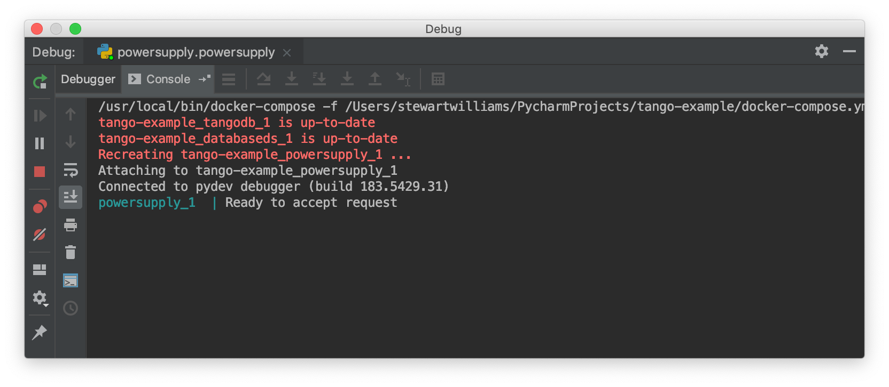

.. _`PyCharm docker-compose configuration`:

PyCharm Professional docker-compose configuration
*************************************************

These instructions show how to configure PyCharm Professional to use a docker-compose configuration, which allows
development and testing of devices that requires interactions with other live devices. Follow the steps below to
configure PyCharm to run tests from the tango-example project that require a live Tango system.

Prerequisites
=============
We recommend you be comfortable with PyCharm and the standard PyCharm Docker configuration before using docker-compose.

Please follow the steps in the :ref:`PyCharm docker configuration` topic for some basic familiarity with PyCharm and
Docker.

Goal
====

In the Docker configuration, PyCharm used the Python interpreter inside the *powersupply:latest* image for development
and testing.

The docker-compose.yml file for the tango-example project declares three containers:

#. tangodb: the relational database used for the Tango installation.
#. databaseds: a container running the device service for the Database.
#. powersupply: a container running the PowerSupply device itself.

We want PyCharm to take the place of the powersupply container, so that tests execute against the code we are
developing. As a result, unit tests should execute in an additional container created for the duration of the test.

Registering the device server
=============================

Tango devices must be registered so that other devices and clients can locate them. The docker-compose.yml entry for the
powersupply service automatically registers the powersupply device. However, this automatic registration is not
performed when PyCharm launches the service
Manual device registration is easily performed from an interactive session. The example below registers a test
instance of the powersupply device:

.. code-block:: console

    mypc:tango-example tangodeveloper$ make interactive
    docker build  -t nexus.engageska-portugal.pt/tango-example/powersupply:0.1.0-067e5b3-dirty . -f Dockerfile --build-arg DOCKER_REGISTRY_HOST=nexus.engageska-portugal.pt --build-arg DOCKER_REGISTRY_USER=tango-example
    Sending build context to Docker daemon  914.4kB
    Step 1/4 : FROM nexus.engageska-portugal.pt/ska-docker/ska-python-buildenv:latest AS buildenv
    # Executing 3 build triggers
     ---> Using cache
     ---> Using cache
     ---> Using cache
     ---> 10811adeaf7d
    Step 2/4 : FROM nexus.engageska-portugal.pt/ska-docker/ska-python-runtime:latest AS runtime
    # Executing 6 build triggers
     ---> Using cache
     ---> Using cache
     ---> Using cache
     ---> Using cache
     ---> Using cache
     ---> Using cache
     ---> 1d24e7c0f8aa
    Step 3/4 : RUN ipython profile create
     ---> Using cache
     ---> 93c8f22c5f87
    Step 4/4 : CMD ["/venv/bin/python", "/app/powersupply/powersupply.py"]
     ---> Using cache
     ---> b54df79f52d6
    [Warning] One or more build-args [DOCKER_REGISTRY_HOST DOCKER_REGISTRY_USER] were not consumed
    Successfully built b54df79f52d6
    Successfully tagged nexus.engageska-portugal.pt/tango-example/powersupply:0.1.0-067e5b3-dirty
    docker tag nexus.engageska-portugal.pt/tango-example/powersupply:0.1.0-067e5b3-dirty nexus.engageska-portugal.pt/tango-example/powersupply:latest
    DOCKER_REGISTRY_HOST=nexus.engageska-portugal.pt DOCKER_REGISTRY_USER=tango-example docker-compose up -d
    tango-example_tangodb_1 is up-to-date
    tango-example_databaseds_1 is up-to-date
    tango-example_powersupply_1 is up-to-date
    docker run --rm -it --name=powersupply-dev -e TANGO_HOST=databaseds:10000 --network=tango-example_default \
          -v /Users/stewartwilliams/PycharmProjects/tango-example:/app nexus.engageska-portugal.pt/tango-example/powersupply:latest /bin/bash
    tango@0f360f86d436:/app$ tango_admin --add-server PowerSupply/test PowerSupply test/power_supply/1

.. ::note::
    The Tango database is written to a persistent volume, one persistent per project based on filesystem path, so
    device registration should only need to be performed once until Docker volumes are pruned.

Configure the remote interpreter
================================

Following the official PyCharm documentation, `configure Docker Compose as a remote interpreter`_. Use the
*docker-compose.yml* file found in the root of the tango-example project, and set the service to *powersupply*. The
docker-compose.yml file expects the ``DOCKER_REGISTRY_HOST`` and ``DOCKER_REGISTRY_USER`` arguments to be provided.
Normally these would be provided by the Makefile, but as we are running outside Make then these variables need to be
defined. Set the environment variables to look like this:

.. _`configure Docker Compose as a remote interpreter`: https://www.jetbrains.com/help/pycharm/using-docker-compose-as-a-remote-interpreter.html#docker-compose-remote

.. image:: docker-compose-environment-variables.png
    :align: center

The final Configure Remote Python Interpreter dialog should look like this:

.. image:: docker-compose-remote-interpreter.png
    :align: center

Click 'OK' to apply your changes.

You can now navigate through the project. As an exercise, open the source code for the PowerSupply class, which is
defined in powersupply/powersupply.py. Like the Docker configuration, notice that the IDE notifications and
intellisense / code completion are now based on information gathered from the remote Docker image.

Just as for the Docker configuration, whenever you change the Python environment you should regenerate the project
skeletons to make PyCharm aware of the changes. To do this, select File | Invalidate Caches / Restart... from the main
menu.

Running the device
==================

From the main menu, choose Run | Edit Configurations... and click on the '+' button to add a new configuration. From the
menu that appears, select Python to add a new Python execution configuration. In the dialog, perform these steps:

#. Edit the script/module to be executed to point to the :code:`powersupply.powersupply` module.
#. Add ``test`` as an execution parameter; this tells the PowerSupply device to execute as the PowerSupply/test instance
   we registered earlier.
#. Change the working directory to the root of the project.

The final Run/Debug dialog should look like this:

.. image:: docker-compose-run-configuration.png
    :align: center

Press OK to apply your changes.

From the main menu, choose Run | Run... and select the configuration that you just created in the Run dialog that opens.
The PowerSupply device will launch alongside the partner containers defined in docker-compose.yml. PyCharm's Run
panel will display output like this, showing the device is executing and ready to accept requests.

.. image:: docker-compose-run-powersupply.png
    :align: center

Debugging configuration and limitations
=======================================

The Run configuration also functions as a Debug configuration. Debugging using the docker-compose configuration behaves
identically and is subject to the same limitations as debugging using the Docker configuration. If you are familiar with
these limitations then free to skip ahead to the next section.

.. note:: The *coverage* module is not compatible with the PyCharm or Visual Studio Code debugger and must be disabled
   before any debugging session. Do so by editing *setup.cfg*, commenting out the ``addopts=...`` line of the
   tool:pytest section so that it looks like this:

    .. code-block:: console

        [tool:pytest]
        testpaths = tests
        #addopts = --cov=powersupply --json-report --json-report-file=htmlcov/report.json --cov-report term --cov-report html --cov-report xml --pylint --pylint-error-types=EF

PyCharm has a *debug* mode that allows breakpoints to be added to code and the runtime state of the device examined.
Refer to the official PyCharm documentation for comprehensive documentation on
`how to add breakpoints and run in debug mode`_.

.. _`how to add breakpoints and run in debug mode`: https://www.jetbrains.com/help/pycharm/debugging-code.html

The steps in the official documentation can also be used to debug and interact with ah Tango device, using the
configuration set up in the previous section as the basis for the debug configuration. However, full breakpoint
functionality requires some workarounds. Breakpoints set outside device initialisation code (i.e., outside
:code:`__init__()` and `init_device()`) only function if the Tango device uses `asyncio green mode`_. In non-asyncio
modes, Tango creates new Python threads to service requests. Unfortunately these threads do not inherit the debugging
configuration attached by PyCharm.

.. _`asyncio green mode`: https://pytango.readthedocs.io/en/stable/green_modes/green.html

For working breakpoints, there are two solutions:

#. the device must be converted to use asyncio green mode;
#. add :code:`pydevd` to your Piplock as a project dependency, rebuild the Docker image and refresh the project
   skeletons, then add :code:`pydevd.settrace()` statements where the breakpoint is required. For example, to add a
   breakpoint in the :code:`PowerSupply.get_current()` method, the code should look like this:

.. code-block:: python

    def get_current(self):
        """Get the current"""
        import pydevd
        pydevd.settrace()  # this is equivalent to setting a breakpoint in IDE
        return self.__current

Debugging unit tests
====================

To debug a unit test, we want the unit tests to run in one container while the PyCharm debugger runs and is attached to
the PowerSupply device in another container. The easiest way to accomplish this is to launch the device using the debug
configuration while the tests we are examining are executed from an interactive session.

First, launch an interactive session with `make interactive`. Keep this session open as we will return to it later.

.. note::
    launching `make interactive` refreshes and recreates the containers defined in docker-compose.yml. Any devices
    launched by PyCharm will be stopped, requiring the device to be started again in PyCharm once the interactive
    session is up and running. In short, if you use 'make interactive' while devices are running, expect to have to
    restart your devices in PyCharm.

From the main menu, choose Run | Debug... and select the PowerSupply run configuration you created earlier. The device
will be launched and the PyCharm debugger attached to the session. The Debug panel of PyCharm should look similar to
this:

Returning to the interactive session, run the unit tests that exercise the live Tango device. For the tango-example
project, these tests are found in the file *test_2_test_server_using_client.py*.

.. code-block:: console

    tango@069dde501ca7:/app$ pytest tests/test_2_test_server_using_client.py
    ============================= test session starts ==============================
    platform linux -- Python 3.5.3, pytest-4.2.0, py-1.7.0, pluggy-0.8.1
    rootdir: /app, inifile: setup.cfg
    plugins: pylint-0.14.0, metadata-1.8.0, json-report-1.0.2, cov-2.6.1
    collected 5 items

    tests/test_2_test_server_using_client.py .....                           [100%]

    =========================== 5 passed in 0.18 seconds ===========================

Set a breakpoint in the PowerSupply.turn_on() method and a single unit test that exercises this function.

.. code-block:: console

    tango@069dde501ca7:/app$ pytest tests/test_2_test_server_using_client.py -k test_turn_on
    ============================= test session starts ==============================
    platform linux -- Python 3.5.3, pytest-4.2.0, py-1.7.0, pluggy-0.8.1
    rootdir: /app, inifile: setup.cfg
    plugins: pylint-0.14.0, metadata-1.8.0, json-report-1.0.2, cov-2.6.1
    collected 5 items / 4 deselected / 1 selected

    tests/test_2_test_server_using_client.py .                               [100%]

    ==================== 1 passed, 4 deselected in 0.15 seconds ====================

The tests execute but unfortunately the breakpoint is not hit. This is because breakpoints in the main body of the
device are not activated (see `Debugging configuration and limitations`_ for the reasons for this). To work around this,
a breakpoint must be introduced into the code itself. Edit the `turn_on` method in  *powersupply.py* to look like this:

.. code-block:: python

    @command
    def turn_on(self):
        """Turn the device on"""
        # turn on the actual power supply here
        import pydevd
        pydevd.settrace()
        self.set_state(DevState.ON)

Restart the debugging configuration for the code change to take effect and re-execute the test in the interactive
session. This time, the breakpoint is respected and execution is frozen, allowing program state to be examined in
PyCharm. The debug panel in PyCharm will look something like this, showing that execution is frozen:

.. image:: docker-compose-working-breakpoint.png
    :align: center

Troubleshooting
===============

- **The device server is not defined in the database**

    If you see an error message like the one below, then the device is unregistered and needs to be registered manually.
    Follow the steps in `Registering the device server`_.

    .. image:: device-unregistered.png
        :align: center

- **The DOCKER_REGISTRY_HOST variable is not set**

    If you see an error message like the one below, then you forgot to define the environment variables for the
    remote interpreter. Edit the variables section in your PyCharm docker-compose configuration and try again.

    .. image:: docker-compose-environment-error.png
        :align: center

