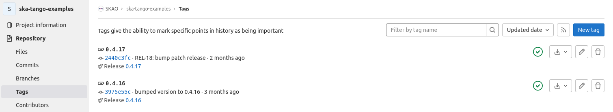
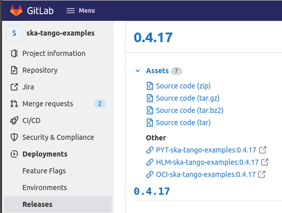

.. _integrate-skampi:

******************************************
So you want to integrate a chart to SKAMPI
******************************************

This tutorial is an arrangement of the workshop available "`So you want to integrate a chart to SKAMPI? <https://confluence.skatelescope.org/pages/viewpage.action?pageId=168663188&src=contextnavpagetreemode>`__".

The purpose of the workshop was to:

* Understanding the principles behind integration of a new chart
* How to integrate a new chart in a consistent way
* Understanding the importance of the review process

This page aims at the same goals. 

We will illustrate the process of chart integration with a walkthrough of integration of the ska-tango-examples chart
that is linked to the repository https://gitlab.com/ska-telescope/ska-tango-examples

Understanding the principles behind integration of a new chart
*****************************************************************

The SKA evolutionary prototype, also known as the Minimum Viable Product (MVP),
results from the integration of the several telescope subsystems. This integration is 
done in the SKA MVP Prototype Integration (SKAMPI) Gitlab repository.

If you are developing (or planning to develop or contribute to) a component 
or subsystem that is to be integrated in SKAMPI, please make sure 
that you are already familiar with:

- |How the SKA does Continuous Integration and Deployment|
- |The SKA Definition of Done|
- |The SKA Software Testing Policy and Strategy|

.. |How the SKA does Continuous Integration and Deployment| raw:: html

    <a href="https://developer.skao.int/en/latest/tools/ci-cd/continuous-integration.html" target="_blank">How the SKA does Continuous Integration and Deployment</a>

.. |The SKA Definition of Done| raw:: html

    <a href="https://developer.skao.int/en/latest/policies/definition-of-done.html" target="_blank">The SKA Definition of Done</a>

.. |The SKA Software Testing Policy and Strategy| raw:: html

    <a href="https://developer.skao.int/en/latest/policies/ska-testing-policy-and-strategy.html" target="_blank">The SKA Software Testing Policy and Strategy</a>

We also recommend the |SKAO Pipeline Machinery Tutorial| for a hands-on overview of present SKAO GitLab CI/CD infrastructure.

.. |SKAO Pipeline Machinery Tutorial| raw:: html

    <a href="https://developer.skao.int/en/latest/tools/ci-cd/skao-pipeline-machinery-tutorial.html" target="_blank">SKAO Pipeline Machinery Tutorial</a>

Check that your repository follows best practices
=================================================

The first thing to do is to verify that the repository contains the following:

* a charts folder
* a docs folder
* a src folder
* a tests folder
* a gitlab-ci.yml file on the root of the repository
* a Dockerfile on the root of the repository (or in an image folder)

Next you need to verify that our .gitlab-ci.yml file  follows standard SKAO GitLab CI/CD infrastructure practices. Stages shall
contain lint, build, test, pages, publish and scan. For ska-tango-examples:

.. code-block:: yaml

  stages:
    - lint
    - build
    - join-reports
    - test
    - pages
    - publish
    - scan
    
  #Join linting reports (This stage is temporary!)
  join_linting_reports:
    stage: join-reports
    tags:
      - k8srunner
    script:
      - echo "This step is needed as the artifacts can't be passed in the same stage"
      - make join-lint-reports
    artifacts:
      paths:
        - build/
      when: always

So all relevant stages are there, with an extra step of joining the linting reports. Next you need to verify 
that those stages include the default templating. For the ska-tango-examples:

.. code-block:: yaml

  # Include CI templates
  include:
  # OCI Images
    # do a custom set of build and publish stages
    - project: 'ska-telescope/templates-repository'
      file: 'gitlab-ci/includes/oci-image.gitlab-ci.yml'
  # Python packages build,lint, test and publish
    - project: 'ska-telescope/templates-repository'
      file: 'gitlab-ci/includes/python.gitlab-ci.yml'
  # Helm Charts
    - project: 'ska-telescope/templates-repository'
      file: 'gitlab-ci/includes/helm-chart.gitlab-ci.yml'
  # Docs pages
    - project: 'ska-telescope/templates-repository'
      file: 'gitlab-ci/includes/docs-pages.gitlab-ci.yml'
  # .post step finalisers eg: badges
    - project: 'ska-telescope/templates-repository'
      file: 'gitlab-ci/includes/finaliser.gitlab-ci.yml'
  # k8s steps
    - project: 'ska-telescope/templates-repository'
      file: 'gitlab-ci/includes/k8s.gitlab-ci.yml'
  # changelog release page
    - project: 'ska-telescope/templates-repository'
      file: 'gitlab-ci/includes/changelog.gitlab-ci.yml'

Now that you have verified that your repository follows the standard defined for SKAO you need the verify the release that
you will be integrating into SKAMPI. This tutorial is aiming for ska-tango-examples:0.4.17

It is important that the pipeline for the release is green, as is the case. The release page should also be checked 
for consistency in naming the image and the helm chart.

Using the standard SKA makefiles and templates the OCI and HELM versions should always comply but there may be cases where customized pipelines are required.

How to integrate a chart in SKAMPI
**********************************

Now that you are sure that the repository and the release follow standard SKA practice you are in a position to start the integration process.

Before you begin
================

It is possible to deploy SKAMPI on many common used operating system. If you have not done it before or are having trouble
with the process please follow the detailed tutorial https://developer.skao.int/en/latest/getting-started/deploy-skampi.html

Before you start with the actual integration you need to clone the SKAMPI repository and test
if its deployment is working. When cloning the SKAMPI repository  all the relevant submodules
need to be imported. We recommend using ssh to clone, but it can also be done using:

.. code:: bash

  $ git clone --recurse-submodules git@gitlab.com:ska-telescope/ska-skampi.git
  $ cd ska-skampi

Since you will want to push your changes later care must be taken not to use the default branch.
A branch should be created using your JIRA ticket ID and a checkout made into that branch. Supposing your Jira ticket is ST-1050:

.. code:: bash

   $ git checkout -b st-1050
   Switched to a new branch 'st-1050'

Note the use of lowercase in the branch name. Your branch should then be pushed to Gitlab:

.. code:: bash

   $ git push --set-upstream origin st-1050
   Total 0 (delta 0), reused 0 (delta 0), pack-reused 0
   remote:
   remote: To create a merge request for st-1050, visit:
   remote:   https://gitlab.com/ska-telescope/ska-skampi/-/merge_requests/new?merge_request%5Bsource_branch%5D=st-1050
   remote:
   To gitlab.com:ska-telescope/ska-skampi.git
   * [new branch]        st-1050 -> st-1050

Installation/Deployment of SKAMPI is much simpler using the Gitlab CI Pipelines (and this is the recommended method), as everything required to set up the environment is included in the CI infrastructure. This method of deployment always requires creation of a branch, even if you do not intend to merge the changes later. Follow the instructions on |Cloud deployments in 
branch-named namespaces| for deploying in a namespace, and then downloading and using the KUBECONFIG file. This file is your key to accessing the namespace in the cluster 
where your branch has just been deployed.

.. |Cloud deployments in branch-named namespaces| raw:: html

    <a href="https://developer.skao.int/projects/ska-skampi/en/latest/deployment/multitenancy.html#deploying-in-a-namespace-linked-to-a-development-branch" target="_blank">Cloud deployments in branch-named namespaces</a>

If you have enough resources it is also possible to deploy SKAMPI locally or on a dedicated server using minikube. A minikube installation compatible with SKAMPI is available from |SKA Minikube Deployment|. Once your minikube is up and running you can follow the guidelines on |how to deploy and interact with SKAMPI| in different environments.

.. |SKA Minikube Deployment| raw:: html

       <a href="https://gitlab.com/ska-telescope/sdi/ska-cicd-deploy-minikube/" target="_blank">SKA Minikube Deployment</a>

.. |how to deploy and interact with SKAMPI| raw:: html

       <a href="https://developer.skao.int/projects/ska-skampi/en/latest/deployment.html" target="_blank">how to deploy and interact with SKAMPI</a>
       
The merge request
-----------------

Even before you have included all relevant changes, preferably as soon as the first commit,
you should start a Merge Request on Gitlab so that the review
process can start. Please mark it as draft to ensure that no merge can be done even by accident.
The merge is only done after the reviewers, drafted from multiple teams, reach a consensus. The ticket can then
be marked as ready for acceptance.

The SKAMPI review process is of course based on |The SKA Definition of Done| but is different
in that it should  go through the changes done not only in the SKAMPI repository, but also in 
other repositories that contributed to the subsystem being deployed. 
This is required since the story associated with the Merge Request will often be part a feature, and the larger context
needs to be considered. It is a lot of work but the stability of SKAMPI absolutely requires it. The whole process
is described in more detail later.

Adding the new or revised chart
===============================

Adding a chart for the first time or replacing a chart with
a new release is a relatively straightforward process, and should be 
consistent across the different telescope subsystems. It generally
requires very similar changes in the following files:

.. code-block:: bash

  charts/ska-low/Chart.yaml 
  charts/ska-low/Chart.yaml  
  pipeline.yaml 
  resources/skampi.mk 

All file paths are relative to the root of your local `ska-skampi` folder. The
actual charts are added on the first two files and may need to be enabled on the third.
The forth file is a makefile where targets to run tests can be added or modified. 

Changing the umbrella charts
----------------------------

The `charts/ska-low/Chart.yaml` and `charts/ska-low/Chart.yaml` files are Helm umbrella charts
determining which Helm charts should used in SKA-LOW and SKA-MID deployments. New charts
should be added below `dependencies:` 

.. code-block:: yaml

   apiVersion: v2
   name: ska-mid
   description: A Helm chart for Kubernetes MVP Mid
   type: application
   version: 0.8.2
   appVersion: 0.8.2
   icon: https://www.skatelescope.org/wp-content/uploads/2016/07/09545_NEW_LOGO_2014.png
   dependencies:
   - name: ska-tango-base
     version: 0.3.5
     repository: https://artefact.skao.int/repository/helm-internal
     condition: ska-tango-base.enabled
  - name: ska-tango-util
    version: 0.3.5
    repository: https://artefact.skao.int/repository/helm-internal
    
The values for the key fields name, version, repository, should be
present; condition is often also needed. Adding ska-tango-examples means adding the following:

.. code-block:: yaml

  - name: ska-tango-examples
    version: 0.4.17
    repository: https://artefact.skao.int/repository/helm-internal
  

Enabling your chart in the pipeline
-----------------------------------

In the root of your local ska-skampi folder there is a `pipeline.yaml` file which
looks like this:

.. code-block:: yaml

   minikube: false

   # Common products
   ska-tango-base:
     vnc:
       enabled: false
   ska-sdp:
     enabled: false
   ska-oso-scripting:
     enabled: false
   ska-taranta:
     enabled: true
   ska-ser-skuid:
     enabled: true
   ska-tango-archiver:
     enabled: false
   ska-landingpage:
     enabled: true

   # Mid specific products
   ska-mid-cbf:
     enabled: false
   ska-csp-lmc-mid:
     enabled: false
   ska-tmc-mid:
     enabled: false
   ska-tango-examples:
     enabled: true

   # Low specific products
   ska-tmc-low:
     enabled: false
   ska-low-mccs:
     enabled: false
     
The pipeline.yaml file controls all the variables that are used by Helm when interpreting the templates 
written for each of the Charts. Make sure that the subsystem that you are adding is enabled in this file and please avoid 
enabling minikube in it. 

If you are going to make a minikube deployment create a similar file, 
call it my_local_values.yaml and use that one instead, 
enabling both your Helm chart and minikube on
it.  As a convenience that file is already in .gitignore, 
so that you won’t unnecessarily commit your local file.
You can then set it as the default for local deployments by doing 

.. code-block:: yaml

  $ echo VALUES=my_local_values.yaml >> PrivateRules.mak

For the guidelines specific to minikube you can get all the relevant 
information from |how to deploy and interact with SKAMPI|.

.. tip::
   
   If the behaviour of your chart is somewhat unexpected you should also verify the `values.yaml` file present in the same folder as the Umbrella chart. You may need to change the configuration in that file.

Adding the component tests
--------------------------

The `resources/skampi.mk` makefile is where you add or modify targets for tests relative to a specific telescope subsytem.  As an example these are the targets for the SKA-SKUID and SKA-TMC-CENTRAL-NODE subsystems:

.. code-block:: 

	## TARGET: skampi-test-01centralnode
	## SYNOPSIS: make skampi-test-01centralnode
	## HOOKS: none
	## VARS: none
	##  make target for running the Central Node specific tests against Skampi

	skampi-test-01centralnode:  ## launcher for centralnode tests
		@version=$$(helm dependency list charts/$(DEPLOYMENT_CONFIGURATION) | awk '$$1 == "ska-tmc-centralnode" {print $$2}'); \
		telescope=$$(echo $(DEPLOYMENT_CONFIGURATION) | sed s/-/_/ | sed s/ska/SKA/); \
		make skampi-k8s-test K8S_TEST_IMAGE_TO_TEST=artefact.skao.int/ska-tmc-centralnode:$$version MARK="$$telescope and acceptance"

	## TARGET: skampi-test-02skuidservice
	## SYNOPSIS: make skampi-test-02skuidservice
	## HOOKS: none
	## VARS: none
	##  make target for running the SKUID component's acceptance tests in the SKAMPI CI pipeline.

	skampi-test-02skuidservice:  ## launcher for skuid tests
		@version=$$(helm dependency list charts/$(DEPLOYMENT_CONFIGURATION) | awk '$$1 == "ska-ser-skuid" {print $$2}'); \
		telescope=$$(echo $(DEPLOYMENT_CONFIGURATION) | sed s/-/_/ | sed s/ska/SKA/); \
		make skampi-k8s-test K8S_TEST_IMAGE_TO_TEST=artefact.skao.int/ska-ser-skuid:$$version MARK="$$telescope and acceptance"

With the possible exception of SKA-SDP the targets for most subsystems should be very similar to these, essentially
just replacing skuid or centralnode with your own subsystem. Pay attention to the following:

* You need to use a `skampi-test-[0-9a-zA-Z_-]` naming scheme for the target name, since the main test target in the makefile will only iterate through component test targets following that particular naming scheme.
* If adding a new target, include it at the end of the list and increment the number after skampi-test.
* The version of the image test is taken directly from the Umbrella chart, so when adding your image name make sure you are using `$$version` not an hard-coded version number. 

For examples, for ska-tango-examples we need to include

.. code-block:: 

	## TARGET: skampi-test-01tangoexamples
	## SYNOPSIS: make skampi-test-01tangoexamples
	## HOOKS: none
	## VARS: none
	##  make target for running tango-examples specific tests against Skampi

	skampi-test-01tangoexamples:  ## launcher for ska-tango-examples tests
		@version=$$(helm dependency list charts/$(DEPLOYMENT_CONFIGURATION) | awk '$$1 == "ska-tango-examples" {print $$2}'); \
		telescope=$$(echo $(DEPLOYMENT_CONFIGURATION) | sed s/-/_/ | sed s/ska/SKA/); \
		make skampi-k8s-test K8S_TEST_IMAGE_TO_TEST=artefact.skao.int/ska-tango-examples:$$version MARK="$$telescope and acceptance"

.. tip::

  If you want to deploy Taranta locally, and you want to be able to log into the web dashboards UI, you should set `TARANTA_AUTH_DASHBOARD_ENABLE=true` in your `PrivateRules.mak` file.

The SKAMPI review process
=========================

Whenever a team feels that a new chart can be added to SKAMPI it should start the review process
by assembling a group of reviewers, including members from other teams, and preparing the tools to capture
the conversation.  Code reviews, feature discussion, and problem resolution, should be made available
not only on the Merge Request page on Gitlab, but also on Confluence pages, a dedicated
Slack channel, and linked to Jira.

The goals of the cross-team review are to:

* Ensure that the delivered product meets requirements
* Increase the quality of code and the feature being delivered
* Harmonise and standardise the development practices
* Share a common understanding of the SKA software system and its architecture
* Give developers the opportunity to gain technical insight about all areas of code
* Ensure the test suite is appropriate, and provides adequate coverage for the feature scope in support of acceptance
* Increase the ability to collaborate between teams

Scheduled review meetings should happen in the form of an informal code-walk-through. This can happen in a focused meeting, 
using tools like zoom and supported by other documentation that can be shared with the reviewers
in advance of the meeting. If possible the meeting should be recorded and linked to Jira.

The information to be shared needs to include:

* The Feature, as described on Jira.
* A pointer to relevant documentation describing the subsystem under review. For example this could be part of the Solution Intent, or part of the detailed design documentation in the developer portal.
* The set of Stories realising the features.
* The set of Merge Requests contributing to the feature.
* Relevant tests and related outputs.

During the review the authors will:

* Describe the larger context where the feature takes place with a brief overview of the subsystem.
* Describe the detailed design behind the implementation
* Walk through the code, possibly following the flow of execution

The reviewers will in turn:

* Verify that the default SKA pipeline machinery (templates, makefiles) is used in all relevant repositories
* Ask questions about the design choices
* Verify that the implementation adheres to SKA quality standards
* Verify that the feature is supported by tests

