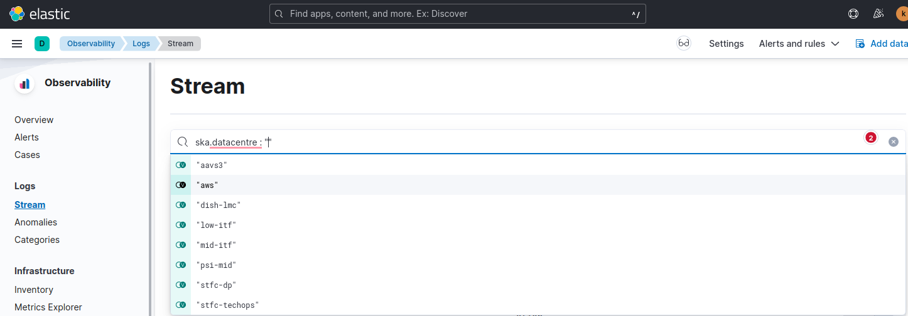
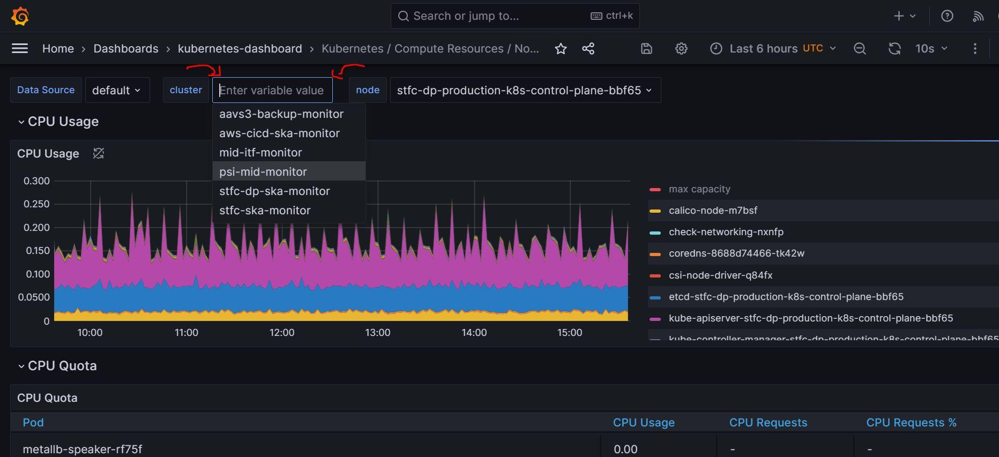

***********************************
Deploying to Multiple SKAO Clusters
***********************************

This guide is designed for developers working with the Square Kilometre Array Observatory (SKAO) and outlines the process of configuring repositories and deploying applications to various K8s clusters within SKAO, each serving different purposes.

Deploy to K8s Clusters
======================

SKAO utilizes GitLab runners for deploying charts to Kubernetes (K8s) clusters. The deployment destination of your jobs, and consequently the installation of your charts, depends on the GitLab runners configured in the `.gitlab-ci.yml` file. To specify a particular runner, set the **tags** field within each job. If no specific runner is designated, the default runner used is **k8srunner**. For instance, to deploy in the PSI-MID cluster, use the following configuration:

Runner for PSI-MID
------------------

.. code-block::

    image: $SKA_K8S_TOOLS_BUILD_DEPLOY

    stages:
    - lint
    - build
    - test
    - deploy
    - integration
    - staging
    - join-reports
    - pages
    - publish
    - scan

    k8s-test-no-operator:
        tags:
            - k8srunner-psi-mid
        extends: k8s-test
        variables:
            KUBE_NAMESPACE: 'ci-$CI_PROJECT_NAME-$CI_COMMIT_SHORT_SHA-no-op'
            SKA_TANGO_OPERATOR: 'false'
        artifacts:
            name: "$CI_PROJECT_NAME-$CI_JOB_ID"
            paths:
            - "build/"
            reports:
            junit: build/report.xml
            when: always
        environment:
            name: test/$CI_COMMIT_REF_SLUG-no-op
            on_stop: stop-k8s-test-no-operator
            auto_stop_in: 1 minute
        rules:
            - exists:
                - tests/**/*

    .
    .
    .

You can find a detailed list of all available runners in the STFC Cloud Kubernetes Clusters on the :ref:`stfc_kubernetes_runners` section.

Deploy to AWS Production Cluster
================================

Teams can request access to the AWS Production cluster for deploying their applications. The following steps outline the process for obtaining the necessary permissions and configuring the deployment pipeline.

1. **Open a Support Ticket:** Request authorization to deploy your application to the AWS Production cluster. Your support ticket should include the following details:

- The **namespace** where the application will be deployed. Note that this needs to follow `prod-<app>` notation.
- The **name** of the application.
- The **repository** of the application.

Example Support Ticket Request:

.. code-block::

	Dear System Team,

	I would like to request access to deploy our application to the AWS Production cluster.

	- Application Name: <app>
	- Namespace: prod-<app>
	- Repository: <Repository link>

	Please generate the necessary kubeconfig and assign it to the appropriate GitLab runner.

	Thank you

2. **Kubeconfig Generation:** Once authorised, the system team will generate a **kubeconfig** file with the required permissions for deployment in the AWS Production cluster. This kubeconfig will be assigned to a **GitLab runner** that will handle the deployment process. The runner tag will then be communicated back to the team to use in their deployment jobs.

3. **GitLab CI/CD Configuration:** In your project’s **CI/CD configuration (.gitlab-ci.yml file)**, define a job that uses the **GitLab runner** assigned to the kubeconfig. This runner will handle the deployment of your application to the specified **namespace** within the cluster.

Example GitLab CI/CD Job:

In the below example, the variable **K8S_SKIP_NAMESPACE** must be set to **true** for the job to run correctly. The make target **k8s-install-chart-car** has **k8s-namespace** as a dependency, which attempts to create the namespace even if it already exists. Since the GitLab runner doesn't have permission to create namespaces, setting this variable to true skips the namespace creation. The System Team will ensure the new namespace is created.

.. code-block::

    aws-deployment:
        stage: production
        tags:
            - ska-aws-runner-<project>
        variables:  
            K8S_SKIP_NAMESPACE: true
            HELM_RELEASE: "<app>"
            K8S_CHART: "<app>-chart"
        script:
            - make k8s-install-chart-car
            - make k8s-wait
        environment:
            name: production
            kubernetes:
            namespace: "prod-<app>"

Debug Clusters
==============

To diagnose issues within the cluster pods, developers should utilize `kibana <https://k8s.stfc.skao.int/kibana/app/logs/>`_ . Select the appropriate datacentre by setting the **ska.datacentre** variable as shown:

|

Monitor Clusters
================

Monitoring the status and health of different clusters is crucial. Developers can access https://k8s.stfc.skao.int/grafana/ for comprehensive dashboards with varied information about the clusters. For example, the dashboard `kubernetes-compute-resources-node-pods <https://k8s.stfc.skao.int/grafana/d/200ac8fdbfbb74b39aff88118e4d1c2c/kubernetes-compute-resources-node-pods?orgId=1&refresh=10s&from=now-6h&to=now>`_ allows you to switch between different data centres using the Grafana variable 'cluster' at the top of the dashboards, as illustrated below:

