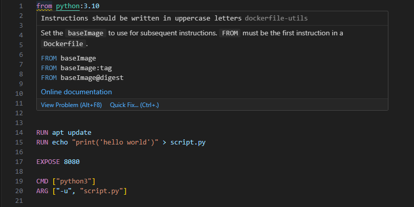
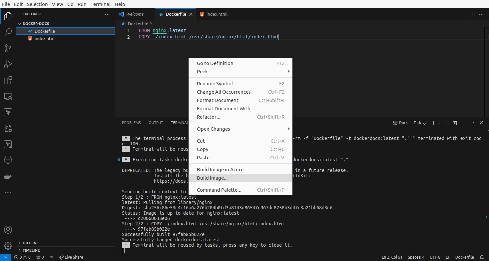
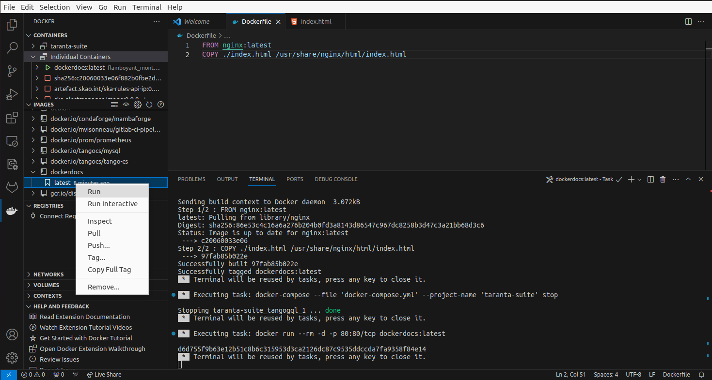
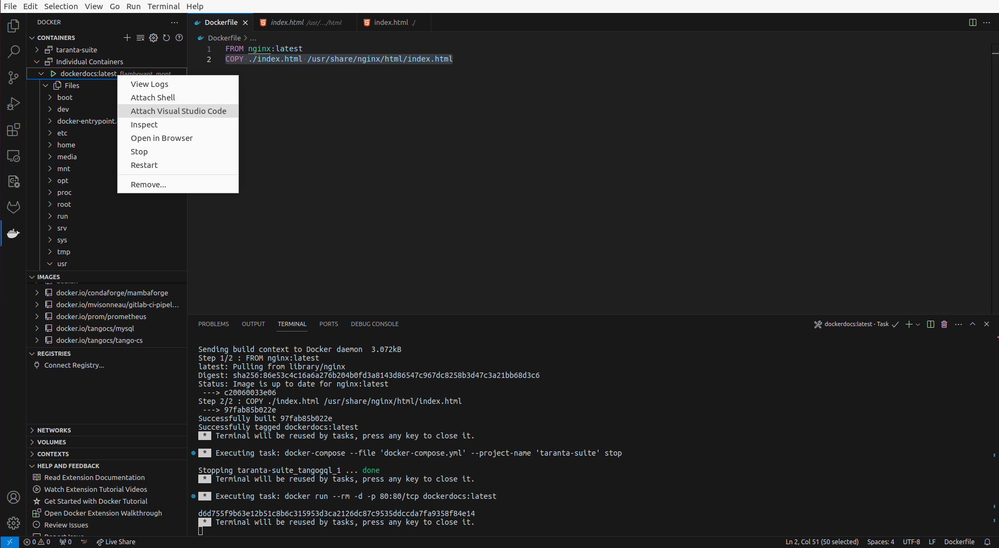

==============================================================
How to use VSCode Docker extension for Dockerfile development
==============================================================

This guide will help you leverage Visual Studio Code (VSCode) Docker extension to simplify Dockerfile development. VSCode provides features such as syntax highlighting, linting, debugging, and more to enhance your Dockerfile development experience.

Prerequisites
=============
Before getting started, ensure you have the following prerequisites in place:

- **Docker**: Install Docker on your system. Please refer to :doc:`howto/install-oci-engines`.
- **Visual Studio Code**: Download and install VSCode from the `official website <https://code.visualstudio.com/download>`_ .
- **Docker Extension for VSCode**: Install the Docker extension for VSCode from the `VSCode Marketplace <https://marketplace.visualstudio.com/items?itemName=ms-azuretools.vscode-docker>`_.

Installing the Docker Extension for VSCode
==========================================
1. Open Visual Studio Code.

2. Go to the Extensions view by clicking on the Extensions icon in the Activity Bar on the side of the window or by using the keyboard shortcut `Ctrl+Shift+X`.

3. Search for **Docker** in the Extensions view search box.

4. Click the **Install** button for the **Docker** extension provided by Microsoft.

5. Wait for the installation to complete.

Dockerfile editing and syntax highlighting
===========================================
* Provides syntax highlighting and autocompletion for Dockerfiles, making it easier to write and understand Dockerfile code.
* Includes built-in linting for Dockerfiles. It can help you identify and fix potential issues in your Dockerfile code

|

Building Docker images
======================
You can build Docker images directly within VSCode using the Docker extension. Here is how: 

1. Open your Dockerfile in VSCode.

2. Right-click anywhere in the Dockerfile editor.

3. Select **Build Image** from the context menu.

4. Follow the prompts to specify the image name, tag, and other build options.

|

Running containers
==================
You can run Docker containers directly from Dockerfiles in VSCode:

1. Get your image built as shown above or pull an image from any registry.

2. Click in the Docker extension icon on the left pane of vscode.

3. In the **images** tab find your image and left-click on it to reveal the existing tags.

4. Choose your **tag** and click **Run** to run it.

5. You should be able to list the containers with the `docker ps` command, but also in VSCode in the **containers** tab.

|

Managing and debugging Docker containers
========================================

You Manage and debug Dockerfiles in VSCode using the containers tab:

1. Open your Dockerfile in VSCode.

2. Click in the Docker extension icon on the left pane of VSCode.

3. In the containers tab find your image and right click it.

4. You can view the container's filesystem and inspect file contents.

5. You can click **Attach Shell** to attach a shell on the container, or **Attach Visual Studio** to open a VSCode session in the container.

|

Additional Resources
=====================
- Visual Studio Code Documentation: https://code.visualstudio.com/docs
- Docker Extension for VSCode: https://marketplace.visualstudio.com/items?itemName=ms-azuretools.vscode-docker
