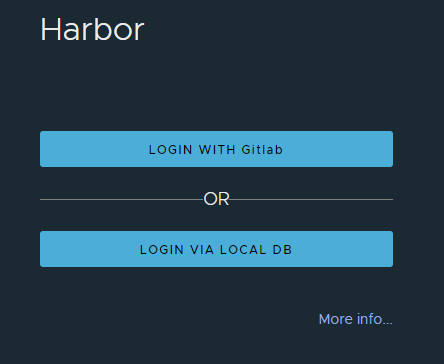
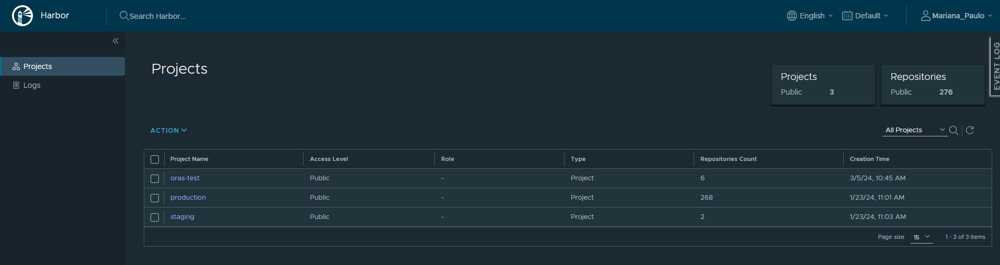
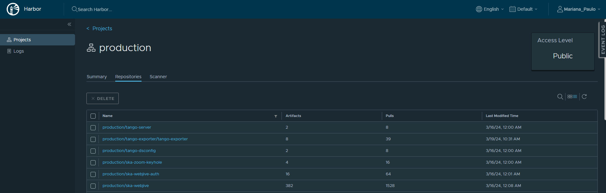
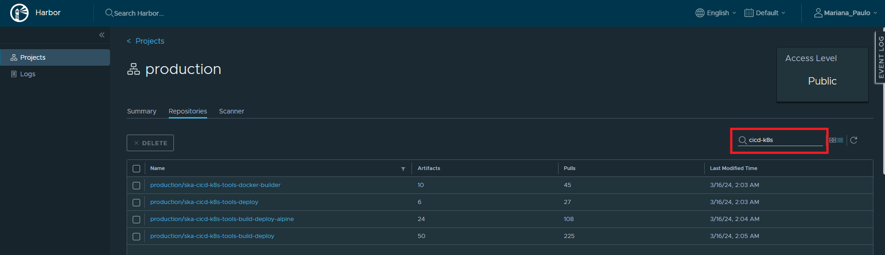
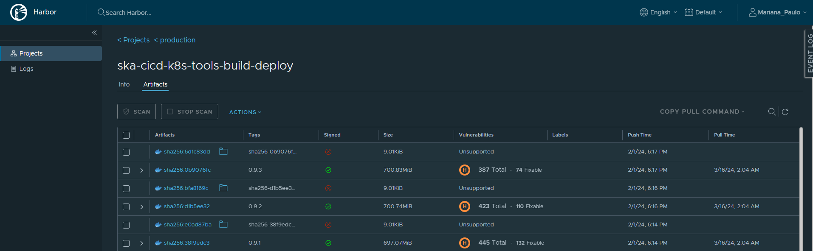

***********************************
Access and Browse Harbor
***********************************

This guide is designed for developers working with the Square Kilometre Array Observatory (SKAO) and describes the process of accessing and finding artefacts in Harbor, 
the CAR OCI.

Harbor Access and Overview
===============================

To access Harbor the user should go to the following URL: `https://harbor.skao.int/ <https://harbor.skao.int/>`__

There are two login options:

* **Login with GitLab** - the option for the *general user* providing read-only access to the CAR OCI projects
* **Login via Local DB** - the option for *admin users* for management purposes

|

Once a user logs in the Harbor Project's main page is shown, as the image below depicts:

|

The staging project is the primary location to where every OCI artefact published will be pushed. Once it is validated that the artefact has *no critical vulnerabilities* 
and has been signed it is automatically promoted to the production project. This is done to ensure the security of the `software supply chain <https://developer.skao.int/en/latest/explanation/software-supply-chain.html>`__.

Finding an Artefact
====================

By accessing the production/staging project the user can see the list of repositories, each corresponding to a group of 1 or more versions of an OCI artefact, the number of times 
that OCI artefact has been pulled as well as its last modification time.

|

To find a specific artefact the user can use the *filter repositories* option to easily browse through the repositories in the project, as the image below shows, or by scrolling
down the list of available repositories.

|

After finding the desired artefact, a user can click on it and see the artefact's tags (*i.e.* versions available), if the artefact has been signed, its associated vulnerabilities,
existing labels as well as its latest push and pull times. Each OCI artefact has a corresponding signature artefact (the non-signed artefact show in Harbor). 

|
