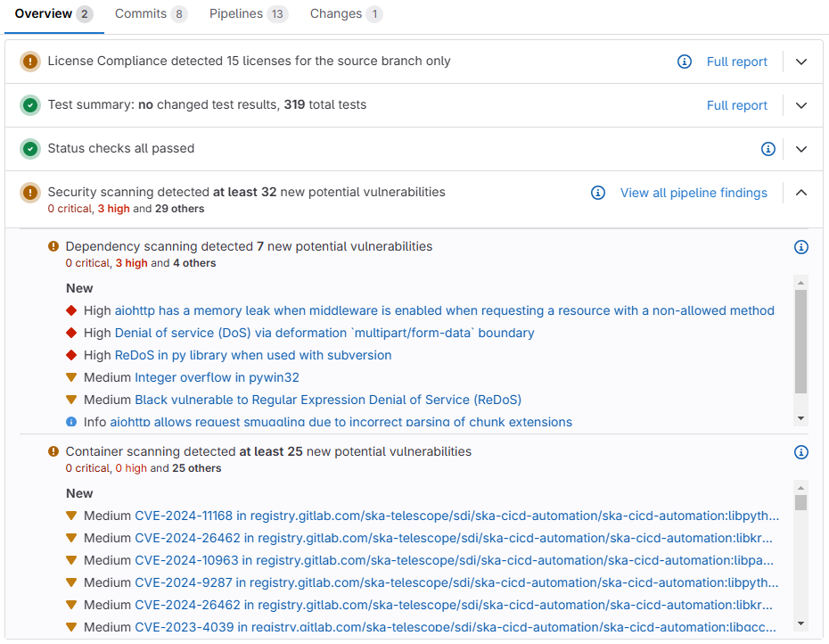

********************************************
Enable and Customise CI/CD Security Scanning
********************************************

.. warning::

    The previously defined oci-image-scan and python-gemnasium-scan jobs have been deprecated and are no longer supported as part of the SKAO templates.
    If your repo contains any reference to these it should be removed as, currently, these are placeholder templates to avoid any pipelines' breakages.
    By January 17th 2025 these placeholders will be removed and only the gitlab-templates.gitlab-ci.yml defined jobs will be supported.

Configure the templates
===============================

To run the container and dependency scanning jobs the ``gitlab-templates.gitlab-ci.yml`` file - from the templates-repository - has been added to the ``finaliser.gitlab-ci.yml``
so it automatically adds these jobs (as applicable) to your repository.

You need to ensure that both the ``test`` and ``scan`` stages are defined in your ``.gitlab-ci.yml`` so that the new templates are supported:

.. code:: yaml

    stages:
      - test
      - scan

This will automatically include and run the container scanning and dependency scanning templates on your pipeline (as applicable).

If you want to disable one of these security scanning jobs you can add a predefined variable to the variables section of your ``.gitlab-ci.yml``:

.. code:: yaml

    variables:
      CONTAINER_SCANNING_DISABLED: 'true' # to disable the container scanning
      DEPENDENCY_SCANNING_DISABLED: 'true' # to disable the dependencies scanning

By default, the **container scanning job** will scan an image under the path: ``$CI_REGISTRY/$CI_PROJECT_NAMESPACE/$CI_PROJECT_NAME/$CI_PROJECT_NAME:$CI_COMMIT_SHORT_SHA``.
To change this the variable CS_IMAGE needs to be overwritten by adding the desired value to the variables section of your ``.gitlab-ci.yml``:

.. code:: yaml

    variables:
      CS_IMAGE: <my-new-path>

Once these configurations are done, the pipeline will run the container and dependency scanning jobs and the summary results of these can be analysed from the MR's overview section as shown by the following example:

|

To know more about the Gitlab Security scanning please refer to Gitlab's official documentation for `container scanning <https://docs.gitlab.com/ee/user/application_security/container_scanning/>`__ and `dependency scanning <https://docs.gitlab.com/ee/user/application_security/dependency_scanning/>`__.
