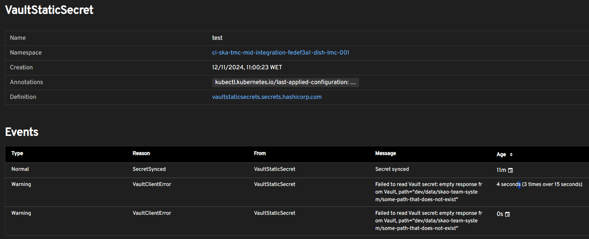

.. _reference-vault:

Vault
=====

This reference page provides quick access to all documentation related to SKAO's Vault usage. Below you'll find a list of resources categorised for easy navigation.

.. list-table:: Vault Documentation Reference
   :header-rows: 0
   :widths: 20 80

   * - :ref:`Vault Reference <reference-vault>`
     - Overview of Vault usage, including key references to tools, structure, integrations and best practices.
   * - :ref:`Vault as a secrets management tool <tools-vault>`
     - Detailed explanation of how HashiCorp Vault is utilised for secrets management, authentication methods and all integrations with Kubernetes.
   * - :ref:`Vault Structure <explanation-vault-structure>`
     - Comprehensive guide on the hierarchical organisation of Vault KV engines, path naming standards and access-control policies within SKAO.
   * - :ref:`Current Vault secret hierarchy <explanation-vault-current-structure>`
     - Current representation and organisation of Vault secrets across various datacentres and environments.
   * - :ref:`Vault-Kubernetes integration with Vault Secrets Operator <tutorial-vault>`
     - Tutorial on setting up Vault Secrets Operator (VSO) for synchronising secrets in Kubernetes, including deployment steps and resource creation.
   * - :ref:`Vault-GitLab integration tutorial <tutorial-vault-gitlab-integration>`
     - Guide on integrating GitLab CI/CD pipelines with Vault using OIDC for secure secret retrieval and injection as environment variables or files.
   * - :ref:`How to use Vault provided values.yml to deploy Helm charts <how-vault-gitlab-helm>`
     - Instructions on leveraging Vault to supply `values.yml` for Helm chart deployments within GitLab CI/CD pipelines, enhancing security and maintainability.
   * - :ref:`How to automatically rotate leaked secrets <how-vault-secret-rotation>`
     - Procedures for automatically rotating secrets in Kubernetes using Vault Secrets Operator to mitigate the impact of secret leaks.

For more detailed information on each topic, please refer to the respective sections above.

Kubernetes integration
**********************

VaultStaticSecret resource
--------------------------

The `VaultStaticSecret <https://developer.hashicorp.com/vault/docs/platform/k8s/vso/api-reference#vaultstaticsecret>`_ resource instructs the Vault Secrets Operator to synchronise a Vault secret into a Kubernetes Secret. Below, you can find the resource manifest with the most useful fields explained:

.. code-block:: yaml
   :caption: VaultStaticSecret resource

   apiVersion: secrets.hashicorp.com/v1beta1
   kind: VaultStaticSecret
   metadata:
     name: secret
   spec:
     type: <type of engine in [kv-v1, kv-v2], use kv-v2>
     mount: <kv engine name>
     path: <path to secret in vault>
     version: <version of the secret, omit for latest>
     refreshAfter: <time to enforce the secret to be rotated, e.g. 10s>
     rolloutRestartTargets: <list of restart targets by name, can include Deployments, StatefulSets, etc>
     syncConfig:
       instantUpdates: <enable or disable event-driven instant updates>
     destination:
       name: <name of the kubernetes secret>
       create: <true to create, if the secret already exists and overwrite is false, set to false>
       overwrite: <true to overwrite if create is true and secret already exists>
       labels: <add labels to created secret>
       annotations: <add annotations to created secret>
       type: <type of Kubernetes secret [dockercfg, tls, service-account-token ...], defaults to Opaque>
       transformation:
         excludeRaw: <exclude `_raw` field from Kubernetes secret containing all secret data and metadata>
         excludes: <exclude fields from the Kubernetes secret>
         includes: <include fields into the Kubernetes secret>
         templates: # Each key will be a key in the Kubernetes secret
           <key name>:
             text: <Go template expression: https://pkg.go.dev/text/template>

This is extremely versatile as it allows data transformation and allows for instantaneous or periodic synchronisation. To use it, simply use the secret as any other Kubernetes `secret <https://kubernetes.io/docs/concepts/configuration/secret/>`_. To know more about it, check our tutorial on :ref:`Kubernetes integration <tutorial-vault>`.

DeviceServer resource
---------------------

Wether you are using or not the SKA TANGO Operator, you can inject secrets from Vault into your Device servers:

.. code-block:: yaml
   :caption: Configure TANGO device to read secret from Vault

   instances: <instances to deploy>
   entrypoints: <TANGO class entrypoints>
   server:
     instances:
       - name: "<some instance>"
         classes:
         - name: "SomeClass"
           devices:
           - name: "test/someclass/1"
             properties:
             - name: "deviceProperty"
               values:
               - "test"
   secrets:
   - secretPath: <path to secret>
     secretMount: <kv engine>
     env:
     - secretKey: <secret key>
       envName: <environment variable name to inject secret key's value into>
       default: <default value if secrets are disabled>
       transform: <Go template expression: https://pkg.go.dev/text/template>

Note that currently there is no support for mounting secrets as **files** or specifying the version.

Debugging
---------

To debug you can describe your VaultStaticSecret resource as any other Kubernetes resource:

.. code-block:: bash
   :caption: Inspect the status of the VaultStaticSecret resource

   kubectl describe vaultstaticsecret/test-secret

Which can output:

.. code-block:: bash
   :caption: Inspect the status of the VaultStaticSecret resource

   Events:
   Type     Reason            Age   From               Message
   ----     ------            ----  ----               -------
   Warning  VaultClientError  3s    VaultStaticSecret  Failed to read Vault secret: Error making API request.

   URL: GET <vault secret url>
   Code: 403. Errors:

   * 1 error occurred:
      * permission denied

The output will be the same as the Vault CLI's output. It can include any of the errors specified in the `documentation <https://developer.hashicorp.com/vault/api-docs#http-status-codes>`_, more notably:

- **400**: Invalid request, missing or invalid data.
- **403**: Forbidden, your authentication details are either incorrect, you don't have access to this secret.
- **404**: Invalid path. This can both mean that the path truly doesn't exist or that you don't have permission to view a specific path.

You can also view these status in **Headlamp** by going into the `VaultStaticSecret <https://k8s.stfc.skao.int/headlamp/c/developers/customresources/vaultstaticsecrets.secrets.hashicorp.com>`__ page for the CICD cluster:

GitLab integration
******************

We can integrate GitLab pipelines with Vault to securely retrieve secrets or configuration files. Those can be injected into the **job** as either **environment variables** or **files**:

.. code-block:: yaml
   :caption: GitLab job using a secret as an environment variable

   <job>:
     stage: <stage>
     variables:
       VAULT_SERVER_URL: <vault url, defaults to `https://vault.skao.int`>
       VAULT_AUTH_PATH: <vault login method, defaults to `jwt`>
       VAULT_AUTH_ROLE: <vault role, defaults to `developer`>
       SOME_VAR: something
     id_tokens:
       VAULT_ID_TOKEN:
         aud: <id token audiences, use `https://gitlab.com`>
     secrets:
       <environment variable holding the secret>:
         vault: <path to secret>/${SOME_VAR}@<kv engine>
         file: <true to inject as a file, false otherwise>
     ...

If the secret is injected as a file, the environment variable contains the **path** to the secret. If it is as an environment variable, it will hold the **value**.

Debugging
---------

Debugging is simpler as, if anything is wrong with the job, it will not start. The debug messages are not always helpful, but they will probably revolve around either access to the secret or the authentication:

- Authentication configuration:

::

  Resolving secret "CONTEXT_VALUES"...
  Using "vault" secret resolver...
  ERROR: Job failed (system failure): resolving secrets: initializing Vault service: preparing authenticated client: authenticating Vault client: writing to Vault: api error: status code 400: error validating token: invalid audience (aud) claim: audience claim does not match any expected audience

- Lack of permissions to existing secret:

::

  Resolving secret "CONTEXT_VALUES"...
  Using "vault" secret resolver...
  ERROR: Job failed (system failure): resolving secrets: reading secret: reading from Vault: api error: status code 403: 1 error occurred:
    * permission denied

- Non existent path:

::

  Resolving secret "CONTEXT_VALUES"...
  Using "vault" secret resolver...
  ERROR: Job failed (system failure): resolving secrets: secret not found: CONTEXT_VALUES

On the other hand, if the job starts, it means that GitLab was able to handle all operations.
