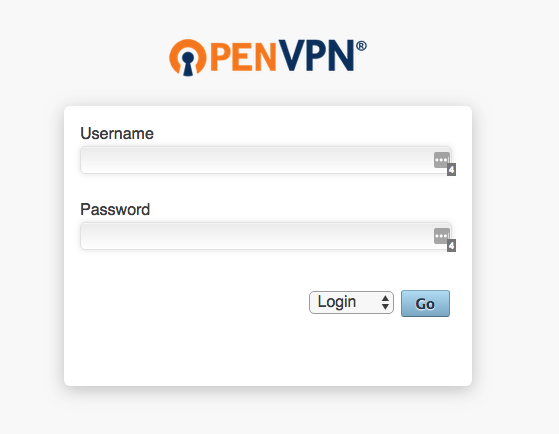
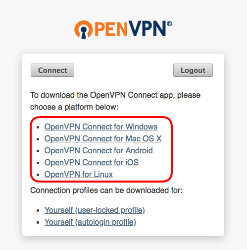
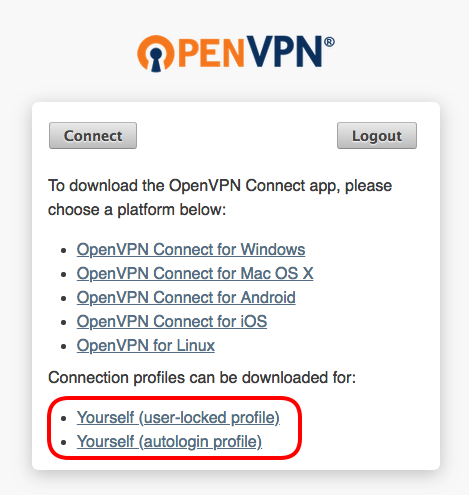
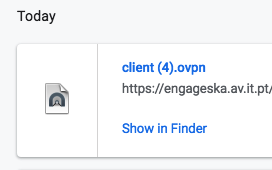
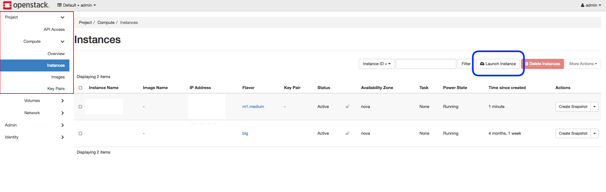
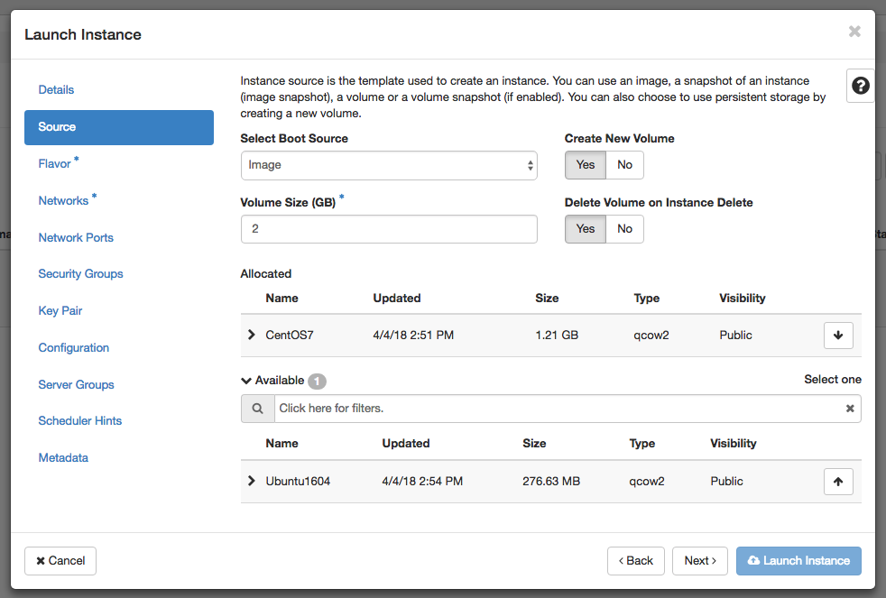
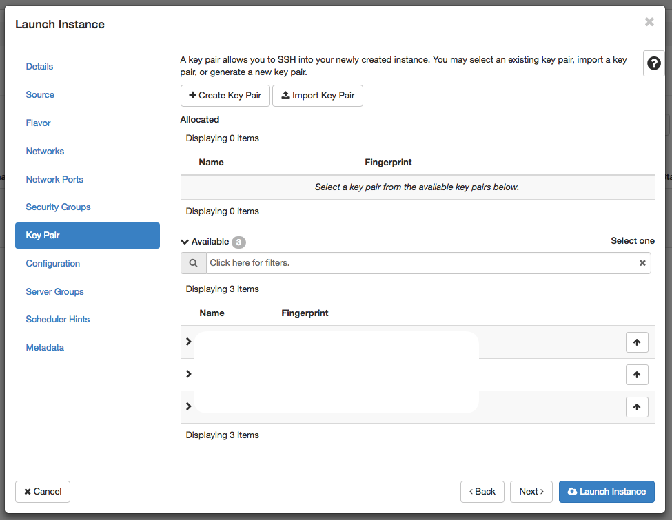
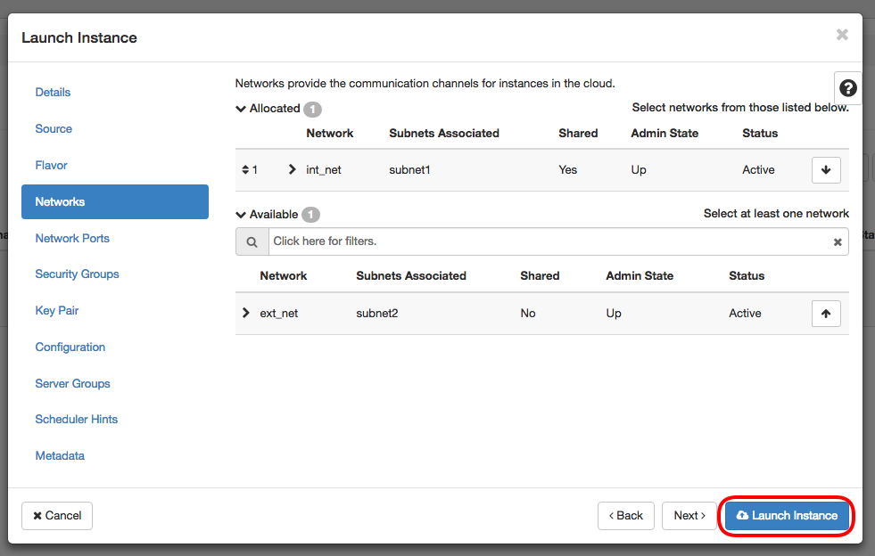
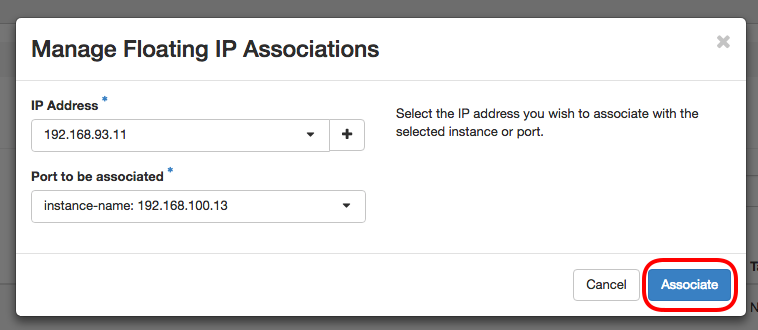

AIT cluster
===========

Cluster specs
-------------
.. image:: cluster.png

Access the cluster
------------------
The EngageSKA cluster locates at the Datacenter of Institute of Telecommunication (IT) in Aveiro. To have access to the cluster, it is required to be inside the facilities or have VPN credentials to access the IT network remotely.

Access to the network using VPN
-------------------------------
At the moment, VPN credentials are sent individually and is required to send an email to Dzianis Bartashevich (bartashevich@av.it.pt) with the knowledge from Marco Bartolini (M.Bartolini@skatelescope.org).

You will receive an login and password to access the private network.

- After receiving VPN credentials go to https://engageska.av.it.pt/?src=connect and authenticate:

- In order to use VPN you have to download and install VPN client, choose acordingly to your operating system:

- Click on "Yourself (user-locked profile)" if you are NOT working on your personal computer (password will be asked) or "Yourself (autologin profile)" if you want to autologin (password is not required):

- After downloading the client configuration file just click on it or add directly to the VPN client:

Now that you have configured the VPN credentials click on the VPN client icon located at the toolbar and connect to the private network. If all went okay, you are successfully connected.

Access to the OpenStack platform (Virtualization)
-------------------------------------------------
.. image:: openstack_login.png

The OpenStack platform requires authentication in order to use it.

At the moment, OpenStack credentials are sent individually and it is required to send an email to Dzianis Bartashevich (bartashevich@av.it.pt with the knowledge from Marco Bartolini (M.Bartolini@skatelescope.org). In the next phase, OpenStack could support GitHub authentication.

To access the OpenStack platform go to http://192.168.93.215/dashboard (require VPN) and login with your credentials.

Virtual machine deployment
^^^^^^^^^^^^^^^^^^^^^^^^^^
- At the sidebar, go to Project -> Compute -> Instances and click on the "Launch Instance" button:

- At this stage a menu will pop-up and will ask to specify virtual machine caracteristics, chose an name for virtual machine:

.. image:: openstack_vm_chars.png

- Select the Operating System you want your VM to have:

**NOTE: Please choose the option "Yes" at "Delete Volume on Instance Delete" so when you decide to delete the instance the volume will be also deleted and not occupy unnecessary space**

.. image:: openstack_vm_os.png

- Select the flavor which you want your VM to have:

.. image:: openstack_flavor.png
.. image:: openstack_flavor2.png

- Select private network (int-net):

.. image:: openstack_network.png
.. image:: openstack_network2.png

- Create or use ssh key to enable ssh access to the VM:

- In the end press on "Launch Instance" button at the bottom. This initiates the virtual machine deployment. It could take a while:

- When the Power State become "Running", the virtual machine has been successfully deployed and is ready to be used:

.. image:: openstack_running_intance.png

- Since the VM is deployed inside private network you will need to associate Floating IP from your network have the access:

.. image:: openstack_running_intance.png
.. image:: openstack_floating_choose.png
.. image:: openstack_floating_add.png

.. image:: openstack_floating_ip.png

- Now using any SSH client connect to the instance through VPN using the Floating IP address

Access to the bare metal
------------------------
In this stage, this option is very restrictive and only in a well-justified situation is allowed.