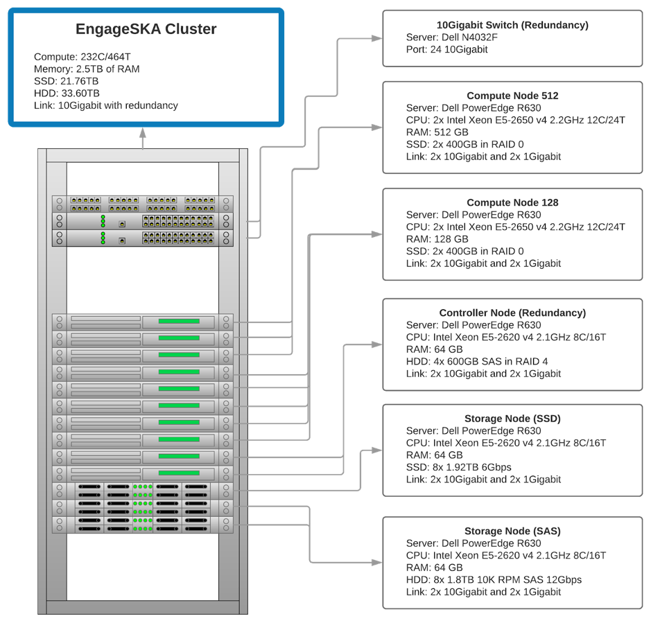

AIT cluster
===========

Cluster specs
-------------

Access the cluster
------------------
The EngageSKA cluster locates at the Datacenter of Institute of Telecommunication (IT) in Aveiro. To have access to the cluster, it is required to be inside the facilities or have VPN credentials to access the IT network remotely.

Access to the network using VPN
-------------------------------
It is required to have OpenVPN client to access the network. Oficial OpenVPN client is only available on Linux and Windows. Apple MacOS users can use TunnelBlick.

- Windows: https://openvpn.net/index.php/open-source/downloads.html
- Ubuntu/Debian/Fedora/CentOS/RedHat: https://openvpn.net/index.php/access-server/docs/admin-guides/182-how-to-connect-to-access-server-with-linux-clients.html
- MacOS: https://tunnelblick.net/downloads.html

At the moment, VPN credentials are sent individually and is required to send an email to Dzianis Bartashevich (bartashevich@av.it.pt).

You will receive an zip file contaning your VPN credentials to access the private network. Extract and open the file with .ovpn extention.

Now that you have configured the VPN credentials click on the VPN client icon located at the toolbar and connect to the private network. If all went okay, you are successfully connected.

Access to the OpenStack platform (Virtualization)
-------------------------------------------------
.. image:: https://wiki.openstack.org/w/images/4/45/1._Log_In.png

The OpenStack platform requires authentication in order to use it.

At the moment, OpenStack credentials are sent individually and is required to send an email to Dzianis Bartashevich (bartashevich@av.it.pt). In the next phase, OpenStack could support GitHub authentication.

To access OpenStack platform go to http://192.168.84.215/dashboard (require VPN) and login with you credentials.

Deploy virtual machine
^^^^^^^^^^^^^^^^^^^^^^
- At the sidebar, go to Project -> Compute -> Instances
- Click on the "Launch Instance" button
- In this stage a menu will pop-up and will ask to specify virtual machine caracteristics
- In the end press on "Launch Instance" button at the bottom. This initiate the virtual machine deployment. It could take a while.
- When the Power State become "Running", the virtual machine has been successfully deployed and is ready to be used.

Access to the bare metal
------------------------
In this stage, this option is very restrictive and only in a well-justified situation is allowed.