Nexus OSS Repository
********************

Repository address
==================
https://nexus.engageska-portugal.pt

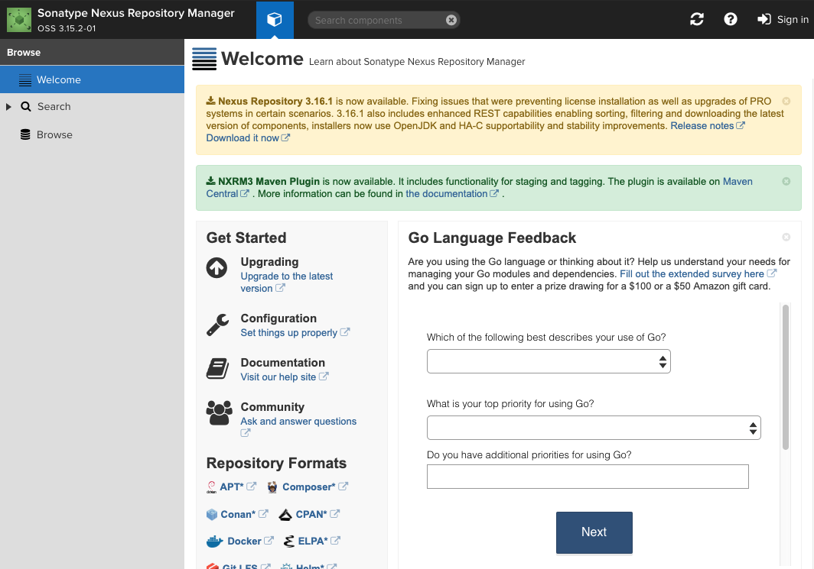

Repository formats
=================================

PyPi
----
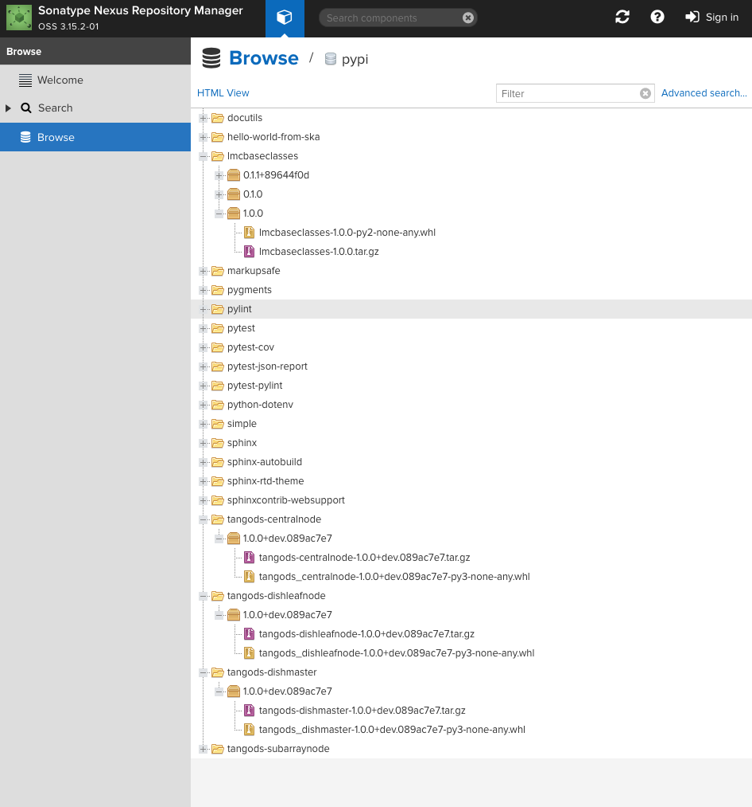

Docker
------
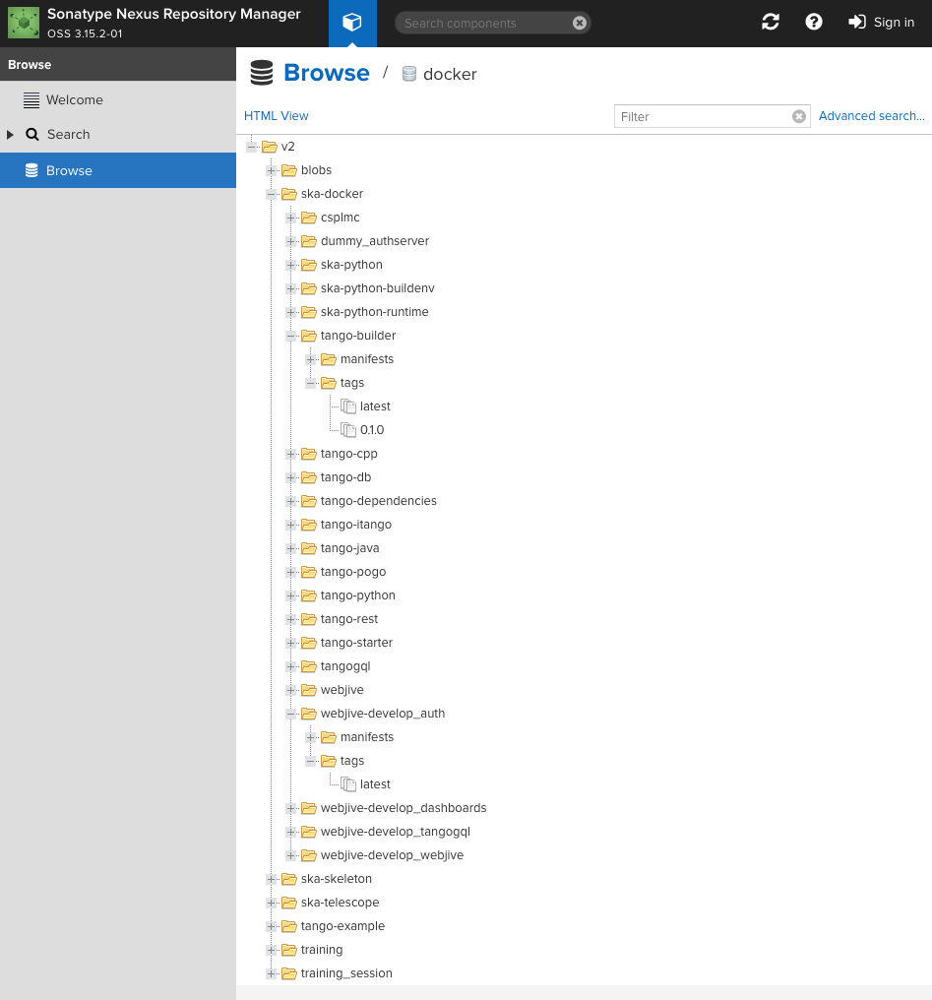

Raw
---
Raw repository is intended for any type and size of file. The main usage of raw repository is intended for sharing and storage of files.

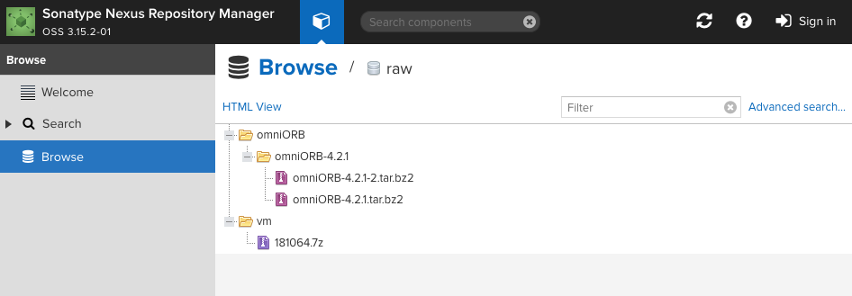

APT
---
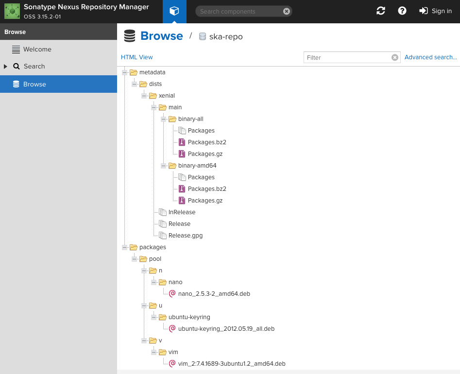

Other available formats
-----------------------
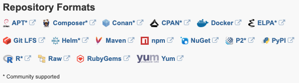

Repository upload (through browser)
===================================

If you have a Nexus user and the user has rights to upload, you may upload your file using an ordinary browser. Without Nexus user you may only list and download files.

In order to upload the file you need to click on "Upload" and then select the repository.

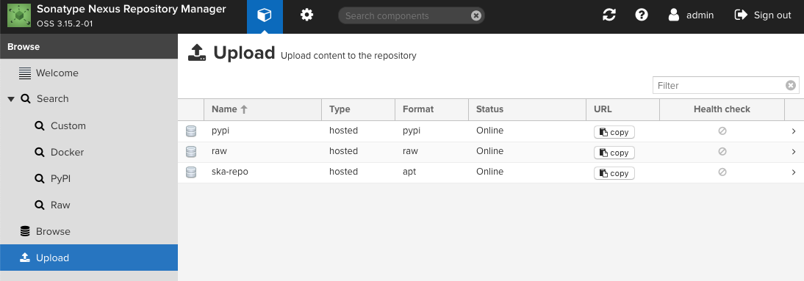

PyPi
----
To upload PyPi content, click on "Browse" and select file to upload.

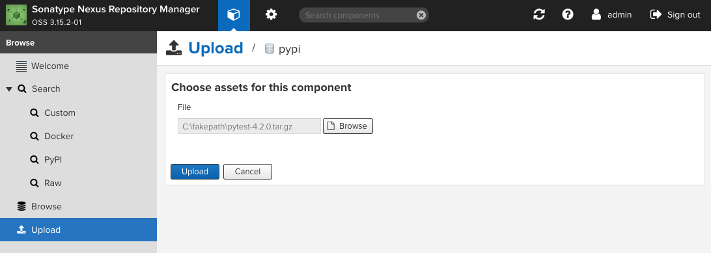

Raw
---
To upload a raw file, click on "Browse" and select file to upload. You also must specify the path for the file.

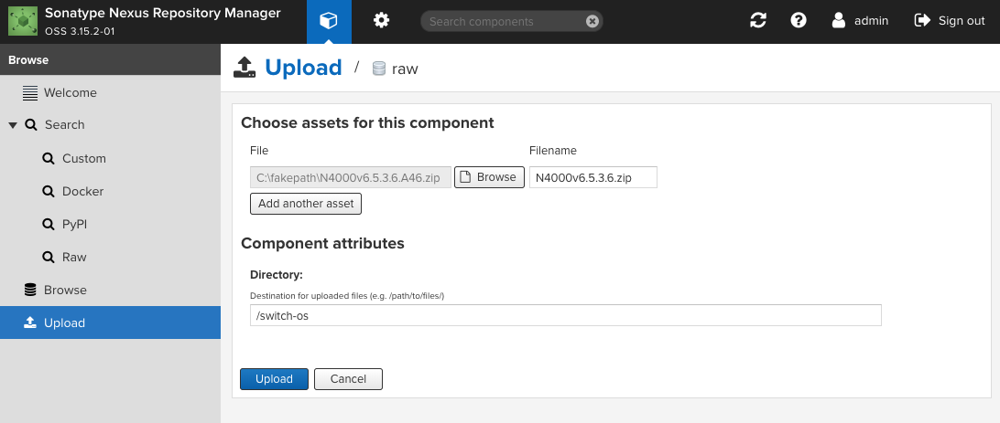

Repository upload (through command line)
========================================

PyPi
----
Uploading a PyPi package into the nexus repo can be done using python tool called "twine".
To install it you can use "pip":
.. code:: bash

	pip install twine

In order to upload the package using twine you must specify the "--repository-url" and the "package name"

.. code:: bash

	twine upload --repository-url https://nexus.engageska-portugal.pt/repository/pypi/ pelican-2.4.4.tar.gz

It will be prompted for your Nexus user credentials.

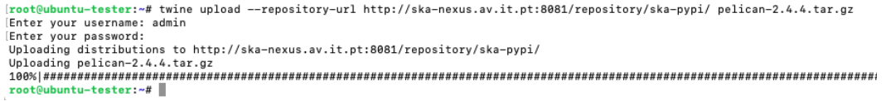

Repository download
===================

PyPi
----
.. code:: bash

	pip install -i https://nexus.engageska-portugal.pt/repository/pypi/simple flask

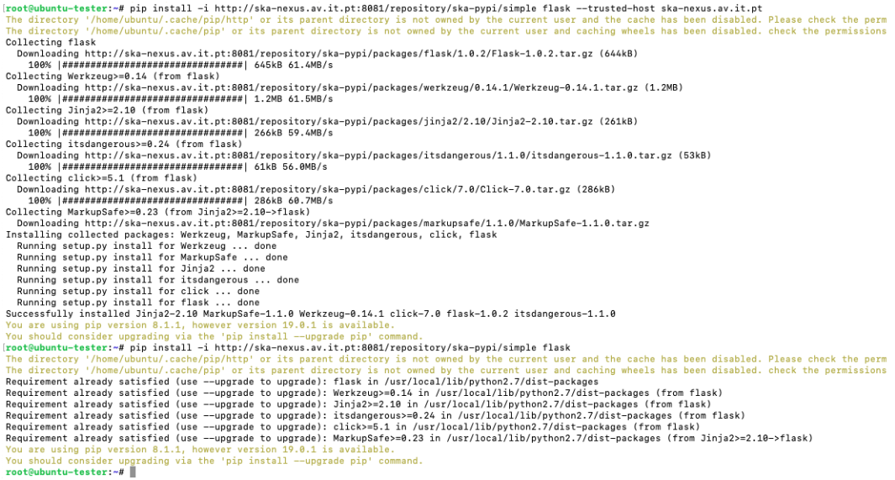