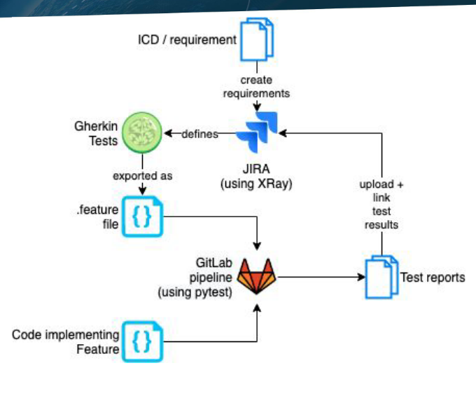
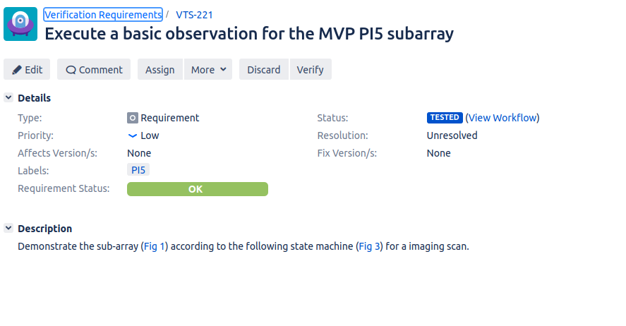
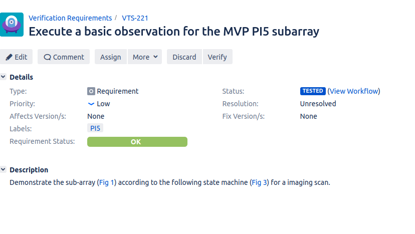
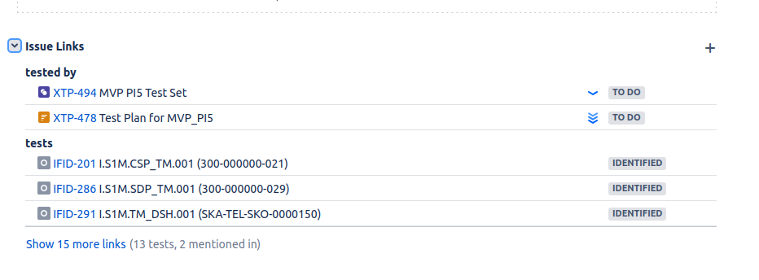
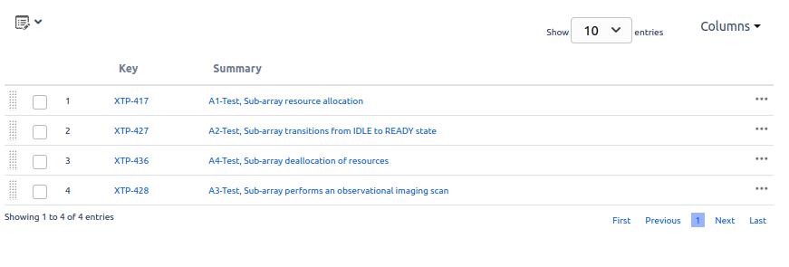
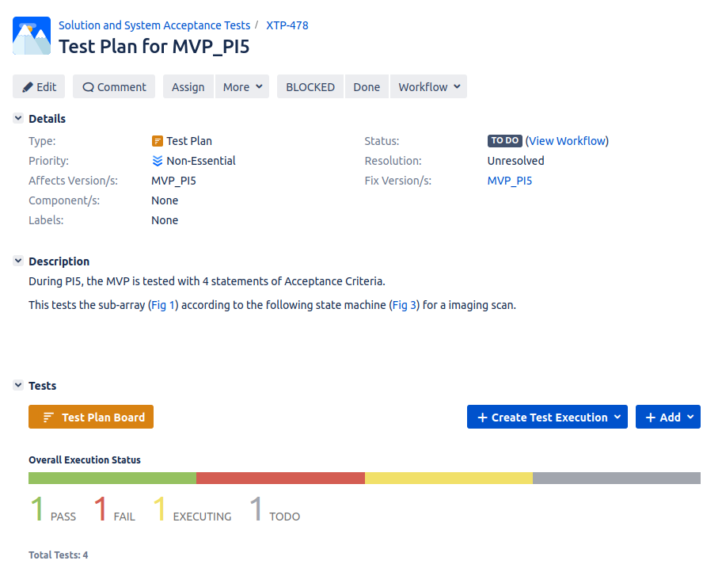
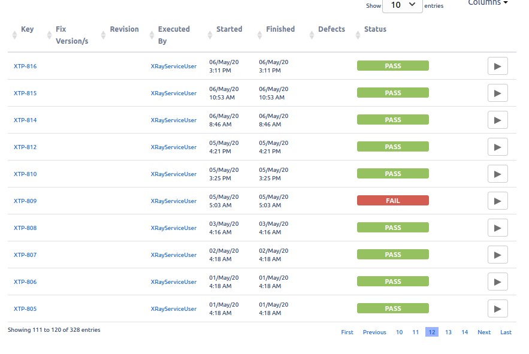
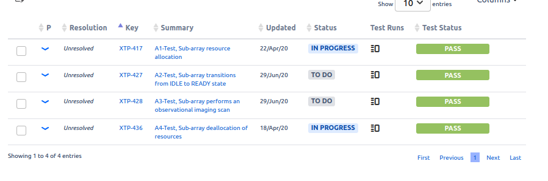

BDD testing guide
*****************

This is based off work originally done by Giorgio Brajnik and Ross Lipscomb. It focuses on the architecture of our BDD system, and the context of BDD testing. For a checklist to use when working with BDD tests, see :doc:`bdd-walkthrough`.

What is BDD testing?
====================

BDD stands for Behaviour Driven Development. Thus BDD is an approach based on a testing style that concentrates on describing and evaluating how the System Under Test (SUT) behaves in response to specified inputs. BDD testing typically focuses on component interactions or other system-level tests. (For more on the different levels of testing, see :doc:`/policies/ska-testing-policy-and-strategy`).

BDD tests are defined using simple natural language formulations, so BDD tests can be understood by people who aren't developers (though these people will typically have a good understanding of the domain that's being tested). Tests are defined using "given", "when", and "then" steps; this uses the `Gherkin specification language <https://cucumber.io/docs/gherkin/reference/>`_. We'll look at a short example::
  
   Given the SKA Community Confluence website
   And I am not logged in
   When I click on the login button
   Then I see a login page

These three steps (augmented by an "And" step - which can be used in all three steps) define a simple test for a website. I can carry this test out manually, or I can work with programmers to automate it. It's easy to understand this test, though some tests may require more domain knowledge (for example if you're setting a test around telescope pointing, or one on the control system). 

BDD tests thus provide a way in to the verification tests that need to be carried out. You can read more about BDD testing at:

- https://github.com/pytest-dev/pytest-bdd
- https://automationpanda.com/2018/10/22/python-testing-101-pytest-bdd/

Why do BDD tests for the SKA?
=============================

The SKA does not just need software to work. There is a vast amount of hardware to run, and the software and hardware must be integrated, as well as the various software components. The SKA has a large number of formal requirements, which specify what the telescope is and what it should do. We have L1 requirements on the whole telescope or observatory, L2 requirements on the various sub-systems, interface requirements on the interfaces between the sub-systems, and verification requirements, which help demonstrate the correct operation of the SKA telescopes. 

BDD tests, with their plain language description, are based on concrete examples of the system's behaviour. Thus they can also provide living documentation of the current capabilities of the system. They allow for a good mapping between software and requirements, by allowing a clear presentation of the capabilities of the system to stakeholders. 

BDD tests are automatable, and can integrate with other management systems, such as JIRA. BDD tests can help provide a traceability report, which fits in well with an engineering culture that needs to meet formal requirements. Because we can integrate BDD tests into our standard software CI/CD pipelines, we can run these tests automatically, and thus verify new features and also provide assurance that there's been no regression. We can use JIRA to collate the output of the CI/CD pipeline, and to link tests to requirements.

BDD JIRA integration
--------------------

The architecture of our BDD implementation:

to the relevant JIRA requirements.

We work from the ICDs (Interface Control Documents) and requirements that were mostly defined in the pre-construction period. These initial requirements have been imported from the SKA JAMA system, and added to the following projects: `L1 <https://jira.skatelescope.org/projects/L1/issues/>`_, `L2 <https://jira.skatelescope.org/projects/L2/issues/>`_, `IF-ID (interface requirements) <https://jira.skatelescope.org/projects/IFID/issues/>`_, and `VTS (verification requirements) <https://jira.skatelescope.org/projects/VTS/issues/>`_. There's also a project for the L3 requirements, but it's not currently populated. JAMA remains the source of truth for the requirements, and we are looking at how we integrate JAMA and JIRA and how we manage new verification requirements. It is also possible to strt by creating a Feature in JIRA, and associate Tests with that Feature. PI planning is a good opportunity to consider wheter there are any requirements or features that would benefit from BDD tests.

   A VTS ticket, showing the test status of the verification requirement.

In JIRA, we define a BDD Gherkin test (using the Given, When, Then steps) in the `XTP project <https://jira.skatelescope.org/XTP/issues/>`_. We then link it to the requirement, usually via a Test Set (explained in more detail later). We export the Gherkin tests to a ``.feature`` file, which we store in the relevant code repository on GitLab. We write the code to implement the tests, and run the tests using the usual CI/CD pipeline, using the ``pytest-bdd`` extension. The CI/CD pipeline outputs the test result to JIRA, where they can be viewed on a `custom Dashboard <https://jira.skatelescope.org/secure/Dashboard.jspa?selectPageId=12700>`_. 

There are a few issues with this process at the moment. We haven't got a clear process for integrating new verification requirements with JAMA yet, nor a way of identifying which verification requirements need to go through this formal process. Exporting the ``.feature`` file from JIRA is currently a manual step, and we'd prefer to automate this. It's also possible to generate thousands of JIRA tickets when running tests; we plan to only keep a certain number of test runs in JIRA, but we also want to be tactical about how many tickets we generate in the first place.  

.. warning::
    We recommend only running the JIRA integration steps of the BDD testing pipeline on the main/master branch of the repository, and only on projects such as skampi that are doing a lot of integration. 

    This will keep the JIRA tickets under control, so we don't spam JIRA.

If you like the BDD style of testing, but don't need the formal integration with JIRA for verification, we suggest you use ``pytest-bdd``, and view the test outcomes in the usual CI/CD outputs on GitLab. 

Writing good BDD tests
----------------------

Writing good BDD tests takes practice. This section is a summary of `a presentation on BDD test quality <https://docs.google.com/presentation/d/1LUQtL_dOEwl_vQvOI0DJQS1Wr1wD5v4w3nBlAVH3dE4/edit?usp=sharing/>`_ by Giorgio Brajnik. The formulation of the Gherkin steps needs domain expertise and a good understanding of the System Under Test and its potential failure modes. When implementing the test steps, you can use your existing unit and component test infrastructure. You may well be able to write most of your tests using the pytest framework (if you're working in Python, or you can exercise your code using Python bindings). 

Your formulation of the Gherkin steps should be as consistent as possible. This facilitates reuse of steps. So check out the existing tests in JIRA to see what they say. This make it easier to reuse more of the underlying test infrastructure; if you have reused a test step, the underlying implementation code can be reused. The Gherkin test defintion should make it clear to stakeholders what is meant to happen to the system. 

We expect that Feature and Product Owners will have the domain knowledge to write good BDD tests, with help from their verification colleagues and developers. These tests help close the loop between the formal requirements and our implementation, to verify correct implementation. 

JIRA organisation for BDD tests
-------------------------------

While we can use BDD tests with many projects, we'll look at the VTS project for verification requirements as an example. We'll use `VTS-221 <https://jira.skatelescope.org/browse/VTS-221/>`_ as an example, though we could also use a Feature ticket as a similar example. This requirement is checking whether we can configure a sub-array to perform an imaging scan. 

This ticket is linked to a Test Set, `XTP-494 <https://jira.skatelescope.org/browse/XTP-494/>`_, which is itself linked to four tests (`XTP-417 <https://jira.skatelescope.org/browse/XTP-417/>`_, `XTP-427 <https://jira.skatelescope.org/browse/XTP-427/>`_, `XTP-436 <https://jira.skatelescope.org/browse/XTP-436/>`_, `XTP-428 <https://jira.skatelescope.org/browse/XTP-428/>`_).

It is from the Test Set XTP-494 that we export the ``.feature`` file, for adding to our repository. It is the Test Set that defines the collection - the set of tests - needed to verify VTS-221. The individual tests linked to the Test Set can be reused, and linked to other Test Sets. Similarly, we can associate multiple Test Sets to a requirement, and the same Test Set can be associated with multiple requirements.

Test Sets allow us to gather tests exercising different parts of the requirement - for example, happy and sad paths through the feature. Or a requirement may say the telescope should either point to a new target, or declare an error state. The error state Test may be reused across many Test Sets. The Test Sets allow us to group tests together logically, and to reuse lower level tests efficiently. 

We can create Test Plans, such as `XTP-478 <https://jira.skatelescope.org/browse/XTP-478/>`_, which can be associated with Test Sets. Test Plans are most usefully used for manual test executions. We can describe test conditions in Test Plans, which is most useful for people configuring the test environment by hand; they are less useful for fully automated tests that happen as part of the CI/CD pipeline. A Test Execution JIRA ticket can then be created to record the results. 

On the individual test tickets, such as `XTP-436 <https://jira.skatelescope.org/browse/XTP-436/>`_,  we can see when the test was last run, and whether it passed or failed. You'll see that each time the test is run, a Test Execution ticket is generated, reported by the XrayServiceUser, which shows the test was carried out as part of the CI/CD pipeline. This can generate thousands of tickets very quickly; hence our recommendation to only run this on the main branch of the repository. 

These results are what are passed to the requirements ticket, such as VTS-221, and to any Dashboards that are configured. 

CI/CD integration
-----------------

The actual tests are defined using an extension to ``pytest`` - ``pytest-bdd``.  This plugin runs the tests, and uses the ``.feature`` file plus annotations to output a ``.json`` file as part of the CI/CD pipeline. A post-test step in the ``.gitlab-ci.yml`` file for the repository pushes the ``.json`` file which contains the ticket metadata to JIRA, where it's parsed by the `XRay JIRA plugin <https://docs.getxray.app/site/xray/>`_. XRay then creates Test Execution tickets, and updates the statuses of the Test and Requirements tickets to show the test result. JIRA statuses can be used in the usual way to build dashboards and other reports on the status of requirements.  Failures are reported as well as successes, provided the CI/CD pipeline completes. 

A feature file can be very simple:: 
  
      @XTP-1156
      Scenario: Observation Execution Tool
        Given The Observation Execution Tool create command
        When OET create is given a <file> that does not exist
        Then the OET returns an <error>

        Examples:
      | file                       | error                                                            |
      | file:///FileNotFound.py    | FileNotFoundError: No such file or directory: /FileNotFound.py   |
      | sdljfsdjkfhsd              | ValueError: Script URI type not handled: sdljfsdjkfhsd           |

This file refers to a single test, XTP-1156. Additional annotations can provide the Test Set JIRA ticket number.  The Examples table allows for handling multiple inputs for checking, without having to write lots of When and Then steps. 

The associated test code then can be relatively simple::

  import pytest
  import pytest-bdd
  
  @pytest.fixture
  def result():
      return {}

  @scenario("XTP-1156.feature", "Observation Execution Tool")
  def test_create(:
      pass

  @given('the Observation Execution Tools create command')
  def command():
      // code to issue the command goes here

  @when('OET create is given a <file> that does not exist')
  def output_from_junk_file(file):
     // code to feed the tool a non-existent file

  @then('the OET returns an <error>')
  def return_error(file, error):
     // code to return the correct error goes here

This imports the relevant pytest infrastructure, creates a pytest fixture to allow information to be passed between steps, and then annotates the pytest infrastructure to allow the JIRA metadata to be associated with the outputs. It also includes the test description, so you can see what the code is meant to be doing. The given, when, then steps and associated methods can be reused for other tests if this is useful. 

This code is lightly adapted from code in https://gitlab.com/ska-telescope/skampi/-/tree/master/post-deployment. 
  

