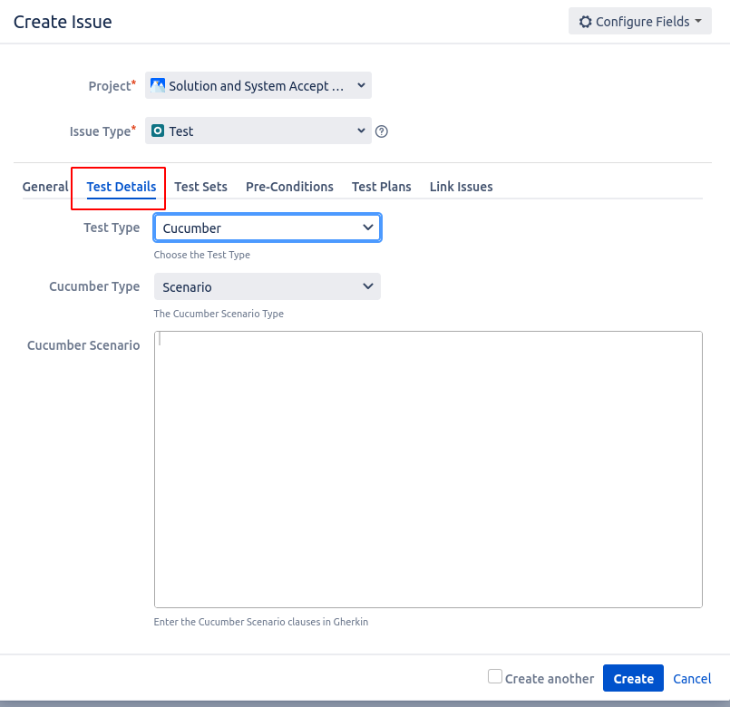
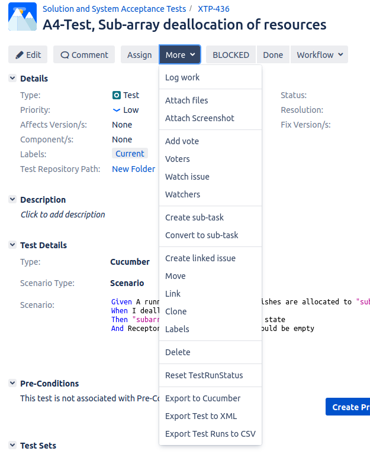

BDD Walkthrough
***************

This is a small adaptation of material by Giorgio Brajnik. For background on how BDD tests work, please read :doc:`bdd-test-context`.

* Identify an SKA requirement or Feature. This may be an existing requirement, such as an interface requirement, or, if you are working on system verification, you may create a new requirement, such as `VTS-221 <https://jira.skatelescope.com/browse/VTS-221/>`_.
   
   * If writing a new requirement, please label it with the PI (Program Increment) in which you plan to implement it. 

* Create a JIRA issue of type "Test Set" in the XTP project. 

   * (optional) Add a fix version corresponding to the relevant PI.
   * Link this issue to the requirement or Feature defined above, using the "tests" relationship. (This can also be done from the requirement/Feature, but then the relationship used should be "tested by".) This can be done from the Test Set Create screen using the "link" field.

* Create the tests for the Test Set.

   * Create issue of type "Test" in the XTP project.
   * (optional) Add fix version.
   * Click on the "Test Details" tab in the newly-created issue

Then provide the test details:

      * Test type: Cucumber
      * Cucumber type: scenario
      * Cucmber scenario: write your Gherkin (given, when, then) steps here.

   * Link your test to the relevant Test Set or Test Sets. If you wish to link an existing test to a new Test Set, that's encouraged, and you can skip the test creation steps.

* Once all the tests for the Test Set are defined, you can export the ``.feature`` file. 
   * Find the relevant Test Set.
   * Go to the More dropdown menu.
   * Select Export to Cucumber from the menu. You'll need to do this for each Test Set you wish to exercise. 

* Add the ``.feature`` file to the relevant GitLab repository. We recommend placing this in the same directory as your tests; you may want to create a directory for your .feature files so that they are placed close to the test code, but so they're not confused with it. 
* Implement your tests using ``pytest-bdd``. 

   * Import ``pytest-bdd`` to your test module.
   * Define a pytest fixture. This creates an empty dictionary that is used to communicate data between steps. 
   * Annotate the test case with the relevant scenario.
   * Write your tests, annotating the methods with the Gherkin keywords. These methods can be reused by your tests (e.g. the same "given" step can be reused by several tests).

.. code-block:: python3 

    // import the relevant libraries
    from pytest-bdd import (given, parsers, scenarios, then, when)

    // load the scenarios from the .feature file. If there are multiple scenarios, add the scenario name after the path.
    scenarios(path/to/.feature/file)

    //you can create a pytest fixture to allow you to pass data between steps via a dictionary
    @pytest.fixture
    def result():
       return {}

    //then write your test steps, annotating them appropriately:
    @given('I have an SDPSubarry device')
    def subarray_device(devices):
       //code to get a subarray device
       result = devices.get_device(DEVICE_NAME)
       return result

    // note that this given step can be reused for many tests that need an SDP subarray device.

    @when('Test step goes here')
    def set_device_state(device):
        // more test code goes here

    @then('Result step goes here')
    def test_result():
        // test the result of your when steps here

This code is loosely based on https://gitlab.com/ska-telescope/sdp/ska-sdp-lmc/-/blob/master/tests/test_subarray.py.

.. note::
   
   We strongly recommend only using the JIRA integration on repositories such as skampi, that do a lot of integration. We further recommend only using the JIRA integration on the main/master branch. If you like the BDD testing style, you can just use ``pytest-bdd`` and get test outcomes as part of the usual CI/CD pipeline. 

