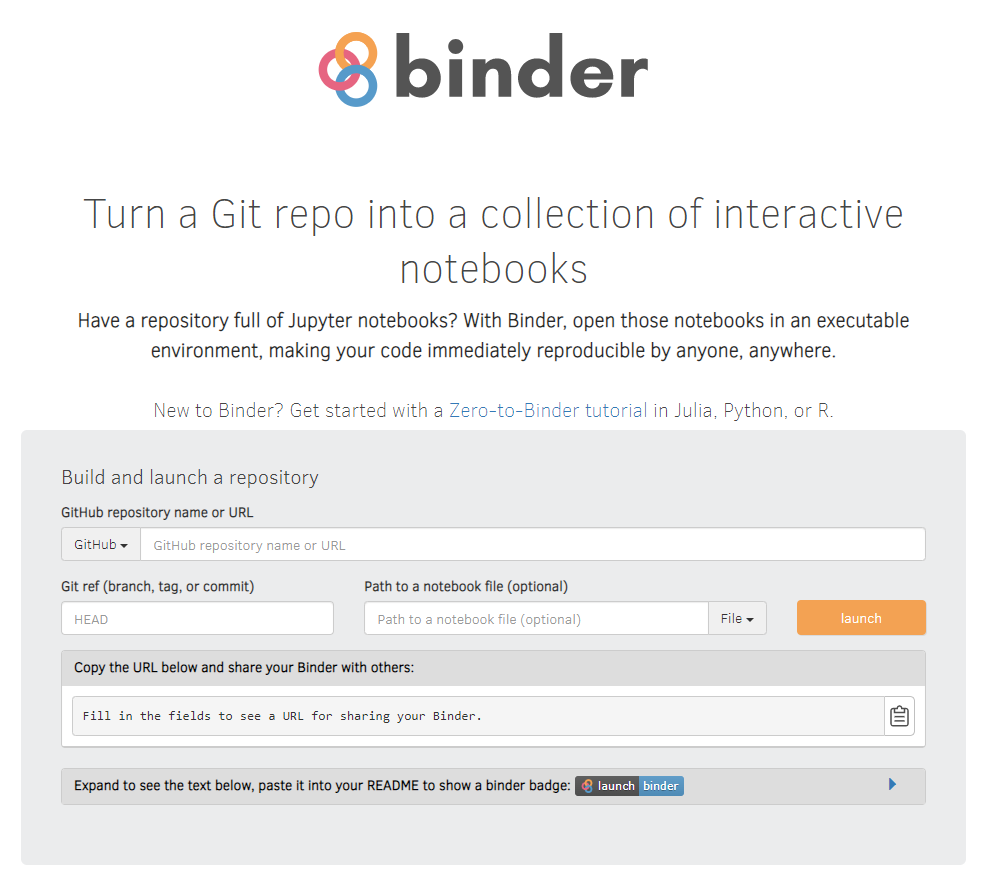
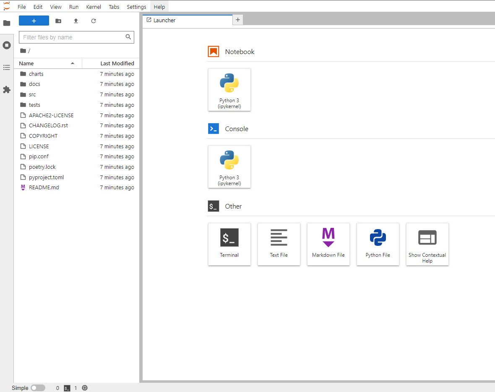
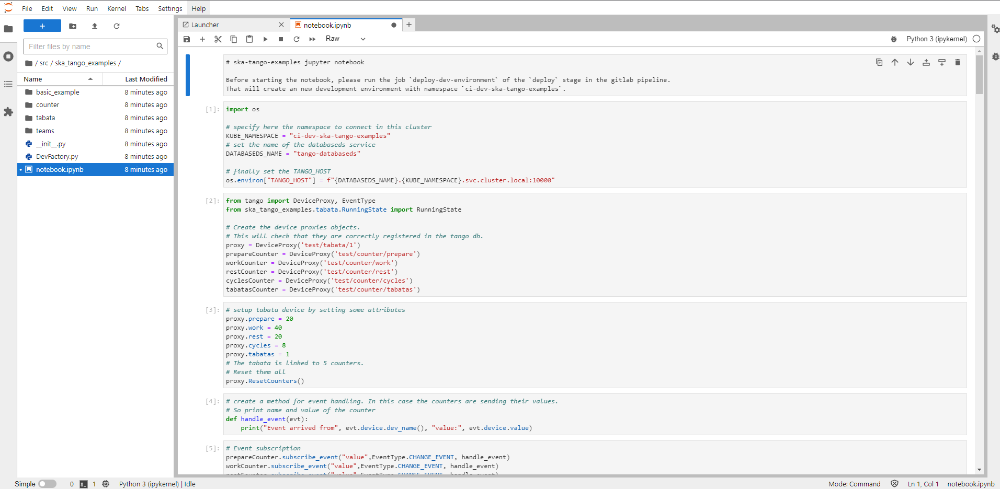
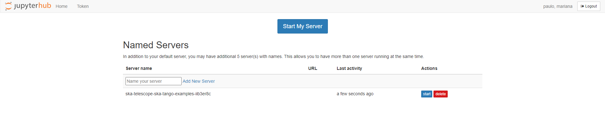

.. _binderhub.rst:

BinderHub/JupyterHub
*********************

BinderHub is a service that allows developers/scientists to share reproducible computational resources and code using Jupyter Notebooks in a kubernetes-based cluster environment.
A developer can create his Jupyter Notebooks, push them into a repository and, through BinderHub, create an environment where he can both execute and modify his code while collaborating with other developers.

JupyterHub is a Hub for single-user Jupyter notebook servers spawning and management, allowing for users to start, stop and delete their servers whenever needed to support the creation and execution of their Jupyter notebooks.

Services access
=======================

To access both services a user should sign in using *<jira-username>@ad.skatelescope.org* as well as the *<jira-password>*.

The following URLs should be used to access the corresponding services:

* **BinderHub** - https://k8s.stfc.skao.int/binderhub/
* **JupyterHub** - https://k8s.stfc.skao.int/binderhub/jupyterhub/
 
BinderHub usage
================

Once successfully logged in a user can enter the name/URL of its repository, including a Git ref if needed (HEAD will be the default), and click on the "launch" button.
BinderHub will then build a Docker image of the repository provided and launch it, creating a customised URL so that the same environment can be reproduced by several users.

   BinderHub homepage

If a developer tries to launch a repository which has already been built the image will be pulled instead of being built again. A rebuild of the image will only happen if a new commit has been made.

When preparing a repository to use with BinderHub it is important to note that the repository provided should 

* **Be public** or else BinderHub won't be able to launch it;
* **Have configuration files** that specify the environment;
* **Include a dependencies file** so that these are included when building the docker image.

Once the image has been launched JupyterLab will be presented showing the home folder of the launched server which contains the files from the selected repository. 

   JupyterLab Launcher

The developer can then navigate to its notebook and start collaborating!

   JupyterLab - Notebook Example

JupyterHub usage
================

Another option is, if a user doesn't have an existing repo to import through BinderHub or simply wants to continue the work previously started, to begin the interaction from JupyterHub.
This will show the previously launched servers - if any - and provide options to:

* Create a new named server, start it and either create a new notebook or upload one from the local machine
* Start a previously stopped server, being able to pickup the work right where it was left 
* Stop or delete any servers that are no longer needed

   JupyterHub Home

An important note is that, when starting the work from JupyterHub, all the dependencies required will need to be installed manually, as no image is built containing these. 

Jupyterhub Profiles
===================

Jupyterhub allows the use of multiple profiles that override Jupyterhub's default configurations.
We are in the process of gathering feedback from the teams on what profiles would be useful to have, as those can only be deployed by a cluster administrator. Currently there are two test profiles available in Jupyterhub:

* default
* test

System team members can generate more profiles if teams have a specific need for them. Profiles can be configured with specific requirements
such as storage, CPU and Memory. If your team requires a specific profile for Jupyterhub please get in contact with the System Team by
raising a `support ticket <https://jira.skatelescope.org/servicedesk/customer/portal/166>`_. 

Policies
========

To ensure that every developer has the same amount of resources available the following policies were defined:

* **Server names:** The name of a server should be limited to 20 characters;
* **Number of servers:** Each developer can have up to 5 named servers plus its own server (using the "My Server" option from JupyterHub);
* **Server timeout:** If a developer leaves a server running for more than 2 hours, without any kind of activity, it will automatically be stopped. It will be available to be started again, once needed, from JupyterHub;
* **Storage capacity:** Each server will have a maximum storage capacity of 2Gib;
* **Storage retention:** Once a server is started, it will have a volume mounted and associated to it to save the work in progress. If the server is stopped, the storage will be kept so that the work can continue once the server is started again. Still, once the server gets deleted, so will its associated storage;
* **CPU and RAM:** Each server will be limited to 1 CPU and 2GB of RAM.