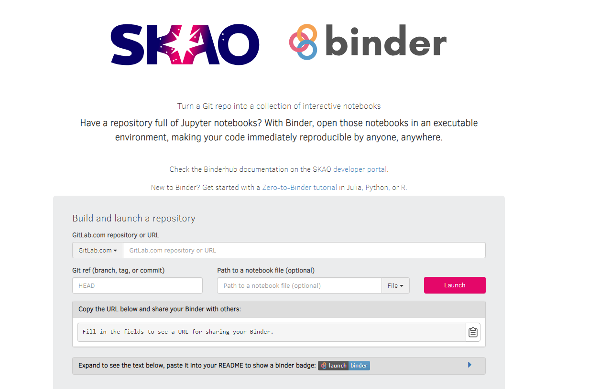

.. _binderhub.rst:

BinderHub/JupyterHub
*********************

BinderHub is a service that allows developers/scientists to share computational resources and code using Jupyter Notebooks in a kubernetes-based cluster environment.
A developer can create his Jupyter Notebooks, push them into a repository and, through BinderHub, create an environment where he can both execute and modify his code while collaborating with other developers.

Initial steps
=============

To access BinderHub, go to https://k8s.stfc.skao.int/binderhub/ and sign in using *<jira-username>@ad.skatelescope.org* and your JIRA password.

   BinderHub homepage

Once successfully logged in a user can enter the name/URL of its repository, including a Git ref if needed (HEAD will be the default), and click on the "launch" button.
BinderHub will then build a Docker image of the repository provided - pushing it into CAR - and launch it, creating a customized URL so that the collaboration can begin.

If a developer tries to launch a repository which has already been built the image will be pulled from CAR instead of being built again. A rebuild of the image will only happen if a new commit has been made.

It is important to note that the repository provided should **include a dependencies file** so that these are included when building the docker image.

Once the image has been launched JupyterHub will be presented showing the home folder of the launched server which contains the files from the selected repository. 

.. figure:: images/jupyterhub-launcher.png
   :scale: 40%
   :alt: JupyterHub Launcher
   :align: center
   :figclass: figborder

   JupyterHub Launcher

The developer can then navigate to its notebook and start collaborating!

.. figure:: images/jupyterhub-notebook.png
   :scale: 40%
   :alt: JupyterHub Notebook Example
   :align: center
   :figclass: figborder

   JupyterHub - Notebook Example

Another option is, if a user doesn't have an existing repo to import through BinderHub or simply wants to continue the work previously started, to begin the interaction from JupyterHub at https://k8s.stfc.skao.int/binderhub/jupyterhub/hub.
This will show the previously launched servers - if any - and provide options to:

* Create a new named server, start it and either create a new notebook or upload one from the local machine
* Start a previously stopped server, being able to pickup the work right where it was left 
* Stop or delete any servers that are no longer needed

.. figure:: images/jupyterhub-home.png
   :scale: 40%
   :alt: JupyterHub Home
   :align: center
   :figclass: figborder

   JupyterHub Home

Policies
========