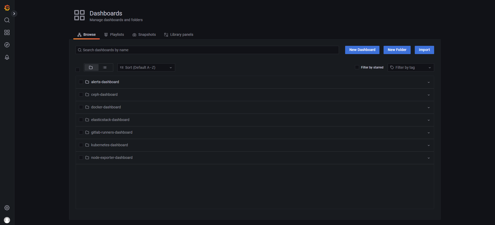
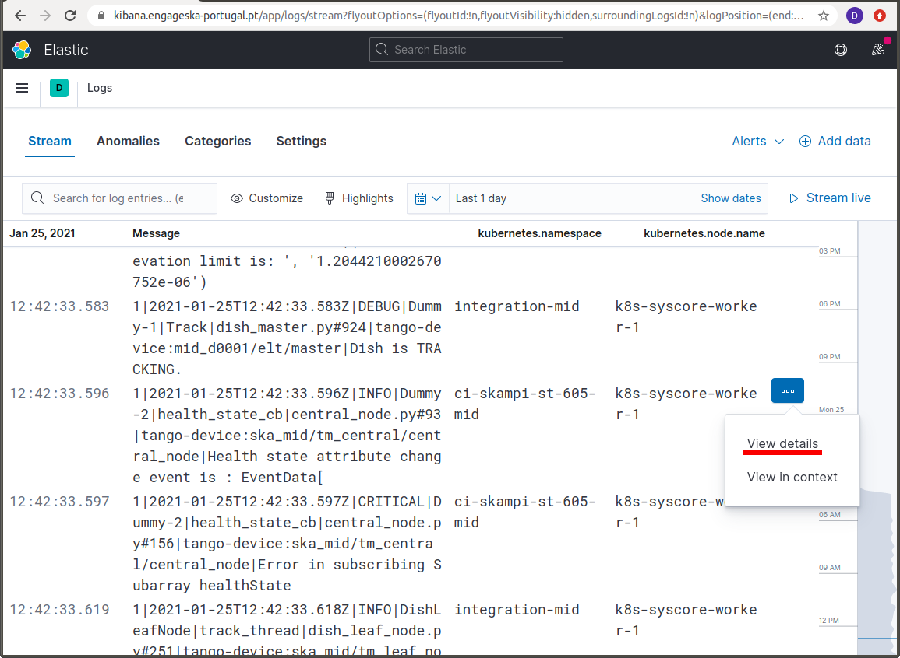
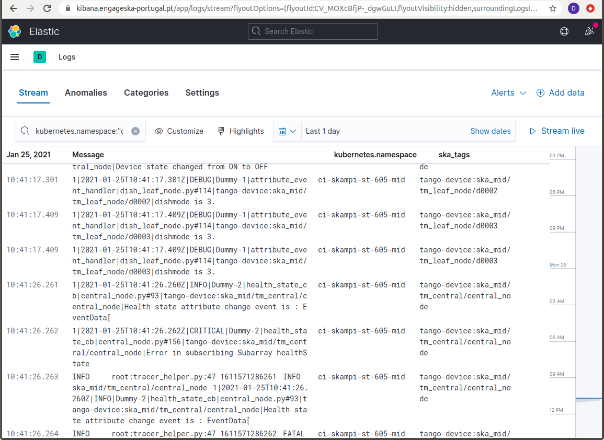
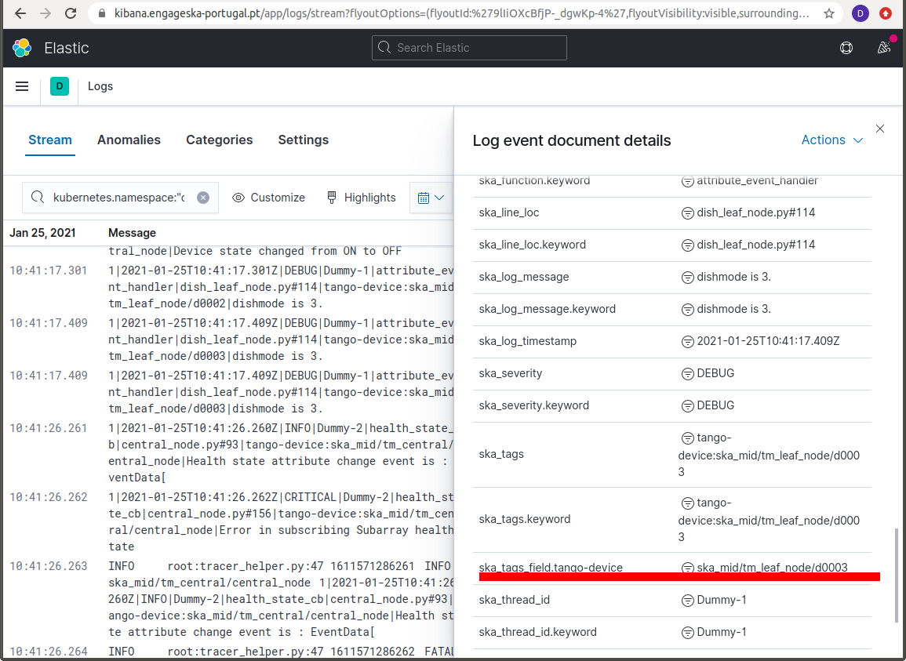

.. _centralised-monitoring-and-logging.rst:

Centralised Monitoring and Logging
**********************************

A centralised monitoring and logging solution was designed to eliminate the need for having many dashboards and services to access monitoring while enabling the aggregation of data from different datacentres, centralising monitoring dashboards and alerting and secure communication with monitoring systems with zero trust principles.
Both the STFC and DP datacentres have been fully integrated into this solution.

On the one hand, the central monitoring solution is based on *Prometheus*, integrated with *Thanos*, providing high-availability and long-term storage capabilities while allowing for the data aggregation from multiple Prometheus targets.
Oh the other hand, the central logging solution is based on *Filebeat*, collecting logs from the referred datacentres and shipping them to *Elasticsearch*.

*Grafana* and *Kibana* are the chosen observability and data visualisation tools, respectively.

Services access and guidelines
==============================

Depending on what is to be monitored and the datacentre to which it belongs, there are several services that can be used. 
The following sections highlight the purpose of each service available as well as the URLs and underlying conditions to access them.

Grafana
-------

To monitor SKA Infrastructure related metrics from, for example, Kubernetes, Gitlab Runners, Elasticstack or Ceph, Grafana dashboards should be used.

The URLs to access it are:

* **STFC datacentre** - https://k8s.stfc.skao.int/grafana/
* **DP datacentre** - https://sdhp.stfc.skao.int/grafana/

To log in choose the "Sign in with Microsoft" option and use the *<jira-username>@ad.skatelescope.org* and *<jira-password>* combination.

Once logged in a user can browse through the existing dashboards and monitor the desired metrics.

   STFC Dashboards Browsing page

Prometheus Alerts
-----------------

To check the prometheus alerts, generated for the core kubernetes cluster and the infrastructure VMs, a user can choose between the web access to the Prometheus Alert Manager UI and the Slack alerts channels.

The URLs to access the Prometheus Alert Manager are:

* **STFC datacentre** - http://monitoring.skao.stfc:9093/#/alerts 
* **DP datacentre** - http://monitoring.sdhp.skao:9093/#/alerts

.. figure:: images/prometheus-alert-manager-example-stfc.png
   :scale: 40%
   :alt: STFC Alert Manager homepage
   :align: center
   :figclass: figborder

   STFC Alert Manager homepage

It is important to note that these URLs are behind a VPN, so VPN access to the corresponding datacentre is required to access them.

There are also two sets of Slack alerts channels, one that serves infrastructure alerts and another that serves user (developer) related alerts. These are:

* **STFC datacentre**
   * Infrastructure alerts - `#techops-alerts <https://skao.slack.com/archives/C047BDYR4LA>`_
   * User alerts - `#techops-user-alerts <https://skao.slack.com/archives/C04815GKLSU>`_

* **DP datacentre**
   * Infrastructure alerts - `#dp-platform-alerts <https://skao.slack.com/archives/C0478FG3HMK>`_
   * User alerts - `#dp-platform-user-alerts <https://skao.slack.com/archives/C047DTS4FNY>`_

Kibana
------

To check the logs collected by Filebeats from a single or multiple clusters, Kibana should be used.

The URL to access it is: https://k8s.stfc.skao.int/kibana/app/logs/stream being that the user should log in as described in the Grafana section and, then, choose the option "Continue as Guest".

Kibana allows for filtering of log messages on the basis of a series of fields. 
These fields can be added as columns to display information, using the **Settings** option, and filtering by the values of those fields can be done directly on the **Search** box or by selecting the **View details** menu:

In the example above in order to retrieve only the log messages relevant for the skampi development pipeline ``ci-skampi-st-605-mid``, one should then select the corresponding ``kubernetes.namespace`` field value. 

.. image:: images/kibana-ns1.png
  :alt: Kibana Log event document details, selecting the kubernetes.namespace

There are many other field options using kubernetes information, for example ``kubernetes.node.name`` and ``kubernetes.pod.name``, that can be used for efficient filtering. 

The fact the SKA logging format allows for simple key-value pairs (SKA Tags) to be included in log messages let us refine the filtering. Tags are parsed to a field named ``ska_tags`` and on this field there can be one or more device properties separated by commas.

The field ``ska_tags`` is also parsed so that the key is added to a ``ska_tags_field`` prefix that will store the value. For the example above, this means filtering the messages using the value of the ``ska_tags_field.tango-device`` field.

Making the selection illustrated above means that only messages with the value ``ska_mid/tm_leaf_node/d0003`` for the ``ska_tags_field.tango-device`` field would be displayed.

 