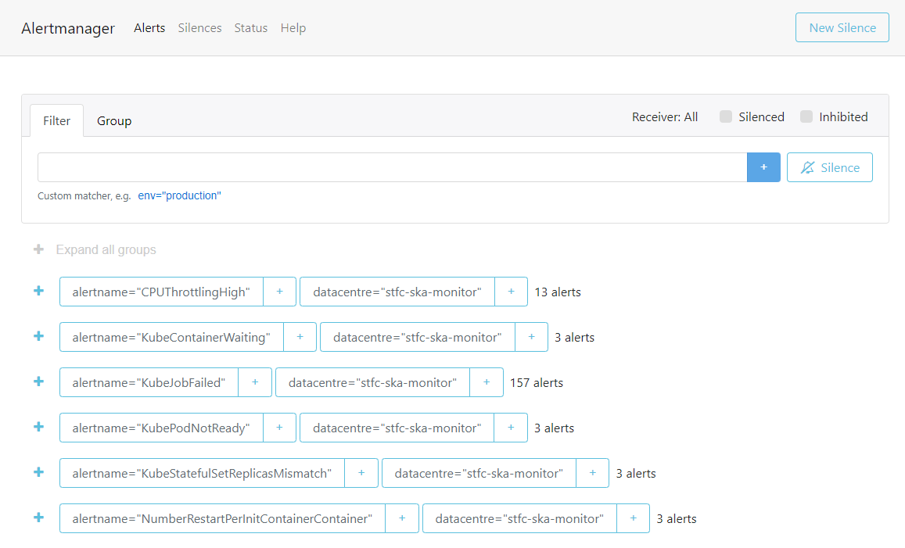

.. _centralised-monitoring-and-logging.rst:

Centralised Monitoring and Logging
**********************************

A centralised monitoring and logging solution was designed to eliminate the need for having many dashboards and services spread across different data centres to access monitoring while enabling the aggregation of data, centralising monitoring dashboards and alerting and secure communication with monitoring systems with zero trust principles.
All SKAO data centres used for testing, staging, integration or production have been fully integrated into this solution.

Developer friendly Dashboards
=============================

To address the evolving needs of developers, several new Grafana dashboards have been introduced. These dashboards provide detailed insights into Kubernetes resource usage, CI/CD pipeline statuses, and namespace management. Developers can now easily monitor their deployments, resource utilization, and logs through these comprehensive dashboards.

These dashbaord can be accessed by following the links printed out in Gitlab CI Job output as the example figure shown below. These are prepopulated with the namespace and time range of the job so that the user can easily monitor the deployment.

   Dashboard Links

Real-Time Dashboards
--------------------

These dashboards are *currently* only available for CI/CD jobs running in STFC. They are based on Headlamp which is graphical user interface specifically tailored for simplfying the monitoring of Kubernetes Deployments. It allows real time monitoring of the deployments such as pod status, custom resource definitions such as TangoDBs and investigate the deployment events, logs and metadata.

- `Namespace Overview <https://k8s.stfc.skao.int/headlamp/c/developers/namespaces/>`__
- `Tango DeviceServers <https://k8s.stfc.skao.int/headlamp/c/developers/customresources/deviceservers.tango.tango-controls.org>`__: *These are specific to the Tango Controls Applications*
- `DatabaseDS <https://k8s.stfc.skao.int/headlamp/c/developers/customresources/databaseds.tango.tango-controls.org>`__: *These are specific to the Tango Controls Applications*

Logs
----

There are prepoulated and filtered log views as shown in the above figure for Job, Test Pod, Namespace and more deployment related logs. These are useful for debugging and monitoring the deployment logs. 
As Kibana URLs are hard to generate and would fail if they don't exist, please follow the URLs in the job output to access the logs.

Kubernetes Dashboards
---------------------

The dashboards provide detailed insights into resource utilization across the deployments. Developers can monitor deployment health, CPU, memory, and storage usage, and identify any resource constraints. This helps in optimizing resource allocation and ensuring that applications run smoothly. These dashboards are also enriched with log integration to provide a comprehensive view of the deployments.

They can be found by following the URLs in the Gitlab CI Job output. Some of the dashboards are shown below. Note that you need to filter these for your specific namespace and time range. 

- `Namespace Resources <https://monitoring.skao.int/d/85a562078cdf77779eaa1add43ccec1e/kubernetes-compute-resources-namespace-pods?orgId=1&var-datasource=default&var-logdatasource=PAE1B8C8635429669&var-cluster=stfc-ska-monitor&var-namespace=gitlab>`__
- `Device Servers <https://monitoring.skao.int/d/e0tiv654z/kubernetes-compute-resources-deviceserver-operator?orgId=1&var-datasource=default&var-cluster=stfc-ska-monitor&var-namespace=ci-ska-tmc-mid-integration-e4206304-tmc-sdp&var-pod=&from=now-1h&to=now>`__
- `Compute Resources by Workload <https://monitoring.skao.int/d/a87fb0d919ec0ea5f6543124e16c42a5/kubernetes-compute-resources-namespace-workloads?orgId=1&var-datasource=default&var-cluster=stfc-ska-monitor&var-namespace=binderhub&var-type=All&from=now-1h&to=now&var-logdatasource=PAE1B8C8635429669>`__
- `Compute Resources by Pod <https://monitoring.skao.int/d/85a562078cdf77779eaa1add43ccec1e/kubernetes-compute-resources-namespace-pods?orgId=1&var-datasource=default&var-cluster=stfc-ska-monitor&var-namespace=ci-ska-tmc-mid-integration-e4206304-tmc-sdp&from=now-1h&to=now>`__
	

CI/CD pipeline Dashboards
-------------------------

The dashboards provide detailed insights into the CI/CD pipeline statuses. Developers can monitor the pipeline health, job statuses, and identify any issues. This helps in optimizing the pipeline and ensuring that the pipelines are healthy.

They can be found by following the URLs below. Note that you need to filter these for your specific namespace and time range.

- `CI/CD Pipeline Jobs <https://monitoring.skao.int/d/gitlab_ci_jobs/gitlab-ci-jobs?orgId=1>`__
- `CI/CD Pipeline Status <https://monitoring.skao.int/d/gitlab_ci_pipelines/gitlab-ci-pipelines?orgId=1>`__

Namespace Management Dashboards
-------------------------------

The dashboards provide detailed insights into the namespace management. Developers can monitor the namespace health, resource utilization, and identify any issues. This helps in optimizing the namespace and ensuring that the namespaces are healthy. They also give an overview on the namespace usage and the resources allocated to the namespace per gitlab project, team or user. 

They can be found by following the URLs below.

- `Namespace Overview <https://monitoring.skao.int/d/edvfag7wkt7nke/namespace-manager-overall?orgId=1&var-datasource=default&var-cluster=stfc-ska-monitor>`__
- `Namespace Usage <https://monitoring.skao.int/d/e374e7bb-e223-4398-aaa8-f15845755fd6/namespace-manager-namespaces?orgId=1&var-datasource=default&var-cluster=stfc-ska-monitor&var-project=All&var-team=All&var-user=All&var-namespace=All>`__

Monitoring Solution
===================

Prometheus and Thanos
---------------------

The central monitoring solution is based on `Prometheus <https://prometheus.io/>`__, integrated with `Thanos <https://thanos.io/>`__, providing high-availability and long-term storage capabilities while allowing for the data aggregation from multiple Prometheus targets.

Grafana
-------

To monitor SKA Infrastructure related metrics from, for example, Kubernetes, Gitlab Runners, Elasticstack or Ceph, `Grafana <https://grafana.com/>`__ dashboards should be used.

- **URL**: https://monitoring.skao.int
- **STFC Metrics URL**: https://k8s.stfc.skao.int/grafana/ (until migration is complete)

.. admonition:: Info

   To log in, choose the "Sign in with Azure AD" option and use the *<jira-username>@ad.skatelescope.org* and *<jira-password>* combination. Once logged in, users can browse through the existing dashboards and monitor the desired metrics.

.. figure:: images/dashboards-browse-example-stfc.png
   :scale: 40%
   :alt: STFC Dashboards Browsing page
   :align: center
   :figclass: figborder

   STFC Dashboards Browsing page

Users can also `create their own dashboards <https://grafana.com/docs/grafana/latest/dashboards/build-dashboards/>`__ and share them.

   New Dashboard Sharing example

Prometheus Alerts
^^^^^^^^^^^^^^^^^

To check the prometheus alerts, generated for the core kubernetes cluster and the infrastructure VMs, a user can choose between the web access to the Prometheus Alert Manager UI and the Slack alerts channels.

The URLs to access the Prometheus Alert Manager are:

* **STFC datacentre** - http://monitoring.skao.stfc:9093/#/alerts 
* **DP datacentre** - http://monitoring.sdhp.skao:9093/#/alerts

   STFC Alert Manager homepage

It is important to note that these URLs are behind a VPN, so VPN access to the corresponding datacentre is required to access them.

There are also two sets of Slack alerts channels, one that serves application alerts and another that serves developer related alerts. These are:

* **STFC datacentre**
   * Application alerts - `#techops-alerts <https://skao.slack.com/archives/C047BDYR4LA>`__
   * Developer alerts - `#techops-user-alerts <https://skao.slack.com/archives/C04815GKLSU>`__

* **DP datacentre**
   * Application alerts - `#dp-platform-alerts <https://skao.slack.com/archives/C0478FG3HMK>`__
   * Developer alerts - `#dp-platform-user-alerts <https://skao.slack.com/archives/C047DTS4FNY>`__

Logging Solution
================

Filebeat and Elasticsearch
--------------------------

The central logging solution is based on `Filebeat <https://www.elastic.co/beats/filebeat>`__, collecting logs from the referred data centres and shipping them to `Elasticsearch <https://www.elastic.co/elasticsearch>`__.

Kibana
------

- **URL**: https://k8s.stfc.skao.int/kibana/app/logs/stream

.. admonition:: Info
   
   To log in to Kibana, open the URL https://k8s.stfc.skao.int/kibana/app/logs/stream, choose the "Sign in with Azure AD" option, use your <jira-username>@ad.skatelescope.org and <jira-password> combination to log in, and after logging in, choose the option "Continue as Guest" to access Kibana.

Kibana allows for filtering of log messages on the basis of a series of fields. 
These fields can be added as columns to display information, using the **Settings** option, and filtering by the values of those fields can be done directly on the **Search** box or by selecting the **View details** menu:

.. image:: images/kibana-ns0.png
  :alt: kibana log stream, selecting "view details" for a particular CI pipeline

In the example above in order to retrieve only the log messages relevant for the skampi development pipeline ``ci-skampi-st-605-mid``, one should then select the corresponding ``kubernetes.namespace`` field value. 

.. image:: images/kibana-ns1.png
  :alt: Kibana Log event document details, selecting the kubernetes.namespace

There are many other field options using kubernetes information, for example ``kubernetes.node.name`` and ``kubernetes.pod.name``, that can be used for efficient filtering. 

The fact the SKA logging format allows for simple key-value pairs (SKA Tags) to be included in log messages let us refine the filtering. Tags are parsed to a field named ``ska_tags`` and on this field there can be one or more device properties separated by commas.

.. image:: images/kibana-tag0.png
  :alt: logs for the specified namespace

The field ``ska_tags`` is also parsed so that the key is added to a ``ska_tags_field`` prefix that will store the value. For the example above, this means filtering the messages using the value of the ``ska_tags_field.tango-device`` field.

.. image:: images/kibana-tag1.png
  :alt: selecting ska-tags to look at tango-device log messages

Making the selection illustrated above means that only messages with the value ``ska_mid/tm_leaf_node/d0003`` for the ``ska_tags_field.tango-device`` field would be displayed.
