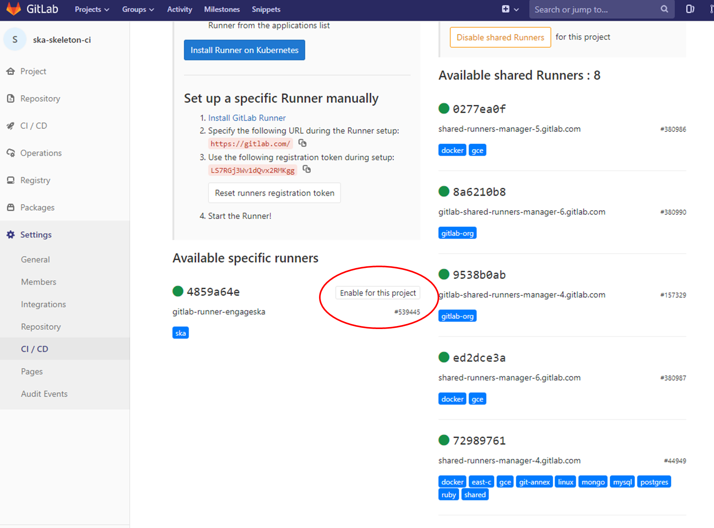
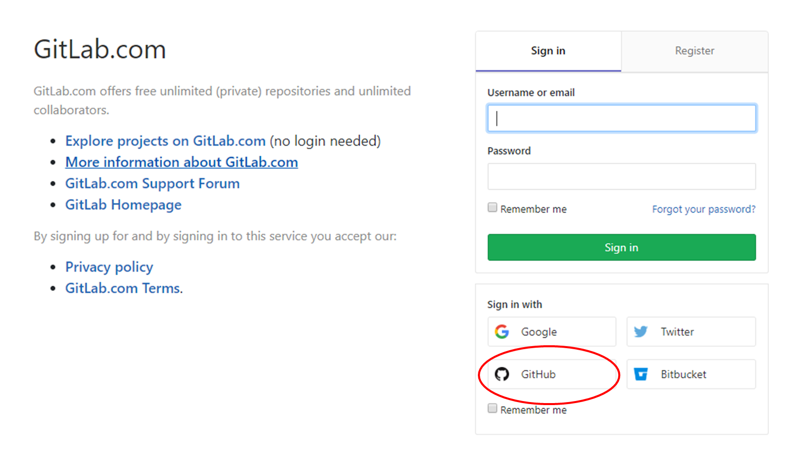

.. _ci-cd:

======================
Continuous Integration
======================

Configuring a CI pipeline
-------------------------

To enable the Gitlab automation, it is needed to insert a
`configuration
file <https://docs.gitlab.com/ee/ci/yaml/README.html>`_ that must be placed in the root of the repository and called ".gitlab-ci.yml". It mainly contains definitions of how your project should be built. An example of
it can be found within the project "ska-python-skeleton" available
`here <https://gitlab.com/ska-telescope/templates/ska-python-skeleton>`__.
Once the file is in the root directory, it is possible to run the CI pipeline manually
(creating a pipeline) or with a commit in gitlab as soon as the
mirroring finishes. The following pipeline was created manually pressing
the button “Run pipeline” on a specific branch (i.e. master).

|image5|

Using a specific executor
-------------------------

The pipeline by default will run with a shared runner made available from GitLab.
It is also possible to assign specific SKA runners to the project (by adding the `tags <https://docs.gitlab.com/ee/ci/yaml/README.html#tags>`__).
To do that the option must be enabled:

|image6|

The EngageSKA cluster located at the Datacenter of Institute of Telecommunication (IT) in Aveiro provides some virtual machines available adding the tag "engageska" or "docker-executor" as shown `here <https://gitlab.com/ska-telescope/templates/ska-python-skeleton/>`__.

.. note::
  In order to have the SKA runners available, a project *must* be under the `SKA Telescope <https://gitlab.com/ska-telescope/>`_ group. Currently projects can only be added to the SKA group by the System Team - refer to our guide to :doc:`/projects/create-new-project`.

The typically used SKA CI Pipeline stages are being documented as they are developed and improved. The currently available documentation on this is discussed under :ref:`ci-pipeline-stages`. The following section deals with the required CI metrics that need to be included in the pipeline.

.. _AutomatedMetrics:

Automated Collection of CI health metrics as part of the CI pipeline
--------------------------------------------------------------------
As part of the CI/CD process all teams are expected to collect and consolidate
the required code health metrics. Namely **unit tests**, **linting (static
code analysis)** and **coverage**.

Part of the CI/CD functionality is to add a quick glance of those metrics to
each repository in the form of badges. These badges will always show the status
of the **default** branch in each repository.

Teams have the option to use the automatic parsing of their CI and code
health metrics and have the badges created automatically as long as the output
from their code health reports follows the requirements described bellow.
As an alternative the teams can instead create the :code:`ci-metrics.json`
file themselves according to what is described in
:ref:`Manual Metrics <ManualMetrics>`.

These metrics reports must pass the following requirements:

1. These files must **not** be part of the repository, but be created under
   their respective steps (:code:`test`, :code:`linting`) in the CI pipeline.
2. Unit Tests report must be a JUnit XML file residing under
   :code:`./build/reports/unit-tests.xml`
3. Linting report must be a JUnit XML file residing under
   :code:`./build/reports/linting.xml`
4. Coverage report must be a XML file in the standard used by `Coverage.py`
   residing under :code:`./build/reports/code-coverage.xml`
5. The XML format expected for the coverage is the standard XML output from
   `Coverage.py <https://pypi.org/project/coverage/>`_ for Python or from a
   similar tool like `Cobertura <https://github.com/cobertura/cobertura>`_
   for Javascript with the :code:`line-rate` attribute specifying the coverage.
   See the example code bellow.

.. code-block:: xml

  <?xml version="1.0" encoding="UTF-8"?>
  <coverage branch-rate="0" branches-covered="0" branches-valid="0" complexity="0" line-rate="0.6861" lines-covered="765" lines-valid="1115" timestamp="1574079100055" version="4.5.4">

**Note:** To always ensure these requirements are fulfilled, you should copy/move the files
in the `after_script` part of your job definition instead of `script` part after running tests etc.
since if the tests/linting fails then the files won't be copied. For example:

.. code-block:: yaml

  # Do not use this:
  job:
    ...
    script:
      ...
      - python3 -m pytest ...
      - cp unit-tests.xml report.json cucumber.json ../build/reports/
      ...

  # Use this instead:
  job:
    ...
    script:
      ...
      - python3 -m pytest ...
    after_script:
      - cp unit-tests.xml report.json cucumber.json ../build/reports/
      ...

In order to automate the process as much as possible for the teams, the
`templates repository <https://gitlab.com/ska-telescope/templates-repository/-/tree/master/gitlab-ci/includes>`_ repository was created and it will automate the all
metrics collection, and badge creation as long as the 5 points above are
observed.

In order to use this automation, the `post_step` from the `templates-repository` must be included, i.e.:
:code:`.gitlab-ci.yml`.

.. code-block:: yaml

  # Create Gitlab CI badges from CI metrics
  # https://developer.skao.int/en/latest/tools/continuousintegration.html#automated-collection-of-ci-health-metrics-as-part-of-the-ci-pipeline
  include:
    - project: 'ska-telescope/templates-repository'
      file: 'gitlab-ci/includes/post_step.yml'
.. _ManualMetrics:

**Note:** You can't redefine the `.post` step in your CI code, or it will break the functionality.
In case you need to use the `.post` step for the CI pipeline then you must use the manual method for
generating the badges.

Manual Collection of CI health metrics as part of the CI pipeline
------------------------------------------------------------------
The teams that prefer to create their own :code:`ci-metrics.json` file instead
of using the provided automation, can do so. They are still expected to observe
all the points described in :ref:`Automated Metrics <AutomatedMetrics>`.

The :code:`ci-metrics.json` file is expect to be created automatically as part
of the CI pipeline by the teams by collecting the relevant information from the
*unit tests*, *coverage*, *linting* and *build status*.
**An important point to notice, is that** :code:`ci-metrics.json` **shouldn't
exist as part of the repository, but, be created specifically as part of the CI
pipeline.**
The file must be created and properly populated before the start of the marked
:code:`stage: .post` step in the  CI pipeline (:code:`.gitlab-ci.yml` file).

The metrics should be collected under the following structure:

- **commit-sha** (string): *sha tag for the git commit*
- **build-status**: *top level placeholder for the build process status*

  - **last**: *placeholder about the last build process*

    - **timestamp** (float): *the Unix timestamp with the date and time of the
      last build status*

- **coverage**: *placeholder about the unit test coverage*

  - **percentage** (float): *the coverage percentage of the unit tests*

- **tests**: *placeholder about the unit tests*

  - **errors** (int): *number of test errors*
  - **failures** (int): *number of test failures - this denotes a serious
    error in the code that broke the testing process*
  - **total** (int): *total number of tests*

- **lint**: *placeholder about the linting (static code analysis)*

  - **errors** (int): *number of linting errors*
  - **failures** (int): *number of linting failures - this denotes a serious
    error in the code that broke the linting process*
  - **total** (int): *total number of linting tests*

:code:`ci-metrics.json` example:

.. code-block:: json

  {
    "commit-sha": "cd07bea4bc8226b186dd02831424264ab0e4f822",
    "build-status": {
        "last": {
            "timestamp": 1568202193.0
        }
    },
    "coverage": {
        "percentage": 60.00
        },
    "tests": {
        "errors": 0,
        "failures": 3,
        "total": 170
    },
    "lint": {
        "errors": 4,
        "failures": 0,
        "total": 7
    }
  }

.. _ci-pipeline-stages:

CI pipeline stage descriptions
------------------------------

.. caution:: This section is a work in progress

The CI/CD pipeline will ensure that software projects are packaged, tested and released in a consistent and predictable manner.
SKA Pipelines are viewable and executable at https://gitlab.com/ska-telescope

General Notes
_____________
- Every commit could potentially trigger a pipeline build. There may be different rules applied to determine which stages are executed in the pipeline based on factors like the branch name.

    - E.g Every commit in a feature branch may trigger the “Lint” stage, but not a slow test suite.
- When doing a release with a git tag, the full pipeline will be run.
- Every pipeline job is associated with its git commit (including tag commits).
- Try and have the stages complete as fast as possible.

    - In some cases it may be possible to parallelize jobs. For example, unit tests and static analysis could be run in parallel.
- All projects must include all the stages listed below.
- Project dependencies must be stored in, and made available from the SKA software repository.
- All tests must pass on the “master” branch and should be kept stable.

Stages
______
Build
"""""
The build stage packages/compiles the software project into distributable units of software.
The project will be checked out at the git commit hash. This specific version of the code must then be built. Failing the build stage will stop the further steps from being executed. Where possible Semantic Versioning should be used.
To create a release a git tag should be used. See :doc:`/tools/software-package-release-procedure` for details.

Input
  Git commit hash

Output
  A distributable unit of software. E.g .deb .whl .jar or docker image.
  These must be stored as part of the artifacts and will then be available to subsequent jobs.
  One could also store metadata together with the artefact, such as a hash of the binary artefact. This should be provided by our artefact registry.

.. _linting:

Linting
"""""""
The static analysis stage does static code analysis on the source code such as Linting.

Input
  None

Output
  Quality analysis results in JUnit format.

.. _tests:

Test
""""
The test stage must install/make use of the packages created during the build stage and execute tests on the installed software. Tests should be grouped into Fast / Medium / Slow / Very Slow categories. For more details, read the :doc:`/policies/ska-testing-policy-and-strategy`.

Input
  The output from the Build stage. E.g .deb or .whl or docker image.
  Input could also consist of test data or environment.

Output
  - The results of the tests in JUnit format. These need to be added to the artifacts.
    `See Gitlab Test Reports <https://docs.gitlab.com/ee/ci/junit_test_reports.html>`_.
  - Coverage metrics in JUnit format.

Test types
++++++++++

.. todo::
   - Further define components to be mocked or not
   - Further define smoke/deployments tests

Unit tests
  The smallest possible units/components are tested in very fast tests. Each test should complete in milliseconds.

Component tests
  Individual components are tested.

Integration/Interface tests
  Components are no longer being mocked, but the interactions between them are tested.
  If a component is a docker image, the image itself should be verified along with its expected functionality.

Deployment tests
  Tests that software can be deployed as expected and once deployed, that it behaves as expected.

Configuration tests
  Multiple combinations of software and hardware are tested.

System tests
  The complete solution, integrated hardware and software is tested. There tests ensure that the system requirements are met.

Publish
"""""""
Once the build and test stages have completed successfully the output from the build stage is uploaded to the SKA software repository. This stage may only be applicable on git tag commits for full releases in certain projects.

Input
  The output from the Build stage. .deb or .whl for example. This could also include docker images.

Output
  The packages are uploaded to the SKA software repository.

Pages
"""""
This is a gitlab stage publishes the results from the stages to Gitlab

Input
  The JUnit files generated in each pipeline stage.

Output
  The generated HTML containing the pipeline test results.

Documentation
"""""""""""""
Currently the documentation is generated by the “readthedocs” online service.
The list of SKA projects available :doc:`/projects/list`.
The project documentation will be updated and accessible at the following URL
\https://developer.skao.int/projects/<PROJECT>
E.g `lmc-base-classes </projects/lmc-base-classes>`_

Input
  A `docs` folder containing the project documentation.

Output
  The generated HTML containing the latest documentation.

Using environment variables in the CI pipeline to upload to the Central Artefact Repository
-------------------------------------------------------------------------------------------

There are several environment variables available in the CI pipeline that should be used when uploading Python packages and Docker images to the Central Artefact Repository.
This will make these packages available to the rest of the SKA project.
This section describes some of these variables.
A :ref:`full list <gitlab-variables>` is also available.

Python Modules
______________

The Central Artefact Repository PYPI destination as well as a username and password is available.
For a reference implementation see the `lmc-base-classes .gitlab-ci.yaml <https://gitlab.com/ska-telescope/lmc-base-classes/blob/master/.gitlab-ci.yml>`_

Note the following:
 - The Central Artefact Repository `CAR_PYPI_REPOSITORY_URL <https://artefact.skatelescope.org/repository/pypi-internal/>`_ is where the packages will be uploaded to.
 - `twine` uses the local environment variables (`TWINE_USERNAME`, `TWINE_PASSWORD`) to authenticate the upload, therefore they are defined in the `variables` section.

.. code-block:: yaml

  publish to nexus:
    stage: publish
    tags:
      - docker-executor
    variables:
      TWINE_USERNAME: $CAR_PYPI_USERNAME
      TWINE_PASSWORD: $CAR_PYPI_PASSWORD
    script:
      # check metadata requirements
      - scripts/validate-metadata.sh
      - pip install twine
      - twine upload --repository-url $CAR_PYPI_REPOSITORY_URL dist/*
    only:
      variables:
        - $CI_COMMIT_MESSAGE =~ /^.+$/ # Confirm tag message exists
        - $CI_COMMIT_TAG =~ /^((([0-9]+)\.([0-9]+)\.([0-9]+)(?:-([0-9a-zA-Z-]+(?:\.[0-9a-zA-Z-]+)*))?)(?:\+([0-9a-zA-Z-]+(?:\.[0-9a-zA-Z-]+)*))?)$/ # Confirm semantic versioning of tag

Docker images
_____________

The Central Artefact Repository Docker registery host and user is available.
For a reference implementation see the `SKA docker gitlab-ci.yml <https://gitlab.com/ska-telescope/ska-tango-images/blob/master/.gitlab-ci.yml>`_

Note the following:
 - The `DOCKER_REGISTRY_USER` corresponds to the folder where the images are uploaded, hence the `$CAR_OCI_REGISTRY_USERNAME` is used.

.. code-block:: yaml

  script:
  - cd docker/tango/tango-cpp
  - echo ${CAR_OCI_REGISTRY_PASSWORD} | docker login --username ${CAR_OCI_REGISTRY_USERNAME} --password-stdin ${CAR_OCI_REGISTRY_HOST}
  - make DOCKER_BUILD_ARGS="--no-cache" DOCKER_REGISTRY_USER=$CAR_OCI_REGISTRY_USERNAME DOCKER_REGISTRY_HOST=$CAR_OCI_REGISTRY_HOST build
  - make DOCKER_REGISTRY_USER=$CAR_OCI_REGISTRY_USERNAME DOCKER_REGISTRY_HOST=$CAR_OCI_REGISTRY_HOST push

Kubernetes based Runners Architecture
-------------------------------------
GitLab runners are orchestrated by Kubernetes cluster. They could be deployed to any Kubernetes clusters with following the instructions on deploy-gitlab-runners repository. The main architecture is illustrated below.

|runners-on-kubernetes|

Features
________

- The main runner pod is deployed with Helm Chart under **gitlab** namespace with the repository.
- Main runner pod is registered to **ska-telescope group** shared runners with configurable tags.
- The main pod picks up **GitLab Jobs** and creates **on-demand pods**. This is configured using helm chart values file/or config.toml file of GitLab runners below.
- Runners are scaled according to configuration.
- Runners have resource **limits** *i.e. cpuRequests, memoryRequests, cpuLimit, memoryLimit*. This is not applied at the moment.
- Runners are running in nodes that are **specifically labelled** for ci/cd jobs.
- Runners share a **cache** between them that is used to speed up the job times.
- **Docker support**
- **Kubernetes support**

With this approach, GitLab Runners are proven to be a viable option to be used in a cluster with auto-scaling and easy management.
Docker Support

Docker can be used in the CI/CD jobs as with the normal runners. Note that: docker-compose cannot be used in conjunction with Kubernetes! You should follow the instruction on the developer portal to set up your repo.

To elevate some of the security concerns listed below with using Docker in Docker, another docker daemon is deployed in the nodes. This daemon then used as default docker-daemon in the runner pods.
Kubernetes Support

Kubernetes clusters could be created in ci/cd jobs. These clusters are created on the ci-worker nodes and destroyed at the end of the job.

Note: in order to run deploy clusters, the account permissions need to be set up correctly for the runner services.

.. |image0| image:: ../media/image1.png
   :width: 6.27083in
   :height: 0.83333in
.. |image1| image:: ../media/image6.png
   :width: 6.27083in
   :height: 3.86111in
.. |image2| image:: ../media/image4.png
   :width: 6.27083in
   :height: 4.27778in
.. |image3| image:: ../media/image5.png
   :width: 6.27083in
   :height: 5.25000in
.. |image4| image:: ../media/image3.png
   :width: 6.27083in
   :height: 4.47222in
.. |image5| image:: ../media/image2.png
   :width: 6.27083in
   :height: 2.88889in

.. |runners-on-kubernetes| image:: ../media/runners-on-kubernetes.png

Best Practices, Tips and Tricks
-------------------------------------
For referring to the best practices that must be followed while working with Gitlab CI, please refer the :doc:`/tools/ci-cd/best-practices-tips-and-tricks` used for projects.
