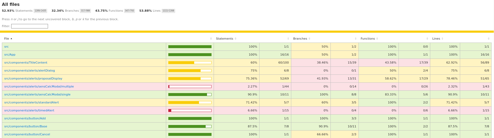

Code format and layout
======================

It is recommended that all react applications are based upon ska-react-webapp-skeleton, which provides all of the basic format and
layout, as well as all of the scripts as described here.    https://gitlab.com/ska-telescope/templates/ska-react-webapp-skeleton

`ESLint`_ and `Prettier`_ are included as code analysis and formatting tools. 
These do not need installing as they’re included in node_modules by running 

``yarn init.``

These tools can be run in the command line or integrated into your IDE.

.. _`ESLint`: https://ESLint.org/

.. tip:: 

   Ensure that prettier and lint in that sequence are both run before any commits as these are also run as part of the pipeline

`Prettier`_
-----------

.. _`Prettier`: https://prettier.io/

This will check the JS Code and reformat to a standard structure.  

To run this to see the current display issues in the application: 

``yarn prettier``

Run the following to allow the library to automatically update the layout:

``yarn prettier:fix``

`ESLint`_
----------

This will check the JS Code and ensure that the code meets required standards.  It should be noted that this should be
run after prettier as it has been noted that prettier has not always formatted as per the SKAO linting standards

To run this to see the current coding issues in the application: 

``yarn lint``

Run the following to allow the library to automatically update if possible:

``yarn lint:fix``

code-analysis
-------------

To run the analysis tools, execute

``yarn code-analysis``

This will display any errors in the command line. If there are any errors, YARN will exit with a non-zero code, 
the -s argument suppresses this and cleans up the output.  This command is also used as part of the CI/CD process,
so it is recommended to run this so that any issues are identified and can be resolved prior to the build.

code-coverage
-------------

It is possible to access the code coverage of an application and see it within a browser, allowing for the identification
and correction of the code.

1. ``yarn test:component:headless`` - Runs that testing and produces the results
2. ``yarn test:coverage:report`` - Convert the output into a file that can be accessed in a browser
3. ``file:///{{repository location}}/build/reports/index.html`` - Drop a URL into a browser which will show coverage breakdown

Clicking on one of the links will drill down until a file is reached, at which point the code is displayed and the lines requiring coverage are marked

.. image:: images/codeCoverageDetail.png
   :alt: Code coverage detail

In this example, the code marked in red has no code coverage at all, whereas the code marked in yellow indicates that the
code has partial coverage. Code with no highlighting has full coverage.