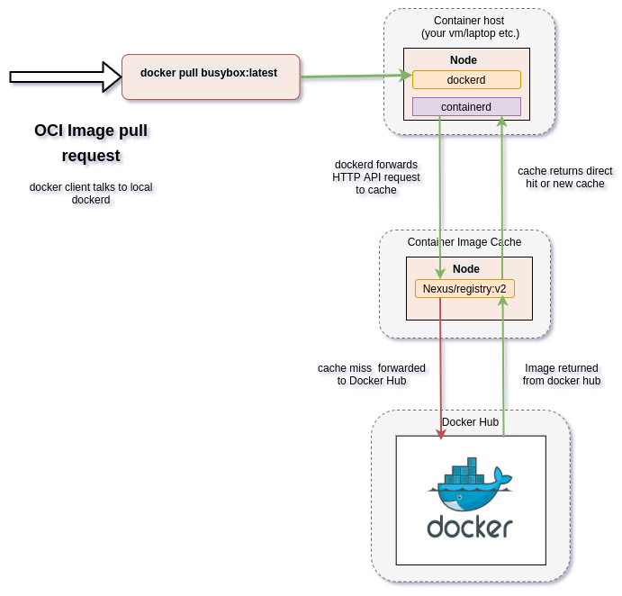

.. raw:: html

    

.. .. admonition:: The thing

..    You can make up your own admonition too.

********************************
Working with Docker: Proxy Cache
********************************

Docker (the Corporation) has implemented download rate limiting or throttling effective from the 1st of November, 2020, the details of which can be found in the company `FAQ <https://www.docker.com/pricing/resource-consumption-updates>`_ and related technical `documentation <https://docs.docker.com/docker-hub/download-rate-limit/>`_.  This can create problems for heavy users of OCI Container Images hosted on the the Docker Hub public registry service, such as CI/CD pipeline build processes, and Institutional environments that aggregate their network traffic through single points of presence.

.. contents:: Table of Contents

The Symptoms
============

The result of these changes is a generic problem for any individual or organisation that were previously relying on an essentially free public OCI Container Image library service.  The problem manifests itself when the introduced threshold is reached for pulling Images, the pull requests will fail and return an HTTP error code 429, where you may see logging messages like the following:

.. code:: bash

    HTTP/1.1 429 Too Many Requests

The basic rules of the new thresholds (as at 15 Dec 2020 ) are that:

* anonymous pull requests - 100 over 6 hours
* logged in pull requests - 200 over 6 hours
* subscription thresholds - vary as selected

Mitigation
==========

In response to this, all affected parties have a few options:

* migrate all OCI Images required to another service provider such as `gcr.io <https://cloud.google.com/container-registry>`_ (Google), `quay.io <https://quay.io/>`_ (RedHat), and `GitLab <https://docs.gitlab.com/ee/user/packages/container_registry/>`_
* migrate to an internally hosted service such as `Nexus <https://help.sonatype.com/repomanager3>`_, `Harbor <https://goharbor.io/>`_, or the `Docker registry <https://docs.docker.com/registry/>`_
* implement a caching proxy such as `Nexus <https://help.sonatype.com/repomanager3>`_, `Harbor <https://goharbor.io/>`_, or the `Docker registry <https://docs.docker.com/registry/>`_
* purchase a subscription from Docker

Solution for CI/CD and Integration Testing Environments
=======================================================

For the supporting services hosted on the Engage SKA OpenStack cluster including the CI/CD GitLab pipelines, shared Kubernetes cluster, and supporting shared services (storage, monitoring, logging, database services), the approach has been to roll out a caching proxy integrated with any deployment of DockerD - which is effectively every VM Host in the cluster supporting these shared services.

.. _figure-1-docker-caching-proxy:

   Pulling an OCI Image - interaction with cache.

When an OCI Image (UN-qualified URL pointing to Docker Hub) is requested eg: via the client ``docker pull``, the request is first communicated with the local ``dockerd`` daemon (the container runtime environment).  The ``dockerd`` consults it's local library and the pull request policy (eg: ``IfNotPresent``, ``Always``, ``Never``), and then makes the request based on the daemon configuration.  When the daemon is configured to use a cache, the request is forwarded to the cache first.  If the image exists in the cache, it is returned, else the request is forwarded to Docker Hub.  Docker Hub returns the result to the cache, the cache returns the result to ``dockerd``, and ``dockerd`` notifies the original requesting client.

HowTo: Proxy Cache
==================

To deploy a Caching proxy, there are effectively two steps:

* Deploy the caching service exposed on an addressable port (protecting this service is an exercise left for the reader)
* Configuring the client host dockerd to use the Proxy Cache

The following offers two solutions based on using the Docker supplied ``registry:v2`` container, and the Sonatype `Nexus Repository Manager 3 <https://help.sonatype.com/repomanager3>`_.

Caching proxy solutions
=======================

Two caching solutions are demonstrated - the first is a minimal caching proxy based on the Docker registry:v2 daemon.  The second is using the Nexus Repository Manager 3 Docker registry as a caching proxy.

registry:v2
-----------

Docker provides a local private registry implementation called the ``registry``.  This can be converted into a caching pull-through registry by passing in the necessary configuration described below.  The key things are to set the ``REGISTRY_PROXY_USERNAME`` variable to your Docker Hub account name, and the ``REGISTRY_PROXY_PASSWORD`` to a Docker Hub application security token for your account which can be configure at the address `<https://hub.docker.com/settings/security>`_.

.. code:: bash

    docker run \
    -d \
    -p 5000:5000 \
    --restart=always \
    --name=through-cache-secure \
    -e REGISTRY_PROXY_REMOTEURL="https://registry-1.docker.io" \
    -e REGISTRY_PROXY_USERNAME=<your docker username> \
    -e REGISTRY_PROXY_PASSWORD=<registry application token> \
    registry

This will expose the registry container on the host port ``5000``, so this mirror can be referenced with ``http://<ip or dns name for host>:5000``.  This solution is easy to setup and is something that could be used by individuals or small collections of developers. (reference `<https://circleci.com/docs/2.0/docker-hub-pull-through-mirror/>`_)

Nexus
-----

Running Nexus (`<https://help.sonatype.com/repomanager3>`_) is a valuable service as a Software Artefact Repository, but does have some overhead and disaster recovery considerations especially if it is used for more than a caching proxy (not only for OCI Images, but also for PyPi, NPM etc.).  However,  the initial setup for running a caching proxy is reasonably simple.  The following are a guiding set of scripts and pointers to documentation to help with this process, focusing on how to establish an anonymous Docker caching proxy.

Boot the Nexus server in a docker container and mount caching space storage (from the host path ``/data/nexus-data`` in this example) into the container.  The configuration for Nexus is updated to enable the Groovy scripting API, enable the default password, and disable the startup wizard (``${DATA}/etc/nexus.properties``).

.. code:: bash

    #!/bin/bash

    TAG=3.28.1
    DATA=/data/nexus-data

    docker stop --time=120 nexus || true
    docker rm -f nexus|| true

    sudo mkdir -p ${DATA}/etc

    # write out a Nexus configuration that will allow automated setup to run
    sudo cat <<EOF | sudo tee ${DATA}/etc/nexus.properties
    # Jetty section
    # application-port=8081
    # application-host=0.0.0.0
    # nexus-args=\${jetty.etc}/jetty.xml,\${jetty.etc}/jetty-http.xml,\${jetty.etc}/jetty-requestlog.xml
    # nexus-context-path=/\${NEXUS_CONTEXT}

    # Nexus section
    # nexus-edition=nexus-pro-edition
    # nexus-features=\
    #  nexus-pro-feature
    # nexus.clustered=false

    # activate scripting
    nexus.scripts.allowCreation=true

    # disable the wizard.
    nexus.onboarding.enabled=false

    # disable generating a random password for the admin user.
    # default is: admin123
    nexus.security.randompassword=false

    EOF
    # set permissions to that expected by the container
    sudo chown -R 200 ${DATA}

    # launch the Nexus service
    docker run -d -p 8081:8081 -p 8181:8181 --name nexus \
    -v ${DATA}:/nexus-data \
    --net=host \
    -e INSTALL4J_ADD_VM_PARAMS="-Xms2g -Xmx2g -XX:MaxDirectMemorySize=3g " \
    sonatype/nexus3:${TAG}

Once the Nexus server has completed starting up (use ``docker logs nexus -f`` to follow what has happened), you then need to run the following Groovy script (packaged inside a bash shell script) to complete the installation of setting up the Docker Proxy Repository.

.. code:: bash

    #!/bin/bash
    # Set the environment variables to your server eg: BASE_URL, and PASSWORD
    set -x
    BASE_URL=http://localhost:8081
    GROOVY_SCRIPT=/tmp/docker-script.json
    SCRIPT_NAME=dockerRepositories
    USER=admin
    DEFAULT_PASSWORD=admin123 # do not change - required for boot up
    PASSWORD=admin # set this password to what you want it to be

    # write out the Groovy script for configuring the Nexus repository manager
    # note the \n's are required for JSON payloads
    cat <<EOF > ${GROOVY_SCRIPT}
    {
    "name": "${SCRIPT_NAME}",
    "content": "import groovy.json.JsonOutput\n
    import org.sonatype.nexus.security.realm.RealmManager\n
    import org.sonatype.nexus.blobstore.api.BlobStoreManager\n
    def user = security.securitySystem.getUser('admin')\n
    user.setEmailAddress('admin@example.com')\n
    security.securitySystem.updateUser(user)\n
    security.securitySystem.changePassword('admin','${PASSWORD}')\n
    log.info('default password for admin changed')\n
    \n
    //enable Docker Bearer Token\n
    realmManager = container.lookup(RealmManager.class.name)\n
    realmManager.enableRealm('DockerToken')\n
    \n
    //Enable anonymois access which we above disabled\n
    security.anonymousAccess = true\n
    security.setAnonymousAccess(true)\n
    // create hosted repo and expose via https to allow deployments\n
    repository.createDockerHosted('docker-internal', null, null)\n
    \n
    // create proxy repo of Docker Hub and enable v1 to get search to work\n
    // no ports since access is only indirectly via group\n
    repository.createDockerProxy('docker-hub',                   // name\n
                                'https://registry-1.docker.io', // remoteUrl\n
                                'HUB',                          // indexType\n
                                null,                           // indexUrl\n
                                null,                           // httpPort\n
                                null,                           // httpsPort\n
                                BlobStoreManager.DEFAULT_BLOBSTORE_NAME, // blobStoreName\n
                                true, // strictContentTypeValidation\n
                                true)\n
    \n
    // create group and allow access via https\n
    def groupMembers = ['docker-hub', 'docker-internal']\n
    repository.createDockerGroup('docker-all', 8181, null, groupMembers, true, BlobStoreManager.DEFAULT_BLOBSTORE_NAME, false)\n
    log.info('Script dockerRepositories completed successfully')\n
    ",
    "type": "groovy"
    }
    EOF

    # upload the Groovy script
    curl -v -u ${USER}:${DEFAULT_PASSWORD} -X POST --header 'Content-Type: application/json' \
    "${BASE_URL}/service/rest/v1/script" \
    -d @${GROOVY_SCRIPT}

    # run the Groovy script
    curl -v -X POST -u ${USER}:${DEFAULT_PASSWORD} --header "Content-Type: text/plain" "${BASE_URL}/service/rest/v1/script/${SCRIPT_NAME}/run"

This shell (bash) script is an automation of the process described in this `article <https://blog.sonatype.com/using-nexus-3-as-your-repository-part-3-docker-images>`_ and this `help documentation <https://help.sonatype.com/repomanager3/formats/docker-registry/proxy-repository-for-docker>`_.

Once the script has completed, you can then login to the Repository Manager at  `<http://localhost:8081>`_.  Navigate to the Repository configuration screen and check that you have something like the following repositories setup.

.. _figure-2-nexus-repositories:

.. figure:: ../images/nexus-repositories.png
   :scale: 40%
   :alt: The Docker group repository
   :align: center
   :figclass: figborder

   The Docker group repository.

The Docker group repository ``docker-all`` is now available on the mirror URL ``http://localhost:8181``.

Configuration of dockerd
------------------------

The local ``dockerd`` agent must be configured to point the cache.  This is done either in the command line arguments using the switch ``--registry-mirror``, or using the daemon configuration file ``/etc/docker/daemon.json``.  A list of mirrors can be supplied, and they are tried in order, with the final attempt being to bypass using a cache/mirror at all.

.. code:: bash

    {
    ...
    "registry-mirrors" : [
        "http://192.168.178.22:8181"
    ],
    ...
    }

Test using an image pull such as ``docker pull busybox``.  Check your local system logs to see whether there are any messages about skipping to the next end point.  This can be found on Linux using ``journalctl -f`` and the messages might look like the following:

.. code:: bash

    Dec 15 08:58:57 wattle dockerd[920572]: time="2020-12-14T19:58:57.826247120Z" level=info msg="Attempting next endpoint for pull after error: Get http://192.168.93.12:8181/v2/library/ubuntu/manifests/20.04: unauthorized: authentication required"
