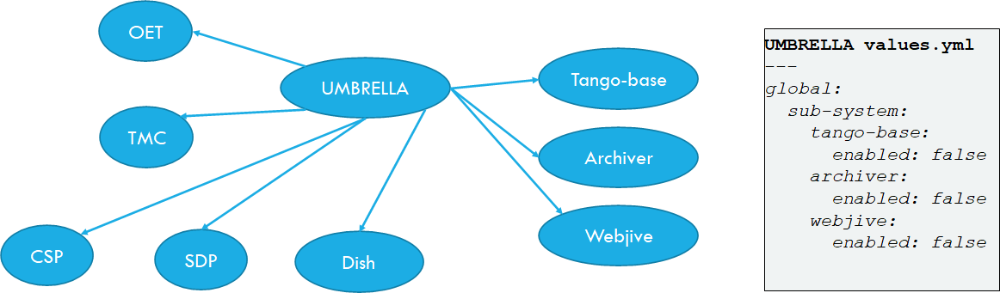

.. raw:: html

    

.. .. admonition:: The thing

..    You can make up your own admonition too.

**********************************
Container Orchestration Guidelines
**********************************

This section describes a set of standards, conventions and guidelines for deploying application suites on Container Orchestration technologies.

.. contents:: Table of Contents

Overview of Standards
=====================

These standards, best practices and guidelines are based on existing industry
standards and tooling.  The main references are:

* `Cloud Native Computing Foundation <https://www.cncf.io/>`_.
* `Docker v2 Registry API Specification <https://docs.docker.com/registry/spec/api/>`_.
* `Container Network Interface <https://github.com/containernetworking/cni>`_.
* `Container Storage Interface <https://github.com/container-storage-interface/spec>`_.
* `Open Container Initiative image specification <https://github.com/opencontainers/image-spec/releases/tag/v1.0.0>`_.
* `Open Container Initiative run-time specification <https://github.com/opencontainers/runtime-spec/releases/tag/v1.0.0>`_.

The standards are broken down into the following areas:

* Structuring application suites for orchestration - general guidelines for breaking up application suites for running in a container orchestration
* Defining and building cloud native application suites - resource definitions, configuration, platform resource integration
* Kubernetes primitives - a more detailed look at key components: Pods, Services, Ingress
* Scheduling and running cloud native application suites - scheduling, execution, monitoring, logging, diagnostics, security considerations

Throughout this documentation, `Kubernetes <https://kubernetes.io/>`_ in conjunction with `Helm <https://helm.sh/>`_ is used as the reference implementation with the canonical versions being Kubernetes v1.16.2 and Helm v3.1.2, however the aim is to target compliance with the OCI specifications and CNF guidelines so it is possible to substitute in alternative Container Orchestration solutions, and tooling.

A set of example Helm Charts are provided in the repository `container-orchestration-chart-examples <https://gitlab.com/ska-telescope/container-orchestration-chart-examples>`_.  These can be used to get an overall idea of how the components of a chart function together, and how the life cycle and management of a chart can be managed with ``make``.

Structuring application suites for Orchestration
================================================

In order to understand how to structure applications suites for orchestration, we first need to understand what the goals of Cloud Native software engineering are.

what is Cloud Native
--------------------

It is the embodiment of modern software delivery practices supported by tools, frameworks, processes and platform interfaces.

These capabilities are the next evolution of Cloud Computing, raising the level of abstraction for all actors against the architecture from the hardware unit to the application component.

What does this mean?  Developers and system operators (DevOps) interface with the platform architecture using abstract resource concepts, and should have next to no concern regarding the plumbing or wiring of the platform, while still being able to deploy and scale applications according to cost and usage.

Cloud Native exploits the advantages of the Cloud Computing delivery model:

* PaaS (Platform as a Service) layered on top of IaaS (Infrastructure as a Service)
* CI/CD (Continuous Integration/Delivery) – fully automated build, test, deploy
* Modern DevOps – auto-scaling, monitoring feedback loop to tune resource requirements
* Software abstraction from platform compute, network, storage
* Portability across Cloud Services providers

Why Cloud Native SDLC (Software Development Life Cycle)?

.. _figure-1-kubernetes-sdlc:

.. figure:: ../images/Kubernetes-SDLC.dio.png
   :scale: 60%
   :alt: Cloud Native SDLC
   :align: center
   :figclass: figborder

   How Kubernetes fits into the Cloud Native SDLC

Kubernetes provides cohesion for distributed projects:

* Codify standards through implementing testing gates
* Ensures code quality, consistency and predictability of deployment success – CI/CD
* Automation – build AND rebuild for zero day exploits at little cost
* Portability of SDI (Software Defined Infrastructure) as well as code
* Provides a codified reference implementation of best practices, and exemplars
* Enables broad engagement – an open and collaborate system - a “Social Coding Platform”
* Consistent set of standards for integration with SRC (SKA Regional Centres), and other projects – the future platform of integrated science projects through shared resources enabled by common standards

How does orchestration work
---------------------------

At the core of Cloud Native is the container orchestration platform.  For the purposes of these guidelines, this consists of Kubernetes as the orchestration layer, over Docker as the container engine.

.. _figure-2-kubernetes-architecture:

.. figure:: ../images/Kubernetes-Architecture.dio.png
   :scale: 60%
   :alt: Kubernetes Architecture
   :align: center
   :figclass: figborder

   The architecture of Kubernetes at the centre of the Cloud Native platform

Kubernetes provides an abstraction layer from hardware infrastructure resources enabling compute, network, storage, and other dependent services (other applications) to be treated as abstract concepts.  A computing cluster is not a collection of machines but instead is an opaque pool of resources, that are advertised for availability through a consistent REST based API. These resources can be customised to provide access to and accounting of specialised devices such as GPUs.

Through the Kubernetes API, the necessary resources that make up an application suite (compute, network, storage) are addressed as objects in an idempotent way that declares the desired state eg: this number of Pods running these containers, backed by this storage, on that network.  The scheduler will constantly move the cluster towards this desired state including in the event of application or node/hardware failure.  This builds in robustness and auto-healing. See :doc:`kubernetes-introduction` for a general introduction.

Both platform and service resources can be classified by performance characteristics and reservation criteria using labelling, which in turn are used by scheduling algorithms to determine optimum placement of workloads across the cluster.  All applications are deployed as sets of one or more containers in a minimum configuration called a `Pod <https://kubernetes.io/docs/concepts/workloads/pods/pod/>`_.  Pods are the minimum scalable unit that are distributed and replicated across the cluster according to the scheduling algorithm.  A Pod is essentially a single Kernel namespace holding one or more containers.  It only makes sense to put together containers that are essentially tightly coupled and logically indivisible by design.  These Pods can be scheduled in a number of patterns using `Controllers (full list) <https://kubernetes.io/docs/concepts/workloads/controllers/>`_ including bare Pod (a single Pod instance), `Deployment <https://kubernetes.io/docs/concepts/workloads/controllers/deployment/>`_ (a replicated Pod set), `StatefulSet <https://kubernetes.io/docs/concepts/workloads/controllers/statefulset/>`_ (a Deployment with certain guarantees about naming and ordering of replicated units), `DaemonSets <https://kubernetes.io/docs/concepts/workloads/controllers/daemonset/>`_ (one Pod per scheduled compute node), and `Job/CronJob <https://kubernetes.io/docs/concepts/workloads/controllers/jobs-run-to-completion/>`_ (run to completion applications).

A detailed discussion of these features can be found in the main Kubernetes documentation under `Concepts <https://kubernetes.io/docs/concepts/>`_.

Structuring Application Suites
------------------------------

Architecting software to run in an orchestration environment builds on the guidelines given in the :ref:`Container Standards 'Structuring Containerised Applications' <container-structure>` section.  The key concepts of treating run time containers as immutable and atomic applications where any application state is explicitly dealt with through connections to storage mechanisms, is key.

The application should be broken into components that represent:

* an application component has an independent development lifecycle
* individual process that performs a discrete task such as a micro service, specific database/web service, device, computational task etc.
* component that exposes a specific service to another application eg. a micro service or database
* a reusable component that is applicable to multiple application deployments eg. a co-routine or proximity depdendent service (logger, metrics collector, network helper, private database etc)
* an independently scalable unit that can be replicated to match demand
* the minimum unit required to match a resource profile at scheduling time such as storage, memory, cpu, specialised device

Above all, design software to scale horizontally through a UNIX process model so that individual components that have independent scaling characteristics can be replicated independently.

The application interface should be through the standard :ref:`container run time <header-2-running-containerised-applications>` interface contract:

* inputs come via a configurable Port
* outputs go to a configurable network service
* logging goes to stdout/stderr and syslog and uses JSON to enrich metadata (see :ref:`Container Standards 'Logging' <container-logging>`)
* metrics are advertised via a standard such as `Prometheus Exporters <https://prometheus.io/docs/instrumenting/writing_exporters/>`_, or emit metrics in a JSON format over TCP consumable by `ETL <https://en.wikipedia.org/wiki/Extract,_transform,_load>`_ services such as `LogStash <https://www.elastic.co/products/logstash>`_
* configuration is passed in using environment variables, and simple configuration files (eg: ini, or key/value pairs).
* POSIX compliant storage IO is facilitated by bind mounted volumes.
* connections to DBMS, queuing technologies and object storage are managed through configuration.
* applications should have builtin recoverability so that prior state and context is automatically discovered on restart.  This enables the cluster to auto-heal by re-launching workloads on other resources when nodes fail (critical aspect of a micro-services architecture).

By structuring an application in this fashion, it can scale from the single instance desktop development environment up to a large parallel deployment in production without needing to have explicit understanding builtin for the plumbing and wiring of each specific environment because this is handled through external configuration at the Infrastructure management layer.

Example: Tango Controls
-----------------------

To help illustrate the Cloud Native application architecture concepts, a walk through of a Tango application suite is used.

A Tango Controller System environment is typically made up of the following:

* Database containing the system state eg: MySQL.
* DatabaseDS Tango device server.
* One or more Tango devices.
* Optional components - Tango REST interface, Tango logviewer, SysAdmin and debugging tools such as Astor and Jive.

These components map to the following Kubernetes resources:

* MySQL Database == StatefulSet.
* DatabaseDS == Deployment or StatefulSet.
* Tango REST interface == Deployment.
* Tango Device == bare Pod, or single replica Deployment.

This example does not take into consideration an HA deployment of MySQL, treating MySQL as a single instance StatefulSet.  Using a StatefulSet in this case gives the following guarantees above a Deployment:

* Stable unique network identifiers.
* Stable persistent storage.
* Ordered graceful deployment and scaling.
* Ordered automated rolling updates.

These characteristics are useful for stable service types such as databases and message queues.

DatabaseDS is a stateless and horizontally scalable service in it's own right (state comes from MySQL).  This makes it a fit for the Deployment (which in turn uses a ReplicaSet) or the StatefulSet.  Deployments are a good fit for stateless components that require high availability through mechanisms such as rolling upgrades.

The Tango Devices are single instance applications that act as a proxy between the 'real' hardware being controlled and the DatabaseDS service that provides each Tango Device with a gateway to the Tango cluster state database (MySQL).  Considering that in most cases, an upgrade to a Device Pod is likely to be a delete and replace, we can use the simplest case of a bare Pod which will enable us to name each Pod after it's intended device without the random suffix generated for Deployments.

Example: MPI jobs
-----------------

A typical MPI application consists of a head node, and worker nodes with the (run to completion) job being launched from the head node, which in turn controls the work distribution over the workers.

This can be broken in to:

* a generic component type that covers head node and worker nodes.
* a launcher that triggers the application on the designated head node.

These components map to the following Kubernetes resources:

* Worker node == DaemonSet or StatefulSet.
* Launcher and Head node == Job.

MPI jobs typically only require a single instance per physical compute node, and this is exactly the use case of DaemonSets where Kubernetes ensures exactly one instance of a Pod is running on each designated node.  Using Jobs enables the launcher and the head node to be combined.  Both Job and DaemonSet Pods will most likely need the same library and tools from MPI, so can be combined into a single container image.

Linking Components Together
---------------------------

Components of an application suite or even between suites should use `DNS <https://kubernetes.io/docs/concepts/services-networking/dns-pod-service/>`_ for service discovery.  This is achieved by using the `Service <https://kubernetes.io/docs/concepts/services-networking/service/>`_ resource.  Services should always be declared before Pods so that the automatic generation of associated Environment Variables happens in time for the subsequent Pods to discover them.  Service names are permanent and predictable, and are tied to the `Namespace <https://kubernetes.io/docs/concepts/overview/working-with-objects/namespaces/>`_ that a application suite is deployed in, for example in the namespace ``test``, the DatabaseDS Tango component can find the MySQL database ``tangodb`` using the name ``tangodb`` or ``tangodb.test``  which is distinctly different to the instance running in the ``qa`` namespace also named ``tangodb`` but addressable by ``tangodb.qa``.  This greatly simplifies configuration management for software deployment.

Defining and building cloud native application suites
=====================================================

All Kubernetes resource objects are described through the `REST based API <https://kubernetes.io/docs/reference/>`_.  The representations of the API documents are in either JSON or YAML, however the preference is for YAML as the description language as this tends to be more human readable.  The API representations are declarative, specifying the end desired state.  It is up to the Kubernetes scheduler to make this a reality.

It is important to use generic syntax and Kubernetes resource types.  Specialised resource types reduce portability of resource descriptors and templates, and increase dependency on 3rd party integrations.  This could lead to upgrade paralysis because the SDLC is out of our control.  An example of this might be using a non-standard 3rd party Database Operator for MySQL instead of the official `Oracle <https://github.com/oracle/mysql-operator>`_ one.

Metadata
--------

Each resource is described with:

* apiVersion - API version that this document should invoke
* kind - resource type (object) that is to be handled
* metadata - descriptive information including name, labels, annotations, namespace, ownership, references
* spec(ification) - the body of the specification for this resource type denoted by `kind`

The following is an example of the start of a StatefulSet for the Tango DatabaseDS:

.. container:: toggle

    .. container:: header

        Resource description

    .. code:: yaml

         ---
         apiVersion: apps/v1
         kind: StatefulSet
         metadata:
           name: databaseds-integration-tmc-webui-test
           labels:
             app.kubernetes.io/name: databaseds-integration-tmc-webui-test
             helm.sh/chart: integration-tmc-webui-0.1.0
             app.kubernetes.io/instance: test
             app.kubernetes.io/managed-by: helm
         spec:
           ...

Namespaces
~~~~~~~~~~

Even though it is possible to specify the namespace directly in the Metadata, it **SHOULD NOT** be, as this reduces the flexibility of any resource definition and templating solution employed such as Helm.  The namespace can be specified at run time eg: ``kubectl --namespace test apply -f resource-file.yaml``.

Name and Labels
~~~~~~~~~~~~~~~

Naming and labelling of all resources associated with a deployment should be consistent.  This ensures that deployments that land in the same namespace can be identified along with all inter-dependencies.  This is particulaly useful when using the ``kubectl`` command line tool as label based filtering can be employed to sieve out all related objects.

Labels are entirely flexible and free form, but as a minimum specify:

* the ``name`` and ``app.kubernetes.io/name`` with the same identifier with sufficient precision that the same application component deplyed in the same namespace can be distinguished eg: a concatenation of <application>-<suite>-<release>.  ``name`` and ``app.kubernetes.io/name`` are duplicated because label filter interaction between resources relies on labels eg: ``Service`` exposing ``Pods`` of a ``Deployment``.
* the labels of the deployment suite such as the ``helm.sh/chart`` for Helm, including the version.
* the ``app.kubernetes.io/instance`` (which is ``release``) of the deployment suite.
* ``app.kubernetes.io/managed-by`` what tooling is used to manage this deployment - most likely ``helm``.

Optional extras which are also useful for filtering are:

* ``app.kubernetes.io/version`` the component version.
* ``app.kubernetes.io/component`` the component type (most likely related to the primary container).
* ``app.kubernetes.io/part-of`` what kind of application suite this component belongs to.

The recommended core label set are described under `Kubernetes common labels <https://kubernetes.io/docs/concepts/overview/working-with-objects/common-labels/#labels>`_.

.. code:: yaml

    metadata:
      name: databaseds-integration-tmc-webui-test
      labels:
        app.kubernetes.io/name: databaseds-integration-tmc-webui-test
        helm.sh/chart: integration-tmc-webui-0.1.0
        app.kubernetes.io/instance: test
        app.kubernetes.io/version: "1.0.3"
        app.kubernetes.io/component: databaseds
        app.kubernetes.io/part-of: tango
        app.kubernetes.io/managed-by: helm

Using this labelling scheme enables filtering for all deployment related objects eg: ``kubectl get all -l helm.sh/chart=integration-tmc-webui-0.1.0,app.kubernetes.io/instance=test``.

.. container:: toggle

    .. container:: header

        kubectl label filtering

    .. code:: bash

        $ kubectl get all,configmaps,secrets,pv,pvc -l helm.sh/chart=integration-tmc-webui-0.1.0,app.kubernetes.io/instance=test
        NAME                                          READY   STATUS     RESTARTS   AGE
        pod/databaseds-integration-tmc-webui-test-0   1/1     Running    0          55s
        pod/rsyslog-integration-tmc-webui-test-0      1/1     Running    0          55s
        pod/tangodb-integration-tmc-webui-test-0      1/1     Running    0          55s
        pod/tangotest-integration-tmc-webui-test      1/1     Running    0          55s
        pod/webjive-integration-tmc-webui-test-0      0/6     Init:0/1   0          55s

        NAME                                            TYPE        CLUSTER-IP    EXTERNAL-IP   PORT(S)                                       AGE
        service/databaseds-integration-tmc-webui-test   ClusterIP   None          <none>        10000/TCP                                     55s
        service/rsyslog-integration-tmc-webui-test      ClusterIP   None          <none>        514/TCP,514/UDP                               55s
        service/tangodb-integration-tmc-webui-test      ClusterIP   None          <none>        3306/TCP                                      55s
        service/webjive-integration-tmc-webui-test      ClusterIP   10.97.135.8   <none>        80/TCP,5004/TCP,3012/TCP,8080/TCP,27017/TCP   55s

        NAME                                                     READY   AGE
        statefulset.apps/databaseds-integration-tmc-webui-test   1/1     55s
        statefulset.apps/rsyslog-integration-tmc-webui-test      1/1     55s
        statefulset.apps/tangodb-integration-tmc-webui-test      1/1     55s
        statefulset.apps/webjive-integration-tmc-webui-test      0/1     55s

        NAME                                                  CAPACITY   ACCESS MODES   RECLAIM POLICY   STATUS   CLAIM                                        STORAGECLASS   REASON   AGE
        persistentvolume/rsyslog-integration-tmc-webui-test   10Gi       RWO            Retain           Bound    default/rsyslog-integration-tmc-webui-test   standard                56s
        persistentvolume/tangodb-integration-tmc-webui-test   1Gi        RWO            Retain           Bound    default/tangodb-integration-tmc-webui-test   standard                55s
        persistentvolume/webjive-integration-tmc-webui-test   1Gi        RWO            Retain           Bound    default/webjive-integration-tmc-webui-test   standard                55s

        NAME                                                       STATUS   VOLUME                               CAPACITY   ACCESS MODES   STORAGECLASS   AGE
        persistentvolumeclaim/rsyslog-integration-tmc-webui-test   Bound    rsyslog-integration-tmc-webui-test   10Gi       RWO            standard       56s
        persistentvolumeclaim/tangodb-integration-tmc-webui-test   Bound    tangodb-integration-tmc-webui-test   1Gi        RWO            standard       55s
        persistentvolumeclaim/webjive-integration-tmc-webui-test   Bound    webjive-integration-tmc-webui-test   1Gi        RWO            standard       55s

.. _orchestration-guidelines-templating-application:

Templating the Application
--------------------------

While it is entirely possible to define all the necessary resources for an application suite to be deployed on Kubernetes in individual or a single YAML file, this approach is static and quickly reveals it's limitations in terms of creating reusable and composable application suites.  This is where `Helm Charts <https://helm.sh/>`_ have been adopted by the Kubernetes community as the leading templating solution for deployment.  Helm provides a mechanism for generically describing an application suite, separating out configuration, and rolling out deployment releases all done in a declarative 'configuration as code' style.  All Helm Charts should target a minimum of three environments:

* Minikube - the standalone developer environment.
* CI/CD - the Continuous Integration testing environment which is typically the same benchmark as Minikube.
* Production Cluster - the target production Kubernetes environment.

Minikube should be the default target environment for a Chart, as this will have the largest audience and should be optimised to work without modification of any configuration if possible.

When designing a Chart it is important to have clear separation of concerns:

* the application - essentially the containers to run.
* configuration - any variables that influence the application run time.
* resources - any storage, networking, configuration files, secrets, ACLs.

The general structure of a Chart should follow:

.. code:: bash

    charts/myapp/
            Chart.yaml          # A YAML file containing information about the chart and listing
                                # dependencies for the chart (refer to Helm 2 vs Helm 3 differences).
            LICENSE             # OPTIONAL: A plain text file containing the license for the chart
            README.md           # OPTIONAL: A human-readable README file
            values.yaml         # The default configuration values for this chart
            charts/             # A directory containing any charts upon which this chart depends.
            templates/          # A directory of templates that, when combined with values,
                                # will generate valid Kubernetes manifest files.
            templates/NOTES.txt # OPTIONAL: A plain text file containing short usage notes
            templates/tests     # A directory of test templates for running with 'helm test'

All template files in the ``templates/`` directory should be named in a readily identifiable way after the component that it contains, and if further clarification is required then it should be suffixed with the ``Kind`` of resource eg: ``tangodb.yaml`` contains the ``StatefulSet`` for the Tango database, and ``tangodb-pv.yaml`` contains the ``PersistentVolume`` declaration for the Tango database.  ``ConfigMaps`` should be clustered in ``configmaps.yaml`` and ``Secrets`` in ``secrets.yaml``.  The aim is to make it easy for others to understand the layout of application suite being deployed.

Helm sub-chart architecture
~~~~~~~~~~~~~~~~~~~~~~~~~~~

Introduction to subcharts
*************************
A chart can have one or more dependencies charts, called sub-charts. According to the `helm documentation <https://helm.sh/docs/chart_template_guide/subcharts_and_globals/>`_:

* a chart is stand-alone (cannot depend on a parent chart),
* a sub-chart cannot access the values of its parent,
* a parent sub-chart can override values for its sub-charts and
* all charts (parent and sub-chart) can access the global values.

Let's consider two charts, A and B where A depends on B. The file Chart.yaml for the chart A will specify the dependency and in the values file it is possible for chart A to override any value of chart B. The following figure shows how to do it:

.. _figure-subcharts-1:

.. figure:: ../images/A-parent-B.png
   :scale: 60%
   :alt: A parent of B
   :align: center
   :figclass: figborder

   Chart A parent of chart B

It is also important to consider the `operational aspects of using dependencies <https://helm.sh/docs/topics/charts/#helm>`_ which state that when Helm installs/upgrades a chart, the Kubernetes objects from the chart and all its dependencies are

* aggregated into a single set; then
* sorted by type followed by name; and then
* created/updated in that order.

This means that if chart A defines the following k8s resources:

* namespace "A-Namespace"
* statefulset "A-StatefulSet"
* service "A-Service"
* and chart B defines the following k8s resources:

* namespace “B-Namespace"
* statefulset “B-ReplicaSet"
* service “B-Service"

Then the result of the helm install command for chart A will be:

* A-Namespace
* B-Namespace
* A-Service
* B-Service
* B-ReplicaSet
* A-StatefulSet.

Subcharts architecture
**********************
Considering the `Module Views <https://confluence.skatelescope.org/pages/viewpage.action?pageId=102138997>`_ for the evolutionary prototype (section "Primary representation: MVP Uses in Kubernetes Deployment"), a partial dependency diagram for the helm charts available within the gitlab.com/ska-telescope group can be represented by the following diagram:

.. _figure-subcharts-2:

.. figure:: ../images/simple-skampi.png
   :scale: 60%
   :alt: Simple skampi diagram
   :align: center
   :figclass: figborder

   Simple skampi diagram

All charts depend on the tango-base and, in general, all charts could need the archiver and the webjive interface. At the moment, this is modelled in skampi repository where there is one parent chart called skampi and all other charts are its subcharts. They are installed with Helm templating instead of normal installation
There are a number of disadvantages in this model specifically:

* Common testing: one place for all integration testing. No clear distinction between system and integration tests
* Not easy to find logs: many tests on the same namespace
* Same namespace for many deployments
* No versioning: charts are not versioned

Three solutions have been proposed and described in the `Supporting model <https://confluence.skatelescope.org/display/SWSI/Supporting+model>`_ page:

#. One parent chart (umbrella) that contains everything needed and Subcharts with no dependency
#. Charts with dependencies and Subcharts enabled by levels
#. Charts with dependencies and Subcharts enabled with conditions and tags

The chosen solution is an hybrid approach which enables a single level hierarchy for the shared charts and umbrella charts for charts composition (i.e. specific deployment or testing purpose). The rational is:

* Every chart can be deployed with its own tango eco-system
* Every chart can have tango-base, webjive and the archiver as dependencies

.. _figure-subcharts-3:

.. figure:: ../images/tmc-shared-charts.png
   :scale: 60%
   :alt: Chart TMC with shared charts
   :align: center
   :figclass: figborder

   Chart TMC with shared charts

Every dependency must have a common condition on it, so that it will be possible to disable the shared charts if they are included in the parent umbrella. For instance if there is the need (for testing purposes) to have the TMC and the OET charts together the result will be:

.. _figure-subcharts-4:

.. figure:: ../images/tmc-oet-umbrella.png
   :scale: 60%
   :alt: Umbrella chart with tmc and oet
   :align: center
   :figclass: figborder

   Umbrella chart with tmc and oet charts

The initial model will become:

.. _figure-subcharts-5:

   Umbrella chart for skampi: initial model refactored

Gitlab Helm/k8s testing pipeline
********************************

In order to enable the GitLab pipeline to deploy and test the specific component each ska-telescope repository must:

* contain at least one helm chart (i.e. starting point is skampi charts): `link to example <https://gitlab.com/ska-telescope/ska-tango-examples/-/tree/master/charts>`__
* have an environment (i.e. test): `link to example <https://gitlab.com/ska-telescope/ska-tango-examples/-/environments>`__
* adopt the Makefile for k8s testing: `link to example <https://gitlab.com/ska-telescope/sdi/ska-cicd-makefile/-/blob/master/k8s.mk>`__

Also, note that each project/repository in the ska-telescope group has a `Kubernetes cluster already enabled <https://gitlab.com/ska-telescope/ska-tango-examples/-/clusters>`_.

The test job of the GitLab pipeline needs to be:

.. code:: yaml

    test:
    stage: test
    tags:
      - docker-executor
    image: artefact.skao.int/ska-cicd-k8s-tools-build-deploy:0.6.1
    script:
      - kubectl version
      - make install-chart
      - make wait
      - make smoketest
      - make test
    after_script:
      - make uninstall-chart
      - make delete_namespace
    environment:
      name: test
      kubernetes:
        namespace: ci-$CI_PROJECT_NAME-$CI_COMMIT_SHORT_SHA
    artifacts:
      name: "$CI_PROJECT_NAME-$CI_JOB_ID"
      paths:
        - "charts/build"
      reports:
        junit: charts/build/report.xml

where:

* make install:  installs the chart in the namespace specified in the environment tag
* make wait: wait for all jobs to be completed and all pods to be running
* make smoketest: checks that no containers are waiting
* make test:

  1. Create a pod into the specified namespace
  2. Run pytests
  3. Return the tests results

* after_script: remove everything after tests

The artifacts are the output of the tests and it will have the report both in xml and json but also other information like the pytest output.

Tango-util library chart
************************

A library chart is a type of Helm chart that defines chart primitives or definitions which can be shared by Helm templates in other charts. In SKAMPI, many charts are a collections of device servers so it is possible to harmonize their definition with a library so to keep charts `DRY <https://it.wikipedia.org/wiki/Don%27t_repeat_yourself>`_.

The following diagram shows the data model for the harmonized values file:

.. _figure-subcharts-6:

.. figure:: ../images/values-data-model.png
   :scale: 100%
   :alt: Data model for the values file
   :align: center
   :figclass: figborder

   Data model for the values file

Elements:

+--------------------------+-----------------------------------------------------------------------------------------------+
| Element                  | Description                                                                                   |
+--------------------------+-----------------------------------------------------------------------------------------------+
| Chart                    | collection of files that describe a related set of Kubernetes resources                       |
+--------------------------+-----------------------------------------------------------------------------------------------+
| Values                   | built-in objects of helm which provides access to values passed into the chart for templating |
+--------------------------+-----------------------------------------------------------------------------------------------+
| DsConfig                 | dsconfig file configuration                                                                   |
+--------------------------+-----------------------------------------------------------------------------------------------+
| DeviceServer             | TANGO Device Server                                                                           |
+--------------------------+-----------------------------------------------------------------------------------------------+
| Device                   | TANGO device                                                                                  |
+--------------------------+-----------------------------------------------------------------------------------------------+
| Global                   | Global values accessible by all charts                                                        |
+--------------------------+-----------------------------------------------------------------------------------------------+
| Labels                   | to be added to all Kubernetes resources                                                       |
+--------------------------+-----------------------------------------------------------------------------------------------+
| Environment variables    | Name/Value pair available in shell                                                            |
+--------------------------+-----------------------------------------------------------------------------------------------+
| Image                    | Detail of the docker image to be used                                                         |
+--------------------------+-----------------------------------------------------------------------------------------------+
| ResourceRequestandLimits | struct for characterise the resource requests and limits for a device server                  |
+--------------------------+-----------------------------------------------------------------------------------------------+
| DB                       | struct for characterise a DB software application                                             |
+--------------------------+-----------------------------------------------------------------------------------------------+

Rationale:

* Almost all helm charts in the Skampi repository are device server configurations so it appears natural to start the modelling from that concept
* The depends_on relationship has been added so that it is possible to extract the dependency map of the MVP prototype
* Every chart of the ska-telescope can have the shared charts in the dependency list
* The annotations block has been added to enable GitLab’s Deploy Boards
* The DeviceServer struct specifies the shell args so that it is possible to start the related container instance of the linked image

Advantages
**********

With this architecture, a number of advantages can be obtained:

* By using a separate deployment (i.e. Namespace) for each test, searching for all the logs of a particular test will be easy: example
* Requires teams to create versions of docker images and charts
* Avoids the use of docker-compose in favour of Kubernetes testing
* Harmonized values yml files (for «common» definitions i.e. TANGO device servers)
* Unit and integration testing within the repositories of teams
* Skampi testing becomes system testing

.. _helm-best-practices:

Helm Best Practices
~~~~~~~~~~~~~~~~~~~

The Helm community have a well defined set of `best practices <https://helm.sh/docs/chart_best_practices/>`_.  The following highlights key aspects of these practices that will help with achieving consistency and reliability.

* charts should be placed in a ``charts/`` directory within the parent project.
* chart names should be lowercase and hyphenated and must match the directory name eg. ``charts/my-app``.
* ``name``, ``version``, ``description``, ``home``, ``maintainers`` and ``sources`` must be included.
* ``version`` must follow the `Semantic Versioning <https://semver.org>`_ standards.
* the chart must pass the ``helm lint charts/<chart-name>`` test.

.. warning:: **Helm 2 vs Helm 3**

  It should be noted that we have now migrated to using Helm 3. Feel free to upgrade Helm in your development environments using our Ansible Playbook ``upgrade_helm.yml`` found in the `SKA Ansible Playbooks repository </projects/ansible-playbooks/en/latest/playbooks/upgrade_helm.html>`_.

  There are a few changes that may impact specific cases, to read up on them please read up at `This blog post <https://dev.to/ridaehamdani/some-changes-between-helm-v2-and-helm-v3-that-you-should-know-32ga>`_, as well as on Helm's own `FAQ page <https://helm.sh/docs/faq/>`_.

Example ``Chart.yaml`` file:

.. code:: yaml

    name: my-app
    version: 1.0.0
    description: Very important app
    keywords:
    - magic
    - mpi
    home: https://www.skatelescope.org/
    icon: http://www.skatelescope.org/wp-content/uploads/2016/07/09545_NEW_LOGO_2014.png
    sources:
    - https://gitlab.com/ska-telescope/my-app
    maintainers:
    - name: myaccount
      email: myacount@skatelescope.org

Metadata with Helm
~~~~~~~~~~~~~~~~~~

All resources should have the following boilerplate metadata to ensure that all resources can be uniquely identified to the chart, application and release:

.. code:: yaml

    ...
    metadata:
    name: <component>-{{ template "my-app.name" . }}-{{ .Release.Name }}
    labels:
        app.kubernetes.io/name: <component>-{{ template "my-app.name" . }}-{{ .Release.Name }}
        helm.sh/chart: "{{ .Chart.Name }}-{{ .Chart.Version }}"
        app.kubernetes.io/instance: "{{ .Release.Name }}"
        app.kubernetes.io/managed-by: "{{ .Release.Service }}"
    ...

Defining resources
~~~~~~~~~~~~~~~~~~

The `Helm templating language <https://helm.sh/docs/chart_template_guide/>`_ is based on `Go template <https://godoc.org/text/template>`_.

All resources go in the ``templates/`` directory with the general rule is one Kubernetes resource per template file.  Files that render resources are suffixed ``.yaml`` whilst files that contain expressions and macros only go in files suffixed ``.tpl``.

.. container:: toggle

    .. container:: header

        Sample resource template for a Service generated by 'helm create mychart'

    .. code:: yaml

        apiVersion: v1
        kind: Service
        metadata:
        name: {{ include "mychart.fullname" . }}
        labels:
          app.kubernetes.io/name: {{ include "mychart.name" . }}
          helm.sh/chart: {{ include "mychart.chart" . }}
          app.kubernetes.io/instance: {{ .Release.Name }}
          app.kubernetes.io/managed-by: {{ .Release.Service }}
        spec:
          type: {{ .Values.service.type }}
          ports:
          - port: {{ .Values.service.port }}
            targetPort: http
            protocol: TCP
            name: http
          selector:
            app.kubernetes.io/name: {{ include "mychart.name" . }}
            app.kubernetes.io/instance: {{ .Release.Name }}

.. container:: toggle

    .. container:: header

        Expression or macro template generated by 'helm create mychart'

    .. code:: javascript

        {{/* vim: set filetype=mustache: */}}
        {{/*
        Expand the name of the chart.
        */}}
        {{- define "mychart.name" -}}
        {{- default .Chart.Name .Values.nameOverride | trunc 63 | trimSuffix "-" -}}
        {{- end -}}

        {{/*
        Create a default fully qualified app name.
        We truncate at 63 chars because some Kubernetes name fields are limited to this (by the DNS naming spec).
        If release name contains chart name it will be used as a full name.
        */}}
        {{- define "mychart.fullname" -}}
        {{- if .Values.fullnameOverride -}}
        {{- .Values.fullnameOverride | trunc 63 | trimSuffix "-" -}}
        {{- else -}}
        {{- $name := default .Chart.Name .Values.nameOverride -}}
        {{- if contains $name .Release.Name -}}
        {{- .Release.Name | trunc 63 | trimSuffix "-" -}}
        {{- else -}}
        {{- printf "%s-%s" .Release.Name $name | trunc 63 | trimSuffix "-" -}}
        {{- end -}}
        {{- end -}}
        {{- end -}}

        {{/*
        Create chart name and version as used by the chart label.
        */}}
        {{- define "mychart.chart" -}}
        {{- printf "%s-%s" .Chart.Name .Chart.Version | replace "+" "_" | trunc 63 | trimSuffix "-" -}}
        {{- end -}}

|

Tightly coupled resources may go in the same template file where they are logically linked or there is a form of dependency.

An example of logically linked resources are PersistentVolume and PersistentVolumeClaim definitions.  Keeping these together makes debugging and maintenance easier.

.. _persistentvolume-and-persistentvolumeclaim-definition:

.. container:: toggle

    .. container:: header

        PersistentVolume and PersistentVolumeClaim definitions

    .. code:: yaml

        ---
        kind: PersistentVolume
        apiVersion: v1
        metadata:
            name: tangodb-{{ template "tango-chart-example.name" . }}-{{ .Release.Name }}
            namespace: {{ .Release.Namespace }}
        labels:
            app.kubernetes.io/name: tangodb-{{ template "tango-chart-example.name" . }}
            app.kubernetes.io/instance: "{{ .Release.Name }}"
            app.kubernetes.io/managed-by: "{{ .Release.Service }}"
            helm.sh/chart: "{{ template "tango-chart-example.chart" . }}"
        spec:
            storageClassName: standard
            capacity:
                storage: 1Gi
            accessModes:
                - ReadWriteOnce
            hostPath:
                path: /data/tangodb-{{ template "tango-chart-example.name" . }}/

        ---
        apiVersion: v1
        kind: PersistentVolumeClaim
        metadata:
            name: tangodb-{{ template "tango-chart-example.name" . }}-{{ .Release.Name }}
            namespace: {{ .Release.Namespace }}
        labels:
            app.kubernetes.io/name: tangodb-{{ template "tango-chart-example.name" . }}
            app.kubernetes.io/instance: "{{ .Release.Name }}"
            app.kubernetes.io/managed-by: "{{ .Release.Service }}"
            helm.sh/chart: "{{ template "tango-chart-example.chart" . }}"
        spec:
            storageClassName: standard
            accessModes:
                - ReadWriteOnce
            resources:
                requests:
                    storage: 1Gi
            volumeName: tangodb-{{ template "tango-chart-example.name" . }}-{{ .Release.Name }}

An example of dependency is the declaration of a Service before the associated Pod/Deployment/StatefulSet/DaemonSet.  The Pod will get the `environment variables <https://kubernetes.io/docs/concepts/services-networking/service/#environment-variables>`_ set from the Service as this will be evaluated by the Kubernetes API first as guaranteed by being in the same template file.

.. container:: toggle

    .. container:: header

        Service before the associated Pod/Deployment

    .. code:: yaml

        ---
        apiVersion: v1
        kind: Service
        metadata:
        name: tango-rest-{{ template "tango-chart-example.name" . }}-{{ .Release.Name }}
        namespace: {{ .Release.Namespace }}
        labels:
          app.kubernetes.io/name: tango-rest-{{ template "tango-chart-example.name" . }}
          app.kubernetes.io/instance: "{{ .Release.Name }}"
          app.kubernetes.io/managed-by: "{{ .Release.Service }}"
          helm.sh/chart: "{{ template "tango-chart-example.chart" . }}"
        spec:
          type: ClusterIP
          ports:
          - name: rest
            port: 80
            targetPort: rest
            protocol: TCP
          selector:
            app.kubernetes.io/name: tango-rest-{{ template "tango-chart-example.name" . }}
            app.kubernetes.io/instance: "{{ .Release.Name }}"

        ---
        apiVersion: extensions/v1beta1
        kind: Deployment
        metadata:
          name: tango-rest-{{ template "tango-chart-example.name" . }}-{{ .Release.Name }}
          namespace: {{ .Release.Namespace }}
        labels:
          app.kubernetes.io/name: tango-rest-{{ template "tango-chart-example.name" . }}
          app.kubernetes.io/instance: "{{ .Release.Name }}"
          app.kubernetes.io/managed-by: "{{ .Release.Service }}"
          helm.sh/chart: "{{ template "tango-chart-example.chart" . }}"
        spec:
          replicas: {{ .Values.tangorest.replicas }}
          template:
            metadata:
              labels:
                app.kubernetes.io/name: tango-rest-{{ template "tango-chart-example.name" . }}
                app.kubernetes.io/instance: "{{ .Release.Name }}"
                app.kubernetes.io/managed-by: "{{ .Release.Service }}"
                helm.sh/chart: "{{ template "tango-chart-example.chart" . }}"
            spec:
              containers:
              - name: tango-rest
                image: "{{ .Values.tangorest.image.registry }}/{{ .Values.tangorest.image.image }}:{{ .Values.tangorest.image.tag }}"
                imagePullPolicy: {{ .Values.tangorest.image.pullPolicy }}
                command:
                - /usr/local/bin/wait-for-it.sh
                - databaseds-{{ template "tango-chart-example.name" . }}-{{ .Release.Name }}:10000
                - --timeout=30
                - --strict
                - --
                - /usr/bin/supervisord
                - --configuration
                - /etc/supervisor/supervisord.conf
                env:
                  - name: TANGO_HOST
                    value: databaseds-{{ template "tango-chart-example.name" . }}-{{ .Release.Name }}:10000
                ports:
                  - name: rest
                    containerPort: 8080
                    protocol: TCP
            restartPolicy: Always
        {{- with .Values.nodeSelector }}
            nodeSelector:
        {{ toYaml . | indent 8 }}
        {{- end }}
        {{- with .Values.affinity }}
            affinity:
        {{ toYaml . | indent 8 }}
        {{- end }}
        {{- with .Values.tolerations }}
            tolerations:
        {{ toYaml . | indent 8 }}
        {{- end }}

.. note::

    It may also be necessary to consider the alphabetic ordering of template files, if there is a declaration dependency wider than the immediate file, for instance when s ``Service`` definition and it's environment variables are necessary for multiple Deployment/StatefulSet/DaemonSet definitions.  In this case, it maybe necessary to use a numerical file prefix such as 00-service-and-pod.yaml, 01-db-statefulset.yaml ...

Use comments liberally in the template files to describe the intended purpose of the resource declarations and any other features of the template markup.  ``#`` YAML comments get copied through to the rendered template output and are a valuable help when debugging template issues with ``helm template charts/chart-name/ ...`` .

.. _managing-configuration:

Managing configuration
~~~~~~~~~~~~~~~~~~~~~~

Helm charts and the Go templating engine enable separation of application management concerns along multiple lines:

* resources are broken out into related and named templates.
* Application specific configuration values are placed in ``ConfigMaps``.
* volatile run time configuration values are placed in the ``values.yaml`` file, and then templated into ``ConfigMaps``, container commandline parameters or environment variables as required.
* sensitive configuration is placed in ``Secrets``.
* template content is programable (iterators and operators) and this can be parameterised at template rendering time.

Variable names for template substitution should observe the following rules:

* Use camel-case or lowercase variable names - never hyphenated.
* Structure parameter values in shallow nested structures to make it easier to pass on the Helm command line eg: ``--set tangodb.db.connection.host=localhost`` is convoluted compared to ``--set tangodb.host=localhost``.
* Use explicitly typed values eg: ``enabled: false`` is not ``enabled: "false"``.
* Be careful of how YAML parsers coerce value types - long integers get coerced into scientific notation so if in doubt use strings and type casting eg: ``foo: "12345678"`` and ``{{ .Values.foo | int }}``.
* use comments in the ``values.yaml`` liberally to describe the intended purpose of variables.

Config in ConfigMaps
~~~~~~~~~~~~~~~~~~~~

``ConfigMaps`` can be used to `populate <https://kubernetes.io/docs/tasks/configure-pod-container/configure-pod-configmap/>`_ ``Pod`` configuration files, environment variables and command line parameters where the values are largely stable, and should not be bundled with the container itself.  This should include any (small) data artefacts that could be different (hence configured) between different instances of the running containers.  Even files that already exist inside a given container image can be overwritten by using the ``volumeMounts`` example below.

.. container:: toggle

    .. container:: header

        ConfigMap values in Pods

    .. code:: yaml

        ---
        apiVersion: v1
        kind: ConfigMap
        metadata:
          name: special-config
          namespace: default
        data:
          SPECIAL_LEVEL: very
          SPECIAL_TYPE: charming
          example.ini: |-
            property.1=value-1
            property.2=value-2
            property.3=value-3
        ---
        apiVersion: v1
        kind: Pod
        metadata:
         name: dapi-test-pod
        spec:
          containers:
            - name: test-container
              image: k8s.gcr.io/busybox
              # accessing ConfigMap values in the commandline fron env vars
              command: [ "/bin/sh", "-c", "echo $(SPECIAL_LEVEL_KEY) $(SPECIAL_TYPE_KEY); cat /etc/config/example.ini" ]
              env:
                # reference the map and key to assign to env var
                - name: SPECIAL_LEVEL_KEY
                  valueFrom:
                    configMapKeyRef:
                      name: special-config
                      key: SPECIAL_LEVEL
                - name: SPECIAL_TYPE_KEY
                  valueFrom:
                    configMapKeyRef:
                      name: special-config
                      key: SPECIAL_TYPE
              volumeMounts:
              # mount a ConfigMap file blob as a configuration file
              - name: config-volume
                mountPath: /etc/config/example.ini
                subPath: example.ini
                readOnly: true
          volumes:
            - name: config-volume
              configMap:
                # Provide the name of the ConfigMap containing the files you want
                # to add to the container
                name: special-config
          restartPolicy: Never
        # check the logs with kubectl logs dapi-test-pod
        # clean up with kubectl delete pod/dapi-test-pod configmap/special-config

Where configuration objects are large or have a sensitive format, then separate these out from the ``configmaps.yaml`` file, and then include them using the template directive: ``tpl (.Files.Glob "configs/*").AsConfig . )`` where the ``configs/`` directory is relative to the ``charts/my-chart`` directory.

.. container:: toggle

    .. container:: header

        ConfigMap file blobs separated

    .. code:: yaml

        ---
        apiVersion: v1
        kind: ConfigMap
        metadata:
        name: config-{{ template "tango-chart-example.name" . }}-{{ .Release.Name }}
        labels:
            app.kubernetes.io/name: config-{{ template "tango-chart-example.name" . }}-{{ .Release.Name }}
            app.kubernetes.io/instance: "{{ .Release.Name }}"
            app.kubernetes.io/managed-by: "{{ .Release.Service }}"
            helm.sh/chart: "{{ template "tango-chart-example.chart" . }}"
        data:
        {{ (tpl (.Files.Glob "configs/*").AsConfig . ) | indent 2  }}

Secrets
~~~~~~~

``Secrets`` information is treated in almost exactly the same way as ``ConfigMaps``.  While the default configuration (as at v1.14.x) is for ``Secrets`` to be stored as Base64 encoded in the etcd database, it is possible and expected that the Kubernetes cluster will be configured with `encryption at rest (available from v1.13) <https://kubernetes.io/docs/tasks/administer-cluster/encrypt-data/>`_.  All account details, passwords, tokens, keys and certificates should be extracted and managed using ``Secrets``.

As was for ``ConfigMaps``, separate ``Secrets`` out into the ``secrets.yaml`` template.

.. container:: toggle

    .. container:: header

        Secret values in Pods

    .. code:: yaml

        ---
        apiVersion: v1
        kind: Secret
        metadata:
          name: mysecret
        type: Opaque
        stringData:
          username: myuser
          password: mypassword
          config.yaml: |-
            apiUrl: "https://my.api.com/api/v1"
            username: myuser
            password: mypassword

        ---
        apiVersion: v1
        kind: Pod
        metadata:
          name: secret-env-pod
        spec:
          containers:
          - name: mycontainer
            image: k8s.gcr.io/busybox
            # accessing Secret values in the commandline fron env vars
            command: [ "/bin/sh", "-c", "echo $(SECRET_USERNAME) $(SECRET_PASSWORD); cat /etc/config/example.yaml" ]
            env:
            - name: SECRET_USERNAME
              valueFrom:
                secretKeyRef:
                  name: mysecret
                  key: username
            - name: SECRET_PASSWORD
              valueFrom:
                secretKeyRef:
                  name: mysecret
                  key: password
            volumeMounts:
            - name: foo
              mountPath: "/etc/config"
          volumes:
          - name: foo
            secret:
              secretName: mysecret
              items:
              - key: config.yaml
                path: example.yaml
                mode: 511
          restartPolicy: Never
        # check the logs with kubectl logs secret-env-pod
        # clean up with kubectl delete pod/secret-env-pod secret/mysecret

Where sensitive data objects are large or have a sensitive format, then separate these out from the ``secrets.yaml`` file, and then include them using the template directive: ``tpl (.Files.Glob "secrets/*").AsSecrets . )`` where the ``secrets/`` directory is relative to the ``charts/my-chart`` directory.

.. container:: toggle

    .. container:: header

        Secret file blobs separated

    .. code:: yaml

        ---
        apiVersion: v1
        kind: Secret
        metadata:
        name: secret-{{ template "tango-chart-example.name" . }}-{{ .Release.Name }}
        labels:
            app.kubernetes.io/name: secret-{{ template "tango-chart-example.name" . }}-{{ .Release.Name }}
            app.kubernetes.io/instance: "{{ .Release.Name }}"
            app.kubernetes.io/managed-by: "{{ .Release.Service }}"
            helm.sh/chart: "{{ template "tango-chart-example.chart" . }}"
        type: Opaque
        data:
        {{ (tpl (.Files.Glob "secrets/*").AsSecrets . ) | indent 2  }}

Storage
~~~~~~~

``PersistentVolumes`` and partner ``PersistentVolumeClaims`` should be defined by default in a separate template.  This template should be bracketed with a switch to enable the storage declaration to be :ref:`turned off  <persistentvolume-and-persistentvolumeclaim-definition>` (eg: ``{{ if .Values.tangodb.createpv }}``), which will most likely be dependent on, and optimised for each environment.

On the ``PersistentVolume``:

* All storage should be treated as ephemeral by setting ``persistentVolumeReclaimPolicy: Delete``.
* Explicitly set volume mode eg: ``volumeMode: Filesystem`` so that it is clear whether ``Filesystem`` or ``Block`` is being requested.
* Explicitly set the access mode eg: ``ReadWriteOnce, ReadOnlyMany, or ReadWriteMany`` so that it is clear what access rights containers are expected to have.
* always specify the storage class - this should always default to ``standard`` eg: ``storageClassName: standard`` given that the default target environment is Minikube.

On the ``PersistentVolumeClaim``:

* Always specify the matching storage class eg: ``storageClassName: standard``, so that it will bind to the intended ``PersistentVolume`` storage class.
* Where possible, always specify an explicit ``PersistentVolume`` with ``volumeName`` eg: ``volumeName: tangodb-tango-chart-example-test``.  This will force the ``PersistentVolumeClaim`` to bind to a specific ``PersistentVolume`` and storage class, avoiding the loosely binding issues that volumes can have.

Storage In Kubernetes Clusters Managed by the Systems Team
~~~~~~~~~~~~~~~~~~~~~~~~~~~~~~~~~~~~~~~~~~~~~~~~~~~~~~~~~~

In any of the existing deployed Kubernetes clusters there are a number of default StorageClasses available, that are backed by `Ceph <https://ceph.io/>`_, and integrated using `Rook <https://rook.io/>`_.  The ``StorageClass`` es expose
``RDB`` block devices and ``CephFS`` Network File System based storage to Kubernetes.

The StorageClasses are as follows:

  +------------+----------------+--------------------------------------------+
  | Classname  |  Maps to       |  Usage                                     |
  +============+================+============================================+
  | nfss1      | CephFS         | Shared Network Filesystem - ReadWriteMany  |
  +------------+----------------+--------------------------------------------+
  | nfs        | alias to nfss1 | Shared Network Filesystem - ReadWriteMany  |
  +------------+----------------+--------------------------------------------+
  | bds1       | RBD            | Single concurrent use ext4 - ReadWriteOnce |
  +------------+----------------+--------------------------------------------+
  | block      | alias to bds1  | Single concurrent use ext4 - ReadWriteOnce |
  +------------+----------------+--------------------------------------------+

StorageClass naming convention follows the following pattern:

``<xxx type><x class><n version>[-<location>]``

* xxx type - bd=block device, nfs=network filesystem
* x class - s=standard,i=iops optimised (could be ssd/nvme), t=throughput optimised (could be hdd, or cheaper ssd)
* n version - 1=first version,...
* location - future tag for denoting location context, rack, dc, etc

Current classes:

* bds1
  - block device - single mount (ReadWriteOnce)
  - standard
  - version 1
* nfss1
  - network filesystem enabled storage (ReadWriteMany)
  - standard
  - version 1
* block = shortcut for bds1
* nfs = shortcut for nfss1

Tests
~~~~~

Helm Chart tests live in the ``templates/tests`` directory, and are essentially one ``Pod`` per file that must be run-to-completion (i.e. ``restartPolicy: Never``).  These ``Pods`` are annotated in one of two ways:

* ``"helm.sh/hook": test-success`` - ``Pod`` is expected to exit with return code ``0``
* ``"helm.sh/hook": test-failure`` - ``Pod`` is expected to exit with return code ``not equal 0``

This is a simple solution for test assertions at the ``Pod`` scale.

As with any other resource definition, tests should have name and metadata correctly scoping them.  End the ``Pod`` name with a string that indicates what the test is suffixed with ``-test``.

Helm tests, must be self contained are should be atomic and non-destructive as the intention is that a chart user can use the tests to determine that the chart installed correctly.  As with the following example, the test is for checking that ``Pods`` can reach the DatabaseDS service.  Other tests might be checking services are correctly exposed via ``Ingress``.

.. container:: toggle

    .. container:: header

        Helm Chart test Pod - metadata and annotations on a simple connection test

    .. code:: yaml

        ---
        apiVersion: v1
        kind: Pod
        metadata:
          name: databaseds-{{ template "tango-chart-example.name" . }}-{{ .Release.Name }}-connection-test
          namespace: {{ .Release.Namespace }}
          labels:
            app.kubernetes.io/name: databaseds-{{ template "tango-chart-example.name" . }}
            app.kubernetes.io/instance: "{{ .Release.Name }}"
            app.kubernetes.io/managed-by: "{{ .Release.Service }}"
            helm.sh/chart: "{{ template "tango-chart-example.chart" . }}"
          annotations:
            "helm.sh/hook": test-success
        spec:
          {{- if .Values.pullSecrets }}
          imagePullSecrets:
          {{- range .Values.pullSecrets }}
            - name: {{ . }}
          {{- end}}
          {{- end }}
          containers:
          - name: databaseds-{{ template "tango-chart-example.name" . }}-{{ .Release.Name }}-connection-test
            image: "{{ .Values.powersupply.image.registry }}/{{ .Values.powersupply.image.image }}:{{ .Values.powersupply.image.tag }}"
            imagePullPolicy: {{ .Values.powersupply.image.pullPolicy }}
            command:
              - sh
            args:
              - -c
              - "( retry --max=10 -- tango_admin --ping-device test/power_supply/1 ) && echo 'test OK'"
            env:
            - name: TANGO_HOST
              value: databaseds-{{ template "tango-chart-example.name" . }}-{{ .Release.Name }}:10000
          restartPolicy: Never

.. _integrating-a-chart-into-the-skampi-repo:

Integrating a chart into the SKAMPI repo
----------------------------------------

.. admonition:: Prerequisites

  - Verify that Docker, kubectl, Minikube and Helm are installed and working properly - refer to :ref:`verify-k8s`.
  - The required docker images have been uploaded to and are available from `Central Artefact Repository <https://artefact.skao.int/#browse/search/docker>`_, see `docker upload instructions <uploading-docker-nexus.html>`__

To integrate a helm chart into the `SKAMPI` repo, follow these steps:

Local steps
~~~~~~~~~~~

- Clone the `SKAMPI` repo, available `here <https://gitlab.com/ska-telescope/ska-skampi>`_.

- Add a directory in `charts` with a descriptive name

- Add your helm chart and associated files within that directory

- Check the validity of the chart

    - Verify that the chart is formatted correctly

      .. code:: bash

          helm lint ./charts/<your_chart_directory>/

    - Verify that the templates are rendered correctly and the output is as expected

        .. code:: bash

            helm install --dry-run --debug ./charts/<your_chart_directory>/

        - For some debugging tips refer to: `debugging tips <https://helm.sh/docs/chart_template_guide/debugging/>`_.

    - Check that your chart deploys locally (utilising minikube as per our standards) and behaves as expected

      .. code:: bash

        make deploy KUBE_NAMESPACE=integration
        make deploy KUBE_NAMESPACE=integration HELM_CHART=<your_chart_directory>

- Once functionality has been confirmed, go ahead and commit and push the changes

Gitlab
~~~~~~

Once the changes had been pushed it will be built in Gitlab.
Find the pipeline builds at `https://gitlab.com/ska-telescope/ska-skampi/pipelines <https://gitlab.com/ska-telescope/ska-skampi/pipelines>`_.

If the pipeline completes successfully, the full integration environment will be available at selected deployment environment which should be accessible from pipeline, i.e. http://k8s.stfc.skao.int for stfc.

Kubernetes primitives
=====================

The following focuses on the core Kubernetes primitives - Pod, Service, and Ingress.  These provide the core delivery chain of a networked application to the end consumer.

The Pod
-------

The ``Pod`` is the basic deployable application unit in Kubernetes, and provides the primary configurable context of an application component.  Within this construct, all configuration and resources are plugged in to the application.

.. _patterns-and-lifecycle-hooks-examples:

This is a complete example that demonstrates container patterns, initContainers and life-cycle hooks discussed in the following sections.

.. container:: toggle

    .. container:: header

        Container patterns and life-cycle hooks

    .. code:: yaml

        ---
        kind: Service
        apiVersion: v1
        metadata:
          name: pod-examples
        spec:
          type: ClusterIP
          selector:
            app: pod-examples
          ports:
          - name: http
            protocol: TCP
            port: 80
            targetPort: http

        ---
        apiVersion: extensions/v1beta1
        kind: Deployment
        metadata:
          name: pod-examples
          labels:
            app: pod-examples
        spec:
          replicas: 1
          template:
            metadata:
              labels:
                app: pod-examples
            spec:
              volumes:
              # lifecyle containers as hooks share state using volumes
              - name: shared-data
                emptyDir: {}
              - name: the-end
                hostPath:
                  path: /tmp
                  type: Directory

              initContainers:
              # initContainers can initialise data, and do pre-flight checks
              - name: init-container
                image: alpine
                command: ['sh', '-c', "echo 'initContainer says: hello!' > /pod-data/status.txt"]
                volumeMounts:
                - name: shared-data
                  mountPath: /pod-data

              containers:
              # primary data generator container
              - name: main-app-container
                image: alpine
                command: ["/bin/sh"]
                args: ["-c", "while true; do echo 'Main app says: ' `date` >> /pod-data/status.txt; sleep 5;done"]
                lifecycle:
                  # postStart hook is async task called on Pod boot
                  # useful for async container warmup tasks that are not hard dependencies
                  # definitely not guaranteed to run before main container command
                  postStart:
                    exec:
                      command: ["/bin/sh", "-c", "echo 'Hello from the postStart handler' >> /pod-data/status.txt"]
                  # preStop hook is async task called on Pod termination
                  # useful for initiating termination cleanup tasks
                  # definitely not guaranteed to complete before container termination (sig KILL)
                  preStop:
                    exec:
                      command: ["/bin/sh", "-c", "echo 'Hello from the preStop handler' >> /the-end/last.txt"]
                volumeMounts:
                - name: shared-data
                  mountPath: /pod-data
                - name: the-end
                  mountPath: /the-end

              # Sidecar helper that exposes data over http
              - name: sidecar-nginx-container
                image: nginx
                ports:
                  - name: http
                    containerPort: 80
                    protocol: TCP
                volumeMounts:
                - name: shared-data
                  mountPath: /usr/share/nginx/html
                livenessProbe:
                  httpGet:
                    path: /index.html
                    port: http
                readinessProbe:
                  httpGet:
                    path: /index.html
                    port: http

              # Ambassador pattern used as a proxy or shim to access external inputs
              # gets date from Google and adds it to input
              - name: ambassador-container
                image: alpine
                command: ["/bin/sh"]
                args: ["-c", "while true; do echo 'Ambassador says: '`wget -S -q 'https://google.com/' 2>&1 | grep -i '^  Date:' | head -1 | sed 's/^  [Dd]ate: //g'` > /pod-data/input.txt; sleep 60; done"]
                volumeMounts:
                - name: shared-data
                  mountPath: /pod-data

              # Adapter pattern used as a proxy or shim to generate/render outputs
              # fit for external consumption (similar to Sidecar)
              # reformats input data from sidecar and ambassador ready for output
              - name: adapter-container
                image: alpine
                command: ["/bin/sh"]
                args: ["-c", "while true; do cat /pod-data/status.txt | head -3 > /pod-data/index.html; cat /pod-data/input.txt | head -1 >> /pod-data/index.html; cat /pod-data/status.txt | tail -1 >> /pod-data/index.html;  echo 'All from your friendly Adapter' >> /pod-data/index.html; sleep 5; done"]
                volumeMounts:
                - name: shared-data
                  mountPath: /pod-data

This will produce output that demonstrates each of the containers fulfilling their role:

    .. code:: bash

        $ curl http://`kubectl get service/pod-examples -o jsonpath="{.spec.clusterIP}"`
        initContainer says: hello!
        Main app says:  Thu May 2 03:45:42 UTC 2019
        Hello from the postStart handler
        Ambassador says: Thu, 02 May 2019 03:45:55 GMT
        Main app says:  Thu May 2 03:46:12 UTC 2019
        All from your friendly Adapter

        $ kubectl delete deployment/pod-examples service/pod-examples
        deployment.extensions "pod-examples" deleted
        service "pod-examples" deleted
        piers@wattle:~$ cat /tmp/last.txt
        Hello from the preStop handler

Container patterns
~~~~~~~~~~~~~~~~~~

The ``Pod`` is a cluster of one or more containers that share the same resource namespaces.  This enables the Pod cluster to communicate as though they are on the same host which is ideal for preserving the one-process-per-container ideal, but be able to deliver orchestrated processes as a single application that can be separately maintained.

All ``Pod`` deployments should be designed around having a core or leading container.  All other containers in the ``Pod`` provide auxillary or secondary services.  There are three main patterns for multi-container ``Pods``:

* Sidecar - extend the primary container functionality eg: adds logging, metrics, health checks (as input to livenessProbe/readinessProbe).
* Ambasador - container that acts as an out-bound proxy for the primary container by handling translations to external services.
* Adapter - container that acts as an in-bound proxy for the primary container aligning interfaces with alternative standards.

initContainers
~~~~~~~~~~~~~~

Any serial container action that does not neatly fit into the one-process-per-container pattern, should be placed in an ``initContainer``.  These are typically actions like initialising databases, checking for upgrade processes, executing migrations.  ``initContainer`` are executed in order, and if any one of them fails, the ``Pod`` will be restarted inline with the ``restartPolicy``.  With this behaviour, it is important to ensure that the ``initContainer`` actions are idempotent, or there will be harmful side effects on restarts.

postStart/preStop
~~~~~~~~~~~~~~~~~

Life-cycle hooks have very few effective usecases as there is no guarantee that a ``postStart`` task will run before the main container command does (this is demonstrated above), and there is no guarantee that a ``preStop`` task (which is only issued when a Pod is terminated - not completed) will complete before the ``KILL`` signal is issued to the parent container after the cluster wide configured grace period (30s).

The value of the lifecycle hooks are generally reserved for:

* ``postStart`` - running an asynchronous non-critical task in the parent container that would otherwise slow down the boot time for the ``Pod`` and impact service availability.
* ``preStop`` - initiating asynchronous clean up tasks via an external service - essentially an opportunity to send a quick message out before the ``Pod`` is fully terminated.

readinessProbe/livenessProbe
~~~~~~~~~~~~~~~~~~~~~~~~~~~~

Readiness probes are used by the scheduler to determine whether the container is in a state ready to serve requests.
Liveness probes are used by the scheduler to determine whether the container continues to be in a healthy state for serving requests.
Where possible, ``livenessProbe`` and ``readinessProbe`` should be specified.  This is automatically used to calculate whether a ``Pod`` is available and healthy and whether it should be added and load balanced in a ``Service``.  These features can play an important role in the continuity of service when clusters are auto-healed, workloads are shifted from node to node, or during rolling updates to deployments.

The following shows the registered probes and their status for the :ref:`sidecar container in the examples above  <patterns-and-lifecycle-hooks-examples>`:

    .. code:: bash

        $ kubectl describe deployment.apps/pod-examples
        ...
        sidecar-nginx-container:
            Image:        nginx
            Port:         80/TCP
            Host Port:    0/TCP
            Liveness:     http-get http://:http/index.html delay=0s timeout=1s period=10s #success=1 #failure=3
            Readiness:    http-get http://:http/index.html delay=0s timeout=1s period=10s #success=1 #failure=3
            Environment:  <none>
            Mounts:
            /usr/share/nginx/html from shared-data (rw)
        ...

While probes can be a `command <https://kubernetes.io/docs/tasks/configure-pod-container/configure-liveness-readiness-probes/#define-a-liveness-command>`_, it is better to make health checks an http service that is combined with an application `metrics handler <https://github.com/prometheus/docs/blob/master/content/docs/instrumenting/exposition_formats.md>`_ so that external applications can use the same feature to do health checking (eg: `Prometheus <https://prometheus.io/>`_, or `Icinga <https://icinga.com/>`_).

Sharing, Networking, Devices, Host Resource Access
~~~~~~~~~~~~~~~~~~~~~~~~~~~~~~~~~~~~~~~~~~~~~~~~~~

Sharing resources is often the bottle neck in High Performance Computing, and where the greatest attention to detail is required with containerised applications in order to gain acceptable performance and efficency.

Containers within a ``Pod`` can share resources with each other directly using shared volumes, network, and memory.  These are the preferred methods because they are cross-platform portable for containers in general, Kubernetes and OS/hardware.

The following example demonstrates how to share memory as a volume between containers:

.. container:: toggle

    .. container:: header

        Pod containers sharing memory

    .. code:: yaml

        ---
        kind: Service
        apiVersion: v1
        metadata:
          name: pod-sharing-memory-examples
          labels:
            app: pod-sharing-memory-examples
        spec:
          type: ClusterIP
          selector:
            app: pod-sharing-memory-examples
          ports:
          - name: ncat
            protocol: TCP
            port: 5678
            targetPort: ncat

        ---
        apiVersion: extensions/v1beta1
        kind: Deployment
        metadata:
          name: pod-sharing-memory-examples
          labels:
            app: pod-sharing-memory-examples
        spec:
          replicas: 1
          template:
            metadata:
              labels:
                app: pod-sharing-memory-examples
            spec:
              containers:
              # Producer - write to shared memory
              - name: producer-container
                image: python:3.7
                command: ["/bin/sh"]
                args: ["-c", "python3 /src/mmapexample.py -p; sleep infinity"]
                volumeMounts:
                - name: src
                  mountPath: /src/mmapexample.py
                  subPath: mmapexample.py
                  readOnly: true
                - mountPath: /dev/shm
                  name: dshm

              # Consumer - read from shared memory and publish on 5678
              - name: consumer-container
                image: python:3.7
                command: ["/bin/sh"]
                # mutating container - this is bad practice but we need netcat for this example
                args: ["-c", "apt-get update; apt-get -y install netcat-openbsd; python3 -u /src/mmapexample.py | nc -l -k -p 5678; sleep infinity"]
                ports:
                - name: ncat
                  containerPort: 5678
                  protocol: TCP
                volumeMounts:
                - name: src
                  mountPath: /src/mmapexample.py
                  subPath: mmapexample.py
                  readOnly: true
                - mountPath: /dev/shm
                  name: dshm

              volumes:
                - name: src
                  configMap:
                    name: pod-sharing-memory-examples
                - name: dshm
                  emptyDir:
                    medium: Memory

            # test with:
            # $ nc `kubectl get service/pod-sharing-memory-examples -o jsonpath="{.spec.clusterIP}"` 5678
            # Producers says: 2019-05-05 19:21:10
            # Producers says: 2019-05-05 19:21:11
            # Producers says: 2019-05-05 19:21:12
            # $ kubectl delete deployment,svc,configmap -l app=pod-sharing-memory-examples
            # deployment.extensions "pod-sharing-memory-examples" deleted
            # service "pod-sharing-memory-examples" deleted
            # configmap "pod-sharing-memory-examples" deleted
            # debug with: kubectl logs -l app=pod-sharing-memory-examples -c producer-container

        ---
        apiVersion: v1
        kind: ConfigMap
        metadata:
          name: pod-sharing-memory-examples
          labels:
            app: pod-sharing-memory-examples
        data:
          mmapexample.py: |-
            #!/usr/bin/env python3
            # -*- coding: utf-8 -*-
            """ example mmap python client
            """

            import datetime
            import time
            import getopt
            import os
            import os.path
            import sys
            import logging
            from collections import namedtuple
            import mmap
            import signal

            def parse_opts():
                """ Parse out the command line options
                """
                options = {
                    'mqueue': "/example_shared_memory_queue",
                    'debug': False,
                    'producer': False
                }

                try:
                    (opts, _) = getopt.getopt(sys.argv[1:],
                                            'dpm:',
                                            ["debug",
                                            "producer"
                                            "mqueue="])
                except getopt.GetoptError:
                    print('mmapexample.py [-d -p -m <message_queue_name>]')
                    sys.exit(2)

                dopts = {}
                for (key, value) in opts:
                    dopts[key] = value
                if '-p' in dopts:
                    options['producer'] = True
                if '-m' in dopts:
                    options['mqueue'] = dopts['-m']
                if '-d' in dopts:
                    options['debug'] = True

                # container class for options parameters
                option = namedtuple('option', options.keys())
                return option(**options)

            # main
            def main():
                """ Main
                """
                options = parse_opts()

                # setup logging
                logging.basicConfig(level=(logging.DEBUG if options.debug
                                        else logging.INFO),
                                    format=('%(asctime)s [%(name)s] ' +
                                            '%(levelname)s: %(message)s'))
                logging.info('mqueue: %s mode: %s', options.mqueue,
                            ('Producer' if options.producer else 'Consumer'))

                # trap the keyboard interrupt
                def signal_handler(signal_caught, frame):
                    """ Catch the keyboard interrupt and gracefully exit
                    """
                    logging.info('You pressed Ctrl+C!: %s/%s', signal_caught, frame)
                    sys.exit(0)

                signal.signal(signal.SIGINT, signal_handler)

                mqueue_fd = os.open("/dev/shm/" + options.mqueue,
                                    os.O_RDWR | os.O_SYNC | os.O_CREAT)

                last = ""
                while True:
                    try:
                        if options.producer:
                            now = datetime.datetime.now()
                            data = "Producers says: %s\n" % \
                                (now.strftime("%Y-%m-%d %H:%M:%S"))
                            logging.debug('sending out to mqueue: %s', data)
                            os.ftruncate(mqueue_fd, 512)
                            with mmap.mmap(mqueue_fd, 0) as mqueue:
                                mqueue.seek(0)
                                mqueue[0:len(data)] = data.encode('utf-8')
                                mqueue.flush()
                        else:
                            with mmap.mmap(mqueue_fd, 0,
                                        access=mmap.ACCESS_READ) as mqueue:
                                mqueue.seek(0)
                                data = mqueue.readline().rstrip().decode('utf-8')
                                logging.debug('from mqueue: %s', data)
                                if data == last:
                                    logging.debug('same as last time - skipping')
                                else:
                                    last = data
                                    sys.stdout.write(data+"\n")
                                    sys.stdout.flush()
                    except Exception as ex:                 # pylint: disable=broad-except
                        logging.debug('error: %s', repr(ex))

                    time.sleep(1)

                logging.info('Finished')
                sys.exit(0)

            # main
            if __name__ == "__main__":

                main()

The following example demonstrates how to share memory over POSIX IPC between containers:

.. container:: toggle

    .. container:: header

        Pod containers sharing memory over POSIX IPC

    .. code:: yaml

        ---
        kind: Service
        apiVersion: v1
        metadata:
          name: pod-ipc-sharing-examples
          labels:
            app: pod-ipc-sharing-examples
        spec:
          type: ClusterIP
          selector:
            app: pod-ipc-sharing-examples
          ports:
          - name: ncat
            protocol: TCP
            port: 1234
            targetPort: ncat

        ---
        apiVersion: extensions/v1beta1
        kind: Deployment
        metadata:
          name: pod-ipc-sharing-examples
          labels:
            app: pod-ipc-sharing-examples
        spec:
          replicas: 1
          template:
            metadata:
              labels:
                app: pod-ipc-sharing-examples
            spec:
              volumes:
              - name: shared-data
                emptyDir: {}

              initContainers:
              # get and build the ipc shmem tool
              - name: builder-container
                image: golang:1.11
                command: ['sh', '-c', "export GOPATH=/src; go get gitlab.com/ghetzel/shmtool"]
                volumeMounts:
                - name: shared-data
                  mountPath: /src

              containers:
              # Producer
              - name: producer-container
                image: alpine
                command: ["/bin/sh"]

                args:
                - "-c"
                - >
                  apk add -U util-linux;
                  mkdir /lib64 && ln -s /lib/libc.musl-x86_64.so.1 /lib64/ld-linux-x86-64.so.2;
                  ipcmk --shmem 1KiB;
                  echo "ipcmk again as chmtool cant handle 0 SHMID";
                  ipcmk --shmem 1KiB; > /pod-data/memaddr.txt;
                  while true;
                   do echo 'Main app (pod-ipc-sharing-examples) says: ' `date` | /pod-data/bin/shmtool open -s 1024 `ipcs -m | cut -d' ' -f 2 | sed  '/^$/d' | tail -1`;
                      sleep 1;
                   done
                volumeMounts:
                - name: shared-data
                  mountPath: /pod-data

              # Consumer - read from the pipe and publish on 1234
              - name: consumer-container
                image: alpine
                command: ["/bin/sh"]
                args:
                - "-c"
                - >
                  apk add --update coreutils util-linux;
                  mkdir /lib64 && ln -s /lib/libc.musl-x86_64.so.1 /lib64/ld-linux-x86-64.so.2;
                  sleep 3;
                  (while true;
                     do /pod-data/bin/shmtool read `ipcs -m | cut -d' ' -f 2 | sed  '/^$/d' | tail -1`;
                        sleep 1;
                     done) | stdbuf -i0 nc -l -k -p 1234
                ports:
                - name: ncat
                  containerPort: 1234
                  protocol: TCP
                volumeMounts:
                - name: shared-data
                  mountPath: /pod-data

        # test with:
        #  $ nc `kubectl get service/pod-ipc-sharing-examples -o jsonpath="{.spec.clusterIP}"` 1234
        #  Main app (pod-ipc-sharing-examples) says:  Tue May 7 20:46:03 UTC 2019
        #  Main app (pod-ipc-sharing-examples) says:  Tue May 7 20:46:04 UTC 2019
        #  Main app (pod-ipc-sharing-examples) says:  Tue May 7 20:46:05 UTC 2019
        # $ kubectl delete deployment,svc -l app=pod-ipc-sharing-examples
        # deployment.extensions "pod-ipc-sharing-examples" deleted
        # service "pod-ipc-sharing-examples" deleted

The following example demonstrates how to share over a named pipe between containers:

.. container:: toggle

    .. container:: header

        Pod containers sharing over named pipe

    .. code:: yaml

        ---
        kind: Service
        apiVersion: v1
        metadata:
          name: pod-sharing-examples
          labels:
            app: pod-sharing-examples
        spec:
          type: ClusterIP
          selector:
            app: pod-sharing-examples
          ports:
          - name: ncat
            protocol: TCP
            port: 1234
            targetPort: ncat

        ---
        apiVersion: extensions/v1beta1
        kind: Deployment
        metadata:
          name: pod-sharing-examples
          labels:
            app: pod-sharing-examples
        spec:
          replicas: 1
          template:
            metadata:
              labels:
                app: pod-sharing-examples
            spec:
              volumes:
              # lifecyle containers as hooks share state using volumes
              - name: shared-data
                emptyDir: {}

              initContainers:
              # Setup the named pipe for inter-container communication
              - name: init-container
                image: alpine
                command: ['sh', '-c', "mkfifo /pod-data/piper"]
                volumeMounts:
                - name: shared-data
                  mountPath: /pod-data

              containers:
              # Producer
              - name: producer-container
                image: alpine
                command: ["/bin/sh"]
                args: ["-c", "while true; do echo 'Main app (pod-sharing-examples) says: ' `date` >> /pod-data/piper; sleep 1;done"]
                volumeMounts:
                - name: shared-data
                  mountPath: /pod-data

              # Consumer - read from the pipe and publish on 1234
              - name: consumer-container
                image: alpine
                command: ["/bin/sh"]
                args: ["-c", "apk add --update coreutils; tail -f /pod-data/piper | stdbuf -i0 nc -l -k -p 1234"]
                ports:
                - name: ncat
                  containerPort: 1234
                  protocol: TCP
                volumeMounts:
                - name: shared-data
                  mountPath: /pod-data

        # test with:
        #  $ nc `kubectl get service/pod-sharing-examples -o jsonpath="{.spec.clusterIP}"` 1234
        #  Main app says:  Thu May 2 20:48:56 UTC 2019
        #  Main app says:  Thu May 2 20:49:53 UTC 2019
        #  Main app says:  Thu May 2 20:49:56 UTC 2019
        # $ kubectl delete deployment,svc -l app=pod-sharing-examples
        # deployment.extensions "pod-sharing-examples" deleted
        # service "pod-sharing-examples" deleted

The following example demonstrates how to share over the localhost network between containers:

.. container:: toggle

    .. container:: header

        Pod containers sharing over localhost network

    .. code:: yaml

        ---
        kind: Service
        apiVersion: v1
        metadata:
          name: pod-sharing-network-examples
          labels:
            app: pod-sharing-network-examples
        spec:
          type: ClusterIP
          selector:
            app: pod-sharing-network-examples
          ports:
          - name: ncat
            protocol: TCP
            port: 5678
            targetPort: ncat

        ---
        apiVersion: extensions/v1beta1
        kind: Deployment
        metadata:
          name: pod-sharing-network-examples
          labels:
            app: pod-sharing-network-examples
        spec:
          replicas: 1
          template:
            metadata:
              labels:
                app: pod-sharing-network-examples
            spec:
              containers:
              # Producer
              - name: producer-container
                image: alpine
                command: ["/bin/sh"]
                args: ["-c", "apk add --update coreutils; (while true; do echo 'Main app (pod-sharing-network-examples) says: ' `date`; sleep 1; done) | stdbuf -i0 nc -lk -p 1234"]

              # Consumer - read from the local port and publish on 5678
              - name: consumer-container
                image: alpine
                command: ["/bin/sh"]
                args: ["-c", "apk add --update coreutils; nc localhost 1234 | stdbuf -i0 nc -l -k -p 5678"]
                ports:
                - name: ncat
                  containerPort: 5678
                  protocol: TCP

            # test with:
            #  $ nc `kubectl get service/pod-sharing-network-examples -o jsonpath="{.spec.clusterIP}"` 5678
            #  Main app says:  Thu May 2 20:48:56 UTC 2019
            #  Main app says:  Thu May 2 20:49:53 UTC 2019
            #  Main app says:  Thu May 2 20:49:56 UTC 2019
            # $ kubectl delete deployment,svc -l app=pod-sharing-network-examples
            # deployment.extensions "pod-sharing-network-examples" deleted
            # service "pod-sharing-network-examples" deleted

Performance driven networking requirements are a concern with HPC.  Often the solution is to bind an application directly to a specific host network adapter.  Historically, the solution for this in containers has been to escalate the privileges of the container so that it is running in the host namespace, and this is achieved in in Kubernetes using the following approach:

    .. code:: yaml

        ...
        spec:
          containers:
            - name: my-privileged-container
              securityContext:
                privileged: true
        ...

This **SHOULD** be avoided at all costs.  This pushes the container into the host namespace for processes, network and storage.  A critical side effect of this is that any port that the container consumes can conflict with host services, and will mean that **ONLY** a single instance of this container can run on any given host.  Outside of these functional concerns, it is a serious source of security breach as the privileged container has full (root) access to the node including any applications (and containers) running there.

To date, the only valid exceptions discovered have been:

* Core daemon services running for the Kubernetes and OpenStack control plane that are deployed as containers but are node level services.
* Storage, Network, or Device Kubernetes plugins that need to deploy OS kernel drivers.

As a first step to resolving a networking issue, the Kubernetes and Platform management team should always be approached to help resolve architectural issues to avoid this approach.  In the event of not being able to reconcile the requirement, then the following ``hostNetwork`` solution should be attempted first:

    .. code:: yaml

        ...
        spec:
          containers:
            - name: my-hostnetwork-container
              securityContext:
                hostNetwork: true

Use of Services
---------------

``Service`` resources should be defined in the same template file as the associated application deployment and ordered at the top.  This will ensure that service related environment variables will be passed into the deployment at scheduling time.  It is good practice to only have a single ``Service`` resource per deployment that covers the port mapping/exposure for each application port.  It is also important to only have one deployment per ``Service`` as it will make debugging considerably harder mapping a ``Service`` to more than one application.  As part of this, ensure that the ``selector`` definition is specific to the fully qualified deployment including release and version to prevent leakage across multiple deployment versions.  Fully qualify port definitions with ``name``, ``port``, ``protocol`` and ``targetPort`` so that the interface is self documenting.  Using names for ``targetPort`` the same as ``name`` is encouraged as this can give useful hints as to the function of the container interface.

.. container:: toggle

    .. container:: header

        Service resource with fully qualified port description and specific selector

    .. code:: yaml

        ---
        apiVersion: v1
        kind: Service
        metadata:
        name: tango-rest-{{ template "tango-chart-example.name" . }}-{{ .Release.Name }}
        namespace: {{ .Release.Namespace }}
        labels:
          app.kubernetes.io/name: tango-rest-{{ template "tango-chart-example.name" . }}
          app.kubernetes.io/instance: "{{ .Release.Name }}"
          app.kubernetes.io/managed-by: "{{ .Release.Service }}"
          helm.sh/chart: "{{ template "tango-chart-example.chart" . }}"
        spec:
          type: ClusterIP
          ports:
          - name: rest
            protocol: TCP
            port: 80
            targetPort: rest
          selector:
            app.kubernetes.io/name: tango-rest-{{ template "tango-chart-example.name" . }}
            app.kubernetes.io/instance: "{{ .Release.Name }}"

``type: ClusterIP`` is the default and should almost always be used and declared.  ``NodePort`` should only be used under exceptional circumstances as it will reserve a fixed port on the underlying node using up the limited node port address range resource.

Only expose ports that are actually needed external to the deployment.  This will help reduce clutter and reduce the surface area for attack on an application.

Use of Ingress
--------------

A Helm chart represents an application to be deployed, so it follows that it is best practice to have a single ``Ingress`` resource per chart.  This represents the single frontend for an application that exposes it to the outside world (relative to the Kubernetes cluster).  If a chart seemingly requires multiple hostnames and/or has services that want to inhabit the same port or URI space, then consider splitting this into multiple charts so that the component application can be published independently.

It is useful to parameterise the control of SSL/TLS configuration so that this can be opted in to in various deployment strategies (as below).

.. container:: toggle

    .. container:: header

        One Ingress per chart with TLS parameterised

    .. code:: yaml

        ---
        apiVersion: extensions/v1beta1
        kind: Ingress
        metadata:
        name: rest-api-{{ template "tango-chart-example.name" . }}-{{ .Release.Name }}
        labels:
          app.kubernetes.io/name: rest-{{ template "tango-chart-example.name" . }}
          app.kubernetes.io/instance: "{{ .Release.Name }}"
          app.kubernetes.io/managed-by: "{{ .Release.Service }}"
          helm.sh/chart: "{{ template "tango-chart-example.chart" . }}"
        annotations:
          {{- range $key, $value := .Values.ingress.annotations }}
          {{ $key }}: {{ $value | quote }}
          {{- end }}
        spec:
          rules:
            - host: {{ .Values.ingress.hostname }}
              http:
                paths:
                  - path: /
                    backend:
                      serviceName:  tango-rest-{{ template "tango-chart-example.name" . }}-{{ .Release.Name }}
                      servicePort: 80
        {{- if .Values.ingress.tls.enabled }}
          tls:
            - secretName: {{ tpl .Values.ingress.tls.secretname . }}
              hosts:
                - {{ tpl .Values.ingress.hostname . }}
        {{- end -}}

Scheduling and running cloud native application suites
======================================================

Security
--------

Security covers many things, but this section will focus on RBAC and network Policies.

Roles
~~~~~

Kubernetes will implement `role based access control <https://kubernetes.io/docs/reference/access-authn-authz/rbac/>`_ which will be used to control external and internal user access to scheduling and consuming resources.

While it is possible to create ``serviceAccounts`` to modify the privileges for a deployment, this should generally be avoided so that the access control profile of the deploying user can be inherited at launch time.

Do not create ``ClusterRole`` and ``ClusterRoleBinding`` resources and/or allocate these to ``ServiceAccounts`` used in a deployment as these have extended system wide access rights.  ``Role`` and ``RoleBinding`` are scoped to the deployment ``Namespace`` so limit the scope for damage.

Pod Security Policies
~~~~~~~~~~~~~~~~~~~~~

Pod Security Policies will affect what can be requested in the `securityContext  <https://kubernetes.io/docs/tasks/configure-pod-container/security-context/>`_ section.

It should be assumed that Kubernetes clusters will run restrictive `Pod security policies <https://kubernetes.io/docs/concepts/policy/pod-security-policy/>`_, so it should be expected that:

* ``Pods`` do not need to access resources outside the current ``Namespace``.
* ``Pods`` do not run as ``privileged: true`` and will not have privilege escalation.
* ``hostNetwork`` activation will require discussion with operations.
* ``hostIPC`` will be unavailable.
* ``hostPID`` will be unavailable.
* Containers should run as a non-root user.
* host ports will be restricted.
* host paths will be restricted (``hostPath`` mounts).
* it maybe required to have read only root filesystem (layer in container).
* `Capabilities <http://man7.org/linux/man-pages/man7/capabilities.7.html>`_ maybe dropped and a restricted list put in place to determine what can be added.
* it should be expected that the ``default`` service account credentials will **NOT** be mounted into the running containers by default - applications should rarely need to query the Kubernetes API, so access will be removed by default.

In general, only system level deployments such as Kubernetes control plane components (eg: adminsion controllers, device drivers, Operators, etc.) are the only deployments that should have cluster level rights.

Network Policies
~~~~~~~~~~~~~~~~

Explicit `Network Policies <https://kubernetes.io/docs/concepts/services-networking/network-policies/>`_ are encouraged to restrict unintended access across deployments, and to secure applications from some forms of intrusion.

The following restricts access to the deployed TangoDB to only the DatabaseDS application.

.. container:: toggle

    .. container:: header

        One Ingress per chart with TLS parameterised

    .. code:: yaml

        ---
        apiVersion: networking.k8s.io/v1
        kind: NetworkPolicy
        metadata:
          name: tangodb-{{ template "tango-chart-example.name" . }}-{{ .Release.Name }}-network-policy
        spec:
          podSelector:
            matchLabels:
              app.kubernetes.io/name: tangodb-{{ template "tango-chart-example.name" . }}
              app.kubernetes.io/instance: "{{ .Release.Name }}"
          policyTypes:
          - Ingress
          - Egress
          ingress:
          - from:
            - podSelector:
            # enable the DatabaseDS interface
                matchLabels:
                  app.kubernetes.io/name: databaseds-{{ template "tango-chart-example.name" . }}
                  app.kubernetes.io/instance: "{{ .Release.Name }}"
            ports:
            - name: ds
              protocol: TCP
              port: 10000
          egress:
          - to:
            # anywhere in the standard Pod Network address range to all ports
            - ipBlock:
                cidr: 10.0.0.0/16

Images, Tags, and pullPolicy
----------------------------

Only use images from trusted sources.  In most cases this should be only from the `official SKA Central Artefact Repository <https://artefact.skao.int/>`_, with a few exceptions such as the core vender supported images for key services such as `MySQL <https://hub.docker.com/_/mysql>`_.  It is anticipated that in the future the SKA will host mirrors and/or pull-through caches for key external software components, and will then firewall off access to external repositories that are not explicitly trusted.

As a general rule, stable image tags should be used for images that at least include the Major and Minor version number of `Semantic Versioning <https://semver.org>`_ eg: ``mysql:5.27``.  As curated images come from trusted sources, this ensures that the deployment process gets a functionally stable starting point that will still accrue bug fixing and security patching over time.  Do **NOT** use the ``latest`` tag as it is likely that this will break your application in future as it gives no way of guaranteeing feature parity and stability.

In Helm Charts, it is good practice to parameterise the registry, image and tag of each container so that these can be varied in different environment deployments by changing ``values``.  Also parameterise the ``pullPolicy`` so that communication with the registry at container boot time can be easily turned on and off.

    .. code:: yaml

        ...
        containers:
        - name: tangodb
          image: "{{ .Values.tangodb.image.registry }}/{{ .Values.tangodb.image.image }}:{{ .Values.tangodb.image.tag }}"
          imagePullPolicy: {{ .Values.tangodb.image.pullPolicy }}

Resource reservations and constraints
-------------------------------------

Compute platform level `resources <https://kubernetes.io/docs/concepts/configuration/manage-compute-resources-container/>`_ encompass:

* Memory.
* CPU.
* Plugin based devices.
* `Extended resources <https://kubernetes.io/docs/tasks/configure-pod-container/extended-resource/>`_ - configured node level logical resources.

Resources can be either specified in terms of:

* Limits - the maximum amount of resource a container is allowed to consume before it maybe restarted or evicted.
* Requests - the amount of resource a container requires to be available before it will be scheduled.

Limits and requests are specified at the individual container level:

    .. code:: yaml

        ...
        containers:
        - name: tango-device-thing
          resources:
            requests:
              cpu: 4000m    # 4 cores
              memory: 512M  # 0.5GB
              skatelescope.org/widget: 3
            limits:
              cpu: 8000m    # 8 cores
              memory: 1024M  # 1GB

Resource requirements should be explicitly set both in terms of requests and limits (not normally applicable to extended resources) as this can be used by the scheduler to determine load balancing policy, and to determine when an application is misbehaving.  These parameters should be set as configured ``values.yaml`` parameters.

Restarts
--------

Containers should be designed to cleanly crash - the main process should exit on a fatal error (no internal restart).  This then will ensure that the configured ``livenessProbe`` and ``readinessProbe`` function correctly and where necessary, remove the affected ``Pod`` from ``Services`` ensuring that there are no dead service connections.

Logging
-------

The SKA has adopted :doc:`/tools/logging-format` as the logging standard to be used by all SKA software.  This should be considered a base line standard and will be decorated with additional data by an infrastructure wide integrated logging solution (eg: `ElasticStack <https://www.elastic.co/products/>`_).  To ensure compliance with this, all containers must log to ``stdout/stderr`` and/or be configured to log to ``syslog``.  Connection to ``syslog`` should be configurable using :ref:`standard container mechanisms  <managing-configuration>` such as mounted files (handled by ``ConfigMaps``) or environment variables.  This will ensure that any deployed application can be automatically plugged into the infrastructure wide logging and monitoring solution.  A simple way to achieve this is to use a logging client library that is dynamically configurable for output destination such as ``import logging`` for ``Python``.

Metrics
-------

Each ``Pod`` should have an application metrics handler that emits the `adopted container standard format <https://github.com/prometheus/docs/blob/master/content/docs/instrumenting/exposition_formats.md>`_. For efficency purposes this should be amalgamated with the ``livenessProbe`` and ``readinessProbe``.

Scheduling
----------

Scheduling in Kubernetes enables the resources of the entire cluster to be allocated using a fine grained model.  These resources can be partitioned according to user policies, namespaces, and quotas.  The default scheduler is a comprehensive rules processing engine that should be able to satisfy most needs.

The primary mechanism for routing incoming tasks to execution is by having a labelling system throughout the cluster that reflects the distribution profile of workloads and types of resources required, coupled with Node and Pod affinity/anti-affinity rules.  These are applied like a sieve to the available resources that the Scheduler keeps track of to determine if resources are available and where the next Pod can be placed.

Scheduling on Kubernetes behaves similarly to a force directed graph, in that the tensions between the interdependent rules form the pressures of the spring bars that influence relative placement across the cluster.

When creating scheduling constraints, attempt to keep them as generic as possible.  Concentrate on declaring rules related to the individual Helm chart and the current chart in relation to any dependent charts (`subcharts <https://helm.sh/docs/chart_template_guide/#creating-a-subchart>`_).  Avoid coding in node specific requirements.  Often it is more efficient to outsource the rules to the ``values.yaml`` file as they are almost guaranteed to change between environments.

.. code:: yaml

    ---
    ...
    {{- with .Values.nodeSelector }}
          nodeSelector:
    {{ toYaml . | indent 8 }}
    {{- end }}
    {{- with .Values.affinity }}
          affinity:
    {{ toYaml . | indent 8 }}
    {{- end }}
    {{- with .Values.tolerations }}
          tolerations:
    {{ toYaml . | indent 8 }}
    {{- end }}
    ...

Always remember that the Kubernetes API is `declarative <https://kubernetes.io/docs/concepts/overview/object-management-kubectl/declarative-config/>`_ and expect that deployments will use the ``apply`` semantics of `kubectl <https://kubernetes.io/docs/reference/generated/kubectl/kubectl-commands#apply>`_, with the scheduler constantly trying to move the system towards the desired state as and when resources become available as well as in response to failures.  This means that scheduling is not guaranteed, so any downstream depedencies must be able to cope with that (also a tenent of micro-services architecture).

Examples of scheduling control patterns
~~~~~~~~~~~~~~~~~~~~~~~~~~~~~~~~~~~~~~~

The below scheduling scenarios are run using the following conditions:

* container replicas launched  using a sleep command in busybox, defined in a StatefulSet.
* Specific node.
* Type of node.
* Density - 1 per node, n per node.
* Position next another Pod - specific Pod, or Pod type.
* Soft and hard rules.
* A four node cluster - master and three minions.
* The nodes have been split into two groups: rack01 - k8s-master-0 and k8s-minion-0, and rack02 - k8s-minion-1, and k8s-minion-2.
* The master node has the labels: node-role.kubernetes.io/headnode, and node-role.kubernetes.io/master.

The aim is to demonstrate how the scheduler works, and how to configure for the common use cases.

obs1 and obs2 - nodeAffinity
~~~~~~~~~~~~~~~~~~~~~~~~~~~~

Use nodeSelector to force all 3 replicas onto ``rack: rack01`` for obs1-rack01 and ``rack02`` for obs2-rack02:

.. container:: toggle

    .. container:: header

        node select rack01 for obs1-rack01 and rack02 for obs2-rack02

    .. code:: yaml

        ---
        apiVersion: apps/v1
        kind: StatefulSet
        metadata:
          name: obs1-rack01
          labels:
            group: scheduling-examples
            app: obs1
        spec:
          replicas: 3
          selector:
            matchLabels:
              app: obs1
          serviceName: obs1
          template:
            metadata:
              labels:
                group: scheduling-examples
                app: obs1
              annotations:
                description: node select rack01
            spec:
              containers:
              - image: busybox:1.28.3
                name: obs1-rack01
                command: ["sleep", "365d"]
              nodeSelector:
                rack: rack01

        ---
        apiVersion: apps/v1
        kind: StatefulSet
        metadata:
          name: obs2-rack02
          labels:
            group: scheduling-examples
            app: obs2
        spec:
          replicas: 3
          selector:
            matchLabels:
              app: obs2
          serviceName: obs2
          template:
            metadata:
              labels:
                group: scheduling-examples
                app: obs2
              annotations:
                description: node select rack02
            spec:
              containers:
              - image: busybox:1.28.3
                name: obs2-rack02
                command: ["sleep", "365d"]
              nodeSelector:
                rack: rack02

Scenario obs1 - run 3 Pods on hosts allocated to rack01.  Only nodes master-0, and minion-0 are used reflecting rack01.

.. code:: bash

    NAME          DESC               STATUS  NODE
    obs1-rack01-0 node select rack01 Running k8s-master-0
    obs1-rack01-1 node select rack01 Running k8s-minion-0
    obs1-rack01-2 node select rack01 Running k8s-master-0

and for Scenario obs2 - run 3 Pods on hosts allocated to rack02.  Only minion-1 and minion-2 are used reflecting rack02.

.. code:: bash

    NAME          DESC               STATUS  NODE
    obs2-rack02-0 node select rack02 Running k8s-minion-2
    obs2-rack02-1 node select rack02 Running k8s-minion-1
    obs2-rack02-2 node select rack02 Running k8s-minion-2

obs3 - nodeAffinity exclussion
~~~~~~~~~~~~~~~~~~~~~~~~~~~~~~

Use nodeAffinity ``operator: NotIn`` rules to exclude the master node from scheduling:

.. container:: toggle

    .. container:: header

        nodeAffinity NotIn master

    .. code:: yaml

        ---
        apiVersion: apps/v1
        kind: StatefulSet
        metadata:
          name: obs3-node-affinity-not-master
          labels:
            group: scheduling-examples
            app: obs3
        spec:
          replicas: 4
          selector:
            matchLabels:
              app: obs3
          serviceName: obs3
          template:
            metadata:
              labels:
                group: scheduling-examples
                app: obs3
              annotations:
                description: nodeAffinity NotIn master
            spec:
              containers:
              - image: busybox:1.28.3
                name: obs3-node-affinity-not-master
                command: ["sleep", "365d"]
              affinity:
                nodeAffinity:
                  requiredDuringSchedulingIgnoredDuringExecution:
                    nodeSelectorTerms:
                    - matchExpressions:
                      - key: node-role.kubernetes.io/master
                        operator: NotIn
                        values:
                        - ""

Scenario obs3 - run 4 Pods on any host so long as they are not labelled node-role.kubernetes.io/master.  In this case minion-0 and minion-1 have been selected minion-2 could also have been used.

.. code:: bash

    NAME                            DESC                      STATUS  NODE
    obs3-node-affinity-not-master-0 nodeAffinity NotIn master Running k8s-minion-1
    obs3-node-affinity-not-master-1 nodeAffinity NotIn master Running k8s-minion-0
    obs3-node-affinity-not-master-2 nodeAffinity NotIn master Running k8s-minion-1
    obs3-node-affinity-not-master-3 nodeAffinity NotIn master Running k8s-minion-0

obs4 - nodeAntiAffinity
~~~~~~~~~~~~~~~~~~~~~~~

Use podAffinity (hard requiredDuringSchedulingIgnoredDuringExecution) to position on the same node as obs1-rack01, and nodeAntiAffinity to (soft preferredDuringSchedulingIgnoredDuringExecution) exclude the node labelled 'node-role.kubernetes.io/headnode' from scheduling:

.. container:: toggle

    .. container:: header

        podAffinity require obs1-rack01, nodeAntiAffinity prefer headnode

    .. code:: yaml

        ---
        apiVersion: apps/v1
        kind: StatefulSet
        metadata:
          name: obs4-pod-affinity-obs1-pref-not-headnode
          labels:
            group: scheduling-examples
            app: obs4
        spec:
          replicas: 5
          selector:
            matchLabels:
              app: obs4
          serviceName: obs4
          template:
            metadata:
              labels:
                group: scheduling-examples
                app: obs4
              annotations:
                description: podAffinity req obs1, nodeAntiAffinity pref headnode
            spec:
              containers:
              - image: busybox:1.28.3
                name: obs4-pod-affinity-obs1-pref-not-headnode
                command: ["sleep", "365d"]
              affinity:
                podAffinity:
                  requiredDuringSchedulingIgnoredDuringExecution:
                  - labelSelector:
                      matchExpressions:
                      - key: app
                        operator: In
                        values:
                        - obs1
                    topologyKey: kubernetes.io/hostname
                nodeAffinity:
                  preferredDuringSchedulingIgnoredDuringExecution:
                  - weight: 100
                    preference:
                      matchExpressions:
                      - key: node-role.kubernetes.io/headnode
                        operator: NotIn
                        values:
                        - ""

Scenario obs4 - run 5 Pods using required Pod Affinity with obs1 and preferred Node Anti Affinity with headnode (master label).   Pods have been scheduled on minion-0 and master-0 as this is where obs1 is.  This is further compounded by the anti affinity rule with headnode where only one replica is on master-0.

.. code:: bash

    NAME                                   DESC                                            STATUS  NODE
    obs4-pod-affinity-obs1-pref-not-headnode-0 podAffinity req obs1, nodeAntiAffinity pref headnode Running k8s-minion-0
    obs4-pod-affinity-obs1-pref-not-headnode-1 podAffinity req obs1, nodeAntiAffinity pref headnode Running k8s-minion-0
    obs4-pod-affinity-obs1-pref-not-headnode-2 podAffinity req obs1, nodeAntiAffinity pref headnode Running k8s-minion-0
    obs4-pod-affinity-obs1-pref-not-headnode-3 podAffinity req obs1, nodeAntiAffinity pref headnode Running k8s-master-0
    obs4-pod-affinity-obs1-pref-not-headnode-4 podAffinity req obs1, nodeAntiAffinity pref headnode Running k8s-minion-0

obs5 - podAntiAffinity
~~~~~~~~~~~~~~~~~~~~~~

Use podAntiAffinity (hard requiredDuringSchedulingIgnoredDuringExecution) to ensure only one instance of self per node (topologyKey: "kubernetes.io/hostname"), and podAffinity to require a position on the same node as obs3:

.. container:: toggle

    .. container:: header

        podAntiAffinity require self and podAffinity require obs3

    .. code:: yaml

        ---
        apiVersion: apps/v1
        kind: StatefulSet
        metadata:
          name: obs5-pod-one-per-node-and-obs3
          labels:
            group: scheduling-examples
            app: obs5
        spec:
          replicas: 5
          selector:
            matchLabels:
              app: obs5
          serviceName: obs5
          template:
            metadata:
              labels:
                group: scheduling-examples
                app: obs5
              annotations:
                description: podAntiAffinity req self, podAffinity req obs3
            spec:
              containers:
              - image: busybox:1.28.3
                name: obs5-pod-one-per-node-and-obs3
                command: ["sleep", "365d"]
              affinity:
                podAntiAffinity:
                  requiredDuringSchedulingIgnoredDuringExecution:
                  - labelSelector:
                      matchExpressions:
                      - key: app
                        operator: In
                        values:
                        - obs5
                    topologyKey: "kubernetes.io/hostname"
                podAffinity:
                  requiredDuringSchedulingIgnoredDuringExecution:
                  - labelSelector:
                      matchExpressions:
                      - key: app
                        operator: In
                        values:
                        - obs3
                    topologyKey: "kubernetes.io/hostname"

Scenario obs5 - run 3 Pods using required Pod Anti Affinity with self (force schedule one per node) and require Pod Affinity with obs3.  This has forced scheduling of one per node, and because obs3 is only running on two different nodes the 3rd replica is in a constant state of Pending.   Pod Affinity is described with a topology key that is

obs6 - Taint NoSchedule
~~~~~~~~~~~~~~~~~~~~~~~

kubernetes.io/hostname ie. the node identifier.  The topology key sets the scope for implementing the rule, so could be a node, a group of nodes, an OS or device classificaton etc.

.. code:: bash

    NAME                             DESC                                           STATUS  NODE
    obs5-pod-one-per-node-and-obs3-0 podAntiAffinity req self, podAffinity req obs3 Running k8s-minion-0
    obs5-pod-one-per-node-and-obs3-1 podAntiAffinity req self, podAffinity req obs3 Running k8s-minion-1
    obs5-pod-one-per-node-and-obs3-2 podAntiAffinity req self, podAffinity req obs3 Pending <none>

First, the master node is `tainted <https://kubernetes.io/docs/concepts/configuration/taint-and-toleration/>`_ to disallow scheduling with ``kubectl cordon <master node>``.

Use nodeSelector to force all 3 replicas onto ``rack: rack01``, but this will fail to schedule as the taint will not allow it so subsequently forced onto minion-0:

.. container:: toggle

    .. container:: header

        node select rack01, but trapped by Taint NoSchedule

    .. code:: yaml

        ---
        # kubectl taint nodes k8s-master-0 key1=value1:NoSchedule, or kubectl cordon k8s-master-0
        apiVersion: apps/v1
        kind: StatefulSet
        metadata:
          name: obs6-rack01-taint
          labels:
            group: scheduling-examples
            app: obs6
        spec:
          replicas: 3
          selector:
            matchLabels:
              app: obs6
          serviceName: obs6
          template:
            metadata:
              labels:
                group: scheduling-examples
                app: obs6
              annotations:
                description: node select rack01, but trapped by Taint NoSchedule
            spec:
              containers:
              - image: busybox:1.28.3
                name: obs6-rack01-taint
                command: ["sleep", "365d"]
              nodeSelector:
                rack: rack01

The resulting schedule is:

.. code:: bash

    NAME                READY STATUS  RESTARTS AGE IP              NODE NOMINATED NODE
    obs6-rack01-taint-0 1/1   Running 0        32s 192.168.105.180 k8s-minion-0 <none>
    obs6-rack01-taint-1 1/1   Running 0        31s 192.168.105.177 k8s-minion-0 <none>
    obs6-rack01-taint-2 1/1   Running 0        29s 192.168.105.181 k8s-minion-0 <none>

For obs6, a StatefulSet that has nodeSelector:

.. code:: yaml

    nodeSelector:
    rack: rack01

The result shows that of the two nodes (ks-master-0, and k8s-minion-0) in rack01, only k8s-minion-0 is available for these Pods.

obs7 - add toleration
~~~~~~~~~~~~~~~~~~~~~~

Repeat obs6 as obs7 but add a toleration to the NoSchedule taint:

.. container:: toggle

    .. container:: header

        node select rack01, with Toleration to Taint NoSchedule

    .. code:: yaml

        ---
        apiVersion: apps/v1
        kind: StatefulSet
        metadata:
          name: obs7-rack01-taint-and-toleration
          labels:
            group: scheduling-examples
            app: obs7
        spec:
          replicas: 3
          selector:
            matchLabels:
              app: obs7
          serviceName: obs7
          template:
            metadata:
              labels:
                group: scheduling-examples
                app: obs7
              annotations:
                description: node select rack01, with Tolleration to Taint NoSchedule
            spec:
              containers:
              - image: busybox:1.28.3
                name: obs7-rack01-taint-and-toleration
                command: ["sleep", "365d"]
              nodeSelector:
                rack: rack01
              tolerations:
              - key: "key1"
                operator: "Equal"
                value: "value1"
                effect: "NoSchedule"

Now with the added a Toleration to the Taint, we have the following:

.. code:: bash

    NAME                                READY STATUS RESTARTS AGE IP              NODE NOMINATED NODE
    obs7-rack01-taint-and-toleration-0 1/1   Running 0       33s 192.168.105.184 k8s-minion-0 <none>
    obs7-rack01-taint-and-toleration-1 1/1   Running 0       32s 192.168.72.27   k8s-master-0 <none>
    obs7-rack01-taint-and-toleration-2 1/1   Running 0       31s 192.168.105.182 k8s-minion-0 <none>

For a StatefulSet that has nodeSelector and Tolerations:

.. code:: yaml

    nodeSelector:
      rack: rack01
    tolerations:
    - key: "key1"
      operator: "Equal"
      value: "value1"
      effect: "NoSchedule"

The result shows that the two nodes k8s-master-0, and k8s-minion-0 in rack01, are available for these Pods.
