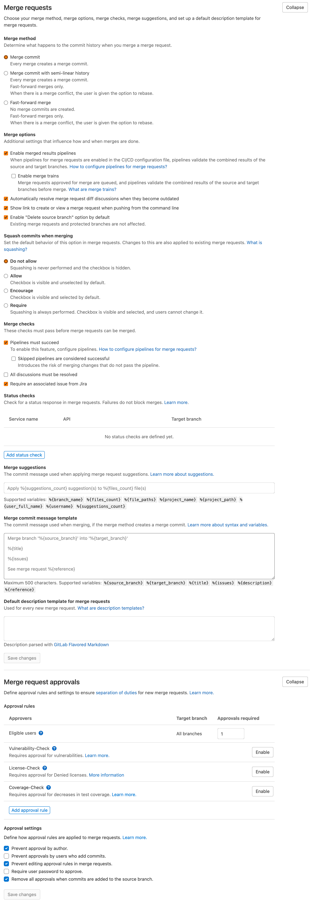
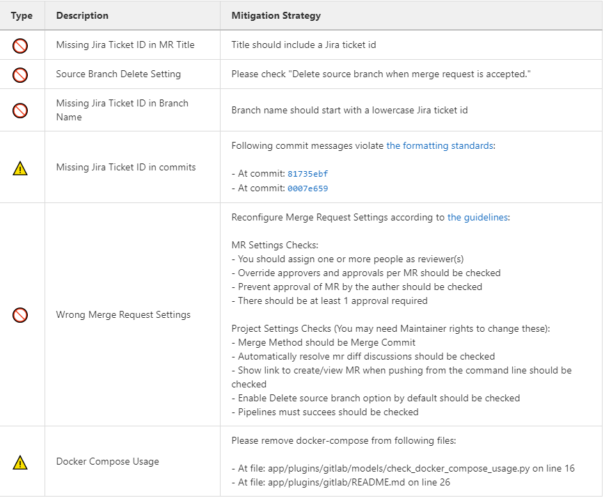

.. _git:

Working with git
----------------

About git
=========

Git is the version control system of choice used by SKA. Describing the basics
of how to use Git is out of the scope of this developer portal, but it is
fundamental that all developers contributing to SKA get familiar with Git and
how to use it. These online resources are a good starting point:

  * Learn git interactively: https://learngitbranching.js.org/
  * Official git reference at: https://git-scm.com/docs
  * Interactive Git cheatsheet: http://www.ndpsoftware.com/git-cheatsheet.html

GitLab as the Git repository manager
====================================

The SKA Software team have adopted the GitLab social coding platform as the main Git repository manager for its
CI/CD tools.  

The following describes how to access the service, and how to setup the basic working environment to integrate with GitLab for the SKA.

Use institutional email
+++++++++++++++++++++++

Create a GitLab account using your **institutional email** address at
https://gitlab.com/users/sign_in. If you already have an account on
GitLab, you should have your institutional email added to your profile: click on
your user icon on the top right corner and select *Settings->Emails->Add email
address* .  It is recommended that 2FA (two-factor authentication) is enabled.  There are a variety of OTP (One Time Pin) applications available for mobile phones with instructions available:
https://docs.gitlab.com/ee/user/profile/account/two_factor_authentication.html.

Setup SSH key
+++++++++++++

To enable `git+ssh` based authentication for clients, associate your ssh-key to your user at *Settings->SSH keys* (https://gitlab.com/profile/keys).

SKA Organization
++++++++++++++++

SKA Organization can be found on GitLab at https://gitlab.com/ska-telescope.
Send a request to the System Team on Slack (*team-system-support* channel) to link your account to the SKA Gitlab group, and assist with creation of repositories and integrating CI.

Code Snippets
+++++++++++++

You can share code snippets (code blocks) within the SKA Organization using the *ska-snippets* repository, and also you can always share code snippets with the project members using project level snippets *(If they are enabled)*

.. _committing-code:

Committing code
===============

When working on a development project, it is important to stick to these simple
commit rules:

* Work in feature branches where possible (see :ref:`branching-policy`)
* Commit early, commit often.
* Have the **Jira story ID** at the beginning of your commit messages. (You can also use Gitlab and JIRA integration defined in :doc:`/tools/jira`)
* Git logs shall be human readable in sequence, describing the development activity.
* Use imperative forms in the commit message:

.. code:: bash

  ST-320 make fluentd,kibana,elasticsearch optional

  * add a pipeline example for disabling ELK
  * add enabled checks
  * filebeat,journalbeat support added to clusters

  # Please enter the commit message for your changes. Lines starting
  # with '#' will be ignored, and an empty message aborts the commit.
  #
  # Date:      Tue May 12 11:24:17 2020 +1200
  #
  # On branch st-320-swap-out-fluentd
  # Your branch is up-to-date with 'origin/st-320-swap-out-fluentd'.

You can find additional information on how to write a good commit message `here <https://chris.beams.io/posts/git-commit/>`__.

Configure Git
=============

Set Git institutional email address
+++++++++++++++++++++++++++++++++++

Setup Git so that it uses your institutional email account to sign commits,
this can be done in your global Git configuration:

.. code:: bash

  $ git config --global user.email "your@institutional.email"

Or you can configure the mail address on a project basis.

.. code:: bash

  $ cd your/git/project
  $ git config user.email "your@institutional.email"

Signing commits with GPG
++++++++++++++++++++++++

Developers are strongly encouraged to use a GPG key to sign Git commits.
The procedure for
obtaining a GPG key and uploading it to the GitLab account is described at
https://docs.gitlab.com/ee/user/project/repository/gpg_signed_commits/, or got straight to uploading at https://gitlab.com/profile/gpg_keys.

The only difference from a non signed commit is the addition of the -S flag:

.. code:: bash

  $ git commit -S -m "My commit msg"

The passphrase of your GPG key will then be asked. To avoid having to type the -S flag every time a commit is made, Git can be configured to sign commits automatically:

.. code:: bash

  $ git config --global commit.gpgsign true

When working in a remote repository by ssh connection, you need to create new GPG key and add it as explained above or you can forward your existing gpg key to the remote machine following the instructions below. 
You can find more information `here <https://wiki.gnupg.org/AgentForwarding>`__.

* Find your local socket: :code:`gpgconf --list-dir agent-extra-socket` 
* Find your remote socket: :code:`gpgconf --list-dir agent-socket`
* Configure your SSH configuration file by adding the following line after your host settings: :code:`RemoteForward <socket_on_remote_box>  <extra_socket_on_local_box>`. Note that you need to reconnect to the remote machine to apply the changes.
* Add :code:`StreamLocalBindUnlink yes` into :code:`/etc/ssh/sshd_config` in the remote machine and restart the sshd service to close the gpg forwarding socket when closing the ssh connection.

Squashing commits
+++++++++++++++++

If you want to replace a series of small commits with a single commit or if you want to make their order more logical you can use an interactive rebase (git rebase -i) to squash multiple commits into one or reorder them. When squashing commits it is important to consider the following:

* You should never rebase commits you have pushed to a remote server.
* You should also never rebase commits authored by other people.

In general the squashing of commits is discouraged for SKA repositories.

.. _branching-policy:

Branching policy
================

The preference within the SKA is that a `feature branch workflow <https://www.atlassian.com/git/tutorials/comparing-workflows/feature-branch-workflow>`_ be adopted, however it is recognised that there are multiple workflows in use, and team requirements and composition vary.
Regardless of the adopted workflow employed, two concepts are important to the SKA way of using Git:

  1. The master branch of a repository shall always be stable, and tested.
  2. Branches shall be short lived, merging into master as often as possible.

Stable means that the master branch shall always compile and build correctly,
and executing automated tests with success. Every time a master branch results
in a condition of instability, reverting to a condition of stability shall have
the precedence over any other activity on the repository.

The following sections discuss the two of the most common workflows:

* Master or trunk based development
* Feature based branching

.. _master-based-development:

Master based development
++++++++++++++++++++++++

Teams may adopt a particular Git workflow designated as Master based development approach,
where each developer commits code into the master branch on a
daily basis. While this practice may seem counter intuitive, there is good evidence
in literature that it leads to a better performing system. Branches are
reduced to a minimum in this model, and the discipline of daily commits into
master greatly enhances the communication within the team and the modularity
of the software system under construction. The workflow follows these steps:

  * As a developer starts working on a story, all their commits related to the story shall contain the story Jira ID in the message. i.e. *AT-51 method stubs*
  * The developer continues working on their local master branch with multiple commits on the same story.
  * Each day the local master pulls the remote and incorporates changes from others.
  * The local master is tested successfully.
  * The local commits are pushed onto the remote master.
  * The CI pipeline is correctly executed on the remote master by the CI server.

Implemented correctly, this practice leads to having an integrated, tested,
working system at the end of each  development interval, that can be shipped
directly from the master branch.

However, this workflow relies on great discipline, and tends to suit small teams with a highly controlled work funnel that ensures work can be completed and tested on a daily iteration, with well defined and highly independent work packages.  There is no buffer against integration failures, so the discipline must extend to dropping all other tasks until the master branch is stable again should there be issues, which will have associated productivity costs against the entire team.

Feature based branching
+++++++++++++++++++++++

The SKA organisation advocates adopting a story-based branching model, often referred to as
**feature branching**. This workflow effectively leverages GitLab **Merge Requests** enabling code reviews and continuous branch testing, but it
is important to stress the importance of having short lived branches. It is
easy to abuse this policy and have long living branches resulting in painful
merge activities and dead or stale development lines.
Bearing in mind that a *story* by definition is a
piece of work a developer should conclude in the time of a sprint, the workflow
should follow these steps:

* As a developer starts working from master on a new story, they create a new branch.
* The new branch shall be named after the story, i.e. *at1-26-the-new-widget*.  Note: branch names are by convention all lower case.

.. code:: bash

  $ git clone git@gitlab.com:ska-telescope/skampi.git
  $ cd skampi
  $ git branch
  * master
  $ git checkout -b at1-26-the-new-widget
  $ git branch
  master
  * at1-26-the-new-widget

* All the commit messages contributing to the development of the story begin with the story ID, i.e. *AT1-26 - basic testing*.
* The developer makes sure that all tests execute correctly on their local story branch.
* When the story is ready for acceptance the developer pushes the story branch upstream.

.. code:: bash

  $ git push -u origin at1-26-the-new-widget
  Enumerating objects: 48, done.
  Counting objects: 100% (48/48), done.
  Delta compression using up to 12 threads
  Compressing objects: 100% (23/23), done.
  Writing objects: 100% (25/25), 4.80 KiB | 614.00 KiB/s, done.
  Total 25 (delta 14), reused 0 (delta 0)
  remote:
  remote: To create a merge request for at1-26-the-new-widget, visit:
  remote:   https://gitlab.com/ska-telescope/skampi/-/merge_requests/new?merge_request%5Bsource_branch%5D=at1-26-the-new-widget
  remote:
  To gitlab.com:ska-telescope/skampi.git
  * [new branch]      at1-26-the-new-widget -> at1-26-the-new-widget
  Branch 'at1-26-the-new-widget' set up to track remote branch 'at1-26-the-new-widget' from 'origin'.

* The branch CI pipeline is automatically triggered.
* A Merge Request is created on GitLab to merge the story branch into the master branch.  The above commit reponse shows a conveniently supplied URL to start this process.
* Reviewers interact with comments on the Merge Request until all conflicts are resolved and reviewers accept the Merge Request.
* The Merge Request is merged into Master.
* The CI pipeline is executed successfully on the master branch by the CI server.

There are some considerations with Feature Branching:

* continually branching and merging is an overhead for small teams and very short work packages where there is a high prevalence of one-commit to one-merge-request
* branching requires discipline in that they should be short lived and developers need to remember to delete them after use
* stale and orphaned branches can pollute the repository
* developers must resolve merge conflicts with master before pushing changes, so there can be a race to merge to avoid these issues

Alternate Strategy
++++++++++++++++++

Whenever a team deviates from one of the recommended policies, it is important
that the team captures its decision and publicly describe its policy,
discussing it with the rest of the community.

See a more detailed description of this workflow at https://docs.gitlab.com/ee/topics/gitlab_flow.html

.. _merge-request:

Merge requests
++++++++++++++

When the story is ready for acceptance a Merge Request should be created on GitLab to
merge the story branch into the master branch. The Merge Request UI on GitLab includes a platform for the discussion threads, and indeed an important purpose of the Merge Request is to provide an online place for the team to discuss the changes and review the code before doing the actual merge.

It is recommended that A new merge request will include, among others, the following options:

* The Merge Request Title should always include the related JIRA issue id - this will be automatic following the above branching naming convention.
* Merge Request Description should include a concise, brief description about the issue.
* Add approval rules.
* Select one or more people for review (use the Reviewer field in the MR to differentiate between assignees and reviewers) and include anyone who has worked in the Merge Request.
* Delete source branch when merge request is accepted.
* Do not Squash commits when merge request is accepted.

At the moment the SKA organisation does not enforce approval rules, but it is recommended as good practice to involve other team members as assignees/reviewers for the Merge Request, and ensure that there is code review.

As part of best practices it is important to delete feature branches on merge or after merging them to keep your repository clean, showing only work in progress.
It is not recommended to squash commits submitted to the remote server, in particular if using GitLab and JIRA integration, so the enabling squash commits option should be left unchecked. However you can arrange your commits before pushing them to remote.

.. _merge-settings-maintainers:

*Gitlab MR Settings for Project Maintainers*
^^^^^^^^^^^^^^^^^^^^^^^^^^^^^^^^^^^^^^^^^^^^

There are more additional settings in GitLab that only project maintainers could tune. The following settings are configured for the developer portal itself and they are the recommended settings for the projects in the SKA organisation. Normally, these settings would not be needed to change. 

.. _figure-gitlab-mergerequest-settings:

   GitLab Merge Request Settings.
   
   
Note that the System team may from time to time batch update all of the SKA projects' settings as to confirm with the policies and recommendations.

Merge Request Quality Checks
============================

To ensure the guidelines and policies described in this Developer Portal is followed for a consistent and robust development/security/review and QA processes for SKA repositories, there are a series of automated checks in place.
The result of the checks are reported back to the developers in the main Merge Request page on GitLab.
It is advised to look for this comment and respond to any issue arisen.

A check is either a:

* Failure (🚫): The Merge Request is violating the SKA guidelines and it should be fixed by following the mitigation defined in the check
* Warning (⚠): The Merge Request is following anti patterns/non-advised guidelines/policies and it would be better if it is fixed by the mitigation defined in the check
* Information (📖): You should be aware of the information conveyed in this Merge Request

Each check has a brief description that explains what it does and a mitigation/explanation (depending on check type) which gives detail information about check on how to fix it or explains its findings more. You can find a detailed list of each check below.

Workflow
++++++++

When a new Merge Request is created, a webhook triggers the SKA MR Service to carry out the checks described below and **Marvin the Paranoid Android** (*username: marvin-42*) happily reports back to the Merge Request by adding a comment (probably the first comment). The comment includes a table (like the example below) with each check information.

For the subsequent changes in the Merge Request, the comment is updated to reflect the latest status of the Merge Request.

   GitLab Merge Request Settings.

Checks
++++++

+---------+-----------------------+------------------------------------------------------------------------------------------+
| Type    | Description           | Mitigation Strategy                                                                      |
+=========+=======================+==========================================================================================+
| Failure | Squash Commits Setting| Please uncheck Squash commits when merge request is accepted.                            |
+---------+-----------------------+------------------------------------------------------------------------------------------+
| Failure | Missing Jira Ticket ID| Title should include a Jira ticket id                                                    |
|         | in MR Title           |                                                                                          |
+---------+-----------------------+------------------------------------------------------------------------------------------+
| Warning | Docker-Compose        | Please remove docker-compose from following files:                                       |
|         |                       |     *  At file: <file_location> on line <line_number>                                    | 
|         | Found                 |     *  At file: <file_location> on line <line_number>                                    |
+---------+-----------------------+------------------------------------------------------------------------------------------+
| Failure | Missing Jira Ticket   | Branch name should start with a lowercase Jira ticket id                                 | 
|         | In Branch Name        |                                                                                          |
+---------+-----------------------+------------------------------------------------------------------------------------------+
| Failure | Wrong Merge           |  Reconfigure Merge Request Settings according to :ref:`merge-request`                    |    
|         | Request Setting       |                                                                                          |
|         |                       |  MR Settings Checks:                                                                     |
|         |                       |      * You should assign one or more people as reviewer(s)                               |
|         |                       |      * Automatically resolve mr diff discussions should be checked                       |
|         |                       |      * Override approvers and approvals per MR should be checked                         |
|         |                       |      * Remove all approvals when new commits are pushed should be checked                |
|         |                       |      * Prevent approval of MR by the author should be checked                            |
|         |                       |      * There should be at least 1 approval required                                      |
|         |                       |  Project Settings Checks(You may need Maintainer rights to change these):                |   
|         |                       |      * Pipelines must succeed should be checked                                          |
|         |                       |      * Enable Delete source branch option by default should be checked                   |
|         |                       |      * Show link to create/view MR when pushing from the command line should be checked  |
+---------+-----------------------+------------------------------------------------------------------------------------------+
| Warning | Missing Jira Ticket   | Following commit messages violate :ref:`committing-code`                                 |  
|         | in commits            |      *   <commit-hash>                                                                   |
|         |                       |      *   <commit-hash>                                                                   |
+---------+-----------------------+------------------------------------------------------------------------------------------+

Squash Commits Setting
^^^^^^^^^^^^^^^^^^^^^^
This check is to prevent users from squashing the commits before merging the merge requests. This will preserve the history of all commits for the merge request. To avoid this failure, users should uncheck Squash commits setting when merge request is accepted.

Missing Jira Ticket ID in MR Title
^^^^^^^^^^^^^^^^^^^^^^^^^^^^^^^^^^
This check prevents users from raising a merge request without A Jira ticket ID in merge request title. This will make every merge request identifiable with its Jira ticket. To avoid this failure, users should include a Jira ticket id in title of the merge request.

Docker-Compose Found
^^^^^^^^^^^^^^^^^^^^
This check is to prevent users from using Docker-Compose in their project. This will make it easier to remove Docker-Compose from the projects as it shouldn't be used anymore. To avoid this warning, user needs to remove Docker-Compose from the project which can be seen from the warning message under Mitigation Strategy column which enlists the files that have the reference to Docker-Compose along with the line numbers where Docker-Compose is found.

Missing Jira Ticket In Branch Name
^^^^^^^^^^^^^^^^^^^^^^^^^^^^^^^^^^
This check prevents users from raising a merge request without A Jira ticket ID in the branch name. This will make every branch identifiable with its Jira ticket. To avoid this failure, users should follow the steps listed in :ref:`master-based-development`.

Wrong Merge Request Setting
^^^^^^^^^^^^^^^^^^^^^^^^^^^
This check prevents users to merge their branch without the merge request being configured with the right settings. To avoid this failure the merge request should be configured as listed in :ref:`merge-request`. Some of the settings can only be changed by the maintainers, this settings are listed in :ref:`merge-settings-maintainers`.

Missing Jira Ticket in commits
^^^^^^^^^^^^^^^^^^^^^^^^^^^^^^
This check warns users for the commits that were made without using a Jira ticket ID in it's message. Having the Jira ticket ID at the beginning of your commit messages is one of the basic rules listed at :ref:`committing-code`. The Jira Ticket ID in the commit messages are used for the developers to keep track of the changes made on the ticket through JIRA.
