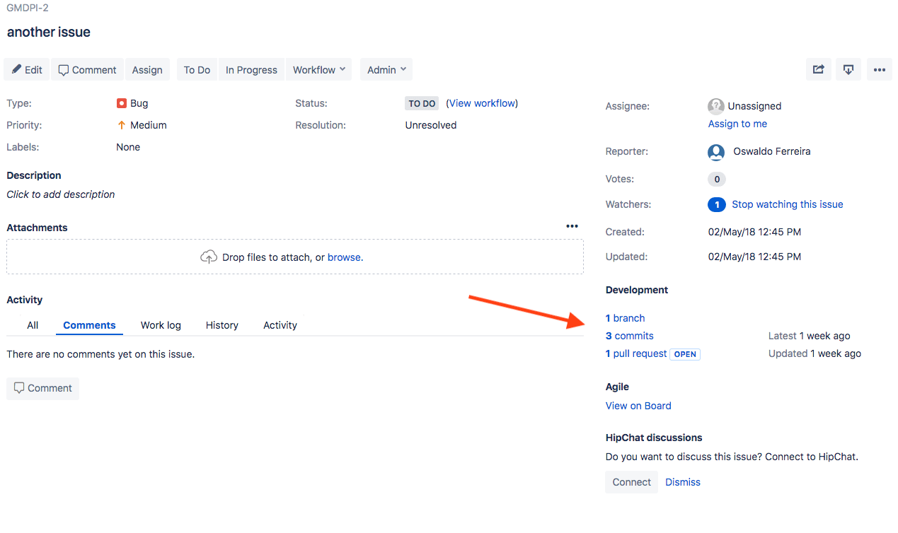

Working with Jira
=================

.. todo::
   - Add info about Jira, ticket types, workflows etc.

GitLab to Jira Integration
--------------------------

If you commit message or make a merge request (MR) in GitLab has **Jira Issue ID mentioned**, then:

- GitLab will hyperlink the issue for easy navigation
- Jira issue will have an issue link to the commit/MR
- Jira issue will have a comment reflecting the comment made in GitLab, the comment author, and a link to the commit/MR in GitLab (If it is enabled)

  *Example Commit Message:* ``SKA-34 added gitlab-jira integration``

If you mention that **a commit or MR ‘closes’, ‘resolves’, or ‘fixes’ a Jira issue ID**, then:

- GitLab’s merge request page displays a note that it “Closed” the Jira issue, with a link to the issue. (Note: Prior the merge, an MR will display that it “Closes” the Jira issue.)
- Jira issue will transition to ``READY FOR ACCEPTANCE`` status if applicable

  *Example Commit Message:* ``closes SKA-34``

Also, You can do other things like adding comments to Jira issues, time-tracking and transitioning Jira issue states directly from GitLab commits. You can find more about it in `Jira Smart Commits`_.

*More info could be found at* |gitlab-jira-integration-link|_

Jira to GitLab Integration
--------------------------

A Development Panel is added automatically to any Jira issues referred
by its ID in:

-  branch names

-  commit messages

-  merge request titles

in GitLab and you will be able to see the linked ``branches``,
``commits``, and ``merge requests`` when entering a Jira issue (inside 
the Jira issue, merge requests will be called “pull requests”).

.. _figure-1-jira-dev-panel:

   Jira Development Panel.

*More info could be found at* |jira-development-panel-link|_

.. _gitlab-jira-integration-link: https://docs.gitlab.com/ee/user/project/integrations/jira.html
.. |gitlab-jira-integration-link| replace:: *GitLab to Jira Integration*
.. _Jira Smart Commits: https://confluence.atlassian.com/fisheye/using-smart-commits-960155400.html
.. _disabled: https://docs.gitlab.com/ee/user/project/integrations/jira.html#disabling-comments-on-jira-issues
.. _jira-development-panel-link: https://docs.gitlab.com/ee/integration/jira_development_panel.html
.. |jira-development-panel-link| replace:: *Jira to GitLab Integration* 
