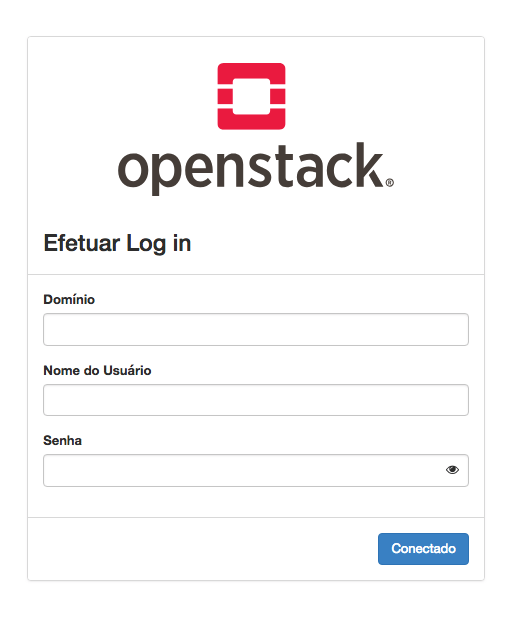
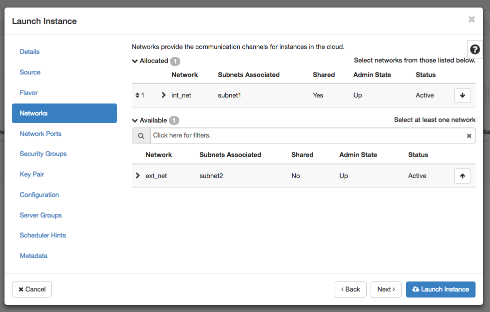
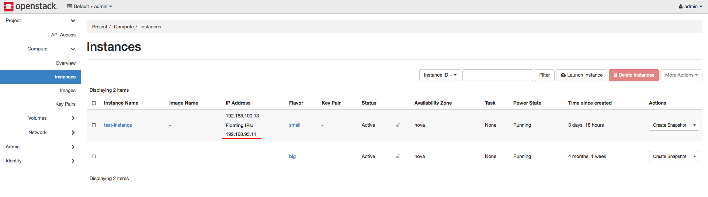

.. _monitoring-dashboards:

EngageSKA cluster
*****************

Cluster specs
=============
.. image:: ../images/cluster.png

Access the cluster
==================
The EngageSKA cluster locates at the Datacenter of Institute of
Telecommunication (IT) in Aveiro. To have access to the cluster, it is required
to be inside the facilities or have VPN credentials to access the IT network
remotely.

Access to the network using VPN
===============================
At the moment, VPN credentials are sent individually and is required to send an
email to Domingos Nunes (dfsn@ua.pt) with the knowledge from Piers Harding
(P.Harding@skatelescope.org).

- Guide on how to connect to the private network using VPN: https://engageska-portugal.pt/theme/files/vpn-guide.pdf

Access to the OpenStack platform (Virtualization)
=================================================

The OpenStack platform requires authentication in order to use it.

At the moment, OpenStack credentials are sent individually and it is required
to send an email to  Domingos Nunes (dfsn@ua.pt) with the knowledge from Piers
Harding (piers@ompka.net). In the next phase, OpenStack could support Gitlab
authentication.

To access the OpenStack platform go to http://192.168.93.215/dashboard
(requires VPN) and login with your credentials. These credentials should be
the same used for your VPN authentication. The **Domain** to use is
**default**.

Virtual machine deployment
--------------------------
- At the sidebar, go to Project -> Compute -> Instances and click on the "Launch Instance" button:

.. image:: ../images/openstack-project-compute-instance.png

- At this stage a menu will pop-up and will ask to specify virtual machine characteristics, chose an name for virtual machine:

.. image:: ../images/openstack-vm-chars.png

- Select the Operating System you want your VM to have:

**NOTE: Please choose the option "Yes" at "Delete Volume on Instance Delete"
so when you decide to delete the instance the volume will be also deleted and
not occupy unnecessary space**

.. image:: ../images/openstack-vm-os.png
.. image:: ../images/openstack-vm-os2.png

- Select the flavor which you want your VM to have:

.. image:: ../images/openstack-flavor.png
.. image:: ../images/openstack-flavor2.png

- Select private network (int-net):

.. image:: ../images/openstack-network.png

- Create or use ssh key to enable ssh access to the VM:

.. image:: ../images/openstack-sshkeys.png

- In the end press on "Launch Instance" button at the bottom. This initiates the virtual machine deployment. It could take a while:

.. image:: ../images/openstack-launch-instance.png

- When the Power State become "Running", the virtual machine has been successfully deployed and is ready to be used:

.. image:: ../images/openstack-running-intance.png

- Since the VM is deployed inside private network you will need to associate Floating IP from your network have the access:

.. image:: ../images/openstack-running-intance.png
.. image:: ../images/openstack-floating-choose.png
.. image:: ../images/openstack-floating-add.png
.. image:: ../images/openstack-floating-add2.png

- Now using any SSH client connect to the instance through VPN using the Floating IP address. The login user is **ubuntu** when using the Ubuntu base images and **centos** for the CentOS ones.

Docker machine deployment
-------------------------
Official docker-machine documentation:
https://docs.docker.com/machine/overview/

1. Installation
^^^^^^^^^^^^^^^
Guide: https://docs.docker.com/machine/install-machine/

2. Configuration
^^^^^^^^^^^^^^^^
In order to use the OpenStack integration you need to export OpenStack
Authentication credentials.

For the future use, create an executable file which will export environmental
variables automatically. For example you can call file "openstackrc" and the
content of the file be:

::

	# VM CONFIG
	export OS_SSH_USER=ubuntu
	export OS_IMAGE_NAME=Ubuntu1604
	export OS_FLAVOR_NAME=m1.medium
	export OS_FLOATINGIP_POOL=ext_net
	export OS_SECURITY_GROUPS=default
	export OS_NETWORK_NAME=int_net

	# AUTH
	export OS_DOMAIN_NAME=default
	export OS_USERNAME=<OPENSTACK_USER>
	export OS_PASSWORD=<OPENSTACK_PASS>
	export OS_TENANT_NAME=geral
	export OS_AUTH_URL=http://192.168.93.215:5000/v3

OS_SSH_USER
  Default ssh user, usually it is ubuntu (if operating system is ubuntu)

OS_IMAGE_NAME
  OS image to be used during virtual machine deployment

OS_FLAVOR_NAME
  Virtual machine specification (vCPU, RAM, storage, ...)

  +------------+------+-----------+-------+
  | Flavor     | vCPU | Root Disk |  RAM  |
  +============+======+===========+=======+
  | m1.tiny    |  1   | 0         | 0.5GB |
  +------------+------+-----------+-------+
  | m1.smaller |  1   | 0         | 1GB   |
  +------------+------+-----------+-------+
  | m1.small   |  1   | 10GB      | 2GB   |
  +------------+------+-----------+-------+
  | m1.medium  |  2   | 10GB      | 3GB   |
  +------------+------+-----------+-------+
  | m1.large   |  4   | 10GB      | 8GB   |
  +------------+------+-----------+-------+
  | m1.xlarge  |  8   | 10GB      | 8GB   |
  +------------+------+-----------+-------+
  | ska1.full  |  46  | 10GB      | 450GB |
  +------------+------+-----------+-------+

OS_FLOATINGIP_POOL
  Floating IP external network pool is the "ext_net"

OS_SECURITY_GROUPS
  Security groups, default is "default"

OS_NETWORK_NAME
  Private network, default is "int_net"

OS_DOMAIN_NAME
  OpenStack domain region, default is "default"

OS_USERNAME
  OpenStack username

OS_PASSWORD
  OpenStack password

OS_TENANT_NAME
  OpenStack project name, default is "geral"

OS_AUTH_URL
  OpenStack Auth URL, default is "http://192.168.93.215:5000/v3"

3. Usage
^^^^^^^^

**Complete documentation about docker-machine CLI commands can be found here:
https://docs.docker.com/machine/reference/**

3.1 Run the enviromental variable file
""""""""""""""""""""""""""""""""""""""
::

	$ . openstackrc

3.2 Create docker-machine
"""""""""""""""""""""""""
Create a machine. Requires the --driver flag to indicate which provider
(OpenStack) the machine should be created on, and an argument to indicate the
name of the created machine.

::

	$ docker-machine create --driver=openstack MACHINE-NAME

	Creating CA: /root/.docker/machine/certs/ca.pem
	Creating client certificate: /root/.docker/machine/certs/cert.pem
	Running pre-create checks...
	Creating machine...
	(MACHINE-NAME) Creating machine...
	Waiting for machine to be running, this may take a few minutes...
	Detecting operating system of created instance...
	Waiting for SSH to be available...
	Detecting the provisioner...
	Provisioning with ubuntu(systemd)...
	Installing Docker...
	Copying certs to the local machine directory...
	Copying certs to the remote machine...
	Setting Docker configuration on the remote daemon...
	Checking connection to Docker...
	Docker is up and running!
	To see how to connect your Docker Client to the Docker Engine running on
	this virtual machine, run: docker-machine env MACHINE-NAME

In this step docker-machine will create VM inside OpenStack. As soon as the
ssh connection to VM is available the Docker service will be installed.

3.3 Set docker-machine environment
""""""""""""""""""""""""""""""""""
Set environment variables to dictate that docker should run a command against
a particular machine.
::

	$ docker-machine env MACHINE-NAME

	export DOCKER_TLS_VERIFY="1"
	export DOCKER_HOST="tcp://192.168.93.23:2376"
	export DOCKER_CERT_PATH="/root/.docker/machine/machines/MACHINE-NAME"
	export DOCKER_MACHINE_NAME="MACHINE-NAME"
	# Run this command to configure your shell: 
	# eval $(docker-machine env MACHINE-NAME)

3.4 Configure shell to use your docker-machine
""""""""""""""""""""""""""""""""""""""""""""""
After this, when you execute "docker" command it will be executed remotely.

::

	$ eval $(docker-machine env MACHINE-NAME)

Now if you run "docker-machine ls" you see that your machine is active and
ready to use.
::

	$ docker-machine ls

	NAME           ACTIVE   DRIVER      STATE     URL                        SWARM   DOCKER     ERRORS
	MACHINE-NAME   *        openstack   Running   tcp://192.168.93.23:2376           v18.09.0   

3.5 Use "docker" command to remotely deploy docker containers
"""""""""""""""""""""""""""""""""""""""""""""""""""""""""""""

::

	$ docker run -d -p 80:80 nginx

	Unable to find image 'nginx:latest' locally
	latest: Pulling from library/nginx
	a5a6f2f73cd8: Pull complete 
	67da5fbcb7a0: Pull complete 
	e82455fa5628: Pull complete 
	Digest: sha256:98b06873ea9c87d5df1bb75b650926cfbcc4c53f675dfabb158830af0b115f99
	Status: Downloaded newer image for nginx:latest
	889a1ab275ba072980fe4fd3ec58094513cf41330c3698b226c239ba490a24a6

3.6 Remove docker-machine
"""""""""""""""""""""""""
Remove a machine. This removes the local reference and deletes it on the cloud 
rr or virtualization management platform.
::

	$ docker-machine rm MACHINE-NAME (-f if need force)

3.7 Docker-machine IP
"""""""""""""""""""""
Get the IP address of one or more machines.

::

	$ docker-machine ip MACHINE-NAME

	192.168.93.23

3.8 Docker-machine list
"""""""""""""""""""""""
List currently deployed docker-machines.

::

	$ docker-machine ls

	NAME           ACTIVE   DRIVER      STATE     URL                        SWARM   DOCKER     ERRORS
	MACHINE-NAME   *        openstack   Running   tcp://192.168.93.23:2376           v18.09.0   

3.9 Docker-machine upgrade
""""""""""""""""""""""""""
Upgrade a machine to the latest version of Docker. How this upgrade happens
depends on the underlying distribution used on the created instance.
::

	$ docker-machine upgrade MACHINE-NAME

	Waiting for SSH to be available...
	Detecting the provisioner...
	Upgrading docker...
	Restarting docker...

3.10 Docker-machine stop
""""""""""""""""""""""""
Stops running docker-machine.

::

	$ docker-machine stop MACHINE-NAME

	Stopping "MACHINE-NAME"...
	Machine "MACHINE-NAME" was stopped.

3.11 Docker-machine restart
"""""""""""""""""""""""""""
Restarts docker-machine.

::

	$ docker-machine restart MACHINE-NAME

	Restarting "MACHINE-NAME"...
	Waiting for SSH to be available...
	Detecting the provisioner...
	Restarted machines may have new IP addresses. You may need to re-run the
	`docker-machine env` command.

3.12 Docker-machine start
"""""""""""""""""""""""""
Starts docker-machine.

::

	$ docker-machine start MACHINE-NAME

	Starting "MACHINE-NAME"...
	Machine "MACHINE-NAME" was started.
	Waiting for SSH to be available...
	Detecting the provisioner...
	Started machines may have new IP addresses. You may need to re-run the
	`docker-machine env` command.

3.13 Docker-machine ssh
"""""""""""""""""""""""
Log into or run a command on a machine using SSH.

::

	$ docker-machine ssh MACHINE-NAME

	Welcome to Ubuntu 16.04.4 LTS (GNU/Linux 4.4.0-116-generic x86_64)

	* Documentation:  https://help.ubuntu.com
	* Management:     https://landscape.canonical.com
	* Support:        https://ubuntu.com/advantage

	Get cloud support with Ubuntu Advantage Cloud Guest:
	http://www.ubuntu.com/business/services/cloud

	153 packages can be updated.
	81 updates are security updates.

	New release '18.04.1 LTS' available.
	Run 'do-release-upgrade' to upgrade to it.

	ubuntu@MACHINE-NAME:~$ 

Access to the bare metal
========================
In this stage, this option is very restrictive and only in a well-justified
situation is allowed.
