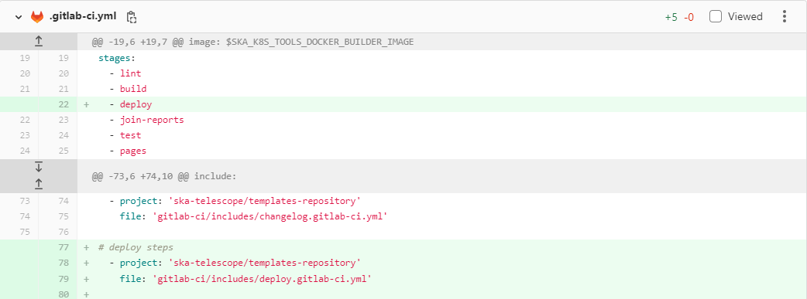
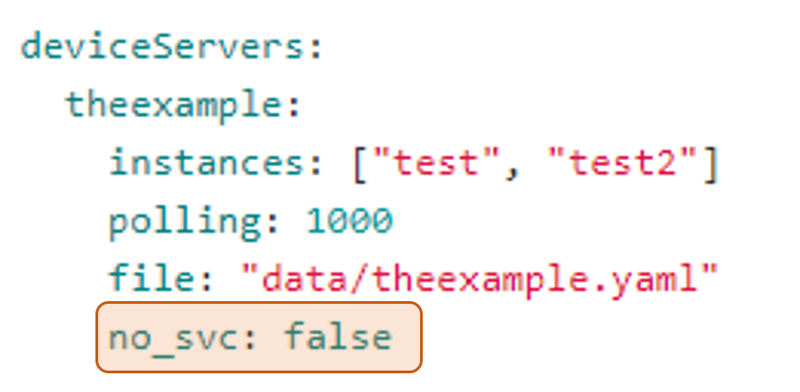
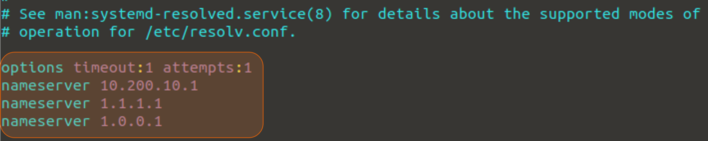
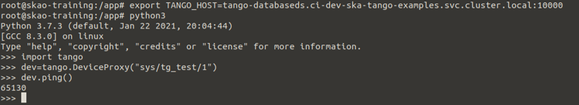

.. _new-environments:

New Environments on STFC
*************************

In order to provide a way for SKA developers to install, uninstall or update their artefacts into an isolated environment, a unified approach - based on GitOps - has been created.

Once a developer pushes a change to the repo, the repo detects this change, updates and pushes the manifest into the cluster and a new environment can be created to test the commited changes. 

This unified approach adds a new stage - the deploy stage - to the pipeline that will make 4 jobs available:

* **Deploy Dev Environment** - first job to be executed to create the new environment

* **Info Dev Environment** - once the deploy and test jobs have been executed successfully, this job can be executed to provide an overview of the environment deployed

* **Stop Dev Environment**  - job automatically executed after 4 hours, deleting the created envrionment. It can also be executed manually, if necessary, before the defined 4 hours

* **Test Dev Environment** - second job to be executed, automatically, once the deploy job finishes to check that something has been deployed and is running

Once, at least, the Deploy and Test Dev Environment jobs are executed successfully a new test environment will be deployed into STFC.

Environment Setup
===============================

To enable this new stage, in your *.gitlab-ci.yml*, add the deploy stage and include the deploy template as shown below:

   Adding the deploy stage to the pipeline

In your *values.yaml* file, the "no_svc" parameter should be set to *false* if, for the service for which this is set, you want it to be deployed into the development environment. If you don't want to deploy the service to the environment and prefer to work on it locally, this parameter should be set to *true*. 

   Setting the no_svc parameter

On the local machine, to be able to communicate with the environment, the following configurations must be added to the */etc/resolv.conf* file.

   Adding the nameserver configuration

Environment Usage Examples
===============================

After the setup has been executed, create a new pipeline. The deploy stage should now be shown with its 4 corresponding jobs. 

For the current example, the deploy stage was added after the build stage on the *ska-tango-examples* repo.

.. figure:: ../images/usage-example-pipeline.png
   :scale: 30%
   :alt: Deploy stage
   :align: center
   :figclass: figborder

   Deploy stage added to the pipeline

Run the deploy job and check that the manifest file, named *ci-dev-<project-name>.yaml* was pushed to the *CICD Gitlab K8s Agents Config* repo.

The test job will be executed automatically, showing the running pods and - for the scope of this example - the device servers deployed.

.. figure:: ../images/test-job-example.png
   :scale: 90%
   :alt: Test job outputs
   :align: center
   :figclass: figborder

   Test job outputs

By executing the info job, the overview of the images being used for every pod containing the version and the associated commit ID will be provided. 

In addition, the instructions on how to connect to the created environment are also provided.

.. figure:: ../images/info-job-example.png
   :scale: 30%
   :alt: Info job outputs
   :align: center
   :figclass: figborder

   Info job outputs

Having connected to the environment you can start using it as needed. The example below shows a simple test to confirm that the local machine and the remote cluster are able to communicate.

   Pinging a device from the local machine to the remote cluster

