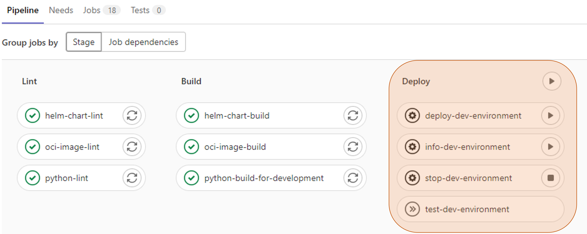
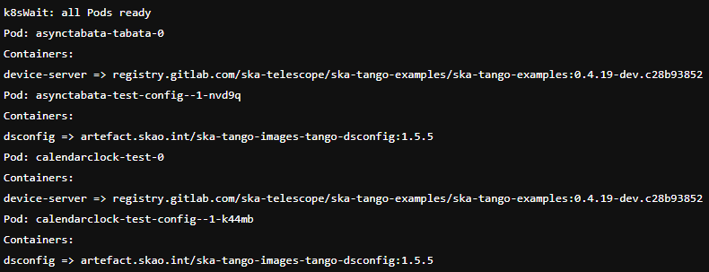
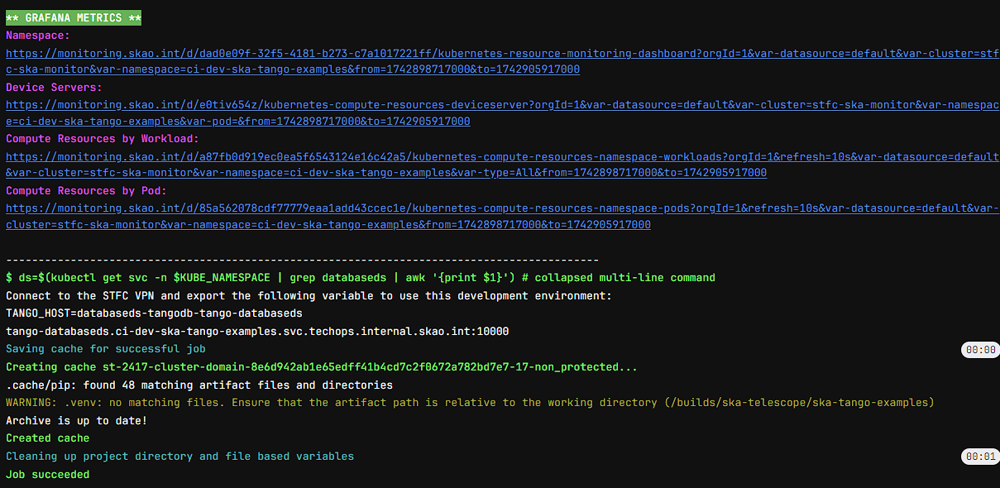

.. _new-environments:

New Environments on STFC
*************************

In order to provide a way for SKA developers to install, uninstall or update their artefacts into an isolated environment, a unified approach - based on GitOps - has been created.

Once a developer pushes a change to the repo, the repo detects this change, updates and pushes the manifest into the cluster and new environments can be created to test the committed changes. 

In general, this approach adds, for each stage - deploy, integration and staging - 4 jobs:

* **Deploy Environment** - first job to be executed to create the new environment

* **Test Environment** - second job to be executed, automatically, once the deploy job finishes to check that something has been deployed and is running

* **Info Environment** - once the deploy and test jobs have been executed successfully, this job can be executed to provide an overview of the environment deployed

* **Stop Environment**  - job automatically executed after 4 hours, deleting the created envrionment. It can also be executed manually, if necessary, before the defined 4 hours

Once, at least, the Deploy and Test Environment jobs are executed successfully a new test environment will be deployed into STFC. If you have feedback about this, please raise it in #team-system-support to improve the solution.

The possible environments to be created are the following: 
* the dev environment which is deleted after 4 hours;
* the integration environment which is stable (not deleted automatically) and can be deployed only from main branch;
* the staging environment which is also stable and can be deployed only from tag branch. 

Environment Setup
===============================

To enable this functionality, in your *.gitlab-ci.yml*, add the following stages and include the deploy template as shown below:

.. code-block:: yaml
  
  ...
   stages:
   - deploy
   - integration
   - staging

   include:  
  - project: 'ska-telescope/templates-repository'
    file: 'gitlab-ci/includes/deploy.gitlab-ci.yml'
  ...

Please note that the list of stages and include files is incomplete. The complete list can be found `here <https://gitlab.com/ska-telescope/ska-tango-examples/-/blob/master/.gitlab-ci.yml>`_, in the ska-tango-examples repository. 

Taking as reference the ska-tango-examples repository, review the *values.yaml* `file <https://gitlab.com/ska-telescope/ska-tango-examples/-/blob/master/charts/test-parent/values.yaml>`_ of the umbrella chart and enable the device servers required (If, for example, you don't want to deploy the service to the environment and prefer to work on it locally, this parameter should be set to *false*). 

If you want to talk to the exposed services (device servers in the TANGO examples) on the cluster by MetalLB, you need to be inside STFC VPN. 

If you are on Ubuntu or MacOS, you don't have to configure anything else as it's included within the VPN configuration, but if you are on WSL2 or using a container for development, you have to add the following configurations in the */etc/resolv.conf* file.

.. code-block:: yaml
  
  ...
  nameserver 192.168.99.194
  ...

Environment Usage Examples
===============================

After the setup has been executed, create a new pipeline. The deploy stage should now be shown with its 4 corresponding jobs. 

For the current example, the deploy stage was added after the build stage on the *ska-tango-examples* repo.

   Deploy stage added to the pipeline

Run the deploy job and check that the manifest file, named *ci-dev-<project-name>.yaml* was pushed to the *CICD Gitlab K8s Agents Config* repo.

The test job will be executed automatically, showing the running pods and - for the scope of this example - the device servers deployed.

   Test job outputs

By executing the info job, the overview of the images being used for every pod containing the version and the associated commit ID will be provided. 

In addition, the instructions on how to connect to the created environment are also provided.

   Info job outputs

Having connected to the environment you can start using it as needed. To be able to connect to any service inside a namespace in the k8s cluster (the environment), it is possible to access it with its name which is (the standard k8s name for a service) in the form: <service name>.<namespace>.svc.<cluster domain>. The example below shows a simple test to confirm that the local machine and the remote cluster are able to communicate in the context of a TANGO environment. In this case the service where we want to connect is the databaseds called "tango-databaseds" in the namespace "ci-dev-ska-tango-examples" with cluster domain "techops.internal.skao.int".

.. code-block:: bash
  
    $ export TANGO_HOST=tango-databaseds.ci-dev-ska-tango-examples.svc.techops.internal.skao.int:10000
    $ python3 -c "import tango; dev=tango.DeviceProxy('test/powersupply/1'); print(dev.Status())"
    The device is in STANDBY state.

