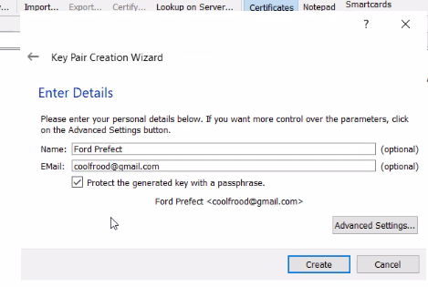
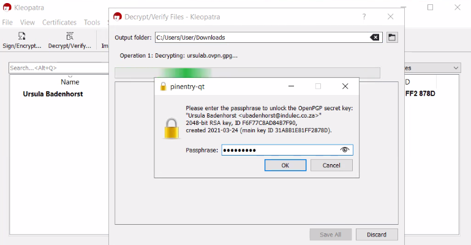
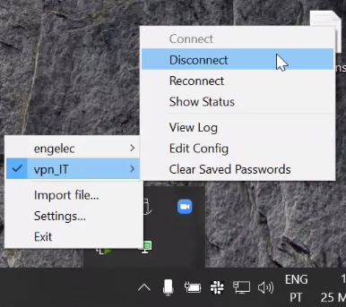

.. _monitoring-dashboards:

STFC cluster
*****************

The STFC cluster is located at the SKAO headquarters, UK. Direct access to Openstack platforms used by SKAO is provided only to the System Team but access to namespaced deployments and monitoring is available to other teams through a VPN connection.

Connecting to the STFC VPN
===============================

For Accessing branch-based deployments of the MVP it is necessary to have a connection to the VPN. This will not only provide access to the iTango, Taranta and REST interfaces, but also allow usage of the KUBECONFIG that can be downloaded from the pipeline logs of the deployments - hence giving developers and testers kubectl access to their namespaced deployments.

In order to gain a VPN connection, you first need credentials.  To get them please contact the system team by sending a Slack message on `#team-system-support <https://skao.slack.com/archives/CEMF9HXUZ>`_ channel. Sharing these credentials has to be done in a secure way. Two methods are currently available for doing this: GPG encryption, and LastPass. Since a GPG key is also required for SKA Developers for verifying their commits this is the preferred method.

Receiving your OVPN key using GPG encryption is a three-step process:

 1 Create and publish your GPG key
 
 2 Request VPN credentials from System Team
 
 3 Receive encrypted credentials and decrypt them.

Once the above three steps are followed, you shall be able to connect.

Create your GPG key
===================

If you don’t already have a GPG key, the following steps can help you get started. As a prerequiste you need to install GPG for your operating system. If your operating system has gpg2 installed, replace gpg with gpg2 in the following commands.

If you are using Windows, you can install Gpg4win. IMPORTANT NOTE: tick all the boxes (GPA is deselected by default) when installing. Then create your GPG key following either the guide for the Command Line or the GUI below.

Command Line / Terminal
-----------------------

Generate the private/public key pair with the following command, which will spawn a series of questions:

.. code-block:: bash

    gpg --full-gen-key

In some cases like Gpg4win on Windows and macOS versions, the command here may be ``gpg --gen-key``.

The first question is which algorithm can be used. Select the kind you want or press Enter to choose the default (RSA and RSA):

.. code-block:: bash

   Please select what kind of key you want:
       (1) RSA and RSA (default)
       (2) DSA and Elgamal
       (3) DSA (sign only)
       (4) RSA (sign only)
   Your selection? 1
   
The next question is key length. We recommend you choose 4096: 

.. code-block:: bash

   RSA keys may be between 1024 and 4096 bits long.
   What keysize do you want? (2048) 4096
   Requested keysize is 4096 bits

Specify the validity period of your key. This is something subjective, and you can use the default value, which is to never expire:

.. code-block:: bash

   Please specify how long the key should be valid.
         0 = key does not expire
      <n>  = key expires in n days
      <n>w = key expires in n weeks
      <n>m = key expires in n months
      <n>y = key expires in n years
   Key is valid for? (0) 0
   Key does not expire at all
   
Confirm that the answers you gave were correct by typing y:

.. code-block:: bash

   Is this correct? (y/N) y

Enter your real name, the email address to be associated with this key (should match a verified email address you use in GitLab) and an optional comment (press Enter to skip): 

.. code-block:: bash

   GnuPG needs to construct a user ID to identify your key.
 
   Real name: Mr. Robot
   Email address: <YOUR_EMAIL>
   Comment:
   You selected this USER-ID:
       "Mr. Robot <YOUR_EMAIL>"
 
   Change (N)ame, (C)omment, (E)mail or (O)kay/(Q)uit? O
   
Pick a strong password when asked and type it twice to confirm.

Create key using GUI
--------------------

Kleopatra is a tool that works for Windows, Linux and Android available from https://apps.kde.org/kleopatra/

Open Kleopatra and choose New Key Pair:

Choose PGP key pair:

Fill in your details and tick the "Protect..." box:

Do no forget this passphrase - you'll need it later:

Click on Finish:

In the list of keys, you can now double-click on your key, to see it's details. Click on Export:

Copy all the text:

.. image:: ../images/image2021-3-25_11-32-46.png
   :align: center

Open the link to the keyserver to publish it as described here (or Gitlab.com if you want to sign your commits) and paste it there.

Publish your GPG key
====================

This GPG key must now be uploaded to https://keyserver.ubuntu.com/ - either by using the command line to directly publish it, or by copying the exported public key & pasting it on the website.

Command line
------------

You can directly upload the key from the command line - just tell GPG to upload it to the keyserver using the fingerprint: 

.. code-block:: bash

	gpg --send-keys --keyserver keyserver.ubuntu.com $(gpg --fingerprint <YOUR_EMAIL> | sed -n '2 p' | tr -d " \t\n\r")

Export, copy
------------

.. code-block:: bash

	Use the following command to list the private GPG key you just created (of course, replace  with your own email address: 

	gpg --armor --export $(gpg --fingerprint <YOUR_EMAIL_ADDRESS> | sed -n '2 p' | tr -d " \t\n\r")
	
Copy all the contents, including the ``-----BEGIN PGP PUBLIC KEY ...`` and ``END ... -----`` parts.

Submit on keyserver
===================

Go to the website, click on "Submit Key":

Paste the key and click on "Submit Public Key":

Request VPN credentials
=======================

Hop on over to #team-system-support on slack and request VPN access credentials. One of the System Team members will contact you directly to help facilitate the rest of the process. You will need to provide them the email address with which you published your GPG key.

.. note::
   Your credentials may expire after some time. If your connection stops working and gives you timeouts you will need to contact the System Team again.

Decrypt credentials
===================

The System Team member helping you should be sending you an encrypted version of your .ovpn file. To decrypt it, follow either the Command line or Windows GUI steps:

Decrypt on the command line
---------------------------

Run the following command (the filename will contain your username, which should contain your name and initials of your last name):

.. code-block:: bash

	$ gpg --output <YOUR_USERNAME>.ovpn --decrypt <YOUR_USERNAME>.ovpn.gpg
	gpg: encrypted with 4096-bit RSA key, ID 7361A071DDC58EE5, created 2021-03-22
	"<YOUR_USERNAME> <<YOUR_EMAIL>>"
	gpg: Signature made Tue 23 Mar 2021 11:39:00 SAST
	gpg: using RSA key 8EF305837D259A6DE269C5068C3A465011EBAD07
	gpg: Good signature from "<SYSTEM TEAM MEMBER NAME> <<SYSTEM_TEAM_MEMBER_EMAIL>>" [ultimate]

Note that, you may see output slightly different from the expected (as shown above), depending on whether or not your Public key was signed. The end-result should be that you now have a file named <YOUR_USERNAME>.ovpn  in the same directory:

.. code-block:: bash

	$ ls -latr
	...snip...
	-rw-rw-r--  1 you you  6838 Mar 23 11:39 <YOUR_USERNAME>.ovpn.gpg
	-rw-rw-r--  1 you you  6446 Mar 23 11:55 <YOUR_USERNAME>.ovpn

Decrypt using GUI
-----------------

Kleopatra is a tool that works for Windows, Linux and Android available from https://apps.kde.org/kleopatra/

Click on Decrypt / Verify:

Locate the file on your hard drive and click on Open. Enter the passphrase you used to create the GPG key:

You should see a success message. Choose an Output folder and click on Save All:

Connecting to the VPN on Linux
==============================

Once you have received your ovpn credentials, you should be able to connect to the VPN using either the command line or
the network manager.

Connecting with the terminal/command line
-----------------------------------------

Open a new terminal. You will need to point the openvpn command to the .ovpn file you have previously obtained. 

.. code-block:: bash

	$ sudo openvpn --config <YOUR_CERTS_PATH>/<YOUR_USERNAME>.ovpn
	
Where ``YOUR_CERTS_PATH`` is the path to the folder where you keep the certificate ``<YOUR_USERNAME>.ovpn`` 
file.

Connect using network manager
-----------------------------

This was tested on Ubuntu 20.04

Ensure that the following packages are installed: network-manager-openvpn, network-manager-openvpn-gnome 

Open Network settings and click on the + for VPN:

From the add VPN dialog, select "Import from file..." and load the OVPN file provided, that contains the connection and authentication information (rename the resultant VPN connection to something appropriate):

Activate the VPN as required under the Network Settings:

Connecting to the VPN on macOS
==============================

Install TunnelBlick - follow instructions https://tunnelblick.net/cInstall.html

.. note::
   If you are running macOS 11 (Big Sur), you need to be running the latest beta version of Tunnelblick: https://tunnelblick.net/downloads.html (see how to troubleshoot issues with Big Sur)

Connecting to the VPN on Windows
================================

There are two clients by openVPN:

 * openVPN GUI: comes with the community edition of openvpn installation
 
 * openVPN Connect: distributed by the openvpn access server and includes paid features

For a simple VPN connection, it’s recommended to use openVPN GUI.

OpenVPN GUI
-----------

OpenVPN GUI used in this guide is: v11.20

Download and install openvpn gui from the official website: https://openvpn.net/community-downloads/ 

The app starts at the system tray, right click on it and select `Import file…`

Select your openvpn configuration file (.ovpn)
You will see the connection in the list like below:
Choose connect to connect to the VPN

After the connection is successful, the icon will turn green
If the connection is unsuccessful, open the logs and investigate the errors:

Note: The openvpn GUI imports your configuration and saves it in a different location. In order to change your configuration. Please select `Edit Config` option on the menu instead of changing the original configuration file. (You could find the location in the Settings… -> Advanced window.

OpenVPN Connect
---------------

OpenVPN Connect used in this guide is: v3.2.3 (1851)

Download and install openvpn for windows from the official website: https://openvpn.net/download-open-vpn/ 

The app starts at the system tray, right click on it and select `Open app`

Click on the Menu Icon

Select Import Profile

Choose File and upload your openvpn profile

u will see the connection in the main profile list as below:

After enabling it (with the grayed out toggle). You don’t need to do anything in the WSL2 as it will automatically work on connections coming from your WSL2 Ubuntu installation.

To access log on the client:

Troubleshooting
===============

**I get a logged error: "Bad compression stub (swap) decompression header byte: 42"**

Try commenting out compress in the .ovpn configuration file

**The VPN connection is unstable and goes up and down every few minutes**

Try switching network protocol from UDP to TCP - edit the .ovpn file and change the configuration line proto udp to proto tcp 

**All tap-windows6 adapters currently in use**

When using OpenVPN GUI, If you're seeing this when trying to connect: 

it may mean that you were still connected to a different VPN (Aveiro IT for instance). You need to manually disconnect first:

Try to connect now - your connection should work: 

