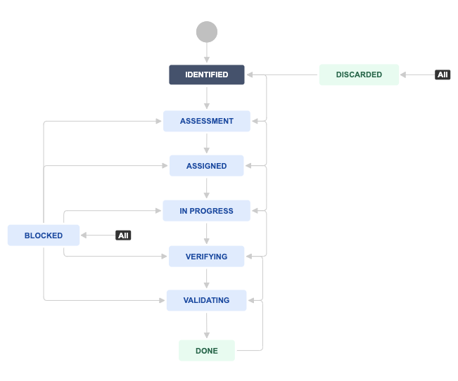

Reporting and Management of Bugs
~~~~~~~~~~~~~~~~~~~~~~~~~~~~~~~~~~~~

.. toctree::
    :maxdepth: 1
    :numbered:
    :hidden:

Introduction
===============

.. admonition:: Software Bug

   A Software Bug is an error, flaw or fault in a computer program or system that causes it to produce an incorrect or unexpected result, or to behave in unintended ways.

The purpose of this chapter is to outline the processes by which the SKA Project will report and track software bugs. After this introduction there is a brief description of how to report bugs, an outline of the bug triaging processes and lastly a description of the process for fixing bugs and the responsibilities of different stakeholders.

The SKA uses JIRA as its bug tracking system, for alignment with all software development processes.

Bug Reporting
===============

Categorising Bug Scope
-----------------------

To try and minimise the number of bug reports exposed to the whole project the SKA recognises two main types of bug, “system-level” bugs and “team-level” bugs. These are reported in different JIRA projects.

A team-level bug is one that is judged to affect only one team and also not affect the functionality of the SKA system as a whole. It would normally be discovered within that team during their testing (though of course team level bugs could be found by other teams).

A system-level bug is one that is judged to affect the wider SKA system beyond repos managed by one team.

This section concentrates primarily on the processes for system-level bugs, with a few comments on team-level bugs.

Reporting the Bug
------------------------

System level bugs are reported in the `SKB JIRA Project <https://jira.skatelescope.org/projects/SKB/summary>`_. “SKB” stands for “SKA Bugs”.

When reporting a bug the reporter should aim to provide as much information as possible, both to allow others to reproduce the problem, and to help provide information that may be useful for tracing and fixing it.

The SKB project provides some key fields to aid the reporter.

=================== =================================================
JIRA Field          Use
=================== =================================================
Summary             Provide a brief summary of the bug
Description         Provide a more detailed description - include a brief statement of what you were doing when the bug arose and copies of the error messages.
Environment         Enter the environment in use when the bug arose - there is a drop-down of suggestions or you may type your own.
Component/s         If you can identify in which software component the bug seems to arise then select from the drop-down or enter a new one. Note of course this may not be the root cause of the problem.
Steps to Reproduce  Write down what you did to produce in Steps to Reproduce. Provide as much information as possible for someone else to be able to follow.
Links to Log Files  Enter any links to log files if possible.
Affects Version/s   Select at least one of the choices in Affects Version/s or type in a new version (of the system you were running).
Severity            Provide your own estimates of the Severity. (See below)
Priority            Provide your own estimates of the Priority. (See below)
=================== =================================================

If there is more information you can provide (e.g. Linked Issues, suggested Collaborators who may be interested) please do.

You may not be or feel able to provide all of this information, but please try - the more information you can provide (while your memory is fresh) will help to reproduce and fix the problem. If you can access logs that may contain useful information, please link to them or attach them to the ticket. If there are any error messages, please provide them in your bug report.

A useful guide to how to report bugs effectively can be found here: https://www.chiark.greenend.org.uk/~sgtatham/bugs.html.

Team-level bugs (not affecting wider system or other teams) should be reported in the relevant agile team’s JIRA project, using the issue type “bug”. The same guidelines for reporting may be used, but of course please tailor to the needs of your team.

**Do I need to report a bug that I fixed as soon as I saw it?** The SKA Project encourages bug fixing “on-the-fly”, i.e. without the need to enter a bug report JIRA ticket. However, “on-the-fly” means that any discovered bug must be fixed *in the same sprint*. If the bug will take longer to fix, or there is no time now then it should be reported. It should also be reported if it affects more than one team, so that all the teams know about it.

The SKB JIRA Project also supports the reporting of incidents, by selecting the JIRA issue type of “Incident”. Incidents, when a bug has a more direct impact on stakeholders, should be reported in more or less the same way. There is more information on :doc:`Incident Management </policies/incident-management>`.

.. TODO::

     Add something on how this relates to the new Problem Reporting and Tracking System (PRTS) setup to report and track hardware issues.

Bug Triage
=============

.. admonition:: Triage

     The process of examining problems in order to decide which ones are the most serious and must be dealt with first.

In the SKA Project the process of triaging a bug report will assess and set values for severity, priority and assignee.

Once the Reporter judges enough information to make an informed assessment has been provided, the bug needs to be triaged.
At a minimum, there should be instructions to reproduce the bug, or a description of why that's not possible, plus any logs and error messages seen. 
The Reporter should then put the bug into the Assessment state, after considering whether the bug needs to be reassigned to an architect for consideration. 
If the Reporter cannot triage the bug themselves, they should assign to a Program Level Architect, who becomes the Bug Owner. 
This may be necessary for bugs where the impact is unclear, or where additional visibility is needed.

.. _bug-priority:

Values and meanings for Severity and Priority
--------------------------------------------------

=================== =================================================
Severity            Meaning
=================== =================================================
Critical            Affects critical functionality or data. No work-around exists.
Major               Affects major functionality or major data.
Minor               Affects minor functionality or non-critical data.
Trivial             Does not affect functionality or data. 
=================== =================================================

=================== =================================================
Priority            When a fix should be sought
=================== =================================================
Highest             Now; a resolution is required as soon as possible.
High                A resolution is required in the next iteration (1-3 weeks).
Medium              A resolution is required in the next 2-4 iterations (3-8 weeks).
Low                 A resolution is required in the next 6 months.
Lowest              A resolution is required when it is convenient.
=================== =================================================

.. important:: Security Issues

     Security Issues will normally be classified as Critical - there is a potential for a critical loss of functionality and/or data.

Some of the possible extreme combinations here (e.g. a Critical bug of Lowest priority) will seem unlikely, though it may be possible to understand some apparently contradictory combinations where work-arounds are available and it is clear the bug may take a while to fix and/or will be fixed in a later release. These judgements should be part of the triage process.

"Trivial" bugs could be assigned to new developers as introductory exercises.

Note that there is a `JIRA Bug Dashboard <https://jira.skatelescope.org/secure/Dashboard.jspa?selectPageId=14101>`_, which shows both SKB and team-level bugs.

Processing a Bug
===================

Workflow
---------------

uses are described below.

   Workflow diagram for the bug process.

Identified
^^^^^^^^^^
All SKB bugs are created with an initial status of *Identified*. The Assignee field will automatically be set as the Reporter of the bug.
During this phase, the Reporter is responsible for collating the information to allow for bug assessment. 
They may need to collaborate with others; nevertheless, they are assigned to co-ordinate this data collection phase.

Once the Reporter judges enough information to make an informed assessment has been provided, the bug needs to be triaged. 
At a minimum, there should be instructions to reproduce the bug, or a description of why that's not possible, plus any logs and error messages seen.
The Reporter should then put the bug into the *Assessment* state, after considering whether the bug needs to be reassigned to an architect for consideration.
If the Reporter cannot triage the bug themselves, they should assign to a Program Level Architect, who becomes the Bug Owner.
This may be necessary for bugs where the impact is unclear, or where additional visibility is needed.

Assessment
^^^^^^^^^^
The Bug Owner (the current Assignee) reviews the information provided, and assesses the Severity and Priority of the bug.
If there is insufficent information, the issue is re-assigned to the original Reporter to provide more information.
The issue may be discarded at this point; perhaps it is a non-issue, or a duplicate of a previous bug.

The assignee then populates the *Agile Team(s)* field with the teams needed to work on the bug, as well as the Severity and Priority fields..

If the Bug Owner is the original reporter, at this point, they should assign the ticket to a Product Owner or Manager who will be able to ensure that the bug is addressed by the team(s).
Otherwise, the Bug Owner remains the assignee.

Weekly sync meetings are used to communicate assigned bugs to teams; however, the very highest priority bugs will require speedier action, and Slack or email amy be used to make contact with the teams.

Assigned
^^^^^^^^
Teams are required to act on bugs that are assigned to them according to the timescale set by their priority. 
See :ref:`bug-priority` for the relevant timescales.

The Product Owner (as team level content authority) typically delegates one or more team members to work on the bug.
Team level issues (typically Bug tickets in the team project) are created and linked to the SKB using the Parent/Child relationship.

Once work begins to fix the bug, the status should be updated to *In Progress*.
Any member of the team may make this status update.
We intend to automate this, so that progress on the child issues automatically sets the parent Bug to the *In Progress* status.

In Progress
^^^^^^^^^^^
At this point, teams are actively investigating and/or fixing the bug. 
Teams may need to collaborate with other teams during this process.
Teams should progress their tickets to the Done status according to the timeline, and should adhere to the :doc:`Definition of Done </policies/definition-of-done>`.

Before moving to the next status in the lifecycle, the bug fix must be:

* Versioned - identified as part of a version of one or more software artefacts.
* Published - be made available via the versioned software.
* Deployed - be deployed on an integration test environment (as a minimum).

.. note:: To Do.
   The SKAO software release process is still a work in progress. This page will be updated with links once it is approved.

A Product Version would typically be associated with the bug ticket using the "Is Delivered By" relationship, where the bug fix is delivered by the Version.

Once the bug fix has been deployed, and a test (or set of tests) confirms that it addresses the original issue, the result of the tests should be captured in the Bug ticket, using the *Outcomes* field.

At this point any Product Owner involved in fixing the bug may update the bug status to Verifying.

Verifying
^^^^^^^^^
The Bug Owner (assignee) verifies the fix:

* Outcomes have been captured, showing appropriate test results.
* The Definition of Done has been met:

  * Team Tickets have been accepted.
  * Solution Intent has been updated (if applicable).
  * Tests are passing.
  * Non-functional requirements (NFRs) are met.
  * The new software versions have passed integration tests.

If verification fails, the status is changed back to *Assigned*, and the Product Owner(s) for the relevant teams must be informed of any issues.
Otherwise, the status is updated to *Validating*, and the Assignee is updated to an appropriate validator.
The original reporter is usually a good candidate for performing validation tests.
Less severe and lower priority bugs may be transitioned directly to Done.

Validating
^^^^^^^^^^
This should be performed on the same system that the bug was reported on, if at all possible.
This ensures that the feedback loop is closed from the original bug report to the fix being applied and working as expected in the same environment in which it originally failed. 

If validation fails, the status is changed back to *Assigned*, and the previous Bug Owner becomes the Assignee.

If validation passes, the status should be updated to *Done*, and the *Resolution* field to *Resolved*.

Bugs will automatically transition to *Done* if they are not validated within 2 weeks. Bugs automatically transitioned to *Done* will have a resolution set to *Not Validated* and hence can always be identified in case Validation need to be performed at a later stage.

Done
^^^^
The bug has been verified by a Bug Owner, and validated by an appropriate user.
The bug will not receive further attention.

Blocked
^^^^^^^
This status should be used when the bug cannot be progressed through its lifecycle because it depends on something else making progress. 
A comment should make clear what is stopping progress.
We recommend the Bug Owner makes this decision.

Discarded
^^^^^^^^^
If the bug requires no further attention (perhaps because it's a duplicate), then the *Outcomes* field should be updated with the reason the bug is being discarded.
We would expect considerable detail to explain why we are rejecting bugs as anything other than Duplicates.

The *Resolution* should be set to one of:

* Cannot reproduce
* Rejected
* Won't fix
* Duplicate

Approaches to fixing a Bug
==========================

Some approaches to fixing bugs are found under :doc:`Testing Strategy </policies/ska-testing-policy-and-strategy>`. That section also has a little more information on handling team-level bugs.

Comments and Open Issues
=============================

  * Committing “on-the-fly” fixes: Marvin requires a ticket number. One possible suggestion:
  
      * Use the story ticket you are working on if the bug relates to the same feature/story.
   
*Can we use gitlab issues?* Using GitLab Issues (or any other Issue Management solution) is problematic as our project management, methodology, and audit trail is held in Jira. 
At this point in time, the policy is that GitLab Issues *should not* be used.

*Should we rename the SKB project?* We would rather not rename. The project is "SKA Bugs".

