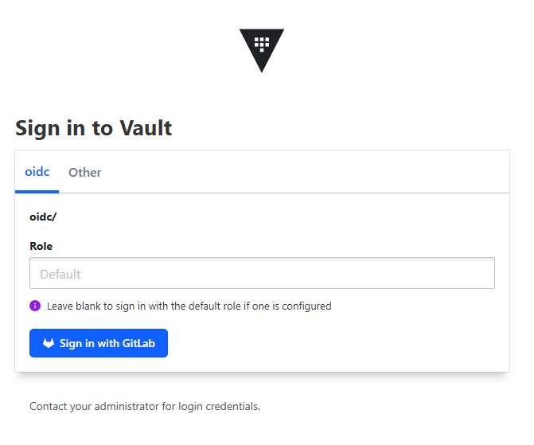
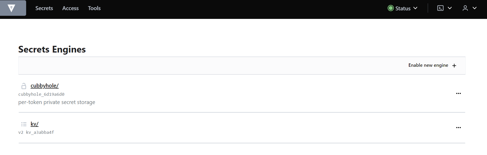
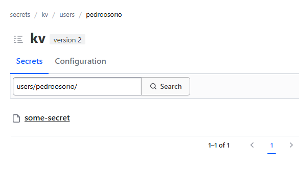
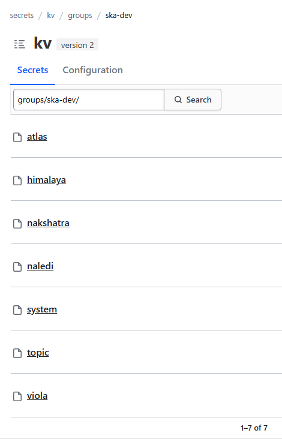

.. _tools-vault:

Secret & Configuration Management
=================================

HashiCorp Vault is a secrets management tool specifically designed to control access to sensitive credentials in low-trust environments. Currently, the SKAO uses Vault as a **secure configuration store**, be it secrets or Helm charts or networking configurations for infrastructure.

This change, in perspective, helps drive a consistent approach having as top priority security, efficient access control, de-duplication of data and enabling cross-component configuration sharing. As it has various types of authentication - Kubernetes authentication, OpenId Connect for Gitlab -
it can be used in all development-to-production use cases.

This is also made possible by recent innovations in the Vault ecosystem, mainly the `Vault Secrets Operator <https://developer.hashicorp.com/vault/tutorials/kubernetes/vault-secrets-operator>`_ (also referred to as VSO). It brings Vault integration with Kubernetes to a whole new level,
making it a first-class solution for secret synchronisation and management.

.. note::

   Currently the SKAO clusters support legacy integrations - **Vault Injector** and **Vault CSI Driver** - but, with VSO's support introduction, these are deprecated.
   Their support will be terminated by Sprint #2 of PI 25 and any deployments using `ska-tango-util` will be migrated automatically when upgrading to version **0.4.13**.

In the following sections we will cover how developers should use Vault, in accordance to the :ref:`SKAO's Vault Structure <explanation-vault-structure>`, as well as provide migration guides to using VSO instead of the deprecated solutions.

.. contents::
   :depth: 2
   :local:

We are also promoting the usage of Vault in Gitlab CICD pipelines as a configuration management solution. If you are interested in that, please follow this :ref:`tutorial <tutorial-vault-gitlab-integration>`.

Adding Secrets to Vault
-----------------------

SKAO developers can log in to `Vault <https://vault.skao.int/ui/vault/auth?with=oidc/>`_ using their Gitlab account. This login method brings group information that is used to control access to team-specific KV engines and paths.

.. note::

   To correctly use Vault, your team should have a corresponding `Gitlab Group <https://gitlab.com/groups/ska-telescope/ska-dev>`_.
   If this isn't the case, please reach out to the System Team via `STS <https://jira.skatelescope.org/servicedesk/customer/portal/166>`_.

When accessing Vault, you should be presented with:

After logging in, using the `Sign in with GitLab` option, you should be given access to the secrets page.

Each user should have access to a **self-named path on the kv** KV engine where they can create their own secrets. To do so you need to create secrets in the path `kv/users/<gitlab username>/<secret path>`. In the example below, the Gitlab username is `pedroosorio`:

If you try to use the root path of your user, `i.e.` `kv/users/<gitlab username>/`, you won't be able to add any secrets since it is **mandatory to have directories** to group the secrets created.
If your **team** is properly configured, as mentioned above, you should also have access to `kv/users/groups/ska-dev/<team slug in gitlab>` and `dev/<team slug in gitlab>/`:

.. note::

   The `kv/users/groups/ska-dev/<team slug in gitlab>/` path is **deprecated** and will be **removed** by Sprint #2 of PI 25, in favor of `dev/<team slug in gitlab>/`

Note that you can see paths to other users' secrets but cannot read them.

Before adding secrets, please read on the :ref:`SKAO's Vault Structure <explanation-vault-structure>` so that you are following the standard put forward for configuration and secret management.

Migration Guide
---------------

If you want to migrate to use the Vault Secrets Operator, for a non-TANGO deployment, you can follow the use cases below as a comparison of usage between the Injector, CSI driver and VSO.
We highly advise you to follow the :ref:`Vault tutorial <tutorial-vault>` which covers the use of VSO in depth. 

If you are using secrets to deploy TANGO devices, using the `ska-tango-util`, you simply need to upgrade to version **0.4.13**.

Vault Integration with Kubernetes
---------------------------------

To use vault secrets, inside the pods, we used to have to resort to using `Vault Sidecar Injector <https://developer.hashicorp.com/vault/tutorials/kubernetes/kubernetes-sidecar>`_ or the `Vault CSI driver <https://developer.hashicorp.com/vault/docs/platform/k8s/csi>`_.
Both of these will be examplified in the sections below, so you can choose the one that best suites your needs.

It should be highlighted, once again, these are **no longer** the de-facto way of using Vault secrets in Kubernetes and their use is **deprecated**.

When you create a Pod - the basic unit of work in Kubernetes - you can set environment variables for the containers that run in that Pod. You can do it either using the `env` configuration field or the `envFrom` field, to refer to other Kubernetes resources.

Lets consider the following example of a simple deployment with 2 environment variables `USERNAME` and `PASSWORD`:

.. code-block:: yaml
    :caption: Deployment with 2 Env variables

    apiVersion: apps/v1
    kind: Deployment
    metadata:
      name: my-app
    spec:
      replicas: 3
      selector:
        matchLabels:
          app: my-app
      template:
        metadata:
          labels:
            app: my-app
        spec:
          containers:
            - name: nginx
              image: nginx:1.14.2
              ports:
                - containerPort: 80
              env:
                - name: USERNAME
                  value: "{{ .Values.username }}"
                - name: PASSWORD
                  value: "{{ .Values.password }}"

With this approach we need to pass the environment variables to the Helm values file where these can be overridden. 
To do so we need to have those variables stored somewhere - like Gitlab CI variables - and pass them using Helm arguments in the Makefile. 
This is insecure - as we cannot efficiently manage access control to the variables - and it is not traceable.

Deprecated: Vault Sidecar Injector
##################################

The **Vault Agent Injector** alters pod specifications to include Vault Agent **containers** that render Vault secrets to a shared memory volume using Vault Agent Templates. This method is inefficient as it requires multiple annotations to be written in the Pod and increases the workload due to the injection of another container.

To use the Vault Sidecar Injector in the previous example, we can do:

.. code-block:: yaml
    :caption: Deployment with Vault Sidecar Injector

    apiVersion: apps/v1
    kind: Deployment
    metadata:
      name: my-app
    spec:
      replicas: 3
      selector:
        matchLabels:
          app: my-app
      template:
        metadata:
          labels:
            app: my-app
          annotations:
            vault.hashicorp.com/agent-inject: "true"
            vault.hashicorp.com/role: "kube-role"
            vault.hashicorp.com/agent-inject-status: "update"
            vault.hashicorp.com/agent-inject-secret-config: "<engine>/data/<path/to/secret>"
            vault.hashicorp.com/agent-inject-template-config: |
                {{`{{- with secret `}}"<engine>/data/<path/to/secret>"{{` -}}`}}
                {{`{{- range $k, $v := .Data.data }}`}}
                {{`export {{ $k }}={{ $v }}`}}
                {{`{{- end }}`}}
                {{`{{- end }}`}}
        spec:
          containers:
            - name: nginx
              image: nginx:1.14.2
              ports:
                - containerPort: 80

This will create an init-container that will inject inside the file `/vault/secrets/config` all the secrets stored in Vault at `<engine>/<path/to/secret>`. The file injected should look something like:

.. code-block:: bash
    :caption: Vault secrets volume file content

    export USERNAME=user
    export PASSWORD=1111

To use these variables, you either need to **source** `/vault/secrets/config` in the **OCI** image' **entrypoint** script or your application needs to read it. A working example on the SKA projects of this method can be found `here <https://gitlab.com/ska-telescope/ska-permissions-api/-/tree/f9aaaea74e30ccb18879f5ef10160c84e40bbb26>`__:

- `Helm chart <https://gitlab.com/ska-telescope/ska-permissions-api/-/blame/f9aaaea74e30ccb18879f5ef10160c84e40bbb26/charts/ska-permissions-api/templates/permissionsApi.yaml#L35>`__
- `Environment variable loading <https://gitlab.com/ska-telescope/ska-permissions-api/-/blob/f9aaaea74e30ccb18879f5ef10160c84e40bbb26/src/ska_permissions_api/configuration/constants.py>`__

This method is very inefficient as it requires modifying the application in some way to be able to load the retrieved secrets. They could also be added as JSON or YAML and that would be a better pattern, but adding an init-container to perform this task is sub-optimal.

Deprecated: Vault CSI Provider
##############################

The CSI Secrets Store driver allows users to inject data in pods as volumes, regardless of the provider, if these follow the `CSI <https://kubernetes.io/blog/2019/01/15/container-storage-interface-ga/>`_ - Container Storage Interface.

For secret stores, we can define a `SecretProviderClass <https://secrets-store-csi-driver.sigs.k8s.io/getting-started/usage>`_ that defines which secret provider to use and what secrets to retrieve. When, using Vault, pods requesting CSI volumes are created,
the CSI Secrets Store driver will send the request to the `Vault CSI Provider <https://developer.hashicorp.com/vault/docs/platform/k8s/csi>`_. The CSI Provider will then use the `SecretProviderClass` specification and the pod's service account to retrieve the secrets´
from Vault and mount them into the pod's CSI volume.

To adapt the previous example to use the CSI Provider, we first need to add a `SecretProviderClass` resource:

.. code-block:: yaml
    :caption: SecretProviderClass resource

    apiVersion: secrets-store.csi.x-k8s.io/v1
    kind: SecretProviderClass
    metadata:
      name: my-app-secret-class
    spec:
      provider: vault
      secretObjects:
        - secretName: my-app-secret
          type: Opaque
          data:
            - objectName: username
              key: username
            - objectName: password
              key: password
      parameters:
        vaultAddress: https://vault.skao.int
        roleName: kube-role
        objects: |
          - objectName: username
            secretPath: <engine>/data/<path/to/secret>
            secretKey: username
          - objectName: password
            secretPath: <engine>/data/<path/to/secret>
            secretKey: password

This is more convenient than adding annotations to pods, as now we can actually construct a secret in Kubernetes that we can compose from multiple secrets.

Under `parameters` we specify how to get to and authenticate with Vault and which **objects** - secret keys named by `objectName` - to pull. Then, under `secretObjects`, we instruct the CSI driver what Kubernetes Secrets to create and how to structure them.
Now, we can change our deployment:

.. code-block:: yaml
    :caption: Deployment with CSI Provider

    apiVersion: apps/v1
    kind: Deployment
    metadata:
      name: my-app
    spec:
      replicas: 3
      selector:
        matchLabels:
          app: my-app
      template:
        metadata:
          labels:
            app: my-app
        spec:
          containers:
            - name: nginx
              image: nginx:1.14.2
              ports:
                - containerPort: 80
              env:
                - name: USERNAME
                  valueFrom:
                    secretKeyRef:
                      name: my-app-secret
                      key: username
                - name: PASSWORD
                  valueFrom:
                    secretKeyRef:
                      name: my-app-secret
                      key: password
              volumeMounts:
                - name: secrets-store-inline
                  mountPath: "/mnt/secrets-store"
                  readOnly: true
          volumes:
            - name: secrets-store-inline
              csi:
                driver: secrets-store.csi.k8s.io
                readOnly: true
                volumeAttributes:
                secretProviderClass: my-app-secret-class

A working example on the SKA projects of this method can be found `here <https://gitlab.com/ska-telescope/ska-tango-charts/-/tree/0.4.12?ref_type=tags>`__:

- `Helm chart <https://gitlab.com/ska-telescope/ska-tango-charts/-/blob/0.4.12/charts/ska-tango-util/templates/_secret-provider-class.yaml?ref_type=tags>`__
- `Environment variable loading <https://gitlab.com/ska-telescope/ska-tango-charts/-/blame/0.4.12/charts/ska-tango-util/templates/_deviceserver.yaml?ref_type=tags#L84>`__

Although it synchronises secrets into Kubernetes secrets, it requires the CSI volume to be mounted to a pod that is scheduled. This is again inefficient and blocks some high-level behaviours that depend on the existence of a secret to begin with.

Vault Secrets Operator
######################

The Vault Secrets Operator breaks away from the inefficient limitations of the previous solutions by implementing an `operator <https://kubernetes.io/docs/concepts/extend-kubernetes/operator/>`_ and `CRDs <https://developer.hashicorp.com/vault/docs/platform/k8s/vso/sources/vault>`_. The main difference to the previous solutions is that it is no longer needed for a Vault secret "link" to be present on a workload - simply defining the VaultStaticSecret or VaultDynamicSecret CRDs is enough to have the operator synchronise secrets as Kubernetes secrets.
From that point onwards we can leverage secrets the way we would any other secret without having second considerations.

Adapting the previous example, we no longer create a SecretProviderClass resource but a **VaultStaticSecret**:

.. code-block:: yaml
    :caption: VaultStaticSecret resource

    apiVersion: secrets.hashicorp.com/v1beta1
    kind: VaultStaticSecret
    metadata:
      name: api-key-{{ include "ska-tango-ping.fullname" . }}
      namespace: {{ .Release.Namespace }}
      labels:
        {{- include "ska-tango-ping.labels" . | nindent 4 }}
    spec:
      type: kv-v2
      mount: <engine>
      path: <path/to/secret>
      refreshAfter: 60s
      destination:
        name: my-app-secret
        create: true
        overwrite: true
        transformation:
          excludeRaw: true
          includes:
            - username
            - password

Now, we can simplify the deployment manifest compared to either of the previous solutions:

.. code-block:: yaml
    :caption: Deployment with VaultStaticSecret

    apiVersion: apps/v1
    kind: Deployment
    metadata:
      name: my-app
    spec:
      replicas: 3
      selector:
        matchLabels:
          app: my-app
      template:
        metadata:
          labels:
            app: my-app
        spec:
          containers:
            - name: nginx
              image: nginx:1.14.2
              ports:
                - containerPort: 80
              env:
                - name: USERNAME
                  valueFrom:
                    secretKeyRef:
                      name: my-app-secret
                      key: username
                - name: PASSWORD
                  valueFrom:
                    secretKeyRef:
                      name: my-app-secret
                      key: password

Note that, now, we don't need to define `Volumes` or `VolumeMounts` and the secret will be created regardless of a pod referring to it.

VSO not only brings the simplicity of defining secrets but also brings new powerful features. To know more about them, please follow the :ref:`tutorial <tutorial-vault>` where we cover,
end-to-end, the configuration of a Vault instance in a Minikube cluster, the deployment of Vault Secrets Operator and we explore some of its novel features like automatic `rollout restarts <https://developer.hashicorp.com/vault/docs/platform/k8s/vso/api-reference#rolloutrestarttarget>`_ and `transformations <https://developer.hashicorp.com/vault/docs/platform/k8s/vso/secret-transformation>`_.

A working example on the SKA projects of this method can be found `here <https://gitlab.com/ska-telescope/ska-tango-ping/-/tree/254646c59f1e6a916f2451dc007037787a4448d2>`__:

- `Helm chart <https://gitlab.com/ska-telescope/ska-tango-ping/-/blob/254646c59f1e6a916f2451dc007037787a4448d2/charts/ska-tango-ping/templates/secrets.yaml>`__
- `Environment variable injection <https://gitlab.com/ska-telescope/ska-tango-ping/-/blame/main/charts/ska-tango-ping/templates/deployment.yaml?ref_type=heads#L57>`_
