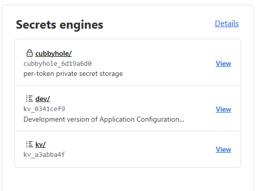

Secret Management
==================

HashiCorp Vault is a secrets management tool specifically designed to control access to sensitive credentials in low-trust environments.
This tool has various types of authentications being one of them Kubernetes Auth Method that will be used to get the secrets inside the pods and Gitlab Auth Method that will allow users to add and list their secrets group.

Logging into Vault with Gitlab and Add Secrets
==============================================

Any developer that is part of the skao-dev group has access to the SKAO Vault service by logging in with their Gitlab Account.

The logging URL is the following: https://vault.skao.int/ui/vault/auth?with=oidc/, and a page like the one below should be shown.

After logging in you should be given access to the secrets page. Each user when logged in for the first time should have access to check the paths on the kv path. A similiar environment can be seen in the image below:

You can also notice that you can see paths to other users secrets but cannot read them. To create your own secrets it needs to have the following path with your gitlab_username in it: `` kv/users/gitlab_username `` . Example below, where the username was Bruno_Ribeiro.

.. image:: images/vault-secrets-path.png
  :alt: Vault Secrets Created
  :align: center

Using Secrets with K8s Pod
==========================

There are 2 known ways to use vault secrets inside the pods, one using a `Vault Sidecar Injector <https://learn.hashicorp.com/tutorials/vault/kubernetes-sidecar>`_ and the other using the Vault `CSI provider <https://www.vaultproject.io/docs/platform/k8s/csi>`_. Both of these will be examplified in the sections below so you can choose the one that best suites your needs.

Use environment variables with K8s
----------------------------------

When you create a Pod, you can set environment variables for the containers that run in the Pod. You can do it either using the `env` configuration field or the `envFrom` field.
Lets consider this simple deployment example of a pod with 2 environment variables `USERNAME` and `PASSWORD`:

.. code-block:: yaml
    :caption: Deployment with 2 Env variables

    apiVersion: apps/v1
    kind: Deployment
    metadata:
    name: nginx-deployment
    labels:
        app: nginx
    spec:
    replicas: 3
    selector:
        matchLabels:
        app: nginx
    template:
        metadata:
        labels:
            app: nginx
        spec:
        containers:
        - name: nginx
            image: nginx:1.14.2
            ports:
            - containerPort: 80
            env:
            - name: USERNAME
                value: "{{ .Values.global.env.username }}"
            - name : PASSWORD
                value: "{{ .Values.global.env.password }}"

With this approach we need to pass the environment variables to the Values File where we can override them with the assist of `helm set` command.
But for us to be able to do this we need to have those variables stored somewhere since, until now, we were using the Gitlab CI Vars to store these variables and secrets.

Vault Sidecar Injector
----------------------

The Vault Agent Injector alters pod specifications to include Vault Agent containers that render Vault secrets to a shared memory volume using Vault Agent Templates. 
To change the previous code for it to use the vault sidecar injector we have something like the following:

.. code-block:: yaml
    :caption: Deployment with Vault Sidecar Injector

    apiVersion: apps/v1
    kind: Deployment
    metadata:
    name: nginx-deployment
    labels:
        app: nginx
    spec:
        selector:
            matchLabels:
            app: nginx
        template:
            metadata:
                labels:
                    app: nginx
                annotations:
                {{ if ((.Values.vault).useVault) }}         
                    vault.hashicorp.com/agent-inject: "true"
                    vault.hashicorp.com/agent-inject-status: "update"
                    vault.hashicorp.com/agent-inject-secret-config: "Path/to/secret/vault"
                    vault.hashicorp.com/agent-inject-template-config: |
                        {{`{{- with secret `}}"<PATH_TO_SECRET_VAULT>>"{{` -}}`}}
                        {{`{{- range $k, $v := .Data.data }}`}}
                        {{`export {{ $k }}={{ $v }}`}}
                        {{`{{- end }}`}}
                        {{`{{- end }}`}}
                    vault.hashicorp.com/role: "kube-role"
                {{ end }}
            spec:
            containers:
            - name: nginx
                image: nginx:1.14.2
                ports:
                - containerPort: 80
                command: [ "sh", "-c", ". /vault/secrets/config" ]
                env:
                - name: USERNAME
                    value: "{{ .Values.global.env.username }}"
                - name : PASSWORD
                    value: "{{ .Values.global.env.password }}"

In this case the annotations where added, this will create an init container that will inject inside the file `/vault/secrets/config` all the secrets stored on vault in the `Path/to/secret/vault`. The file injected should look something like:

.. code-block:: bash
    :caption: /vault/secrets/config

    export USERNAME=user
    export PASSWORD=1111

For these variables to be declared environment variables inside the running pod you will also need to add the command `[ "sh", "-c", ". /vault/secrets/config" ]` to source those variables.

A working example on the SKA projects of this method can be checked `here <https://gitlab.com/ska-telescope/ska-tango-images/-/blob/master/charts/ska-tango-base/templates/databaseds.yaml#L75>`_

Vault CSI Provider
----------------------

At a high level, the CSI Secrets Store driver allows users to create SecretProviderClass objects. This object defines which secret provider to use and what secrets to retrieve. When pods requesting CSI volumes are created, the CSI Secrets Store driver will send the request to the Vault CSI Provider if the provider is vault. The Vault CSI Provider will then use Secret Provider Class specified and the pod's service account to retrieve the secrets from Vault, and mount them into the pod's CSI volume.

To change the previous code to use the CSI Provider first we need to add a K8s kind SecretProviderClass:

.. code-block:: yaml
    :caption: vaultsecrets.yaml

    ---
    apiVersion: secrets-store.csi.x-k8s.io/v1
    kind: SecretProviderClass
    metadata:
    name: <<{{ .Values.secretProvider.name }}>>
    spec:
    provider: {{ .Values.secretProvider.provider.name | default "vault" }}
    secretObjects:
        - secretName: {{ .Values.secretProvider.name }}
        type: Opaque
        data:
            {{- range .Values.secretProvider.provider.secrets }}
            - objectName: {{ .secretKey }}
            key: {{ .secretKey }}
            {{- end }}
            {{- if .Values.secretProvider.testDeployment }}
            {{- range .Values.secretProvider.provider.testSecrets }}
            - objectName: {{ .secretKey }}
            key: {{ .secretKey }}
            {{- end }}
            {{- end }}
    parameters:
        vaultAddress: {{ .Values.secretProvider.provider.vaultAddress }}
        roleName: {{ .Values.secretProvider.provider.roleName }}
        objects: |
        {{- range .Values.secretProvider.provider.secrets }}
        - objectName: {{ .secretKey }}
            secretPath: {{ $.Values.secretProvider.provider.secretsPath }}
            secretKey: {{ .secretKey }}
        {{- end }}
        {{- if .Values.secretProvider.testDeployment }}
        {{- range .Values.secretProvider.provider.testSecrets }}
        - objectName: {{ .secretKey }}
            secretPath: {{ $.Values.secretProvider.provider.secretsPath }}
            secretKey: {{ .secretKey }}
        {{- end }}
        {{- end }}

Admiting that we have a Values.yaml with these fields:

.. code-block:: yaml
    :caption: values.yaml

    secretProvider:
    enabled: true
    name: vault-ska-vault-example-csi
    provider: 
        name: "vault"
        vaultAddress: "https://vault.skao.int"
        roleName: "kube-role"
        secretsPath: "PATH_TO_SECRET_VAULT"
        secrets:
        - secretKey: "USERNAME"
        - secretKey: "PASSWORD"

On the Pod we will need to get the variables from the mounted volume like so:

.. code-block:: yaml
    :caption: Deployment with CSI Provider

    apiVersion: apps/v1
    kind: Deployment
    metadata:
    name: nginx-deployment
    labels:
        app: nginx
    spec:
    replicas: 3
    selector:
        matchLabels:
        app: nginx
    template:
        metadata:
        labels:
            app: nginx
        spec:
        containers:
        - name: nginx
            image: nginx:1.14.2
            ports:
            - containerPort: 80
            env: ###
            {{- if .Values.secretProvider.enabled }}
            {{- range .Values.secretProvider.provider.secrets }}
            - name: {{ .targetEnv | default .secretKey }}
                valueFrom: 
                secretKeyRef:
                    name: {{ $.Values.secretProvider.name }}
                    key: {{ .secretKey }}
            {{- end }}
            {{- else }}
            - name: USERNAME
                value: "{{ .Values.global.env.username }}"
            - name : PASSWORD
                value: "{{ .Values.global.env.password }}"
            {{- end }}
            volumeMounts: 
            {{- if .Values.secretProvider.enabled }}
              - name: secrets-store-inline
                mountPath: "/mnt/secrets-store"
                readOnly: true
            {{- end }}
          resources:
            {{- toYaml .Values.resources | nindent 12 }}
        volumes: 
        {{- if .Values.secretProvider.enabled }}
            - name: secrets-store-inline
            csi:
                driver: secrets-store.csi.k8s.io
                readOnly: true
                volumeAttributes:
                secretProviderClass: {{ .Values.secretProvider.name }}

It is very important to have the if statements to make sure that the deployment works in local environments where we don't have access to the vault secrets.

A working example on the SKA projects of this method can be checked `in this chart <https://gitlab.com/ska-telescope/sdi/ska-cicd-artefact-validations/-/tree/master/charts/ska-cicd-artefact-validations/templates>`_
